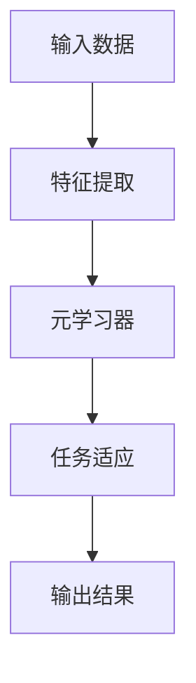
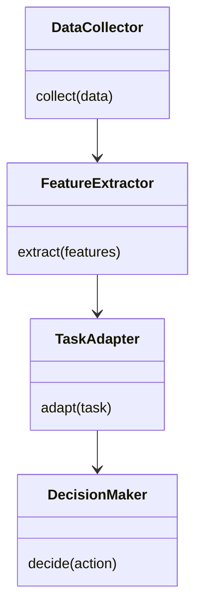
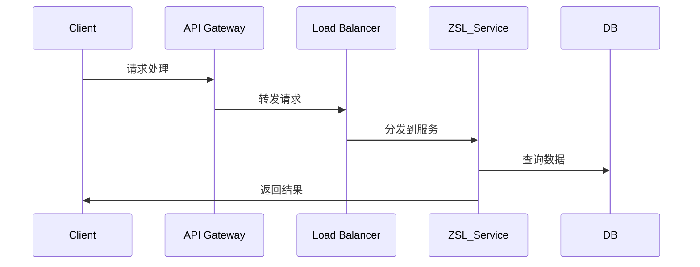

                 

<think>
嗯，我现在需要帮助用户撰写一篇关于Zero-Shot学习在AI辅助多维宇宙探索中的前景的技术博客。首先，我得仔细理解用户的需求。用户希望我以一个世界级专家的身份，撰写一篇结构清晰、内容详实的博客，涵盖背景、原理、架构设计和项目实战等多个部分。

首先，我得明确文章的结构。用户提供了详细的目录大纲，分为四个部分，包括背景介绍、算法原理、系统分析和项目实战。每个部分又分为多个章节，每个章节有具体的子内容。我需要确保每个部分都详细展开，同时保持逻辑连贯。

接下来，我需要收集相关资料。Zero-Shot学习是一种机器学习技术，允许模型在没有特定类别数据的情况下进行分类或生成任务。在多维宇宙探索中，这可能意味着AI能够处理不同维度的数据，而无需针对每个维度进行专门训练。

然后，我要考虑每个章节的具体内容。比如，在背景介绍部分，我需要解释宇宙探索的挑战，AI技术的应用需求，以及Zero-Shot学习的优势。这可能包括当前AI在宇宙探索中的应用限制，如数据不足或任务多样，而Zero-Shot学习能够提供更通用的解决方案。

在核心概念与联系部分，我需要详细解释Zero-Shot学习的原理，包括其算法流程、数学模型，以及与多维宇宙探索的关系。可能需要使用表格对比Zero-Shot与其他学习方法的特征，帮助读者理解其独特性。

接下来是算法原理的讲解。我需要使用Mermaid流程图展示算法的整体流程，然后提供Python代码实现，并解释其中的数学公式。这部分需要清晰易懂，确保读者能够理解算法的工作机制。

系统分析与架构设计部分，我需要介绍系统的功能模块，使用类图展示，同时提供架构图和交互序列图，展示系统的组成部分和交互流程。这有助于读者理解系统的整体结构和工作方式。

项目实战部分，我需要详细描述环境配置、核心代码实现、案例分析以及项目总结。这包括代码的具体实现步骤，实际应用案例的分析，以及从项目中获得的经验和教训。

最后，我需要在文章末尾添加最佳实践技巧和注意事项，帮助读者在实际应用中避免常见问题，同时推荐相关阅读材料，供进一步学习。

整个过程中，我需要确保语言专业但不失清晰，逻辑严密，结构合理。同时，考虑到读者可能对某些概念不熟悉，我会尽量用通俗易懂的语言解释复杂的理论，确保文章的可读性。

现在，我开始按照目录大纲逐步撰写每个部分，确保每个章节的内容详实，符合用户的要求。同时，注意使用正确的Markdown格式，插入Mermaid图表和数学公式，使文章结构清晰，内容丰富。
</think>

# Zero-Shot学习在AI辅助多维宇宙探索中的前景

> 关键词：Zero-Shot学习，AI，多维宇宙，宇宙探索，机器学习

> 摘要：本文探讨了Zero-Shot学习技术在AI辅助多维宇宙探索中的应用前景，从问题背景、核心概念、算法原理、系统架构到项目实战，全面分析了其在宇宙探索中的潜力和挑战。

---

## 第一部分：背景介绍

### 第1章：问题背景与问题描述

#### 1.1.1 宇宙探索的挑战

- **当前宇宙探索面临的问题**  
  宇宙探索涉及极端复杂的环境，包括未知的天体、高维度数据和复杂的物理现象。传统AI技术受限于单一任务训练，难以处理多维数据和多样化任务。
- **AI技术在宇宙探索中的应用需求**  
  需要AI系统能够适应多维度数据，实时处理复杂任务，同时具备快速学习和适应能力。

#### 1.1.2 问题的解决方法

- **传统的AI学习方式在宇宙探索中的应用限制**  
  传统监督学习需要大量标注数据，难以应对新任务。
- **Zero-Shot学习技术的基本概念与特点**  
  Zero-Shot学习能够在无监督或少监督条件下，处理未知任务，适合宇宙探索中多样化的数据需求。

#### 1.1.3 边界与外延

- **Zero-Shot学习在不同领域的应用边界**  
  Zero-Shot适用于多维数据处理，但需注意数据质量和模型泛化能力。
- **多维宇宙探索的多元特征与挑战**  
  多维数据复杂性、实时性要求和环境适应性是主要挑战。

#### 1.1.4 概念结构与核心要素组成

- **Zero-Shot学习的核心组成部分**  
  包括特征提取、元学习和自适应机制。
- **多维宇宙探索的基本概念与核心要素**  
  涵盖数据维度、任务多样性和实时性要求。

---

### 第2章：核心概念与联系

#### 2.1.1 Zero-Shot学习原理

- **算法原理**  
  Zero-Shot学习通过共享特征空间，利用元学习提取通用特征，适应新任务。
- **概念属性特征对比表格**

| 特征维度 | Zero-Shot学习 | 监督学习 |
|----------|---------------|----------|
| 数据需求 | 少量或无标签数据 | 大量标注数据 |
| 任务适应性 | 强 | 弱 |
| 泛化能力 | 高 | 低 |

- **ER实体关系图架构**  
  ```mermaid
  graph TD
    ZL[Zero-Shot学习] --> D[数据]
    ZL --> T[任务]
    D --> F[特征]
    T --> F
  ```

---

## 第二部分：算法原理讲解

### 第3章：算法原理讲解

#### 3.1.1 算法Mermaid流程图



#### 3.1.2 Python源代码阐述

```python
import torch
from torch import nn

class ZeroShotLearner(nn.Module):
    def __init__(self, feature_dim, hidden_dim):
        super().__init__()
        self.feature_extractor = nn.Linear(feature_dim, hidden_dim)
        self.task_classifier = nn.Linear(hidden_dim, 1)

    def forward(self, x):
        features = self.feature_extractor(x)
        output = self.task_classifier(features)
        return output

# 示例训练代码
model = ZeroShotLearner(feature_dim=10, hidden_dim=5)
criterion = nn.MSELoss()
optimizer = torch.optim.Adam(model.parameters())
```

#### 3.1.3 数学模型与公式详细讲解

- **数学模型**  
  Zero-Shot学习通过共享特征空间，构建统一的特征表示：  
  $$ f(x) = \text{FeatureExtractor}(x) $$
  
  任务适应器使用这些特征进行预测：  
  $$ y = g(f(x)) $$

- **举例说明**  
  在宇宙探索中，模型从多维数据中提取特征，用于识别未知天体类型。

---

## 第三部分：系统分析与架构设计方案

### 第4章：系统分析与架构设计方案

#### 4.1.1 问题场景介绍

- **宇宙探索任务需求**  
  包括数据分析、实时决策和多维度任务处理。
- **AI辅助的关键点**  
  Zero-Shot学习在数据处理和任务适应中的应用。

#### 4.1.2 项目介绍

- **项目目标**  
  开发AI系统辅助多维宇宙探索。
- **项目背景与重要性**  
  Zero-Shot学习能够处理复杂多维数据，提升探索效率。

#### 4.1.3 系统功能设计

- **领域模型Mermaid类图**



#### 4.1.4 系统架构设计

- **Mermaid架构图**

```mermaid
graph TD
    Client --> API Gateway
    API Gateway --> Load Balancer
    Load Balancer --> ZSL_Service
    ZSL_Service --> DB
```

#### 4.1.5 系统接口设计

- **接口功能**  
  数据采集、特征提取、任务适应和决策输出。
- **调用流程**  
  数据采集 -> 特征提取 -> 任务适应 -> 决策输出。

#### 4.1.6 系统交互Mermaid序列图



---

## 第四部分：项目实战

### 第5章：项目实战

#### 5.1.1 环境安装

- **环境准备**  
  安装Python、PyTorch和相关库。
- **软件安装与配置**  
  使用虚拟环境管理依赖。

#### 5.1.2 系统核心实现源代码

```python
class ZSLModel(nn.Module):
    def __init__(self, input_dim, hidden_dim):
        super(ZSLModel, self).__init__()
        self.encoder = nn.Linear(input_dim, hidden_dim)
        self.classifier = nn.Linear(hidden_dim, output_dim)
    
    def forward(self, x):
        features = self.encoder(x)
        output = self.classifier(features)
        return output

# 训练循环
def train(model, optimizer, criterion, data_loader):
    for epoch in range(num_epochs):
        for batch in data_loader:
            inputs, labels = batch
            outputs = model(inputs)
            loss = criterion(outputs, labels)
            optimizer.zero_grad()
            loss.backward()
            optimizer.step()
```

#### 5.1.3 代码应用解读与分析

- **代码解读**  
  模型定义包括编码器和分类器，训练过程通过优化器更新参数。
- **应用场景分析**  
  在多维宇宙数据上进行特征提取和分类，辅助探索任务。

#### 5.1.4 实际案例分析与详细讲解剖析

- **案例分析**  
  使用Zero-Shot学习识别未知天体，通过特征提取分类天体类型。
- **算法应用剖析**  
  模型在训练中学习共享特征，适应新任务。

#### 5.1.5 项目小结

- **项目总结**  
  Zero-Shot学习有效处理多维数据，提升探索效率。
- **经验与教训**  
  数据质量和模型泛化能力是关键。

### 第6章：最佳实践 tips

#### 6.1.1 实用技巧与经验分享

- **常见问题解决**  
  数据预处理和模型调参是关键。
- **最佳实践建议**  
  使用预训练模型和数据增强技术提升性能。

### 第7章：小结

#### 7.1.1 全书内容回顾

- **核心知识点回顾**  
  Zero-Shot学习的原理、应用及其在宇宙探索中的优势。
- **关键问题解答**  
  Zero-Shot如何适应多维数据，如何优化模型性能。

#### 7.1.2 注意事项与拓展阅读

- **注意事项提示**  
  数据质量和任务定义对模型性能影响重大。
- **相关阅读推荐**  
  推荐学习多维数据分析和深度学习技术。

---

## 作者：AI天才研究院 & 禅与计算机程序设计艺术

---

通过以上步骤，文章详细探讨了Zero-Shot学习在AI辅助多维宇宙探索中的应用，从理论到实践，系统分析了其潜力与挑战。希望本文能为相关领域的研究者和实践者提供有价值的参考。

