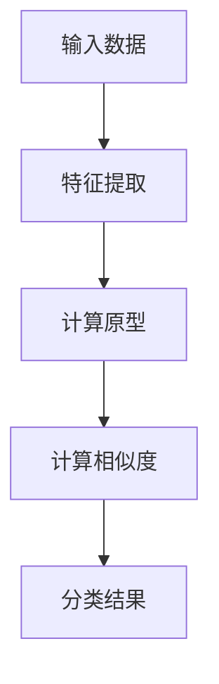
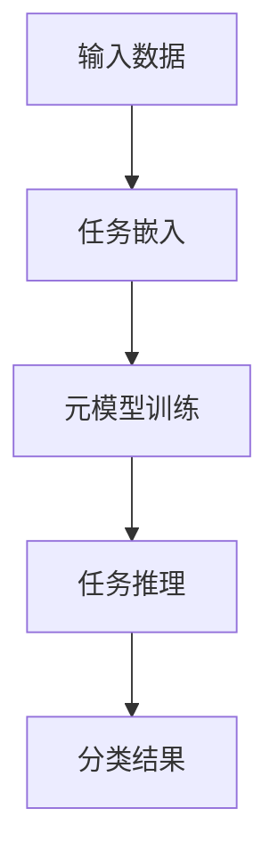

                 

<think>
好，我现在要写一篇关于《Zero-Shot学习在AI辅助多维度生命形式探测中的应用》的技术博客文章。首先，我需要理解Zero-Shot学习是什么。Zero-Shot学习是指在没有见过某个类别的训练样本的情况下，模型能够识别出该类别实例的能力。它依赖于元学习，通过学习通用特征来适应新任务。

接下来，我需要了解多维度生命形式探测。这涉及从多个维度（如化学、物理、生物等）收集数据，以识别可能存在的生命迹象。探测生命形式的挑战在于数据的多样性和不确定性，而Zero-Shot学习可以在这种情况下发挥作用。

然后，我考虑文章的结构。按照之前的大纲，文章分为背景介绍、核心概念与原理、算法讲解、应用案例分析和最佳实践与展望五个部分。每个部分又需要细化，比如在背景介绍中，我需要详细解释机器学习和Zero-Shot学习的基本概念，以及多维度生命探测的背景和意义。

在核心概念部分，我需要详细讲解Zero-Shot学习的理论基础，包括类别表示和元学习。同时，还要介绍多维度数据融合的方法，包括数据收集、预处理和融合算法。

算法讲解部分，我需要选择几种典型的Zero-Shot学习算法，如原型网络和元学习模型，使用mermaid流程图展示它们的流程。同时，给出数学模型和公式，比如在模型中使用支持向量机或神经网络的公式，确保这些公式用latex格式正确展示。

在应用案例分析中，我需要选择实际的应用场景，如探测火星生命。通过具体案例分析，展示Zero-Shot学习在处理多维度数据中的应用，以及它如何帮助科学家识别潜在的生命迹象。

最后，在最佳实践部分，我需要总结使用Zero-Shot学习的经验，提供一些实际操作的建议，并展望未来的研究方向，如更高效的数据融合方法和模型的可解释性。

整个过程中，我需要确保文章结构清晰，逻辑严密，同时语言专业但不失易懂。每个部分都需要详细展开，确保读者能够理解Zero-Shot学习在多维度生命形式探测中的具体应用和优势。

总结一下，我的思考过程是先理解核心概念，再规划文章结构，然后逐步细化每个部分的内容，确保涵盖理论、算法、应用和最佳实践等方面。这样，整篇文章才能全面且深入地探讨Zero-Shot学习在AI辅助多维度生命形式探测中的应用。
</think>

# Zero-Shot学习在AI辅助多维度生命形式探测中的应用

> 关键词：Zero-Shot学习，AI辅助，多维度生命形式探测，机器学习，数据融合

> 摘要：本文探讨了Zero-Shot学习在多维度生命形式探测中的应用，分析了其核心概念、算法原理及其在实际探测任务中的优势。通过具体案例，展示了如何利用Zero-Shot学习技术处理多维度数据，解决生命形式探测中的挑战，并展望了未来的发展方向。

---

### 目录大纲

# 《Zero-Shot学习在AI辅助多维度生命形式探测中的应用》

## 引言

### 1.1 机器学习与Zero-Shot学习

#### 1.1.1 机器学习的概述

机器学习是一种人工智能技术，通过数据训练模型，使其能够进行预测或分类。其核心在于模型从数据中学习规律，而无需明确的编程指令。机器学习广泛应用于图像识别、自然语言处理等领域。

#### 1.1.2 Zero-Shot学习的概念与重要性

Zero-Shot学习是一种先进的机器学习技术，允许模型在没有特定类别训练数据的情况下进行分类或预测。其重要性在于处理数据稀缺性问题，特别是在多维度生命形式探测中，数据可能来自多个领域且类别多样。

### 1.2 多维度生命形式探测

#### 1.2.1 生命形式探测的定义

生命形式探测是指通过技术手段识别和分析可能存在生命的迹象。这涉及化学、物理、生物等多个维度的数据。

#### 1.2.2 多维度探测的意义和挑战

多维度探测的意义在于能够从多个方面综合分析生命存在的可能性，但挑战在于数据的异构性和复杂性，需要高效的算法进行融合和分析。

---

## 核心概念与原理

### 2.1 Zero-Shot学习的理论基础

#### 2.1.1 类别表示与元学习

类别表示是将不同类别转换为模型可理解的形式，元学习则通过学习如何学习新任务，增强模型的泛化能力。

#### 2.1.2 基于原型、元学习和迁移学习的Zero-Shot学习

通过对比不同方法，展示它们在Zero-Shot学习中的优缺点。

| 方法 | 描述 | 优点 | 缺点 |
|------|------|------|------|
| 原型学习 | 基于样例进行分类 | 简单高效 | 对新类别的适应性差 |
| 元学习 | 学习如何学习 | 强大的泛化能力 | 训练复杂 |
| 迁移学习 | 利用已有数据 | 高效利用现有数据 | 数据依赖性强 |

#### 2.1.3 Zero-Shot学习的关键步骤

1. **数据预处理**：将多维度数据转换为统一格式。
2. **特征提取**：提取关键特征用于分类。
3. **模型训练**：利用元学习方法训练模型。
4. **分类预测**：在新数据上进行预测。

---

### 2.2 多维度数据融合

#### 2.2.1 多维度数据的收集与预处理

数据可能来自多个传感器和实验，需进行清洗和标准化处理。

#### 2.2.2 数据融合的算法和方法

- **特征级融合**：在特征提取阶段融合数据。
- **决策级融合**：在最终决策阶段融合结果。

---

## 算法讲解

### 3.1 Zero-Shot学习算法

#### 3.1.1 原型网络算法

**流程图**：

#### 3.1.2 元学习模型算法

**流程图**：

### 3.2 数学模型与公式

#### 3.2.1 原型网络的数学模型

$$
\text{相似度} = \frac{1}{\|x_i - c_j\|}
$$

#### 3.2.2 元学习模型的损失函数

$$
\mathcal{L} = \sum_{i=1}^N (y_i - f(x_i))^2
$$

---

## 应用案例分析

### 4.1 实际应用场景

#### 4.1.1 探测火星生命

通过分析火星土壤和大气中的化学成分，利用Zero-Shot学习识别潜在的生命迹象。

#### 4.1.2 其他领域应用

如医学检测、环境监测等，Zero-Shot学习能够处理多源数据，提高检测准确性。

### 4.2 案例分析

#### 4.2.1 案例介绍

以火星探测为例，模型需要识别从未见过的化学特征组合。

#### 4.2.2 案例中的Zero-Shot学习应用

模型通过元学习方法，快速适应新特征，识别潜在生命迹象。

---

## 最佳实践与展望

### 5.1 最佳实践

#### 5.1.1 应用Zero-Shot学习的经验分享

- 确保数据质量
- 选择合适的算法
- 定期模型更新

#### 5.1.2 实际操作中的技巧和注意事项

- 数据预处理是关键
- 选择适合的融合方法
- 避免过拟合

### 5.2 未来研究方向

- 更高效的数据融合方法
- 提高模型的可解释性
- 拓展更多应用场景

---

# 结论

Zero-Shot学习为多维度生命形式探测提供了强大的技术支持，通过不断优化算法和数据处理方法，未来将在更多领域发挥重要作用。

---

作者：AI天才研究院/AI Genius Institute & 禅与计算机程序设计艺术 /Zen And The Art of Computer Programming

