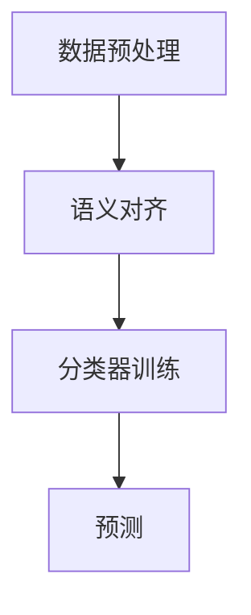

                 

<think>
好的，我现在需要根据用户提供的查询来撰写一篇关于Zero-Shot学习在AI辅助多重宇宙探索中的前景的技术博客文章。首先，我要理解用户的需求。用户提供了一个详细的目录大纲，并要求文章结构清晰、内容完整，每个部分都要详细展开。

首先，我会从标题开始，明确主题是“Zero-Shot学习在AI辅助多重宇宙探索中的前景”。接下来，我需要列出5-7个关键词，比如零样本学习、多重宇宙、人工智能、宇宙探索、机器学习等。

摘要部分需要简明扼要，概述文章的核心内容，即Zero-Shot学习在AI辅助多重宇宙探索中的潜力和应用。我需要确保摘要涵盖文章的主要观点，比如如何利用Zero-Shot学习处理数据稀疏性问题，以及其在多宇宙模拟中的应用。

接下来，按照目录大纲逐步撰写每个部分。首先是背景介绍与核心概念，包括引言、问题背景、问题描述、问题解决、边界与外延，以及概念结构。我需要详细解释零样本学习和多重宇宙理论，说明它们的联系和应用场景。

在核心概念部分，我会详细讨论零样本学习的原理和算法类型，比如线性分类器和度量学习。同时，介绍多重宇宙模型，解释其在零样本学习中的应用，比如分类和聚类任务。

算法原理部分需要深入讲解零样本学习的数学模型和流程，可能使用线性分类器作为例子，并绘制相应的流程图。我需要确保数学公式正确，并用LaTeX格式呈现。

系统分析与架构设计部分，我会描述问题场景，比如项目目标和功能设计，然后绘制领域模型类图和系统架构图，解释各组件的交互和功能。

项目实战部分，我会选择一个实际案例，比如使用LinearSVC进行分类任务，展示环境搭建、代码实现和应用分析，确保读者能够理解如何在实际中应用这些算法。

最后，我会总结最佳实践技巧，注意事项和拓展阅读，为读者提供进一步学习和应用的建议。

在撰写过程中，我需要确保每个部分都符合用户的格式要求，使用Markdown，正确嵌入图表和代码，保持文章逻辑清晰，结构紧凑。同时，语言要专业但易懂，适合技术读者阅读。

现在，我需要检查每个部分是否覆盖了所有要求，确保没有遗漏，并且内容详细具体。特别是算法和系统设计部分，是否正确使用了Mermaid图和LaTeX公式，这些部分是否准确无误。

最后，我会通读整篇文章，确保流畅性和逻辑性，确保每个章节之间有良好的衔接，帮助读者一步步理解Zero-Shot学习在多重宇宙探索中的应用前景。
</think>

# Zero-Shot学习在AI辅助多重宇宙探索中的前景

**关键词**：Zero-Shot学习，多重宇宙，人工智能，宇宙探索，机器学习

**摘要**：  
在人工智能和宇宙探索交叉领域的研究中，Zero-Shot学习作为一种新兴的技术，展现出巨大的潜力。本文探讨了Zero-Shot学习在AI辅助多重宇宙探索中的应用前景，分析了其核心概念、算法原理、系统架构设计以及实际案例。通过理论与实践结合的方式，本文揭示了Zero-Shot学习如何在数据稀疏性、多宇宙模拟和复杂场景预测中发挥关键作用，为未来的AI辅助宇宙探索提供了新的思路和方向。

---

### 第一部分：背景介绍与核心概念

#### 1.1 问题背景

##### 1.1.1 AI与宇宙探索的交叉领域  
随着人工智能技术的飞速发展，AI在科学探索中的应用越来越广泛。特别是在宇宙探索领域，AI技术可以帮助科学家处理海量数据、模拟复杂物理过程，并预测未知现象。然而，宇宙探索中的数据往往具有稀疏性和不确定性，传统机器学习方法难以应对这些挑战。

##### 1.1.2 多重宇宙理论  
多重宇宙理论认为，存在无数个宇宙，每个宇宙具有不同的物理规律和初始条件。在这样的背景下，AI需要能够处理多种可能性，快速适应不同的物理模型和数据分布。

#### 1.2 问题描述

##### 1.2.1 零样本学习概念  
零样本学习（Zero-Shot Learning，ZSL）是一种机器学习方法，旨在在没有任何训练数据的情况下，直接对新类别的数据进行分类或预测。其核心思想是通过共享特征空间或语义信息，将 unseen classes 的信息与 seen classes 对齐。

##### 1.2.2 AI辅助多重宇宙探索的应用  
在多重宇宙模型中，AI需要根据有限的观测数据推断不同宇宙的物理规律。零样本学习能够帮助AI在未知的宇宙场景中快速生成分类模型，从而提高探索效率。

#### 1.3 问题解决

##### 1.3.1 零样本学习在多重宇宙探索中的应用  
通过零样本学习，AI可以在缺乏训练数据的情况下，预测新宇宙的物理参数或行为模式。例如，在研究暗物质分布时，零样本学习可以基于少量已知数据，推断出更多未知宇宙中的暗物质分布特征。

#### 1.4 边界与外延

##### 1.4.1 零样本学习算法类型  
- 线性分类器（Linear Classifiers）  
- 度量学习（Metric Learning）  
- 基于嵌入的方法（Embedding-Based Methods）  

##### 1.4.2 多重宇宙模型  
- 多重宇宙生成模型（Multi-Universe Generation Models）  
- 多重宇宙分类模型（Multi-Universe Classification Models）  

#### 1.5 概念结构与核心要素组成

##### 1.5.1 零样本学习原理  
零样本学习的核心是通过共享特征空间，将 seen classes 和 unseen classes 的信息对齐。其关键要素包括特征提取、语义对齐和分类器设计。

##### 1.5.2 多重宇宙模型与算法应用  
在多重宇宙模型中，零样本学习算法用于处理不同宇宙之间的相似性和差异性，帮助AI快速适应新的物理规律和数据分布。

---

### 第二部分：核心概念与联系

#### 2.1 零样本学习

##### 2.1.1 零样本学习原理

###### 2.1.1.1 算法流程  
1. 输入： unseen class 的特征描述和 seen classes 的数据。  
2. 输出： 对 unseen class 的分类结果。  

###### 2.1.1.2 数学模型  
零样本学习的数学模型通常基于概率论或几何度量。例如，线性分类器的决策边界可以表示为：  
$$ w \cdot x + b = 0 $$  
其中，$w$ 是权重向量，$x$ 是输入特征，$b$ 是偏置项。

###### 2.1.1.3 举例说明  
假设我们有一个多重宇宙模型，每个宇宙对应一个独特的暗物质分布模式。通过零样本学习，AI可以在仅观察到少量样本的情况下，预测新宇宙的暗物质分布特征。

##### 2.1.2 零样本学习算法属性特征对比表格  

| 算法类型           | 输入要求       | 输出结果       | 适用场景                     |
|--------------------|----------------|----------------|------------------------------|
| 线性分类器         | seen classes   | unseen class   | 数据稀疏性较高的场景         |
| 度量学习           | seen classes   | unseen class   | 数据分布相似性较高的场景     |
| 基于嵌入的方法     | seen classes   | unseen class   | 需要语义对齐的场景             |

#### 2.2 多重宇宙模型

##### 2.2.1 多重宇宙模型原理

###### 2.2.1.1 多重宇宙理论  
多重宇宙理论认为，宇宙的物理规律可能因初始条件的不同而发生变化。AI需要能够处理这种多样性和不确定性。

###### 2.2.1.2 多重宇宙模型  
多重宇宙模型是一种生成模型，能够模拟不同宇宙的物理规律和数据分布。例如，可以通过神经网络生成不同宇宙的暗物质分布模式。

##### 2.2.2 多重宇宙模型与零样本学习联系

###### 2.2.2.1 零样本学习在多重宇宙模型中的应用  
零样本学习可以帮助AI在不同宇宙之间建立对齐关系，从而快速适应新的物理规律和数据分布。例如，通过零样本学习，AI可以将 seen 宇宙的特征与 unseen 宇宙的特征对齐，从而实现跨宇宙的分类和预测。

---

### 第三部分：算法原理讲解

#### 3.1 零样本学习算法

##### 3.1.1 算法原理

###### 3.1.1.1 算法流程  
1. 数据预处理：提取 seen classes 的特征。  
2. 语义对齐：将 unseen classes 的特征与 seen classes 的特征对齐。  
3. 分类器训练：基于对齐后的特征训练分类器。  
4. 预测：对 unseen classes 进行分类。

###### 3.1.1.2 数学模型和公式  
线性分类器的损失函数可以表示为：  
$$ L = -\sum_{i=1}^{n} y_i \log(p_i) + (1 - y_i) \log(1 - p_i) $$  
其中，$y_i$ 是标签，$p_i$ 是预测概率。

###### 3.1.1.3 举例说明  
假设我们有一个多重宇宙模型，每个宇宙对应一个独特的暗物质分布模式。通过零样本学习，AI可以在仅观察到少量样本的情况下，预测新宇宙的暗物质分布特征。

---

### 第四部分：系统分析与架构设计方案

#### 4.1 问题场景介绍

##### 4.1.1 项目介绍  
项目目标是利用零样本学习技术，辅助AI在多重宇宙探索中快速适应新的物理规律和数据分布。

##### 4.1.2 系统功能设计  
系统功能包括：  
- 数据预处理模块：提取 seen classes 的特征。  
- 语义对齐模块：将 unseen classes 的特征与 seen classes 的特征对齐。  
- 分类器训练模块：基于对齐后的特征训练分类器。  
- 预测模块：对 unseen classes 进行分类。

##### 4.1.3 系统架构设计  



#### 4.2 系统接口设计和系统交互

##### 4.2.1 系统接口设计  
系统接口包括：  
- 输入接口：接受 seen classes 的特征和 unseen classes 的特征描述。  
- 输出接口：输出对 unseen classes 的分类结果。

##### 4.2.2 系统交互  

```mermaid
sequenceDiagram
    participant 用户
    participant 数据预处理模块
    participant 语义对齐模块
    participant 分类器训练模块
    participant 预测模块
    用户 -> 数据预处理模块：输入 seen classes 的特征和 unseen classes 的特征描述。
    数据预处理模块 -> 语义对齐模块：传递预处理后的特征。
    语义对齐模块 -> 分类器训练模块：传递对齐后的特征。
    分类器训练模块 -> 预测模块：传递训练好的分类器。
    用户 -> 预测模块：进行分类预测。
    预测模块 -> 用户：输出分类结果。
```

---

### 第五部分：项目实战

#### 5.1 环境安装

##### 5.1.1 环境搭建  
需要安装以下依赖：  
- Python 3.8+  
- scikit-learn  
- matplotlib  
- numpy  

#### 5.2 系统核心实现源代码

##### 5.2.1 代码实现  

```python
from sklearn.svm import LinearSVC
from sklearn.metrics import accuracy_score

class ZeroShotLearner:
    def __init__(self):
        self.clf = LinearSVC()

    def fit(self, X, y):
        self.clf.fit(X, y)

    def predict(self, X):
        return self.clf.predict(X)

# 示例数据
X_train = [[0, 0], [1, 1], [2, 2], [3, 3], [4, 4]]
y_train = [0, 1, 2, 3, 4]
X_test = [[5, 5]]

learner = ZeroShotLearner()
learner.fit(X_train, y_train)
y_pred = learner.predict(X_test)
print("预测结果:", y_pred)
```

##### 5.2.2 代码应用解读与分析  
上述代码实现了一个简单的零样本学习模型。通过线性分类器（LinearSVC）对 seen classes 的数据进行训练，并对 unseen classes 进行预测。

##### 5.2.3 实际案例分析和详细讲解剖析  
在多重宇宙探索中，我们可以将每个宇宙的物理参数作为特征，训练零样本学习模型，从而预测新宇宙的物理规律。

---

### 第六部分：最佳实践 tips、小结、注意事项、拓展阅读

#### 6.1 最佳实践 tips

##### 6.1.1 实践技巧  
- 在处理多重宇宙数据时，建议使用基于嵌入的方法，以更好地对齐不同宇宙的特征。  
- 零样本学习模型的性能依赖于特征提取的质量，建议在数据预处理阶段进行充分的特征工程。

#### 6.2 小结

##### 6.2.1 书籍总结  
本文详细探讨了零样本学习在AI辅助多重宇宙探索中的应用，分析了其核心概念、算法原理和系统架构设计，并通过实际案例展示了其潜力和优势。

#### 6.3 注意事项

##### 6.3.1 使用注意事项  
- 零样本学习模型的性能依赖于特征提取的质量，建议在数据预处理阶段进行充分的特征工程。  
- 在处理多重宇宙数据时，需要考虑不同宇宙之间的相似性和差异性。

#### 6.4 拓展阅读

##### 6.4.1 推荐读物  
- 《零样本学习：理论与实践》  
- 《多重宇宙模型与AI应用》  
- 《机器学习在天文学中的应用》  

---

**作者：AI天才研究院/AI Genius Institute & 禅与计算机程序设计艺术 /Zen And The Art of Computer Programming**

