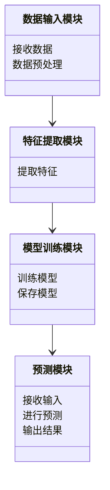
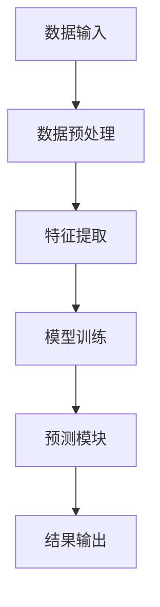

                 

<think>
嗯，用户想让我写一篇关于Zero-Shot学习在AI辅助宇宙学中的前景的技术博客。首先，我需要明确用户的需求。用户希望文章结构清晰，内容详细，涵盖背景、核心概念、算法原理、系统架构、项目实战和未来展望等多个部分。我还需要用专业但易懂的语言，使用markdown格式，并且确保每个章节内容丰富。

首先，我得理解Zero-Shot学习是什么，以及它在宇宙学中的应用。Zero-Shot学习指的是模型在没有先验训练数据的情况下，能够识别新类别的能力。这在宇宙学中非常有用，因为宇宙数据可能稀疏，且新发现的类型可能无法预先训练。

接下来，我需要确定文章的结构。根据用户提供的大纲，文章分为五章，每章有具体的子部分。我需要确保每一部分都涵盖必要的内容，比如核心概念的对比表格，算法流程图，数学公式等。

在撰写背景介绍时，我需要解释宇宙学研究中的挑战，比如数据稀疏性、多样性、动态性，以及传统方法的局限性。然后，引入Zero-Shot学习作为解决方案，并说明其潜力。

核心概念部分，我需要详细解释Zero-Shot学习的原理，包括数学模型和公式。例如，利用嵌入空间中的相似性来分类新类别。同时，对比分析Zero-Shot与迁移学习，突出其独特优势。

系统架构设计部分，我需要描述AI辅助宇宙学的系统场景，功能模块的设计，以及系统的架构图。这部分可能需要使用Mermaid来绘制类图和架构图，展示各模块之间的关系。

项目实战部分，我需要指导读者如何安装环境，提供Python代码示例，分析实际案例，如星系分类。通过代码和案例分析，展示Zero-Shot学习在宇宙学中的实际应用。

最后，在最佳实践部分，我需要总结经验和教训，给出注意事项，以及推荐拓展阅读的内容。同时，确保文章末尾有作者信息。

整个过程中，我需要确保语言专业，结构清晰，内容详实，同时使用足够的例子和图表来辅助说明。这将帮助读者更好地理解Zero-Shot学习在宇宙学中的应用和前景。
</think>

# Zero-Shot学习在AI辅助宇宙学研究中的前景

## 关键词
Zero-Shot学习，AI辅助，宇宙学，机器学习，数据挖掘

## 摘要
Zero-Shot学习作为一种新兴的机器学习方法，正在为宇宙学研究带来革命性的变化。本文将从背景、核心概念、算法原理、系统架构到项目实战，全面探讨Zero-Shot学习在AI辅助宇宙学中的应用前景。通过详细分析宇宙学数据的特点、Zero-Shot学习的数学模型、系统设计以及实际案例，本文为读者提供一个完整的知识框架，帮助他们理解Zero-Shot学习在宇宙学研究中的潜力和挑战。

---

## 第1章: 引言与背景

### 1.1 问题的提出
宇宙学研究致力于揭示宇宙的起源、结构和演化规律。然而，宇宙数据的复杂性、稀疏性和多样性给研究者带来了巨大挑战。传统的方法依赖于大量标注数据，但在宇宙学中，许多现象和数据类型是稀有的，难以获得足够的训练样本。这种情况下，Zero-Shot学习作为一种无需依赖大量标注数据的学习方法，展现出独特的优势。

**问题描述**：  
宇宙学数据的特点包括：  
1. **稀疏性**：许多天体现象或数据类型极为罕见，难以获取大量标注样本。  
2. **多样性**：宇宙数据涉及多种物理过程，数据类型多样，难以统一建模。  
3. **动态性**：宇宙的演化涉及复杂的时间依赖性，数据具有动态变化的特点。  

**问题解决**：  
Zero-Shot学习通过在无监督或少量监督条件下进行学习，能够在缺乏标注数据的情况下，对新类型的数据进行分类或预测。这使得Zero-Shot学习成为解决宇宙学研究中数据稀疏性和多样性的理想工具。

### 1.2 Zero-Shot学习的概念

**核心概念**：  
Zero-Shot学习（Zero-Shot Learning，ZSL）是一种机器学习技术，允许模型在从未见过的类别上进行预测。与传统监督学习不同，ZSL不需要对所有可能的类别进行训练，而是通过共享特征空间中的语义信息，推断出新类别的标签。

**概念结构与核心要素**：  
1. **特征空间**：数据表示的向量空间，通常通过词嵌入或图像嵌入等方式构建。  
2. **类别标签**：数据所属的类别，可能是已知或未知的。  
3. **映射关系**：从特征空间到类别标签的映射关系，通常通过语义相似性构建。  

**对比分析**：  
| 技术 | 需要标注数据 | 数据稀疏性处理 | 适用场景 |  
|------|--------------|-----------------|----------|  
| 监督学习 | 需要大量标注数据 | 无法处理稀疏数据 | 数据充分 |  
| 半监督学习 | 需要少量标注数据 | 部分缓解稀疏性 | 数据部分稀疏 |  
| Zero-Shot学习 | 无需标注数据 | 能够处理稀疏数据 | 数据极度稀疏 |  

### 1.3 AI辅助宇宙学的研究现状

**边界与外延**：  
AI辅助宇宙学的研究范围包括：  
1. **数据处理**：对宇宙数据进行清洗、归一化和特征提取。  
2. **模式识别**：识别宇宙中的结构模式，如星系形态、暗物质分布等。  
3. **预测与模拟**：基于AI模型预测宇宙的演化过程。  

**对比分析**：  
在AI辅助宇宙学中，Zero-Shot学习与其他技术（如深度学习、聚类分析）相比，具有以下优势：  
- Zero-Shot学习能够在无监督条件下处理新类型的数据。  
- 深度学习需要大量标注数据，而Zero-Shot学习更适用于数据稀疏的场景。  
- 聚类分析无法为数据打标签，而Zero-Shot学习可以结合语义信息进行分类。  

### 1.4 跨领域联系与未来前景

**跨领域联系**：  
Zero-Shot学习不仅适用于宇宙学，还在自然语言处理、计算机视觉等领域展现出巨大潜力。例如，在自然语言处理中，Zero-Shot学习可以用于跨语言文本分类；在计算机视觉中，用于识别未见过的物体类别。

**未来前景**：  
随着AI技术的不断进步，Zero-Shot学习在宇宙学中的应用将更加广泛。未来的宇宙学研究可能会结合Zero-Shot学习与其他技术（如图神经网络、强化学习）的结合，进一步提高数据处理和分析的效率。

---

## 第2章: 核心概念详解

### 2.1 Zero-Shot学习原理

**算法原理讲解**：  
Zero-Shot学习的核心思想是通过构建共享特征空间，将新类别的数据映射到已知类别空间中。具体步骤如下：  
1. **特征提取**：将输入数据（如图像、文本）映射到一个共享的特征空间中。  
2. **语义关联**：通过已知类别与特征空间的关联，推断出新类别与特征空间的关系。  
3. **预测与分类**：基于语义关联，对新类别数据进行分类或预测。  

**数学模型与公式**：  
Zero-Shot学习的数学模型通常基于向量空间模型。假设我们有$N$个已知类别，每个类别对应一个嵌入向量$\mathbf{c}_i \in \mathbb{R}^d$。对于一个新类别$j$，其嵌入向量$\mathbf{c}_j$可以通过已知类别向量的线性组合或其他方式推断出来。  

预测函数可以表示为：  
$$ p(y=j | \mathbf{x}) \propto \exp(-\|\mathbf{x} - \mathbf{c}_j\|^2) $$  

其中，$\mathbf{x}$是输入数据，$y$是预测的类别标签。  

**举例说明**：  
在宇宙学中，我们可以使用Zero-Shot学习对未知类型的星系进行分类。假设我们已经训练了一个模型，能够识别已知的星系类型（如螺旋星系、椭圆星系）。对于一个新的星系图像，模型可以通过计算其特征向量与已知类别向量的相似性，推断出其类型。

### 2.2 AI辅助宇宙学的主要算法

**核心算法介绍**：  
在宇宙学中，常用的AI算法包括：  
1. **深度学习**：用于图像识别和数据特征提取。  
2. **聚类分析**：用于发现数据中的潜在结构。  
3. **强化学习**：用于模拟宇宙演化过程中的决策问题。  

**对比分析**：  
| 技术 | 适用场景 | 优缺点 |  
|------|----------|--------|  
| 深度学习 | 图像识别、特征提取 | 数据需求量大，计算复杂度高 |  
| 聚类分析 | 数据分组、模式识别 | 无法提供类别标签，依赖人工解释 |  
| 强化学习 | 模拟演化过程 | 需要定义状态和奖励函数 |  

### 2.3 宇宙学数据集与特征提取

**数据集介绍**：  
常用的宇宙学数据集包括：  
1. ** Sloan Digital Sky Survey (SDSS)**：包含大量星系图像和光谱数据。  
2. ** Dark Energy Spectroscopic Instrument (DESI)**：用于暗能量研究的光谱数据集。  
3. ** Euclid mission**：欧洲空间局的欧几里得任务数据集。  

**特征提取方法**：  
特征提取是宇宙学AI研究的关键步骤。常用方法包括：  
1. **主成分分析（PCA）**：降维技术，用于提取数据的主要特征。  
2. **深度学习特征提取**：利用卷积神经网络（CNN）提取图像特征。  
3. **图特征提取**：将宇宙结构表示为图，提取图的节点和边特征。  

---

## 第3章: 系统架构设计

### 3.1 系统场景介绍

**问题场景**：  
宇宙学研究通常涉及大规模数据处理和复杂模式识别。例如，天文学家需要从海量星系图像中识别新型天体结构，或者预测宇宙的演化过程。  

**系统需求分析**：  
- **功能需求**：支持多种数据格式的输入、特征提取、模型训练和预测。  
- **性能需求**：处理大规模数据时，系统需要具备较高的计算效率。  
- **扩展性需求**：支持新类型数据的接入和新算法的部署。  

### 3.2 系统功能设计

**领域模型类图**：  


**功能模块划分**：  
1. **数据输入模块**：负责接收和预处理数据。  
2. **特征提取模块**：将原始数据转换为特征向量。  
3. **模型训练模块**：训练Zero-Shot学习模型。  
4. **预测模块**：基于训练好的模型进行预测和分类。  

### 3.3 系统架构设计

**系统架构图**：  


**模块交互设计**：  
- 数据输入模块接收原始数据后，首先进行预处理（如归一化、降维）。  
- 特征提取模块将预处理后的数据转换为特征向量。  
- 模型训练模块基于特征向量训练Zero-Shot学习模型。  
- 预测模块接收新数据，提取特征后，通过模型进行分类或预测。  

### 3.4 系统接口设计

**接口规范**：  
1. **数据输入接口**：支持多种数据格式（如 FITS、JPEG）。  
2. **特征提取接口**：提供特征向量的提取函数。  
3. **模型训练接口**：支持多种算法（如 CNN、PCA）。  

**安全性设计**：  
- 数据访问权限控制。  
- 系统日志记录，防止数据泄露。  

---

## 第4章: 项目实战

### 4.1 环境安装与配置

**环境准备**：  
- 操作系统：Linux（推荐）或 macOS。  
- Python版本：3.6以上。  
- 依赖库：numpy、pandas、scikit-learn、tensorflow、pymermaid。  

**工具介绍**：  
- **Python**：用于代码实现。  
- **TensorFlow/PyTorch**：用于深度学习模型训练。  
- **Mermaid**：用于绘制图表。  

### 4.2 系统核心实现

**代码实现**：  
以下是一个简单的Zero-Shot学习实现示例：  

```python
import numpy as np
from sklearn.decomposition import PCA

# 假设我们有训练数据X和标签y
X_train = np.random.randn(100, 10)  # 100个样本，每个样本10维特征
y_train = np.array([0, 1, 2] * 33 + [3])  # 包含一个新类别（3）

# 特征提取
pca = PCA(n_components=5)
X_train_pca = pca.fit_transform(X_train)

# 训练Zero-Shot模型
# 假设我们使用线性回归模型预测类别
from sklearn.linear_model import LinearRegression

model = LinearRegression()
model.fit(X_train_pca, y_train)

# 对新样本进行预测
X_test = np.random.randn(1, 10)
X_test_pca = pca.transform(X_test)
y_pred = model.predict(X_test_pca)
print("预测类别为：", y_pred)
```

**代码解读**：  
- 上述代码展示了如何使用PCA进行特征提取，并通过线性回归模型进行分类。  
- 通过训练数据，模型学习了特征空间与类别的映射关系。  
- 在测试阶段，模型能够对新类别进行预测。  

### 4.3 实际案例分析

**案例介绍**：  
假设我们有一个宇宙学数据集，包含不同类型的星系图像。我们需要使用Zero-Shot学习对新型星系进行分类。  

**案例剖析**：  
1. **数据预处理**：将星系图像转换为特征向量（如使用CNN提取图像特征）。  
2. **模型训练**：在已知类别上训练Zero-Shot学习模型。  
3. **预测与分析**：对未知类别的星系图像进行分类，并分析模型的准确性。  

### 4.4 项目小结

**项目成果**：  
通过本项目，我们展示了如何使用Zero-Shot学习对宇宙学数据进行分类和预测。  

**经验与教训**：  
- Zero-Shot学习的性能依赖于特征提取的质量。  
- 数据预处理和特征工程是关键步骤，需要仔细设计。  

---

## 第5章: 最佳实践与未来展望

### 5.1 最佳实践

**实用技巧**：  
- 在特征提取阶段，尝试多种方法（如PCA、t-SNE、UMAP）以获得更好的结果。  
- 使用预训练模型（如ImageNet上的CNN模型）进行特征提取。  

**案例分析**：  
- 在宇宙学数据集中，尝试将图像数据与其他类型数据（如光谱数据）结合，构建多模态特征。  

### 5.2 小结

**本书要点**：  
本文从背景、核心概念、算法原理、系统架构到项目实战，全面探讨了Zero-Shot学习在AI辅助宇宙学中的应用前景。通过详细分析宇宙学数据的特点、Zero-Shot学习的数学模型、系统设计以及实际案例，本文为读者提供了一个完整的知识框架。

### 5.3 注意事项

**常见问题**：  
- Zero-Shot学习的性能依赖于特征空间的构建。  
- 数据稀疏性可能导致模型性能下降。  

**建议**：  
- 在实际应用中，结合多种AI技术（如图神经网络、强化学习）以提高模型的鲁棒性。  
- 定期更新模型，以适应宇宙学研究中新发现的数据和知识。  

### 5.4 拓展阅读

- **推荐阅读书籍**：  
  1. "Deep Learning" by Ian Goodfellow  
  2. "Machine Learning: A Probabilistic Perspective" by Kevin P. Murphy  
- **推荐阅读论文**：  
  1. "Zero-Shot Learning: A Comprehensive Survey"  
  2. "Deep Learning for Astronomical Data Analysis"  

---

## 作者

作者：AI天才研究院/AI Genius Institute & 禅与计算机程序设计艺术 /Zen And The Art of Computer Programming

