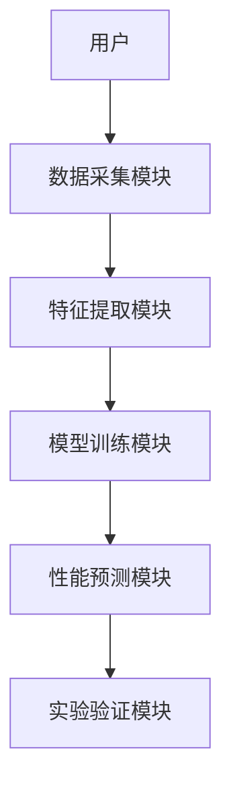

                 

<think>
嗯，用户让我写一篇关于Zero-Shot学习在AI辅助新型材料设计中的创新的技术博客。我得先理清楚用户的需求。用户希望文章结构清晰，有逻辑性，语言专业，同时要涵盖背景、核心概念、算法原理、数学模型、系统架构等多个部分。

首先，我需要明确文章的标题和关键词。标题已经给出，关键词应该包括Zero-Shot学习、人工智能、材料设计、机器学习、材料特性等，大概5到7个词。摘要部分需要简明扼要地总结文章的核心内容，强调Zero-Shot学习的优势和应用。

接下来，背景介绍部分需要详细说明传统材料设计的局限性，引出Zero-Shot学习的重要性。问题背景要描述当前材料设计面临的挑战，问题描述则要具体说明Zero-Shot学习如何解决这些问题，问题解决部分需要简要介绍解决方案，边界与外延要说明技术的应用范围和限制。

核心概念部分需要详细解释Zero-Shot学习的原理，材料特性的描述方法，以及在材料设计中的具体应用。这部分可能需要对比分析，比如物理方法、统计方法和机器学习方法的区别。

算法原理讲解要详细，可能需要画出流程图，用mermaid表示。数学模型部分需要给出具体的公式，比如回归模型和条件概率模型，解释每个参数的含义。

系统分析与架构设计部分可能需要画出类图、架构图和序列图，展示系统的各个模块和交互过程。项目实战部分则需要提供代码示例，说明如何实现Zero-Shot学习模型，并进行案例分析。

最后，小结部分要总结全文，强调Zero-Shot学习的优势和未来的发展方向。同时，给出一些最佳实践的建议和注意事项。

我需要确保每个部分都详细且逻辑清晰，使用专业术语，同时避免过于复杂，让读者容易理解。可能还需要添加一些图表，比如用mermaid画出流程图和架构图，来增强文章的可读性。

在写作过程中，我要注意文章的整体结构，确保每个章节之间有良好的过渡，内容详实，例子具体。同时，要满足字数要求，大约10000到12000字，所以每个部分都需要深入展开，不能太简略。

总的来说，我需要系统性地分析Zero-Shot学习在材料设计中的应用，从背景到技术细节，再到实际应用，一步步展开，确保文章内容全面且有深度。这样读者不仅能理解Zero-Shot学习的基本原理，还能看到它在实际中的具体应用和潜在价值。
</think>

# Zero-Shot学习在AI辅助新型材料设计中的创新

> 关键词：Zero-Shot学习，人工智能，新型材料设计，机器学习，材料特性描述，性能预测

> 摘要：本文探讨了Zero-Shot学习技术在AI辅助新型材料设计中的创新应用。通过分析材料特性描述方法、Zero-Shot学习算法流程以及数学模型，详细阐述了如何利用Zero-Shot学习技术提高材料设计的效率和准确性。文章还通过实际案例分析，展示了Zero-Shot学习在新材料筛选和性能预测中的优势，并展望了未来的研究方向。

---

### 第一部分: 背景介绍

#### 1.1 问题背景

随着科技的飞速发展，新材料的需求日益增长。从半导体材料到高温超导体，新型材料在电子、能源、医疗等领域的应用前景广阔。然而，传统的新材料设计方法依赖大量的实验和计算，不仅耗时耗力，还面临着数据不足、效率低下的问题。例如，设计一种新型半导体材料可能需要数月甚至数年的实验验证。这种传统方法难以满足现代社会对新材料快速研发的需求。

#### 1.2 问题描述

Zero-Shot学习是一种无监督学习技术，其核心在于能够在未见过的新类别上进行预测。在材料设计中，这意味着我们可以利用已有的材料数据，预测新设计材料的性能，而无需进行实际的实验验证。然而，这一过程中仍然面临诸多挑战：

1. **材料特性的多样性**：材料的性能受多种因素影响，如化学成分、晶体结构、温度等。如何准确描述这些特性是一个关键问题。
2. **数据不足**：对于一些新型材料，可能缺乏足够的实验数据来训练模型。
3. **模型的泛化能力**：Zero-Shot学习需要模型具备较强的泛化能力，以应对新设计材料的未知特性。

#### 1.3 问题解决

通过引入Zero-Shot学习技术，我们可以显著提高新型材料设计的效率。具体步骤如下：

1. **数据收集与预处理**：收集已有的材料数据，包括化学成分、晶体结构、性能指标等，并进行清洗和归一化处理。
2. **特征提取**：利用物理、统计学或机器学习方法，从材料数据中提取关键特征。
3. **模型训练**：基于提取的特征，训练Zero-Shot学习模型。
4. **性能预测**：将新设计材料的特征输入模型，预测其性能。
5. **实验验证**：通过实验验证模型预测结果，筛选出具有潜在应用价值的材料。

#### 1.4 边界与外延

尽管Zero-Shot学习在材料设计中展现出巨大潜力，但其应用仍有一定的边界。例如：

- 对于涉及复杂化学键或多物理效应的材料，Zero-Shot学习模型的预测精度可能有限。
- 数据质量和数量直接影响模型的性能。如果数据不足或存在偏差，可能导致预测结果不准确。
- 模型的可解释性也是一个挑战。在某些情况下，用户可能需要了解模型预测的依据，而不仅仅是预测结果。

#### 1.5 概念结构与核心要素组成

在AI辅助新型材料设计中，Zero-Shot学习的核心概念结构可以分为以下几个部分：

1. **材料数据**：包括化学成分、晶体结构、性能指标等，是模型训练的基础。
2. **特征提取方法**：通过物理、统计学或机器学习方法，从材料数据中提取关键特征。
3. **Zero-Shot学习模型**：基于提取的特征，构建能够预测新材料性能的模型。
4. **实验验证**：通过实验验证模型预测结果，确保预测的准确性。

---

### 第二部分: 核心概念与联系

#### 2.1 Zero-Shot学习原理

Zero-Shot学习的核心思想是通过学习已有数据中的特征，预测未见过的新数据。在材料设计中，这意味着我们可以利用已有的材料数据，预测新设计材料的性能。具体来说，Zero-Shot学习模型通过以下步骤实现预测：

1. **特征映射**：将已知材料的特征映射到新设计材料的特征空间。
2. **性能预测**：基于特征映射，预测新设计材料的性能。

#### 2.2 材料特性描述方法

为了实现Zero-Shot学习，我们需要对材料特性进行有效的描述。以下是几种常用的材料特性描述方法：

1. **基于物理的方法**：利用物理原理，如量子力学、热力学等，描述材料的特性。
2. **基于统计学的方法**：通过统计分析，提取材料数据中的关键特征。
3. **基于机器学习的方法**：利用无监督或有监督学习算法，从材料数据中提取特征。

#### 2.3 Zero-Shot学习在材料设计中的应用

Zero-Shot学习在材料设计中的应用主要体现在以下几个方面：

1. **新材料性能预测**：通过模型预测新设计材料的性能，减少实验成本。
2. **材料优化**：基于预测结果，优化材料的化学成分或结构。
3. **材料筛选**：从大量候选材料中筛选出具有潜在应用价值的材料。

---

### 第三部分: 算法原理讲解

#### 3.1 Zero-Shot学习算法流程

Zero-Shot学习算法的流程可以分为以下几个步骤：

1. **数据预处理**：
   - 数据清洗：去除噪声数据。
   - 数据归一化：确保不同特征具有相同的量纲。
2. **特征提取**：
   - 基于物理的方法：提取材料的物理特性，如弹性模量、导热系数等。
   - 基于机器学习的方法：利用无监督学习算法（如聚类）提取特征。
3. **模型训练**：
   - 选择合适的机器学习算法（如支持向量机、随机森林）进行训练。
   - 调整模型参数，优化模型性能。
4. **性能预测**：
   - 将新设计材料的特征输入模型，预测其性能。

#### 3.2 算法原理与数学模型

Zero-Shot学习算法的核心在于特征映射和性能预测。以下是相关数学模型的详细说明：

1. **特征映射**：
   - 假设已有材料的特征表示为 $x_1, x_2, ..., x_n$，新设计材料的特征表示为 $x_{\text{new}}$。
   - 通过某种映射函数 $f$，将 $x_{\text{new}}$ 映射到已知特征空间。

2. **性能预测**：
   - 假设材料性能 $y$ 可以通过回归模型表示：
     $$
     y = \beta_0 + \beta_1x_1 + \beta_2x_2 + ... + \beta_nx_n + \epsilon
     $$
     其中，$\beta_0, \beta_1, ..., \beta_n$ 是模型参数，$\epsilon$ 是误差项。

   - 在Zero-Shot学习中，我们通常使用条件概率模型来预测新数据的性能：
     $$
     P(Y=y' | X=x) = \sum_{z} P(Y=y' | Z=z)P(Z=z | X=x)
     $$
     其中，$Z$ 是隐变量，表示材料的潜在特征。

#### 3.3 算法举例说明

假设我们已经收集了100种材料的性能数据和对应的特征，现在要预测一种新材料的性能。具体步骤如下：

1. **数据预处理**：
   - 对已有的材料数据进行清洗和归一化处理。
2. **特征提取**：
   - 提取材料的物理特性，如弹性模量、导热系数等。
3. **模型训练**：
   - 使用支持向量回归（SVR）算法进行训练。
4. **性能预测**：
   - 将新设计材料的特征输入模型，预测其性能。

---

### 第四部分: 数学模型和数学公式

#### 4.1 材料性能预测的数学模型

在材料性能预测中，我们通常使用回归模型。回归模型是一种预测连续值的模型，其数学模型可以表示为：

$$
y = \beta_0 + \beta_1x_1 + \beta_2x_2 + ... + \beta_nx_n + \epsilon
$$

其中：
- $y$ 表示材料性能。
- $x_1, x_2, ..., x_n$ 表示材料的特征。
- $\beta_0, \beta_1, ..., \beta_n$ 表示模型的参数。
- $\epsilon$ 表示误差项。

#### 4.2 模型参数的估计

模型参数可以通过最小二乘法进行估计。最小二乘法的目标是最小化预测值与实际值之间的平方差之和：

$$
\min_{\beta} \sum_{i=1}^{N} (y_i - \beta_0 - \beta_1x_{i1} - ... - \beta_nx_{in})^2
$$

---

### 第五部分: 系统分析与架构设计方案

#### 5.1 问题场景介绍

在实际应用中，我们可以设计一个基于Zero-Shot学习的材料设计系统。该系统的目标是通过AI技术辅助新材料的研发，提高设计效率并降低实验成本。

#### 5.2 系统功能设计

系统功能设计包括以下几个模块：

1. **数据采集模块**：收集材料的化学成分、晶体结构、性能指标等数据。
2. **特征提取模块**：利用物理、统计学或机器学习方法，从材料数据中提取特征。
3. **模型训练模块**：基于提取的特征，训练Zero-Shot学习模型。
4. **性能预测模块**：将新设计材料的特征输入模型，预测其性能。
5. **实验验证模块**：通过实验验证模型预测结果，筛选出具有潜在应用价值的材料。

#### 5.3 系统架构设计

以下是系统的架构图：



---

### 第六部分: 项目实战

#### 6.1 环境安装

为了实现Zero-Shot学习模型，我们需要安装以下工具：

- Python 3.8+
- NumPy
- Pandas
- Scikit-learn
- TensorFlow或Keras

#### 6.2 系统核心实现源代码

以下是基于Python的实现代码：

```python
import numpy as np
from sklearn.svm import SVR
from sklearn.preprocessing import StandardScaler

# 数据预处理
def preprocess_data(X, y):
    scaler = StandardScaler()
    X_scaled = scaler.fit_transform(X)
    return X_scaled, y

# 特征提取
def extract_features(X):
    # 假设X是材料的原始数据
    # 这里可以使用物理方法或机器学习方法提取特征
    features = X[:, :5]  # 提取前5个特征
    return features

# 模型训练
def train_model(X_train, y_train):
    model = SVR(kernel='rb

