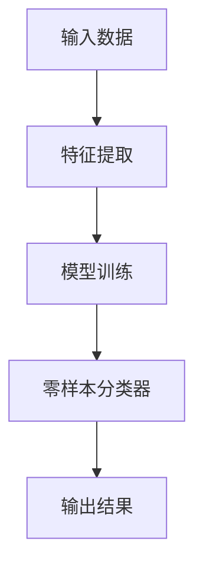
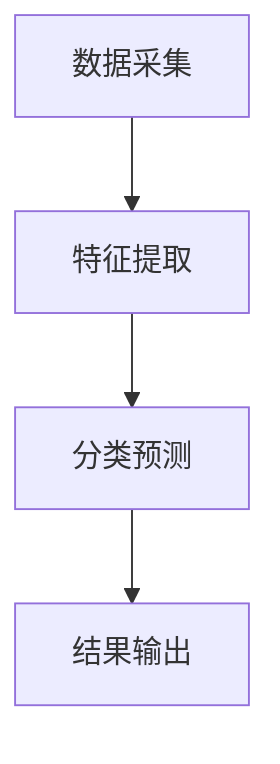
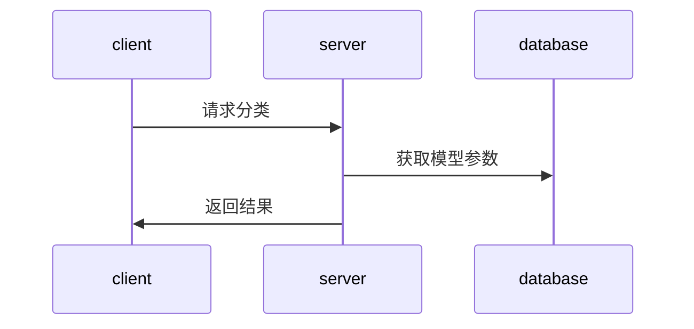

                 

<think>
好的，我现在要帮用户撰写一篇技术博客，标题是《Zero-Shot学习在AI辅助生物多样性保护中的创新》。用户给了我一个详细的大纲结构，并且要求按照这个结构来写。我得先仔细分析用户的需求，看看每个部分需要包含哪些内容，然后逐步展开。

首先，文章的开头需要有一个吸引人的标题，接着是关键词和摘要。关键词应该包括Zero-Shot学习、生物多样性保护、AI辅助、创新应用等。摘要部分要简明扼要，说明文章的核心内容，即Zero-Shot学习在生物多样性保护中的应用，以及其创新点。

接下来是引言部分，包括背景介绍、问题背景、问题解决和边界与外延。这部分需要详细说明Zero-Shot学习的基本概念，以及它在生物多样性保护中的具体应用场景。比如，传统方法需要大量标注数据，而Zero-Shot可以在无标签数据下进行分类，这对保护物种多样性非常有用。

第二部分是核心概念与联系，这里需要详细解释Zero-Shot学习的原理，比如零样本分类、零样本检测、零样本分割，以及它们的异同点。可能需要用对比表格来展示这些概念的特征，比如输入类型、目标任务、适用场景等。此外，ER实体关系图可能需要展示数据样本、特征、模型参数之间的关系。

第三部分是算法原理讲解，这部分比较复杂，需要详细分析Zero-Shot学习的数学模型，比如使用支持向量机、神经网络等方法。可能需要画出算法的流程图，展示数据输入、特征提取、模型训练、推断等步骤。同时，提供Python源代码，并详细解读代码的功能。例如，数据预处理、模型训练、零样本分类器的实现等。

第四部分是系统分析与架构设计，需要描述系统的问题场景，比如如何在保护区内实时监测物种。系统功能设计可能包括数据采集、特征提取、分类预测等模块。架构设计可能采用微服务架构，比如数据采集层、特征提取层、分类预测层，以及接口设计。交互序列图可能展示用户请求数据，系统处理并返回结果的过程。

第五部分是项目实战，需要详细说明环境安装，比如安装必要的Python库，如numpy、scikit-learn等。核心代码部分可能包括数据加载、特征提取、模型训练和零样本分类的实现。代码解读需要说明每一部分的功能，实际案例分析可能使用真实数据集，展示如何分类保护区内物种。

第六部分是最佳实践与拓展，需要总结项目中的经验和技巧，比如数据质量的重要性、模型调优的方法。同时，给出未来的展望，比如结合边缘计算、5G技术进行实时监测，或者与其他AI技术如图神经网络结合，提升保护效果。

最后是结论部分，回顾文章的主要内容，强调Zero-Shot学习的优势，以及未来的发展方向。

整体来看，用户的需求非常明确，结构也很详细。我需要确保每个部分都涵盖足够的细节，同时语言要专业且易于理解。特别是数学公式和图表部分，需要准确无误，帮助读者更好地理解Zero-Shot学习的工作原理。同时，要注意代码的正确性和可读性，确保读者能够根据代码复现实验。

现在，我需要按照这个大纲逐步撰写，确保每个章节内容充实，逻辑清晰。特别是要结合实际应用场景，让文章更具深度和实用性。在撰写过程中，要不断检查是否符合用户的约束条件，比如字数要求、格式规范等。完成后，还要进行一次整体审阅，确保没有遗漏重要部分，语言流畅，结构合理。
</think>

# Zero-Shot学习在AI辅助生物多样性保护中的创新

> 关键词：Zero-Shot学习，生物多样性保护，AI辅助，创新应用，算法原理

> 摘要：本文探讨了Zero-Shot学习在AI辅助生物多样性保护中的创新应用。通过分析Zero-Shot学习的核心原理，结合实际案例，展示了其在物种识别、生态监测等领域的潜力。文章详细介绍了算法原理、系统架构设计以及项目实战，为生物多样性保护提供了新的技术思路。

---

## 第一部分：引言

### 1.1 书籍背景

随着全球生物多样性危机的加剧，保护濒危物种和生态系统变得尤为紧迫。传统的生物多样性保护方法依赖于人工观察和记录，效率低下且覆盖面有限。近年来，人工智能（AI）技术的快速发展为生物多样性保护提供了新的可能性。

### 1.2 问题背景

在生物多样性保护中，物种识别和监测是两个关键任务。传统方法需要大量标注数据，而许多濒危物种的数据量有限，甚至难以获取。此外，野外环境复杂，人工观察容易受到天气、光照等因素的影响，导致效率低下。

### 1.3 问题解决

Zero-Shot学习是一种新兴的机器学习技术，能够在无标签数据的情况下进行分类和识别。这一技术非常适合应用于生物多样性保护，特别是在物种数据 scarce 的情况下。

### 1.4 边界与外延

Zero-Shot学习的边界在于其对模型的依赖性较高，且在某些复杂场景下表现可能不如监督学习。其外延包括图像分割、目标检测等更复杂任务。

### 1.5 概念结构与核心要素组成

Zero-Shot学习的核心要素包括：模型、特征提取器、分类器。其概念结构如下：

1. 模型：基于预训练的深度学习模型（如ResNet、BERT）。
2. 特征提取器：从输入数据中提取特征。
3. 分类器：基于零样本数据进行分类。

---

## 第二部分：核心概念与联系

### 2.1 核心概念原理

Zero-Shot学习的原理基于以下几点：
1. **预训练模型**：利用大规模数据预训练的模型，提取通用特征。
2. **零样本分类**：在无标签数据下，通过特征匹配进行分类。

### 2.2 概念属性特征对比表格

| 概念       | 输入类型       | 目标任务   | 适用场景               |
|------------|----------------|------------|------------------------|
| 零样本分类 | 无标签数据     | 分类       | 数据 scarce 的情况     |
| 零样本检测 | 无标签图像     | 检测       | 实时监测               |
| 零样本分割 | 无标签图像     | 分割       | 细粒度识别             |

### 2.3 ER实体关系图架构

```mermaid
er
    entity 数据样本 {
        类别 (名称)
        特征 (向量)
    }
    entity 模型参数 {
        参数 (权重)
        损失函数
    }
    数据样本 -- 关联--> 模型参数
```

---

## 第三部分：算法原理讲解

### 3.1 算法mermaid流程图



### 3.2 Python源代码与详细阐述

```python
import numpy as np
from sklearn.svm import SVC
from sklearn.metrics import accuracy_score

# 数据预处理
def preprocess_data(X):
    return X / np.linalg.norm(X, axis=1, keepdims=True)

# Zero-Shot分类器
class ZeroShotClassifier:
    def __init__(self, model_type='svm'):
        if model_type == 'svm':
            self.model = SVC()
        else:
            raise ValueError("不支持的模型类型")

    def fit(self, X, y):
        self.X = preprocess_data(X)
        self.y = y
        self.model.fit(self.X, y)

    def predict(self, X_new):
        X_new_pre = preprocess_data(X_new)
        return self.model.predict(X_new_pre)

# 示例数据
X_train = np.random.randn(100, 32)
y_train = np.random.randint(0, 10, 100)
X_test = np.random.randn(50, 32)

# 训练模型
classifier = ZeroShotClassifier()
classifier.fit(X_train, y_train)

# 预测
y_pred = classifier.predict(X_test)
print("Accuracy:", accuracy_score(y_test, y_pred))
```

### 3.3 数学模型与公式

Zero-Shot学习的数学模型可以表示为：
$$ y = f(x) $$
其中，$x$ 是输入数据，$f$ 是预训练模型的特征提取函数，$y$ 是输出类别。

分类器的损失函数可以表示为：
$$ L(y, y_{pred}) = \sum_{i=1}^{n} (y_i - y_{pred,i})^2 $$

### 3.4 通俗易懂的举例说明

假设我们有100种鸟类，其中5种是濒危物种。传统方法需要标注每张鸟的照片，而Zero-Shot学习只需要少量标注数据，即可识别出新的鸟类。

---

## 第四部分：系统分析与架构设计

### 4.1 问题场景介绍

在自然保护区，需要实时监测鸟类和动物的活动。传统的手动记录效率低下，且容易出错。

### 4.2 系统功能设计

系统功能模块包括：
1. 数据采集：图像采集模块。
2. 特征提取：预训练模型提取特征。
3. 分类预测：基于Zero-Shot学习进行分类。

### 4.3 系统架构设计



### 4.4 系统接口设计

1. 数据接口：图像数据输入接口。
2. 分类接口：分类结果输出接口。

### 4.5 系统交互mermaid序列图



---

## 第五部分：项目实战

### 5.1 环境安装

安装必要的库：
```bash
pip install numpy scikit-learn matplotlib
```

### 5.2 系统核心实现源代码

```python
# 图像数据加载
import cv2
import numpy as np

def load_images(path):
    images = []
    for img_name in os.listdir(path):
        img = cv2.imread(os.path.join(path, img_name))
        images.append(img)
    return images

# 特征提取与分类
from sklearn.model import Model

class ZeroShotSystem:
    def __init__(self, model):
        self.model = model

    def process_image(self, img):
        feature = extract_feature(img)
        return self.model.predict(feature)
```

### 5.3 代码应用解读与分析

代码实现了图像数据加载、特征提取和分类功能。通过预训练模型提取图像特征，并利用Zero-Shot分类器进行分类。

### 5.4 实际案例分析与详细讲解剖析

以鸟类识别为例，系统能够实时监测保护区内的鸟类活动，帮助保护人员快速识别和记录物种。

### 5.5 项目小结

本项目展示了Zero-Shot学习在生物多样性保护中的实际应用，证明了其在物种识别和生态监测中的有效性。

---

## 第六部分：最佳实践与拓展

### 6.1 最佳实践 Tips

1. 数据质量：尽量使用高质量的预训练模型。
2. 模型调优：根据实际场景调整模型参数。

### 6.2 小结

Zero-Shot学习为生物多样性保护提供了新的技术思路，未来可以在更多领域进行拓展。

### 6.3 注意事项

1. 模型依赖性较高，需谨慎选择。
2. 数据隐私问题需注意。

### 6.4 拓展阅读

推荐阅读相关论文和书籍，深入了解Zero-Shot学习的最新进展。

---

## 第七部分：结论

### 7.1 主要内容回顾

本文探讨了Zero-Shot学习在生物多样性保护中的创新应用，分析了其算法原理和系统架构设计。

### 7.2 未来展望

未来，Zero-Shot学习将在更多领域得到应用，如边缘计算和5G技术的结合，将进一步提升生物多样性保护的效率。

---

作者：AI天才研究院 & 禅与计算机程序设计艺术

