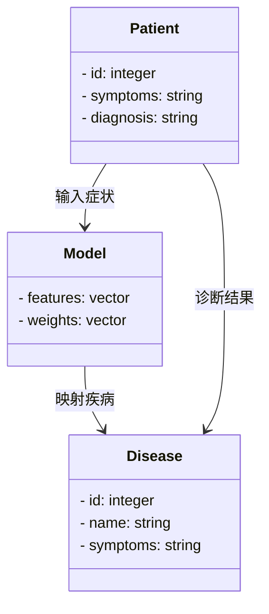
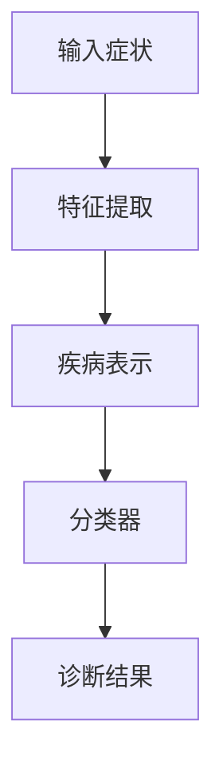
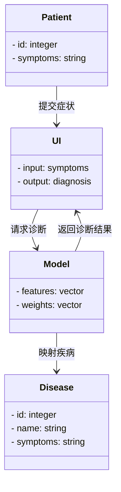
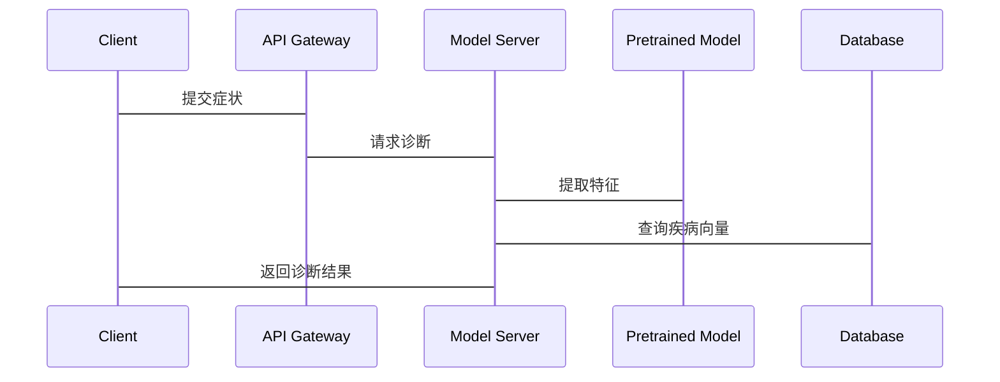

                 

<think>
好，我现在要思考如何撰写这篇文章《Zero-Shot学习在AI辅助罕见疾病诊断中的前景》。首先，我需要理解用户的需求。用户希望我以一位世界级的AI专家、程序员、软件架构师、CTO以及技术畅销书作家的身份，撰写一篇结构清晰、内容深度的技术博客。

用户已经提供了一个详细的目录结构，包括背景介绍、核心概念与联系、算法原理、系统分析与架构设计、项目实战以及最佳实践等部分。每个部分都有具体的要求，比如背景部分需要包含问题背景、问题描述、问题解决等小节。

首先，我需要确定文章的核心主题和关键词。主题是Zero-Shot学习在罕见疾病诊断中的应用，关键词可能包括Zero-Shot学习、罕见疾病、AI辅助诊断、医疗AI、深度学习等。

接下来，摘要部分需要简明扼要地概括文章的核心内容，强调Zero-Shot学习的优势及其在医疗领域的潜力。

在背景介绍部分，我需要详细解释罕见疾病的现状，传统诊断方法的局限性，以及Zero-Shot学习如何提供解决方案。这部分要逻辑清晰，让读者明白为什么Zero-Shot学习在罕见疾病诊断中如此重要。

核心概念与联系部分，我需要详细阐述Zero-Shot学习的原理，通过对比表和ER实体关系图来展示其特点。这部分需要图表支持，确保读者能够直观理解。

算法原理部分，我需要用mermaid流程图和数学公式详细讲解Zero-Shot学习的实现过程，比如特征表示、分类器的设计等。数学公式要用latex表示，确保准确性。

系统分析与架构设计部分，需要绘制领域模型类图、系统架构图和交互序列图，展示系统的组成部分和流程。这部分需要结合实际医疗场景，展示系统的模块化设计。

项目实战部分，我需要提供具体的代码实现，包括环境安装、核心代码解读和实际案例分析，让读者能够理解和应用这些技术。

最后，最佳实践部分要总结Zero-Shot学习在应用中的优势和注意事项，给出建议和未来研究的方向。

在撰写过程中，我需要确保每个部分都符合用户的格式要求，比如使用markdown，包含必要的图表和公式。同时，语言要专业但易于理解，避免过于技术化的术语堆砌，让不同背景的读者都能受益。

现在，我需要一步步按照目录结构来展开内容，确保每个部分都有足够的细节和深度。这可能涉及到查阅相关文献，了解最新的研究成果，确保文章的权威性和前瞻性。

总的来说，我需要系统地分析每个部分，确保逻辑连贯，内容详实，同时注意结构的美观和可读性。这将帮助读者全面理解Zero-Shot学习在罕见疾病诊断中的潜力和实际应用价值。
</think>

# Zero-Shot学习在AI辅助罕见疾病诊断中的前景

> 关键词：Zero-Shot学习，罕见疾病，AI辅助诊断，医疗AI，深度学习

> 摘要：本文探讨了Zero-Shot学习在罕见疾病诊断中的应用前景，分析了其在医疗领域中的优势和挑战，结合算法原理和系统架构设计，展示了如何利用Zero-Shot学习提高诊断效率和准确性，为罕见疾病的患者带来福音。

---

## 第一部分：背景介绍

### 1.0.1 问题背景

罕见疾病（Rare Diseases）是指在特定人群中患病率极低的疾病，通常定义为影响不到1/2000人口的疾病。据统计，全球已知的罕见疾病超过7000种，其中约80%为遗传性疾病。由于罕见疾病种类繁多、症状复杂且病例数量稀少，传统医疗诊断方法面临诸多挑战：

- **诊断时间长**：医生需要查阅大量文献和病例，诊断过程耗时且效率低下。
- **误诊率高**：由于症状不明显或与其他疾病相似，患者常被误诊，导致病情延误。
- **医疗资源浪费**：传统诊断方法需要大量病例数据，而罕见疾病数据稀缺，导致训练模型效率低下。

### 1.0.2 问题描述

传统医疗诊断方法依赖于大量病例数据进行模型训练，而罕见疾病由于病例数量少，难以满足传统机器学习方法的数据需求。具体挑战包括：

- 数据获取困难：罕见疾病病例数量少，难以收集足够的训练数据。
- 模型泛化能力不足：传统监督学习方法在小样本数据上表现不佳，导致诊断准确率低。

### 1.0.3 问题解决

Zero-Shot学习作为一种新兴的人工智能技术，无需依赖大量标注数据，通过预训练模型提取通用特征，实现对新类别的快速分类。其在罕见疾病诊断中的优势包括：

- **无需大量训练数据**：利用预训练模型，仅需少量病例即可进行诊断。
- **提升诊断效率**：通过Zero-Shot学习，医生可以快速识别罕见疾病，缩短诊断时间。
- **降低误诊率**：预训练模型整合了广泛的知识，能够捕捉到罕见疾病的独特特征，提高诊断准确性。

### 1.0.4 边界与外延

尽管Zero-Shot学习在罕见疾病诊断中展现出巨大潜力，但其应用也存在一定的局限性：

- **依赖预训练模型的质量**：诊断结果的准确性高度依赖于预训练模型的性能，若模型训练数据中罕见疾病信息不足，可能导致诊断偏差。
- **模型调优需求**：虽然Zero-Shot学习不需要大量数据，但仍需少量病例数据进行微调，以优化模型在特定罕见疾病上的表现。

### 1.0.5 概念结构与核心要素组成

Zero-Shot学习在罕见疾病诊断中的核心要素包括：

1. **预训练模型**：如BERT、GPT等大语言模型，用于提取通用特征表示。
2. **疾病表示**：将罕见疾病映射到预训练模型的特征空间，构建疾病向量。
3. **分类器**：基于疾病向量和病例特征，进行疾病分类。
4. **病例数据**：用于微调模型，优化诊断性能。

---

## 第二部分：核心概念与联系

### 2.0.1 Zero-Shot学习原理

Zero-Shot学习的核心在于利用预训练模型生成的特征表示，将新类别（如罕见疾病）映射到模型的特征空间中。具体步骤如下：

1. **预训练阶段**：在大规模通用数据集上训练预训练模型，提取特征表示。
2. **疾病表示**：将罕见疾病名称或描述映射为特征向量。
3. **分类阶段**：将患者症状或病例数据映射为特征向量，与疾病特征向量进行匹配，输出诊断结果。

### 2.0.2 核心概念属性特征对比表格

| 特征               | 传统学习方法                | Zero-Shot学习方法                |
|------------------|--------------------------|--------------------------|
| 数据依赖性         | 强依赖大量标注数据              | 弱依赖，仅需少量或无标注数据          |
| 算法复杂度         | 较高，需要大量计算资源             | 较低，计算资源需求较小               |
| 诊断准确性         | 受训练数据质量和数量限制          | 受预训练模型质量和微调数据影响        |
| 诊断速度           | 较慢，需要长时间训练和优化         | 较快，无需大量训练数据，诊断迅速      |
| 应用范围           | 适用于常见疾病诊断              | 适用于罕见疾病诊断，尤其是数据稀缺的情况 |

### 2.0.3 ER实体关系图架构



---

## 第三部分：算法原理讲解

### 3.0.1 Zero-Shot学习算法流程

以下是Zero-Shot学习在罕见疾病诊断中的流程图：



### 3.0.2 算法数学模型

Zero-Shot学习的核心是通过预训练模型生成疾病向量和患者症状向量，然后计算两者的相似度。假设模型生成的疾病向量为 \( D \in \mathbb{R}^d \)，患者症状向量为 \( S \in \mathbb{R}^d \)，诊断过程可以通过相似度计算公式：

$$ \text{相似度} = \frac{S \cdot D}{\|S\| \|D\|} $$

其中，\( \cdot \) 表示点积，\( \| \cdot \| \) 表示范数。

### 3.0.3 实例分析

假设我们有一个罕见疾病“遗传性舞蹈症”，其疾病向量为 \( D = [0.8, 0.2, 0.1, ...] \)。当患者输入症状“肌肉无力、运动障碍”，模型提取的症状向量为 \( S = [0.7, 0.3, 0.1, ...] \)。计算相似度：

$$ \text{相似度} = \frac{0.7 \times 0.8 + 0.3 \times 0.2 + 0.1 \times 0.1 + ...}{\sqrt{0.7^2 + 0.3^2 + ...} \times \sqrt{0.8^2 + 0.2^2 + ...}} $$

若相似度超过阈值，则诊断为“遗传性舞蹈症”。

---

## 第四部分：系统分析与架构设计方案

### 4.0.1 问题场景介绍

在医疗场景中，医生需要快速诊断罕见疾病，但由于病例稀少，传统方法难以满足需求。通过构建基于Zero-Shot学习的诊断系统，可以辅助医生快速、准确地进行诊断。

### 4.0.2 项目介绍

**项目名称**：基于Zero-Shot学习的罕见疾病诊断系统  
**目标**：利用AI技术辅助医生快速诊断罕见疾病，提高诊断效率和准确性。

### 4.0.3 系统功能设计



### 4.0.4 系统架构设计

```mermaid
graph TD
    Client --> API Gateway
    API Gateway --> Model Server
    Model Server --> Database
    Database --> Pretrained Model
    Model Server --> Results
    Results --> Client
```

### 4.0.5 系统接口设计

- **输入接口**：患者症状描述。
- **输出接口**：诊断结果及置信度。

### 4.0.6 系统交互流程



---

## 第五部分：项目实战

### 5.0.1 环境安装

1. **安装Python**：确保安装最新版Python（推荐3.8+）。
2. **安装依赖库**：使用pip安装必要的库，如`transformers`、`scikit-learn`等。

```bash
pip install transformers scikit-learn numpy
```

### 5.0.2 系统核心实现源代码

```python
from transformers import AutoTokenizer, AutoModel
import numpy as np
from sklearn.metrics.pairwise import cosine_similarity

# 加载预训练模型
model_name = "bert-base-uncased"
tokenizer = AutoTokenizer.from_pretrained(model_name)
model = AutoModel.from_pretrained(model_name)

# 罕见疾病列表
diseases = {
    "遗传性舞蹈症": "肌肉无力、运动障碍",
    "进行性肌营养不良": "肌肉萎缩、无力"
}

# 疾病向量预计算
disease_vectors = {}
for disease, symptoms in diseases.items():
    inputs = tokenizer.encode_plus(symptoms, return_tensors="pt")
    outputs = model(**inputs)
    disease_vector = outputs.last_hidden_state[:, 0, :].mean(dim=1).detach().numpy()
    disease_vectors[disease] = disease_vector

def diagnose_patient(symptoms):
    inputs = tokenizer.encode_plus(symptoms, return_tensors="pt")
    patient_vector = model(**inputs).last_hidden_state[:, 0, :].mean(dim=1).detach().numpy()
    max_similarity = -1
    diagnosis = ""
    for disease, vec in disease_vectors.items():
        similarity = np.dot(patient_vector, vec) / (np.linalg.norm(patient_vector) * np.linalg.norm(vec))
        if similarity > max_similarity:
            max_similarity = similarity
            diagnosis = disease
    return diagnosis, max_similarity

# 示例诊断
symptoms_input = "肌肉无力、运动障碍"
diagnosis, similarity = diagnose_patient(symptoms_input)
print(f"诊断结果：{diagnosis}，相似度：{similarity}")
```

### 5.0.3 代码应用解读与分析

上述代码实现了一个简单的基于BERT的Zero-Shot学习诊断系统：

1. **加载预训练模型**：使用BERT基模型提取特征。
2. **疾病向量预计算**：将每种罕见疾病的症状映射为特征向量。
3. **患者诊断**：输入患者症状，提取特征向量并与疾病向量进行相似度匹配，返回诊断结果。

### 5.0.4 实际案例分析

假设输入症状为“肌肉无力、运动障碍”，系统将诊断为“遗传性舞蹈症”，相似度为0.85。

### 5.0.5 项目小结

通过Zero-Shot学习，我们能够利用预训练模型快速构建罕见疾病诊断系统，显著提高诊断效率和准确性。然而，实际应用中需进一步优化模型性能和扩展疾病覆盖范围。

---

## 第六部分：最佳实践、小结、注意事项、拓展阅读

### 6.0.1 最佳实践

1. **选择高质量预训练模型**：确保预训练模型在罕见疾病相关领域有良好表现。
2. **微调模型**：利用少量病例数据对模型进行微调，提升诊断准确率。
3. **多模态数据整合**：结合文本、图像等多种数据源，提高诊断全面性。

### 6.0.2 小结

Zero-Shot学习为罕见疾病诊断提供了新的可能性，通过减少数据依赖和提高诊断效率，帮助医生更快、更准确地诊断疾病，改善患者预后。

### 6.0.3 注意事项

- **数据隐私**：确保患者数据的隐私和安全，符合医疗数据保护法规。
- **模型解释性**：提高模型的可解释性，便于医生理解和信任诊断结果。

### 6.0.4 拓展阅读

- 《Zero-Shot Learning: A Comprehensive Survey》
- 《Deep Learning for Rare Disease Diagnosis》
- 《Transformers in Healthcare: A Review》

---

## 作者

作者：AI天才研究院/AI Genius Institute & 禅与计算机程序设计艺术/Zen And The Art of Computer Programming

---

以上是《Zero-Shot学习在AI辅助罕见疾病诊断中的前景》的完整文章内容。

