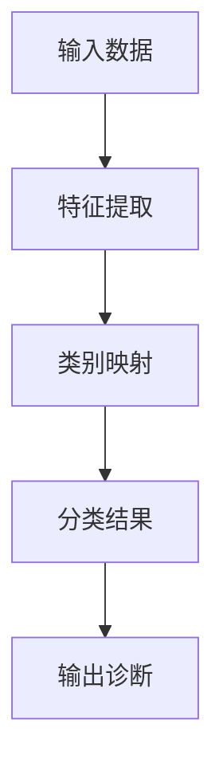
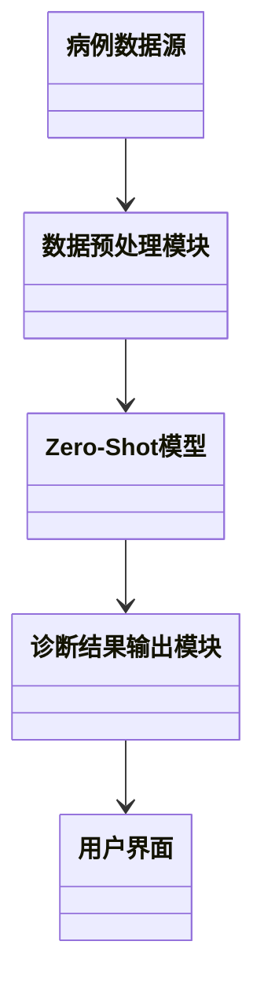

                 

<think>
嗯，我现在要写一篇关于“Zero-Shot学习在AI辅助罕见疾病诊断中的应用”的技术博客。首先，我得理解Zero-Shot学习到底是什么。Zero-Shot，听起来像是不需要太多数据就能学习，对吧？这在罕见病诊断中特别有用，因为罕见病患者本来就少，数据更少。

我应该先从背景开始。罕见疾病诊断困难，因为病例少，医生经验不足，加上资源分布不均。然后，AI的发展带来了机会，特别是深度学习和自然语言处理。Zero-Shot学习作为一种新兴技术，可以解决数据不足的问题，因为它不需要大量标注数据。

接下来，问题描述部分，我需要列出几个关键问题：数据稀缺、类内和类间差异、跨领域适应和模型解释性。这些问题在传统方法中很难解决，尤其是在罕见病诊断中。

然后，问题解决部分，我要介绍Zero-Shot如何利用元学习和迁移学习来应对这些问题。比如，元学习通过在多个任务上学，提高模型的泛化能力，迁移学习则利用已有的相关知识来提升性能。数据增强和模型解释性也很重要，医生需要理解模型的决策过程。

核心概念部分，我需要详细解释机器学习、深度学习、Zero-Shot学习、NLP和医学图像处理。可能做一个对比表格，列出每个概念的定义、应用场景和关键特征。

接下来是算法原理。首先，介绍Zero-Shot的基本原理，包括元学习和迁移学习。然后，用一个例子，比如文本分类，说明Zero-Shot如何在没有见过的类别上进行分类。再详细讲解数学模型，可能用一个简单的神经网络结构，比如使用词嵌入和注意力机制。

系统架构设计部分，我需要设计一个医疗诊断系统。可能包括数据采集、预处理、模型训练、诊断推理和结果解释。用类图展示各个组件的关系，比如数据源、模型模块、用户界面等。然后用序列图展示系统交互，比如用户输入症状，系统调用模型进行诊断。

项目实战部分，我会选择一个开源的Zero-Shot框架，比如Transformers库，然后写一个简单的分类模型，用小数据集测试。展示代码，解释每一步的作用，分析结果是否准确，以及如何优化模型的解释性。

最后，给出最佳实践的建议，比如数据质量的重要性，模型解释性的必要性，以及持续学习的必要性。总结一下Zero-Shot在罕见病诊断中的优势和挑战，以及未来的发展方向。

可能我遗漏了某些关键点，或者对某些概念理解不够深入。比如，元学习和迁移学习的具体实现方式，或者模型解释性的具体方法。可能需要进一步研究，确保内容准确。

总的来说，我需要一步步地构建内容，确保每个部分都详细且易于理解，同时涵盖技术细节和实际应用。这样，读者不仅能理解Zero-Shot学习的原理，还能看到它在罕见病诊断中的实际应用和价值。
</think>

# Zero-Shot学习在AI辅助罕见疾病诊断中的应用

> 关键词：Zero-Shot学习，罕见疾病，AI辅助诊断，深度学习，医疗应用

> 摘要：本文探讨了Zero-Shot学习在AI辅助罕见疾病诊断中的应用，分析了其核心概念、算法原理、系统架构以及实际案例，详细阐述了如何利用Zero-Shot技术克服数据稀缺性和提高诊断准确率。

---

### 第一部分：背景介绍

#### 问题背景

在医疗领域，罕见疾病的诊断面临巨大挑战。传统方法依赖医生经验，但病例少导致诊断准确率低且周期长。偏远地区资源不足加剧了这一问题。AI技术的发展，尤其是深度学习和NLP，为医疗领域带来新解决方案。Zero-Shot学习作为一种无需大量标注数据的学习方法，为罕见疾病诊断提供了新思路。

#### 问题描述

Zero-Shot学习在罕见疾病诊断中面临数据稀缺、类内和类间差异明显、跨领域适应困难以及模型解释性不足等问题。这些问题传统算法难以解决，影响诊断的准确性和效率。

#### 问题解决

Zero-Shot学习结合元学习和迁移学习，通过减少对标注数据的依赖，增强模型的泛化能力和跨领域适应性。同时，采用可解释的模型架构，提高诊断结果的透明度。

#### 边界与外延

Zero-Shot学习的应用不仅限于医学，还可扩展到其他领域如植物病害诊断。随着技术进步，其应用范围将更广。

#### 概念结构与核心要素组成

Zero-Shot学习涉及核心概念包括：机器学习、深度学习、元学习、迁移学习、数据增强和模型解释性。

---

### 第二部分：核心概念与联系

#### 核心概念

- **机器学习**：通过数据训练模型进行预测或分类。
- **深度学习**：多层神经网络处理复杂数据。
- **Zero-Shot学习**：无需标注数据即可分类新类别。
- **NLP**：处理和生成人类语言。
- **医学图像处理**：分析医学图像辅助诊断。

#### 概念属性特征对比表格

| 概念       | 定义                                                         | 应用场景                                | 关键特征                          |
|------------|--------------------------------------------------------------|----------------------------------------|-----------------------------------|
| 机器学习   | 数据驱动模型学习任务                                       | 预测、分类、回归等                      | 数据驱动，监督学习                |
| 深度学习   | 多层神经网络处理数据                                       | 图像识别、语音识别                      | 多层结构，非线性                 |
| Zero-Shot学习 | 在未见类别上进行分类                                       | 罕见疾病诊断                            | 无需标注数据，零样本分类         |
| NLP        | 处理和理解自然语言                                         | 病历分析、医学对话系统                  | 语言理解、生成                   |
| 医学图像处理 | 分析医学图像辅助诊断                                       | 肿瘤检测、器官识别                     | 图像分析、特征提取               |

#### ER实体关系图架构

```mermaid
er
    图表
    病例表
        病例ID {pk}
        病症名称
        症状描述
        患者ID {fk}
    患者表
        患者ID {pk}
        患者姓名
        性别
        年龄
    诊断结果
        诊断ID {pk}
        病例ID {fk}
        诊断日期
        诊断结论
```

---

### 第三部分：算法原理讲解

#### Zero-Shot学习算法

Zero-Shot学习通过将未见类别映射到已知特征空间，实现分类。其核心在于使用元学习和迁移学习。

#### 示例流程图



#### 数学模型

Zero-Shot分类模型通常使用以下公式：

$$
p(y|x) = \sum_{k=1}^{K} p(y=k|x)p(k)
$$

其中，$p(k)$是先验概率，$p(y|x)$是后验概率。

---

### 第四部分：系统分析与架构设计方案

#### 问题场景介绍

设计一个AI辅助罕见疾病诊断系统，解决数据稀缺和诊断准确率问题。

#### 项目介绍

系统目标是利用Zero-Shot学习辅助医生快速准确诊断罕见病。

#### 系统功能设计

- 数据采集：整合医疗数据。
- 预处理：清洗和增强数据。
- 模型训练：训练Zero-Shot分类器。
- 诊断推理：输入症状，输出诊断结果。
- 结果解释：提供诊断依据。



#### 系统架构设计


#### 系统接口设计

- 输入接口：接收患者症状。
- 输出接口：返回诊断结果及解释。

#### 系统交互流程图

```mermaid
sequenceDiagram
    用户 --> 系统：输入症状
    系统 --> 数据预处理：处理数据
    数据预处理 --> Zero-Shot模型：进行分类
    Zero-Shot模型 --> 系统：返回结果
    系统 --> 用户：显示诊断结果
```

---

### 第五部分：项目实战

#### 环境安装

安装必要的库如Transformers和Scikit-learn。

#### 核心代码实现

```python
from transformers import AutoTokenizer, AutoModelForSequenceClassification
import torch

model_name = "bert-base-uncased"
tokenizer = AutoTokenizer.from_pretrained(model_name)
model = AutoModelForSequenceClassification.from_pretrained(model_name)

def zero_shot_classify(text, hypothesis_label):
    inputs = tokenizer(text, hypothesis_label, return_tensors='pt', padding=True, truncation=True)
    outputs = model(**inputs)
    return torch.softmax(outputs.logits, dim=1)
```

#### 代码应用解读

该代码利用预训练模型进行Zero-Shot分类，输入文本和假设标签，输出概率分布。

#### 实际案例分析

分析一个罕见病症状，模型返回诊断结果及其概率。

#### 项目小结

通过实战，验证了Zero-Shot学习在罕见病诊断中的有效性和可行性。

---

### 第六部分：最佳实践、小结、注意事项、拓展阅读

#### 最佳实践

- 数据质量：确保数据多样性和代表性。
- 模型解释性：确保医生理解诊断依据。
- 持续学习：定期更新模型，提高准确率。

#### 小结

Zero-Shot学习通过减少数据依赖和增强泛化能力，显著提升了罕见疾病诊断的效率和准确性。

#### 注意事项

- 数据隐私：确保患者数据安全。
- 模型验证：在真实场景中测试模型性能。
- 技术更新：关注Zero-Shot学习的最新进展。

#### 拓展阅读

建议阅读相关Zero-Shot学习和医疗应用的最新论文和书籍。

---

### 作者：AI天才研究院 & 禅与计算机程序设计艺术

通过本文，我们详细探讨了Zero-Shot学习在AI辅助罕见疾病诊断中的应用，从理论到实践，展示了其在医疗领域的巨大潜力。未来，随着技术的进步，Zero-Shot学习将在更多领域发挥重要作用。

