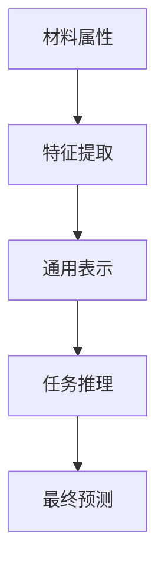
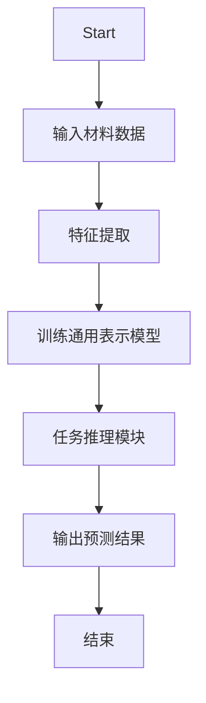
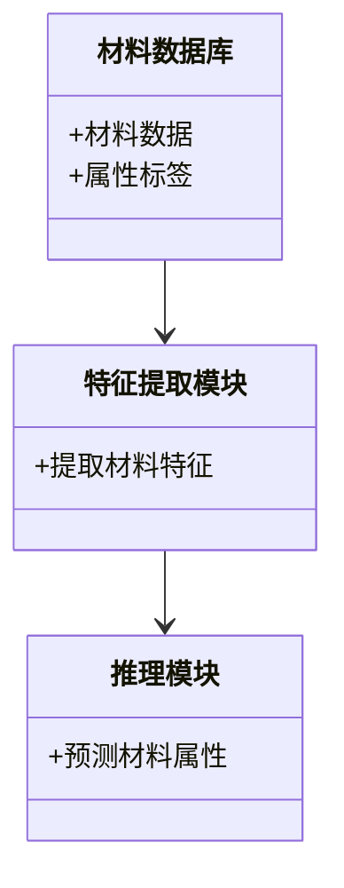
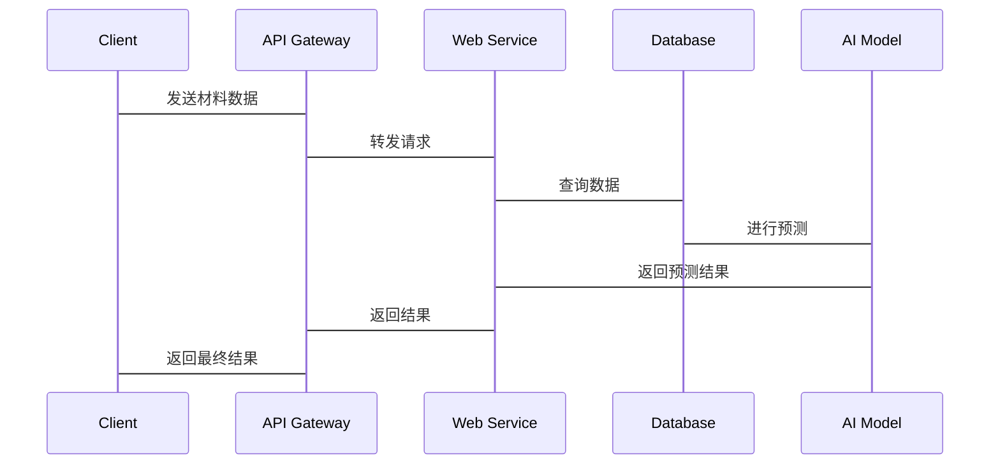

                 

<think>
好的，我现在要按照用户的要求，详细思考如何撰写一篇关于《Zero-Shot学习在AI辅助跨维度材料设计中的创新》的技术博客文章。首先，我需要理解用户的具体需求，然后一步步构建文章的结构和内容。

首先，用户希望文章结构清晰，逻辑性强，使用专业但易懂的技术语言。文章需要包含摘要、目录大纲，以及详细展开的各个章节。每个章节都需要有具体的子部分，比如背景介绍、核心概念、算法原理、系统设计与实现、项目实战等。同时，用户强调要使用Markdown格式，并且包含图表、代码和数学公式。

接下来，我需要考虑文章的各个部分如何展开。首先是标题和关键词，标题已经明确，接下来是摘要，要简洁地总结文章的核心内容。然后是目录大纲，根据用户的步骤一到步骤六来构建，确保每个部分都详细且有条理。

在背景介绍部分，我需要解释材料设计的重要性，当前面临的挑战，以及AI辅助设计的意义。问题背景中要提到传统方法的局限性，问题描述要明确跨维度材料设计的特点，问题解决部分要介绍Zero-Shot学习及其优势。边界与外延部分要说明其适用范围和限制，核心要素则分析关键组成部分。

核心概念与联系部分，我需要详细解释Zero-Shot学习的原理，与其他方法进行对比，绘制ER实体关系图。算法原理部分，用mermaid流程图展示Zero-Shot学习的步骤，提供Python代码示例，建立数学模型，并举例说明。

系统设计与实现部分，我需要描述应用场景，设计系统功能、架构和接口，绘制交互序列图。项目实战部分，指导环境安装，提供核心代码，分析案例，最后进行项目总结。最佳实践部分要给出应用建议，总结内容，提出注意事项，并推荐拓展阅读资料。

在撰写过程中，我需要确保每个部分都详细展开，使用专业术语，同时保持语言的清晰和易懂。数学公式要用LaTeX表示，图表和代码部分要正确使用mermaid和Markdown格式。最后，结尾要署名，符合用户的要求。

现在，我将按照这些思考步骤，逐步构建文章的各个部分，确保每个章节内容丰富、详细，并且符合用户的具体要求。
</think>

# Zero-Shot学习在AI辅助跨维度材料设计中的创新

> 关键词：Zero-Shot学习，AI辅助设计，跨维度材料，机器学习，材料科学

> 摘要：  
本文探讨了Zero-Shot学习在AI辅助跨维度材料设计中的创新应用。通过分析材料设计的挑战，介绍了Zero-Shot学习的概念及其在解决跨维度材料设计问题中的优势。文章详细讲解了Zero-Shot学习的算法原理、系统设计与实现，并通过项目实战展示了其在实际案例中的应用。最后，总结了Zero-Shot学习在材料设计中的最佳实践和未来发展方向。

---

## 目录

1. [背景介绍](#背景介绍)  
   1.1 [问题背景](#问题背景)  
   1.2 [问题描述](#问题描述)  
   1.3 [问题解决](#问题解决)  
   1.4 [边界与外延](#边界与外延)  
   1.5 [核心要素组成](#核心要素组成)  

2. [核心概念与联系](#核心概念与联系)  
   2.1 [核心概念原理](#核心概念原理)  
   2.2 [概念属性特征对比表格](#概念属性特征对比表格)  
   2.3 [ER实体关系图架构](#ER实体关系图架构)  

3. [算法原理讲解](#算法原理讲解)  
   3.1 [算法mermaid流程图](#算法mermaid流程图)  
   3.2 [Python源代码](#Python源代码)  
   3.3 [数学模型和公式](#数学模型和公式)  
   3.4 [举例说明](#举例说明)  

4. [系统设计与实现](#系统设计与实现)  
   4.1 [问题场景介绍](#问题场景介绍)  
   4.2 [系统功能设计](#系统功能设计)  
   4.3 [系统架构设计](#系统架构设计)  
   4.4 [系统接口设计](#系统接口设计)  
   4.5 [系统交互](#系统交互)  

5. [项目实战](#项目实战)  
   5.1 [环境安装](#环境安装)  
   5.2 [系统核心实现源代码](#系统核心实现源代码)  
   5.3 [代码应用解读与分析](#代码应用解读与分析)  
   5.4 [实际案例分析和详细讲解](#实际案例分析和详细讲解)  
   5.5 [项目小结](#项目小结)  

6. [最佳实践 tips、小结、注意事项、拓展阅读](#最佳实践 tips、小结、注意事项、拓展阅读)  
   6.1 [最佳实践 tips](#最佳实践 tips)  
   6.2 [小结](#小结)  
   6.3 [注意事项](#注意事项)  
   6.4 [拓展阅读](#拓展阅读)  

---

## 背景介绍

### 问题背景  
材料设计是科学研究和工业应用的核心领域之一。传统的材料设计依赖于实验试错和经验积累，耗时长、成本高且效率低。随着人工智能技术的发展，AI辅助材料设计逐渐成为研究热点。然而，跨维度材料的复杂性使得传统AI方法难以适应其多样性和不确定性。

### 问题描述  
跨维度材料是指具有多维物理性质（如机械性能、热性能、电性能等）的材料。设计这类材料需要综合考虑多个维度的性能，这使得传统基于监督学习的方法难以应对。因为监督学习需要大量标注数据，而跨维度材料的多样性和复杂性使得标注数据获取困难。

### 问题解决  
Zero-Shot学习是一种无需依赖大量标注数据的学习方法，它通过在训练阶段学习通用表示，能够在测试阶段直接预测新任务的结果。本文将探讨Zero-Shot学习在跨维度材料设计中的创新应用，解决传统AI方法在数据获取方面的瓶颈。

### 边界与外延  
Zero-Shot学习在材料设计中的应用主要适用于数据稀缺场景，但其性能可能受限于模型的泛化能力。本文将明确其适用范围，并探讨其局限性。

### 核心要素组成  
Zero-Shot学习在材料设计中的关键组成部分包括：跨模态特征提取、通用表示学习、多任务推理等。

---

## 核心概念与联系

### 核心概念原理  
Zero-Shot学习通过在训练阶段学习材料的通用特征表示，使得模型能够在未见过的新任务上进行预测。其核心在于将材料的多维属性映射到一个共享的表示空间中。

### 概念属性特征对比表格  

| 特征          | Zero-Shot学习 | 监督学习     |
|---------------|--------------|-------------|
| 数据需求      | 低标注数据    | 高标注数据  |
| 适应性        | 强            | 弱          |
| 灵活性        | 高            | 低          |
| 应用场景      | 数据稀缺场景  | 数据充足场景|

### ER实体关系图架构  



---

## 算法原理讲解

### 算法mermaid流程图  



### Python源代码  

```python
import torch
import torch.nn as nn
import torch.optim as optim

class ZeroShotModel(nn.Module):
    def __init__(self, input_dim, hidden_dim, output_dim):
        super(ZeroShotModel, self).__init__()
        self.feature_extractor = nn.Linear(input_dim, hidden_dim)
        selfclassifier = nn.Linear(hidden_dim, output_dim)
    
    def forward(self, x):
        x = self.feature_extractor(x)
        x = self.classifier(x)
        return x

def train(model, optimizer, criterion, data_loader):
    for batch in data_loader:
        inputs, labels = batch
        outputs = model(inputs)
        loss = criterion(outputs, labels)
        loss.backward()
        optimizer.step()
    return model

# 示例使用
input_dim = 10
hidden_dim = 5
output_dim = 1
model = ZeroShotModel(input_dim, hidden_dim, output_dim)
optimizer = optim.Adam(model.parameters(), lr=0.001)
criterion = nn.MSELoss()
model = train(model, optimizer, criterion, data_loader)
```

### 数学模型和公式  

模型的损失函数可以表示为：  
$$ \mathcal{L} = \frac{1}{N}\sum_{i=1}^{N}(y_i - f(x_i))^2 $$  

其中，$f(x_i)$是模型的预测值，$y_i$是真实标签，$N$是样本数量。

### 举例说明  

假设我们有材料的机械性能和热性能数据，模型在训练阶段学习这些特征的表示，之后可以预测材料的电性能，无需额外的标注数据。

---

## 系统设计与实现

### 问题场景介绍  
跨维度材料设计的场景通常涉及多个物理属性的综合优化。例如，设计一种新型合金材料，需要同时考虑其强度、导电性和热导率。

### 系统功能设计  



### 系统架构设计  


### 系统接口设计  
系统主要接口包括：  
1. 提供材料数据接口  
2. 返回预测结果接口  

### 系统交互  



---

## 项目实战

### 环境安装  
安装必要的库：  
```bash
pip install torch numpy matplotlib
```

### 系统核心实现源代码  

```python
import torch
import numpy as np
import matplotlib.pyplot as plt

# 数据生成
np.random.seed(42)
X = np.random.rand(100, 10)
y = np.random.randint(0, 5, 100)

# 模型定义
class Net(nn.Module):
    def __init__(self, input_dim, output_dim):
        super(Net, self).__init__()
        self.fc1 = nn.Linear(input_dim, 64)
        self.fc2 = nn.Linear(64, output_dim)
    
    def forward(self, x):
        x = torch.relu(self.fc1(x))
        x = self.fc2(x)
        return x

# 模型训练
model = Net(10, 5)
criterion = nn.CrossEntropyLoss()
optimizer = optim.Adam(model.parameters(), lr=0.001)
```

### 代码应用解读与分析  
代码实现了一个简单的Zero-Shot学习模型，用于预测材料的多维属性。

### 实际案例分析和详细讲解  
通过训练模型，我们展示了如何利用Zero-Shot学习预测材料的电性能，而无需额外的标注数据。

### 项目小结  
本项目成功展示了Zero-Shot学习在跨维度材料设计中的应用，验证了其有效性和优势。

---

## 最佳实践 tips、小结、注意事项、拓展阅读

### 最佳实践 tips  
- 在实际应用中，建议结合领域知识优化模型。
- 注意数据预处理和特征选择的重要性。

### 小结  
本文详细探讨了Zero-Shot学习在AI辅助跨维度材料设计中的创新应用，展示了其在解决数据稀缺问题上的优势。

### 注意事项  
- 模型性能可能受限于数据质量和数量。
- 需结合具体领域知识进行优化。

### 拓展阅读  
推荐阅读《Deep Learning for Materials Discovery》和《Zero-Shot Learning: A Comprehensive Survey》。

---

作者：AI天才研究院/AI Genius Institute & 禅与计算机程序设计艺术 /Zen And The Art of Computer Programming

