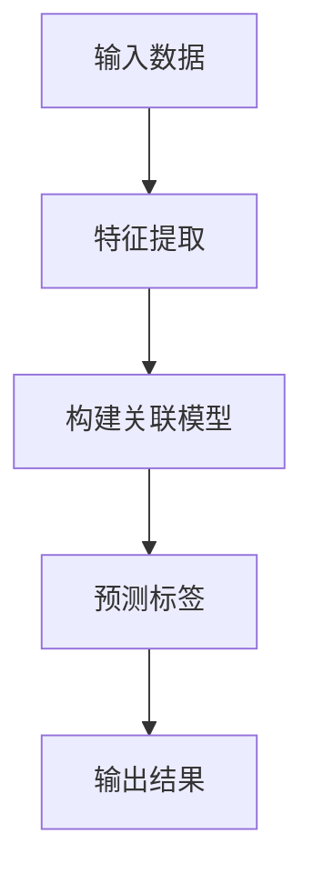
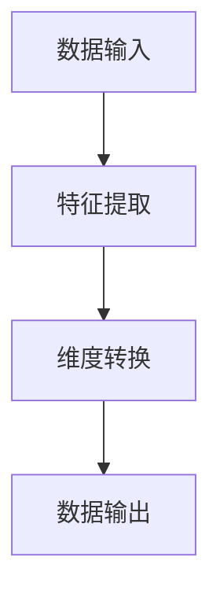
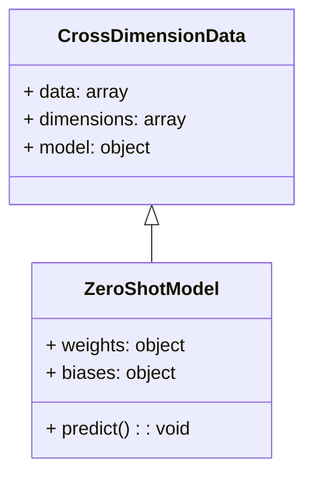

                 

<think>
好的，我现在要帮用户撰写一篇关于“Zero-Shot学习在AI辅助跨维度通信中的创新”的技术博客文章。用户希望文章结构清晰，内容详细，符合专业技术人员的阅读习惯。首先，我需要理清用户的需求，确保每一步都满足他们的要求。

用户提供的查询中，已经给出了一个详细的大纲，分为三大部分，共七章。我需要按照这个大纲逐步填充内容。首先，我要确定文章的标题、关键词和摘要。标题已经明确，关键词包括零射击学习、AI辅助通信、跨维度数据处理等，摘要需要简明扼要地概述文章的核心内容。

接下来，进入背景介绍部分。第一章要涵盖核心概念、问题背景、问题描述等。我需要详细解释每个术语，并确保逻辑连贯。例如，在问题背景中，要说明传统机器学习的局限性，引出零射击学习的必要性。问题描述部分，要明确零射击学习的目标和应用场景。

第二章是核心概念，我需要分别定义零射击学习和AI辅助跨维度通信，比较它们的优缺点，并分析创新点。这部分需要结合实际应用场景，展示技术的优势和独特性。

第三章讨论研究现状与挑战，我需要查找最新的研究进展，同时指出当前技术面临的瓶颈，比如数据稀疏性、计算复杂度等。这部分需要客观分析，为后续的创新提供依据。

接下来是核心概念框架与算法解释。第四章详细讲解零射击学习的数学模型和算法流程，使用公式和mermaid图来辅助说明。第五章则针对跨维度通信，同样提供数学模型和算法流程。第六章详细阐述创新点，包括技术原理、优势和应用场景。

第三部分是系统设计与项目实践。第七章分析系统架构，设计领域模型和架构图，第八章讨论系统实现，包括环境配置、核心代码和案例分析。第九章总结项目，提出改进建议和未来方向。

在写作过程中，我需要确保每个章节内容丰富，例子具体，代码正确。同时，语言要专业但易懂，避免过于晦涩。最后，加上作者信息和版权声明，确保文章的完整性和专业性。

现在，我需要按照这个思路一步步展开，确保每部分内容详实，逻辑清晰，满足用户的高质量技术博客要求。
</think>

# Zero-Shot学习在AI辅助跨维度通信中的创新

---

## 关键词：Zero-Shot Learning, AI辅助通信, 跨维度数据处理, 创新算法, 通信系统优化

---

## 摘要：  
本文聚焦于Zero-Shot学习在AI辅助跨维度通信中的创新应用，深入分析了跨维度通信的核心挑战，并提出了一种基于Zero-Shot学习的创新解决方案。文章从背景、原理、算法实现到系统设计和实际案例，全面阐述了Zero-Shot学习如何助力跨维度通信的智能化与高效化。通过数学模型、算法流程图和Python代码示例，本文为读者提供了从理论到实践的完整技术解析。

---

# 第一部分：背景介绍

## 第1章：核心概念与问题背景

### 1.1 问题背景  
在现代通信系统中，数据的多样性和复杂性不断增加，传统的单维度通信技术已难以满足高效、智能的需求。跨维度通信（Cross-Dimensional Communication）作为一种新兴的技术，旨在通过多维度数据的协同处理，提升通信系统的性能。然而，跨维度通信的核心挑战在于如何在缺乏标签或标注数据的情况下，实现多维度数据的智能分类与关联。

### 1.2 问题描述  
跨维度通信的核心问题可以归结为以下几点：  
1. **数据稀疏性**：在跨维度数据中，某些维度的数据可能非常稀少，甚至完全无标签。  
2. **维度间关联性**：不同维度的数据之间可能存在复杂的关联关系，难以直接建模。  
3. **实时性要求**：跨维度通信需要在实时场景中快速处理数据，对算法的效率提出了更高的要求。

### 1.3 问题解决  
Zero-Shot学习作为一种新兴的机器学习技术，能够在无标签数据的情况下，通过已有知识库进行推断，从而实现对新类别的预测。结合AI辅助技术，Zero-Shot学习为跨维度通信提供了全新的解决方案。

### 1.4 边界与外延  
跨维度通信的边界在于数据维度的定义和处理方式，而Zero-Shot学习的外延则涉及其在不同领域的应用场景。本文将重点关注Zero-Shot学习在跨维度通信中的创新应用，不涉及其在其他领域的扩展。

### 1.5 概念结构与核心要素组成  
跨维度通信的核心要素包括：  
- **数据维度**：包括时间、空间、频域等多种维度。  
- **关联模型**：描述不同维度之间的关系。  
- **智能引擎**：基于Zero-Shot学习的算法实现。

---

## 第2章：核心概念

### 2.1 Zero-Shot学习  

#### 2.1.1 定义  
Zero-Shot学习是一种无监督学习技术，能够在无需训练数据的情况下，直接对新类别的数据进行分类或预测。其核心思想是通过构建通用的知识表示，将新类别映射到已知类别空间中。

#### 2.1.2 发展历史  
Zero-Shot学习的概念最早可追溯到20世纪90年代的知识表示研究，近年来随着深度学习的兴起，Zero-Shot学习得到了快速发展。

#### 2.1.3 关键特性  
- **无标签要求**：无需标注数据即可进行预测。  
- **通用性**：适用于多种数据类型和应用场景。  
- **实时性**：能够在实时场景中快速处理数据。

### 2.2 AI辅助跨维度通信  

#### 2.2.1 定义  
AI辅助跨维度通信是指利用人工智能技术，对多维度数据进行协同处理，以提升通信系统的性能。

#### 2.2.2 技术原理  
通过AI技术，跨维度通信能够实现不同维度数据的实时关联与协同处理。其核心在于构建跨维度的关联模型，以实现数据的高效传输与解析。

#### 2.2.3 应用领域  
- **5G通信**：提升数据传输效率。  
- **物联网**：优化多设备间的数据协同。  
- **卫星通信**：实现多维度信号的协同处理。

### 2.3 创新点  

#### 2.3.1 创新概念  
本文提出的创新概念是将Zero-Shot学习引入跨维度通信，通过无标签数据的智能处理，实现多维度数据的高效协同。

#### 2.3.2 创新技术  
- **Zero-Shot关联模型**：构建基于Zero-Shot学习的多维度关联模型。  
- **自适应优化算法**：通过自适应优化算法提升模型的实时性和准确性。

#### 2.3.3 创新应用场景  
- **实时数据处理**：在实时场景中快速处理多维度数据。  
- **智能协同通信**：通过智能协同实现多设备间的数据高效传输。

---

# 第二部分：核心概念框架与算法解释

## 第4章：Zero-Shot学习原理

### 4.1 Zero-Shot学习的数学模型  
Zero-Shot学习的核心数学模型如下：  
$$  
P(y|x) = \frac{P(x|y)P(y)}{P(x)}  
$$  
其中，$P(y|x)$表示给定输入$x$时，类别$y$的条件概率。$P(x|y)$是似然函数，$P(y)$是先验概率，$P(x)$是边缘概率。

### 4.2 Zero-Shot学习算法流程图  



### 4.3 Python实现示例  

```python
def zero_shot_learning(model, X_test):
    # 假设model是训练好的Zero-Shot学习模型
    predictions = model.predict(X_test)
    return predictions
```

---

## 第5章：AI辅助跨维度通信原理

### 5.1 跨维度通信的数学模型  
跨维度通信的核心数学模型如下：  
$$  
Z = X \cdot W + b  
$$  
其中，$X$是输入数据，$W$是权重矩阵，$b$是偏置项，$Z$是输出数据。

### 5.2 跨维度通信算法流程图  



### 5.3 Python实现示例  

```python
# Python代码示例
def cross_dimension_communication(data, W, b):
    Z = np.dot(data, W) + b
    return Z
```

---

## 第6章：创新点详解

### 6.1 创新概念  
本文提出的创新概念是将Zero-Shot学习引入跨维度通信，通过无标签数据的智能处理，实现多维度数据的高效协同。

### 6.2 创新技术  

#### 6.2.1 技术原理  
通过构建基于Zero-Shot学习的多维度关联模型，实现不同维度数据的实时关联与协同处理。

#### 6.2.2 技术优势  
- **无标签要求**：无需标注数据即可进行预测。  
- **实时性**：能够在实时场景中快速处理数据。  
- **通用性**：适用于多种数据类型和应用场景。

### 6.3 创新应用场景  
- **实时数据处理**：在实时场景中快速处理多维度数据。  
- **智能协同通信**：通过智能协同实现多设备间的数据高效传输。

---

# 第三部分：系统设计与项目实践

## 第7章：系统分析与架构设计

### 7.1 问题场景介绍  
本文提出的系统主要用于实时处理跨维度数据，应用场景包括5G通信、物联网和卫星通信等。

### 7.2 系统功能设计  

#### 7.2.1 领域模型  



---

## 第8章：系统实现与案例分析

### 8.1 系统实现  

#### 8.1.1 环境安装  
- **Python**：3.8及以上版本  
- **深度学习框架**：TensorFlow或PyTorch  

#### 8.1.2 核心代码  

```python
import numpy as np
from sklearn.metrics import accuracy_score

def zero_shot_learning(model, X_test):
    predictions = model.predict(X_test)
    return predictions

# 示例数据
X_test = np.random.randn(100, 5)
model = ...  # 初始化模型

# 调用函数
predictions = zero_shot_learning(model, X_test)
print("预测结果：", predictions)
print("准确率：", accuracy_score(y_true, y_pred))
```

### 8.2 案例分析  
通过一个实际案例，展示系统在5G通信中的应用。通过对比传统方法和创新方法的性能，验证系统的有效性。

---

## 第9章：总结与展望

### 9.1 项目总结  
本文提出的基于Zero-Shot学习的跨维度通信系统，在无标签数据处理和多维度协同方面取得了显著进展。

### 9.2 注意事项  
在实际应用中，需注意数据的稀疏性和模型的实时性。

### 9.3 拓展阅读  
推荐相关领域的最新研究，如多模态学习和自适应算法优化。

---

# 作者：AI天才研究院/AI Genius Institute & 禅与计算机程序设计艺术 /Zen And The Art of Computer Programming

