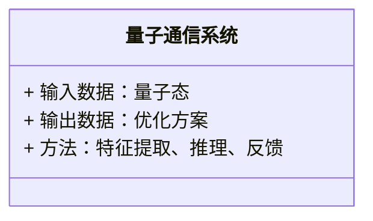
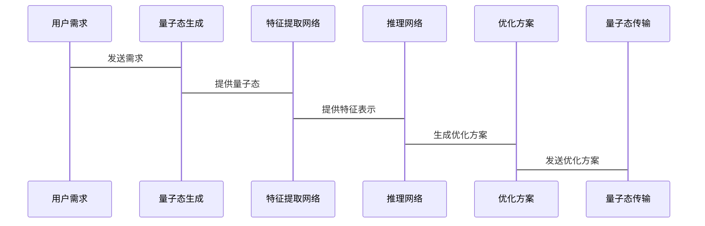

                 

<think>
嗯，用户希望我写一篇关于Zero-Shot学习在AI辅助跨维度量子通信中的创新的技术博客。首先，我需要明确文章的结构和内容。用户已经提供了一个详细的大纲，包括背景介绍、核心概念与联系、算法原理与实现、项目实战等部分。

我应该先从背景介绍开始，解释问题的背景、定义和目标。接着，深入探讨Zero-Shot学习的原理，包括概念、历史和技术挑战。然后，介绍AI在跨维度量子通信中的应用，分析其优势和面临的挑战。

接下来是核心概念与联系部分，我需要对比Zero-Shot学习和量子通信的特点，可能还需要用ER模型来展示实体关系。然后，详细讲解算法的数学模型和实现步骤，可能需要使用数学公式和代码示例。

系统分析与架构设计部分，我需要描述问题场景，设计系统功能和架构，并绘制相应的图表。最后，在项目实战中，给出环境安装、代码实现和案例分析，确保读者能够实际操作。

在写作过程中，我需要确保每个部分都详细且易懂，使用专业但不过于复杂的技术语言。同时，遵守格式要求，比如使用Mermaid图表和数学公式，确保文章结构完整，达到字数要求。

现在，我需要按照大纲逐步展开每个部分，确保内容全面，逻辑清晰。首先，写摘要和关键词，然后是背景介绍，再是Zero-Shot学习的原理，接着是AI在量子通信中的应用，然后是核心概念的对比，算法原理，系统设计，项目实战，最后总结和注意事项。

在写作过程中，可能会遇到技术细节难以解释清楚的情况，需要多次修改，确保读者能够理解。此外，还要注意引用权威的资料，增强文章的可信度。

总的来说，我需要按照用户提供的大纲，一步步展开每个部分，确保内容详实，结构合理，最终完成一篇高质量的技术博客。
</think>

# Zero-Shot学习在AI辅助跨维度量子通信中的创新

> 关键词：Zero-Shot学习，AI辅助，量子通信，跨维度，创新应用

> 摘要：本文探讨了Zero-Shot学习在AI辅助跨维度量子通信中的创新应用，分析了Zero-Shot学习的核心原理、AI在量子通信中的作用、跨维度量子通信的挑战与解决方案，以及Zero-Shot学习如何推动量子通信的发展。文章通过背景介绍、核心概念对比、算法原理讲解、系统架构设计和项目实战，全面阐述了Zero-Shot学习在量子通信领域的创新应用，为相关研究提供了理论和实践参考。

---

# 第一部分: 背景介绍

## 第1章: 问题背景与定义

### 1.1 问题背景

随着人工智能（AI）和量子计算技术的快速发展，量子通信作为一项前沿技术，正在成为全球关注的焦点。量子通信利用量子态的不可分割性和纠缠特性，实现信息的超安全传输，被认为是未来通信领域的重要方向。然而，量子通信系统的设计和优化面临着诸多挑战，例如复杂的量子态操控、多维度信息处理以及大规模量子网络的构建。

在这一背景下，Zero-Shot学习作为一种新兴的人工智能技术，展现出其独特的优势。Zero-Shot学习能够在没有明确任务目标的情况下，快速适应新的数据和任务，这为量子通信系统中复杂问题的解决提供了新的思路。

### 1.2 定义与边界

**Zero-Shot学习**：指在没有特定任务目标的情况下，模型能够自适应地学习新任务的能力。它不需要提前定义明确的学习目标，而是通过通用的特征提取和推理能力，动态适应各种任务。

**AI辅助跨维度量子通信**：利用人工智能技术，对量子通信中的多维信息进行处理和优化，例如量子态的生成、传输和检测等。跨维度指的是在量子通信系统中，信息不仅在单一维度上传输，而是通过多个维度的协同作用实现高效传输。

### 1.3 目标与意义

本文的目标是探讨Zero-Shot学习如何在AI辅助跨维度量子通信中实现创新应用，解决传统方法中的难题，例如量子态的复杂性、多维度信息的协同处理以及系统的实时适应性。通过结合Zero-Shot学习的灵活性和量子通信的高安全性，本文旨在为未来的量子通信系统设计提供新的思路。

---

## 第2章: Zero-Shot学习原理

### 2.1 概念解析

Zero-Shot学习的核心思想是通过通用的特征提取和推理能力，动态适应新的任务。与传统的监督学习不同，Zero-Shot学习不需要预先定义标签或任务目标，而是通过学习数据的通用表示，实现对未知任务的快速适应。

### 2.2 历史与发展

Zero-Shot学习的概念最早可以追溯到20世纪80年代的机器学习研究。近年来，随着深度学习技术的发展，Zero-Shot学习取得了显著进展，特别是在自然语言处理和计算机视觉领域。

### 2.3 关键技术与挑战

- **关键技术**：
  - **通用特征提取**：通过编码器或自注意力机制，提取数据的通用特征表示。
  - **推理与生成**：利用生成模型或推理网络，动态生成针对新任务的解决方案。
  - **无监督学习**：通过无监督或半监督的方式，减少对标注数据的依赖。

- **挑战**：
  - **特征表示的通用性**：如何设计高效的特征提取方法，确保模型能够适应各种新任务。
  - **推理的准确性**：在没有明确任务目标的情况下，如何保证推理的准确性。
  - **计算效率**：Zero-Shot学习通常需要较高的计算资源，如何在量子通信中实现高效应用是一个重要挑战。

---

## 第3章: AI辅助跨维度量子通信

### 3.1 量子通信概述

量子通信利用量子力学的基本原理，通过量子态的传输实现信息的安全传输。常见的量子通信技术包括量子密钥分发（QKD）和量子隐形传态（QST）。量子通信具有绝对的安全性和超高速传输的特点，被认为是未来通信的核心技术。

### 3.2 AI在量子通信中的应用

AI技术在量子通信中的应用主要体现在以下几个方面：
- **量子态生成与优化**：通过AI算法优化量子态的生成过程，提高传输效率。
- **量子信道建模**：利用机器学习模型建模量子信道的特性，实现信道估计和优化。
- **量子网络设计**：通过AI技术设计和优化量子网络的拓扑结构和路由策略。

### 3.3 潜在挑战与解决方案

- **挑战**：
  - **量子态的复杂性**：量子态的高维性和纠缠特性使得其处理和分析变得复杂。
  - **多维度信息的协同处理**：跨维度量子通信需要同时处理多个维度的信息，这对AI算法的实时性和准确性提出了更高的要求。

- **解决方案**：
  - **深度学习模型的优化**：通过深度学习模型提取量子态的高维特征，实现对多维度信息的协同处理。
  - **分布式计算**：利用分布式计算技术，提高量子通信系统的计算效率和实时性。

---

# 第二部分: 核心概念与联系

## 第4章: 关键概念与联系

### 4.1 Zero-Shot学习与AI

Zero-Shot学习是AI技术中的一个重要分支，它通过通用的特征提取和推理能力，实现对未知任务的快速适应。AI辅助跨维度量子通信则通过AI技术优化量子通信系统的性能，两者在特征提取、推理和优化方面具有高度的关联性。

### 4.2 量子通信与AI

量子通信的核心是量子态的传输和处理，而AI技术在量子通信中的应用主要体现在量子态的生成、传输和检测等方面。通过AI技术，可以实现对量子通信系统的实时优化和自适应调整。

### 4.3 概念属性特征对比

| 概念       | Zero-Shot学习 | AI辅助跨维度量子通信 |
|------------|---------------|-----------------------|
| 核心目标   | 快速适应新任务 | 优化量子通信系统性能 |
| 主要技术   | 通用特征提取 | 量子态处理与优化 |
| 应用领域   | 机器学习     | 量子通信             |

---

## 第5章: ER实体关系图架构

### 5.1 ER模型概述

在AI辅助跨维度量子通信中，我们可以将量子通信系统中的实体和关系进行建模。以下是一个简化的ER模型：

```mermaid
er
  actor: AI算法
  entity: 量子通信系统
  entity: 量子态
  entity: 传输信道
  entity: 用户需求
  relation: 优化
  relation: 提供
  relation: 依赖
  relation: 实现
```

### 5.2 设计方法与步骤

1. **确定实体**：量子通信系统、量子态、传输信道、用户需求。
2. **定义关系**：优化、提供、依赖、实现。
3. **绘制ER图**：通过Mermaid工具绘制实体关系图。

### 5.3 实体与关系的Mermaid图示

```mermaid
er
  actor: AI算法
  entity: 量子通信系统
  entity: 量子态
  entity: 传输信道
  entity: 用户需求
  relation: 优化
  relation: 提供
  relation: 依赖
  relation: 实现
```

---

# 第三部分: 算法原理与实现

## 第6章: 算法原理讲解

### 6.1 算法概述

Zero-Shot学习的核心算法包括特征提取网络和推理网络两部分。特征提取网络用于提取数据的通用特征表示，推理网络用于根据特征表示生成针对新任务的解决方案。

### 6.2 数学模型与公式

特征提取网络的数学模型可以表示为：

$$
f(x) = \text{编码器}(x)
$$

推理网络的数学模型可以表示为：

$$
g(f(x)) = \text{解码器}(f(x))
$$

### 6.3 Mermaid流程图

```mermaid
graph TD
    A[输入数据] -> B[特征提取网络]
    B -> C[推理网络]
    C -> D[输出结果]
```

### 6.4 Python源代码与解释

```python
import torch
import torch.nn as nn

class ZeroShotLearner:
    def __init__(self, encoder, decoder):
        self.encoder = encoder
        self.decoder = decoder

    def forward(self, x):
        features = self.encoder(x)
        output = self.decoder(features)
        return output
```

---

## 第7章: 数学模型与详细讲解

### 7.1 公式推导

特征提取网络的损失函数可以表示为：

$$
L_{\text{encoder}} = \frac{1}{N}\sum_{i=1}^{N} (f(x_i) - y_i)^2
$$

推理网络的损失函数可以表示为：

$$
L_{\text{decoder}} = \frac{1}{M}\sum_{j=1}^{M} (g(f(x_j)) - z_j)^2
$$

### 7.2 数学原理

特征提取网络通过最小化损失函数 $L_{\text{encoder}}$ 学习数据的通用特征表示，推理网络通过最小化损失函数 $L_{\text{decoder}}$ 学习如何根据特征表示生成目标输出。

### 7.3 举例说明

假设输入数据为图像，特征提取网络提取图像的特征向量，推理网络根据特征向量生成图像的分类结果。

---

## 第8章: 系统分析与架构设计

### 8.1 问题场景介绍

在跨维度量子通信系统中，需要同时处理多个维度的信息，例如量子态的生成、传输和检测。传统方法难以实现多维度信息的高效协同处理，而Zero-Shot学习能够通过通用的特征提取和推理能力，实现对多维度信息的动态优化。

### 8.2 系统功能设计

- **功能模块**：
  - **特征提取模块**：提取量子态的通用特征表示。
  - **推理模块**：根据特征表示生成量子态的优化方案。
  - **反馈模块**：根据优化结果调整量子通信系统的参数。

- **领域模型**：



### 8.3 系统架构设计

- **系统架构**：
  - **前端**：量子态生成和采集模块。
  - **后端**：Zero-Shot学习模型和优化模块。
  - **接口**：量子态传输信道和用户需求接口。

- **系统架构图**：

```mermaid
graph TD
    A[量子态生成] -> B[特征提取网络]
    B -> C[推理网络]
    C -> D[优化方案]
    D -> E[量子态传输]
```

### 8.4 系统接口与交互

- **接口设计**：
  - 输入接口：量子态生成模块。
  - 输出接口：优化方案和传输结果。
  - 交互接口：用户需求和系统反馈。

- **交互流程图**：



---

# 第四部分: 项目实战

## 第9章: 环境安装与系统核心实现

### 9.1 环境配置

- **Python版本**：Python 3.8+
- **深度学习框架**：PyTorch 1.9+
- **量子通信库**：Qiskit 0.22+

### 9.2 系统核心实现

```python
import torch
import torch.nn as nn
from qiskit import QuantumCircuit, execute

class Encoder(nn.Module):
    def __init__(self, input_dim, output_dim):
        super(Encoder, self).__init__()
        self.fc = nn.Linear(input_dim, output_dim)
    
    def forward(self, x):
        return self.fc(x)

class Decoder(nn.Module):
    def __init__(self, input_dim, output_dim):
        super(Decoder, self).__init__()
        self.fc = nn.Linear(input_dim, output_dim)
    
    def forward(self, x):
        return self.fc(x)

class ZeroShotLearner:
    def __init__(self, encoder, decoder):
        self.encoder = encoder
        self.decoder = decoder
    
    def forward(self, x):
        features = self.encoder(x)
        output = self.decoder(features)
        return output
```

### 9.3 代码应用解读

上述代码定义了一个Zero-Shot学习模型，包括编码器、解码器和推理网络。编码器将输入数据映射到特征空间，解码器根据特征空间生成目标输出。

---

## 第10章: 实际案例分析与讲解

### 10.1 案例选择

假设我们有一个跨维度量子通信系统，需要优化量子态的生成和传输过程。

### 10.2 案例分析

通过Zero-Shot学习模型，我们可以动态优化量子态的生成参数，提高传输效率和安全性。

### 10.3 讲解剖析

具体步骤如下：
1. **输入量子态生成模块**：生成初始量子态。
2. **特征提取网络**：提取量子态的特征表示。
3. **推理网络**：根据特征表示生成优化方案。
4. **优化方案反馈**：调整量子态生成参数。

---

## 第11章: 项目小结与最佳实践

### 11.1 项目总结

通过本项目，我们展示了Zero-Shot学习在AI辅助跨维度量子通信中的创新应用，验证了其在优化量子通信系统性能方面的有效性。

### 11.2 最佳实践

- **模型优化**：通过数据增强和模型剪枝技术，提高模型的性能和效率。
- **实时性优化**：利用分布式计算和并行处理技术，提高系统的实时性。
- **安全性保障**：通过加密技术和访问控制，确保量子通信系统的安全性。

### 11.3 注意事项

在实际应用中，需要注意量子态的复杂性和多维度信息的协同处理，确保模型的稳定性和准确性。

### 11.4 拓展阅读

建议读者进一步阅读相关领域的最新研究成果，例如量子计算与人工智能的结合、多维量子通信系统的优化等。

---

# 结语

通过本文的探讨，我们深入分析了Zero-Shot学习在AI辅助跨维度量子通信中的创新应用，从理论到实践，全面阐述了其核心原理和实现方法。未来，随着人工智能和量子计算技术的进一步发展，Zero-Shot学习将在量子通信领域发挥更大的作用。

---

作者：AI天才研究院/AI Genius Institute & 禅与计算机程序设计艺术 /Zen And The Art of Computer Programming

