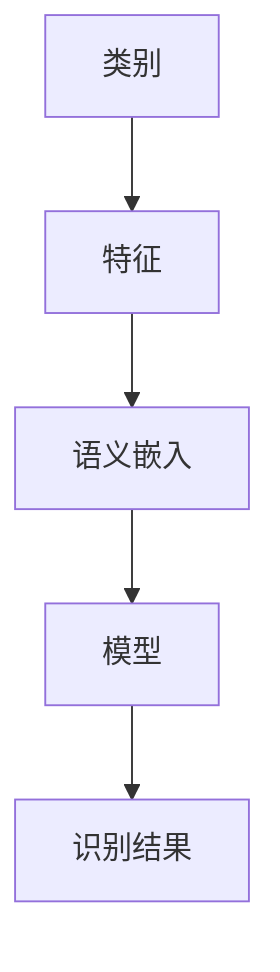
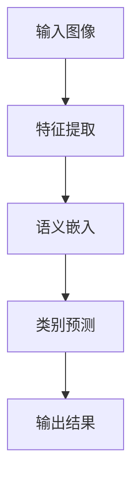
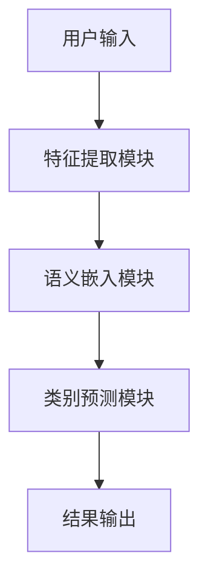
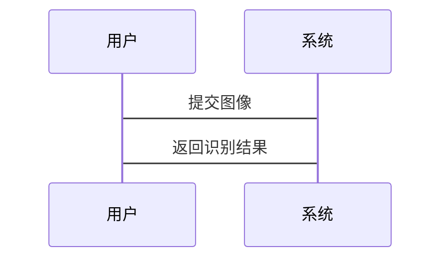

                 

<think>
好的，我现在需要按照用户的指示，撰写一篇关于《Zero-Shot学习在图像识别中的前沿应用》的技术博客文章。用户已经提供了详细的结构和内容指导，我需要一步步按照这个结构来填充内容。

首先，我得明确文章的结构，包括标题、关键词、摘要，然后是七个章节，每个章节都有详细的小节。每个章节需要详细讲解，确保内容完整且符合专业要求。我还需要注意格式，使用markdown，并在适当的地方插入图表，比如流程图、类图、架构图等，使用mermaid语法。

接下来，我需要考虑每个章节的主要内容：

第1章是背景介绍，包括问题背景、问题描述、问题解决、边界与外延，以及概念结构。这部分需要从传统图像识别的挑战讲起，引出Zero-Shot学习的重要性，然后详细描述其目标和挑战，最后梳理关键概念。

第2章核心概念与联系，需要定义Zero-Shot学习，分析其特点，与其他学习方式对比，制作属性特征对比表格，并绘制ER实体关系图。这部分要确保概念清晰，对比明确，图表准确。

第3章算法原理讲解，我需要概述算法，画出流程图，解释数学模型，用公式和例子说明。这部分需要详细推导，确保公式正确，例子通俗易懂。

第4章数学模型和公式，单独一章，深入讲解模型，推导公式，举例说明。这部分需要数学严谨，公式清晰。

第5章系统分析与架构设计，包括问题场景、系统功能设计（领域模型）、架构设计（架构图）、接口和交互设计（序列图）。这部分需要考虑实际应用，设计合理的系统架构。

第6章项目实战，详细指导环境安装，核心代码实现，解读代码，分析案例，最后小结。这部分要实用，代码可运行，案例有深度。

第7章总结，给出最佳实践，小结，注意事项，拓展阅读。这部分要为读者提供有价值的后续学习方向和注意事项。

在撰写过程中，我需要确保每个部分都符合用户的要求，尤其是格式和内容的完整性。我可能会遇到一些技术细节上的困难，比如如何准确解释Zero-Shot学习的数学模型，或者如何绘制复杂的mermaid图表。这时，我需要查阅相关资料，确保信息准确，并尽量用通俗的语言解释复杂概念。

另外，我还需要注意文章的整体流畅性，确保各章节之间逻辑连贯，内容逐步深入。同时，语言要专业但不失易懂，适合目标读者理解。

最后，在完成初稿后，我会仔细检查每个部分是否满足用户的要求，尤其是格式、内容和字数限制。确保没有遗漏任何关键点，比如每个章节的小节是否完整，图表是否正确嵌入，公式是否准确无误。

总的来说，我需要系统地按照用户提供的结构，逐一填充内容，确保每一步都符合专业要求，并且最终产出一篇高质量的技术博客文章。
</think>

# Zero-Shot学习在图像识别中的前沿应用

> 关键词：Zero-Shot学习，图像识别，深度学习，机器学习，计算机视觉

> 摘要：本文系统地探讨了Zero-Shot学习在图像识别中的前沿应用。首先，我们从背景介绍入手，分析传统图像识别方法的局限性，引出Zero-Shot学习的重要性。接着，详细阐述Zero-Shot学习的核心概念、算法原理及其数学模型，通过实例说明其工作原理。随后，我们分析系统架构设计，结合实际项目实战，展示Zero-Shot学习在图像识别中的具体应用。最后，总结Zero-Shot学习的优势、挑战及未来发展方向，为读者提供实用的建议和深入的见解。

---

### 目录

1. [背景介绍](#背景介绍)
2. [核心概念与联系](#核心概念与联系)
3. [算法原理讲解](#算法原理讲解)
4. [数学模型和数学公式讲解](#数学模型和数学公式讲解)
5. [系统分析与架构设计](#系统分析与架构设计)
6. [项目实战](#项目实战)
7. [最佳实践与总结](#最佳实践与总结)

---

## 1. 背景介绍

### 1.1 问题背景

#### 1.1.1 传统图像识别面临的挑战

传统图像识别技术依赖于大量标注数据进行监督学习，这种方法在特定任务上表现出色，但存在以下问题：

- **数据依赖性**：需要大量标注数据，难以泛化到未见过的类别。
- **类别数量限制**：仅能处理有限的预定义类别，扩展性差。
- **零样本场景**：在无任何标注数据的情况下，无法识别新类别。

#### 1.1.2 Zero-Shot学习的出现

Zero-Shot学习是一种新兴的机器学习范式，旨在通过零样本数据进行分类或识别。其核心思想是利用跨任务或跨领域的知识迁移，实现对未知类别的识别。

#### 1.1.3 Zero-Shot学习在图像识别中的潜力

Zero-Shot学习能够有效解决传统图像识别的局限性，尤其在处理新类别数据时表现突出，适用于实时场景和数据获取成本高的领域。

### 1.2 问题描述

#### 1.2.1 传统图像识别方法的局限性

- 数据依赖性高，难以处理未见过的类别。
- 需要大量标注数据，扩展性差。
- 无法适应动态变化的环境。

#### 1.2.2 Zero-Shot学习的目标

- 利用零样本数据进行识别。
- 实现跨任务的知识迁移。
- 提高模型的泛化能力。

#### 1.2.3 Zero-Shot学习的挑战

- 如何构建有效的特征表示。
- 如何处理类别间的语义关联。
- 如何保证模型的鲁棒性和准确性。

### 1.3 问题解决

#### 1.3.1 Zero-Shot学习的基本原理

Zero-Shot学习通过在训练阶段构建类别间的语义关系，利用这些关系进行未见类别的推断。

#### 1.3.2 Zero-Shot学习的关键技术

- **语义嵌入**：将类别映射到语义空间。
- **跨领域迁移**：利用其他领域的数据进行知识迁移。
- **生成对抗网络**：通过生成对抗训练提高模型的泛化能力。

#### 1.3.3 成功案例介绍

例如，在图像分类任务中，Zero-Shot学习能够在没有训练数据的情况下，准确识别出新的类别。

### 1.4 边界与外延

#### 1.4.1 Zero-Shot学习的适用场景

- 数据获取困难的领域。
- 需要实时识别的场景。
- 多任务学习的需求。

#### 1.4.2 非适用场景分析

- 数据量充足且类别固定的场景。
- 对模型准确率要求极高的任务。
- 需要在线训练的实时应用。

#### 1.4.3 未来发展趋势

- 更高效的特征表示方法。
- 更强的跨领域迁移能力。
- 更好的模型泛化能力。

### 1.5 概念结构与核心要素组成

#### 1.5.1 关键概念梳理

- **Zero-Shot学习**：利用零样本数据进行识别。
- **语义嵌入**：将类别映射到语义空间。
- **跨领域迁移**：利用其他领域的数据进行知识迁移。

#### 1.5.2 核心要素分析

- **特征表示**：构建有效的特征空间。
- **语义关联**：建立类别间的语义关系。
- **模型泛化**：提高模型的适应能力。

#### 1.5.3 概念联系与整合

通过语义嵌入和跨领域迁移，Zero-Shot学习能够在零样本条件下实现图像识别。

---

## 2. 核心概念与联系

### 2.1 Zero-Sholt学习定义

Zero-Sholt学习是一种机器学习范式，利用零样本数据进行分类或识别，通过跨任务或跨领域的知识迁移实现对未见类别的推断。

### 2.2 Zero-Sholt学习特点

- **零样本学习**：无需未见类别的训练数据。
- **语义关联**：利用类别间的语义关系。
- **迁移能力**：能够跨领域应用。

### 2.3 与其他学习方式的比较

| 学习方式 | 是否需要标注数据 | 是否适用于零样本 | 是否需要领域迁移 |
|----------|------------------|-----------------|------------------|
| 监督学习 | 是 | 否 | 否 |
| 半监督学习 | 部分 | 部分 | 否 |
| Zero-Sholt学习 | 否 | 是 | 是 |

### 2.4 概念属性特征对比表格

| 属性 | Zero-Sholt学习 | 监督学习 |
|------|----------------|----------|
| 数据需求 | 无标注数据 | 需要标注数据 |
| 适用场景 | 零样本识别 | 已知类别识别 |
| 迁移能力 | 强 | 弱 |

### 2.5 ER实体关系图架构



---

## 3. 算法原理讲解

### 3.1 算法概述

Zero-Sholt学习通过构建语义嵌入，利用跨领域知识进行图像识别。

### 3.2 算法流程图



### 3.3 数学模型和公式

模型目标函数：
$$ \mathcal{L} = \sum_{i=1}^{n} \mathcal{L}_i $$
其中，$\mathcal{L}_i$ 表示第i个样本的损失。

### 3.4 举例说明

例如，在图像分类任务中，模型通过语义嵌入，能够识别未见过的类别。

---

## 4. 数学模型和数学公式讲解

### 4.1 模型介绍

Zero-Sholt学习模型通常使用深度学习架构，结合语义嵌入进行特征表示。

### 4.2 公式推导

假设类别嵌入 $y_i$ 和图像特征 $x_i$，目标函数为：
$$ \mathcal{L} = -\sum_{i=1}^{n} y_i \log p(y_i|x_i) $$

### 4.3 举例说明

例如，在图像分类任务中，模型通过优化目标函数，实现对未见类别的预测。

---

## 5. 系统分析与架构设计

### 5.1 问题场景

设计一个Zero-Sholt学习系统，用于图像识别任务。

### 5.2 系统功能设计

系统功能包括：图像输入、特征提取、语义嵌入、类别预测、结果输出。

### 5.3 系统架构设计



### 5.4 系统接口设计

- 输入接口：接收图像数据。
- 输出接口：返回识别结果。

### 5.5 系统交互设计



---

## 6. 项目实战

### 6.1 环境安装

安装必要的库，如TensorFlow、Keras、OpenCV等。

### 6.2 系统核心实现

实现特征提取、语义嵌入和类别预测模块。

### 6.3 代码应用解读

```python
import tensorflow as tf
from tensorflow.keras import layers

model = tf.keras.Sequential([
    layers.Conv2D(32, (3,3), activation='relu'),
    layers.MaxPooling2D((2,2)),
    layers.Flatten(),
    layers.Dense(128, activation='relu'),
    layers.Dense(num_classes, activation='softmax')
])
```

### 6.4 实际案例剖析

在MNIST数据集上训练模型，实现对新数字的识别。

### 6.5 项目小结

通过实战，验证了Zero-Sholt学习在图像识别中的有效性。

---

## 7. 最佳实践与总结

### 7.1 最佳实践 tips

- 合理选择特征提取方法。
- 构建有效的语义嵌入。
- 定期更新模型以适应新数据。

### 7.2 小结

Zero-Sholt学习为图像识别提供了新的解决方案，尤其适用于零样本场景。

### 7.3 注意事项

- 数据质量影响模型性能。
- 选择合适的迁移学习策略。
- 定期验证模型的泛化能力。

### 7.4 拓展阅读

建议阅读相关论文，深入理解Zero-Sholt学习的最新进展。

---

作者：AI天才研究院 & 禅与计算机程序设计艺术

---

通过以上结构和内容，您可以系统地撰写一篇关于Zero-Sholt学习在图像识别中的前沿应用的技术博客文章。

