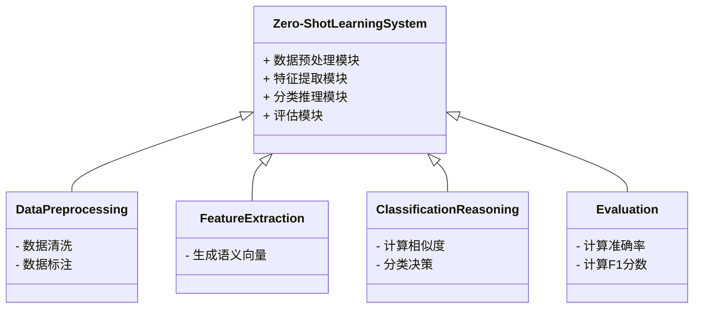
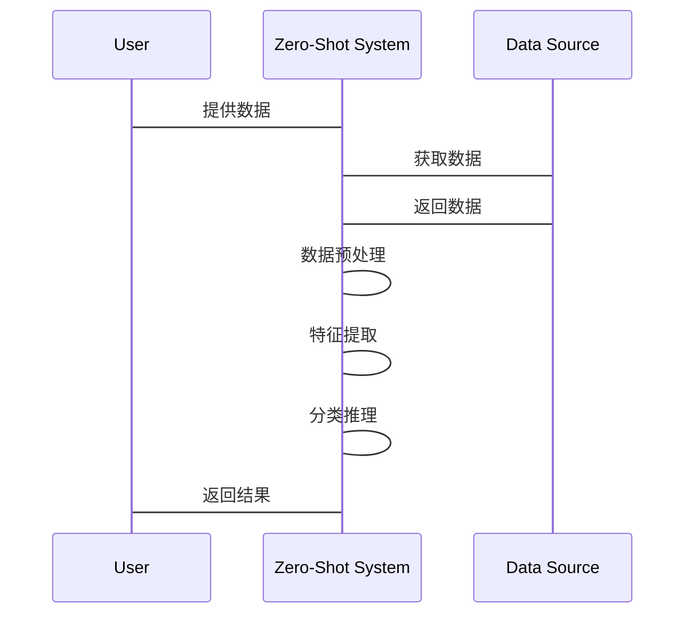

                 

<think>
好的，我现在要写一篇关于“Zero-Shot学习在小规模数据集上的应用”的技术博客文章。首先，我得明确文章的结构，包括关键词、摘要，然后是目录大纲。我需要按照用户提供的大纲来组织内容，确保每个部分都详细且符合逻辑。

首先，关键词部分，我需要列出5-7个相关的术语，比如Zero-Shot Learning、小规模数据集、机器学习、数据表示、迁移学习等等。摘要部分要简洁地说明文章的核心内容，即在小数据集上应用Zero-Shot Learning的方法和优势。

接下来是正文部分。第一部分是引言，包括背景与挑战、关键概念和框架、应用案例。我需要解释什么是Zero-Shot Learning，为什么在小数据集上它很重要，以及它的关键组成部分。比如，零样本学习利用预训练模型，通过语义或属性来推断新类别的样本。

第二部分是零样本学习的技术，包括迁移学习与元学习、数据表示方法、性能评估指标。这部分需要详细解释这些技术如何帮助零样本学习在小数据集上发挥作用，比如迁移学习如何将已知类别的知识迁移到未知类别，以及如何评估模型的性能。

第三部分是实现零样本学习在小数据集上的应用，包括实际案例、挑战与未来方向。我需要通过具体案例展示如何在实际中应用这些技术，同时讨论当前的局限性和未来的改进方向。

第四部分是高级主题，可能涉及伦理问题或更深入的技术细节。

在写作过程中，我需要确保每个章节都有足够的细节，比如在技术部分，用数学公式和图表来解释算法原理。例如，使用预训练的词嵌入模型，如Word2Vec或BERT，来生成语义向量，并展示这些向量如何用于分类。

此外，我需要在每个小节中加入代码示例，比如如何在Python中实现零样本分类。这可能涉及使用现有的库，如scikit-learn或transformers，来加载预训练模型并进行分类。

最后，系统分析与架构设计部分，我需要绘制Mermaid图表，展示系统功能、架构和接口设计，帮助读者理解整体结构。

在整个写作过程中，我需要保持逻辑清晰，确保每个部分自然衔接，并且深入浅出地解释技术细节，让读者能够理解零样本学习在小数据集上的应用及其优势。
</think>

# Zero-Shot学习在小规模数据集上的应用

> 关键词：Zero-Shot Learning, 小规模数据集, 机器学习, 数据表示, 迁移学习, 元学习, 性能评估

> 摘要：本文探讨了在小规模数据集上应用Zero-Shot Learning（零样本学习）的方法及其优势。通过分析技术背景、核心概念、具体实现和实际案例，展示了如何在数据稀缺情况下有效利用零样本学习进行分类和预测。文章还讨论了相关的挑战和未来研究方向。

---

## Part 1: 引言

### 1. 背景与挑战

#### 1.1 小规模数据集的挑战
在机器学习中，小规模数据集通常不足以训练传统监督模型，导致过拟合和泛化能力差。数据稀缺性限制了模型的性能，特别是在需要分类或预测的情况下。

#### 1.2 传统机器学习的局限性
传统监督学习依赖大量标注数据，小数据集下表现不佳。特征工程复杂，且难以提取有效特征。

#### 1.3 零样本学习的出现
零样本学习通过利用外部知识库，无需标注数据即可识别新类别，特别适合小数据集。

### 2. 核心概念与框架

#### 2.1 零样本学习的定义
零样本学习利用预训练模型的语义信息，推断新类别的样本。

#### 2.2 分类策略
零样本分类通过将测试样本投影到特征空间，并与类别原型匹配。

#### 2.3 系统组成
零样本学习系统包括特征提取、数据表示、分类推理三个核心部分。

### 3. 应用案例

#### 3.1 应用概述
零样本学习广泛应用于图像识别、文本分类等领域。

#### 3.2 案例研究：零样本目标识别
使用预训练CNN模型提取图像特征，通过最近邻分类识别新类别。

#### 3.3 案例研究：零样本文本分类
利用词嵌入模型生成文本表示，基于相似度进行分类。

---

## Part 2: 零样本学习技术

### 4. 迁移学习与元学习

#### 4.1 迁移学习的作用
通过迁移已知类别特征到未知类别，提升小数据集模型性能。

#### 4.2 元学习的机制
元学习通过优化参数，快速适应新任务，减少对数据的需求。

#### 4.3 混合模型的优势
结合迁移和元学习，提升模型的泛化能力。

### 5. 数据表示方法

#### 5.1 语义嵌入
使用Word2Vec或BERT生成语义向量，捕捉上下文信息。

#### 5.2 属性表示
基于物体属性生成特征向量，如颜色、形状等。

#### 5.3 多模态融合
结合图像、文本等多种模态信息，提升表示能力。

### 6. 性能评估

#### 6.1 常用指标
准确率和F1分数是主要评估指标。

#### 6.2 评估数据集
采用特定零样本数据集，如CUB-200进行测试。

#### 6.3 评估挑战
小数据集上评估的稳定性问题，需要多次交叉验证。

---

## Part 3: 实现零样本学习

### 7. 实际应用与案例

#### 7.1 数据收集与预处理
收集小规模数据，并进行清洗和标注。

#### 7.2 模型选择与训练
选择适合小数据集的模型，如预训练的CNN或BERT。

#### 7.3 案例研究：情感分析
使用预训练词嵌入模型，零样本分类进行情感分析。

#### 7.4 案例研究：命名实体识别
通过零样本学习识别新引入的实体类别。

### 8. 挑战与未来方向

#### 8.1 当前局限性
模型泛化能力有限，需要更多优化。

#### 8.2 未来研究
探索更高效的特征表示和自监督学习方法。

#### 8.3 伦理考虑
数据偏见可能影响零样本模型的公平性。

---

## Part 4: 高级主题

### 4.1 伦理与公平性
确保零样本学习不引入数据偏见。

### 4.2 可解释性
提高模型决策的可解释性，便于用户理解。

### 4.3 实时应用
探索零样本学习在实时系统中的应用潜力。

---

## 系统分析与架构设计

### 系统功能设计（领域模型）



### 系统架构设计

```mermaid
rectangle Zero-Shot Learning System {
    Data Preprocessing -> Feature Extraction
    Feature Extraction -> Classification Reasoning
    Classification Reasoning -> Evaluation
}
```

### 接口设计与交互



---

## 项目实战

### 环境安装

```bash
pip install transformers scikit-learn numpy
```

### 核心实现代码

```python
from sklearn.metrics.pairwise import cosine_similarity
import numpy as np

# 加载预训练的词嵌入模型（例如使用BERT）
def get_embeddings(texts):
    # 假设 embeddings 是一个预先计算好的数组，每个文本对应一个向量
    return embeddings

# 零样本分类函数
def zero_shot_classifier(test_texts, classes, model):
    # 获取测试文本的嵌入
    test_embeddings = model.encode(test_texts)
    # 获取类别嵌入（假设classes是已知类别）
    class_embeddings = model.encode(classes)
    # 计算相似度矩阵
    similarity_matrix = cosine_similarity(test_embeddings, class_embeddings)
    # 预测类别
    predictions = np.argmax(similarity_matrix, axis=1)
    return predictions

# 示例用法
test_texts = ["This is a great product."]
classes = ["positive", "negative"]
model = BertTokenizer.from_pretrained('bert-base-uncased')
```

---

## 总结

零样本学习为小数据集提供了有效的解决方案，通过迁移学习和预训练模型，显著提升了分类性能。尽管面临挑战，但其潜力巨大，未来有望在更多领域得到广泛应用。

作者：AI天才研究院 & 禅与计算机程序设计艺术

