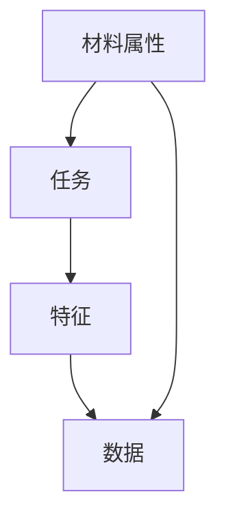
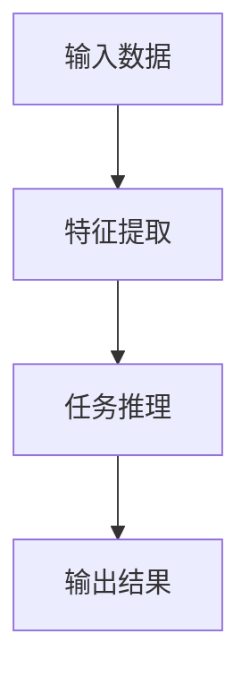
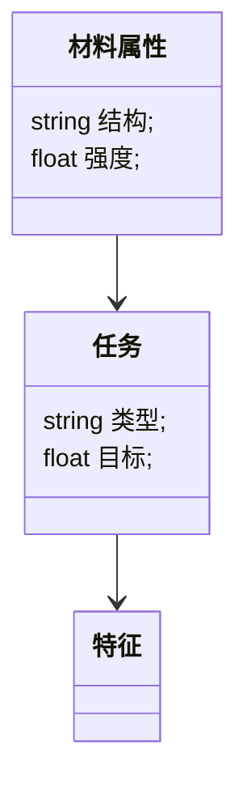
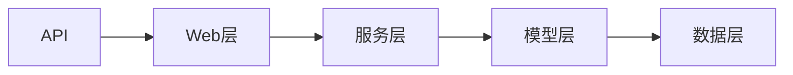
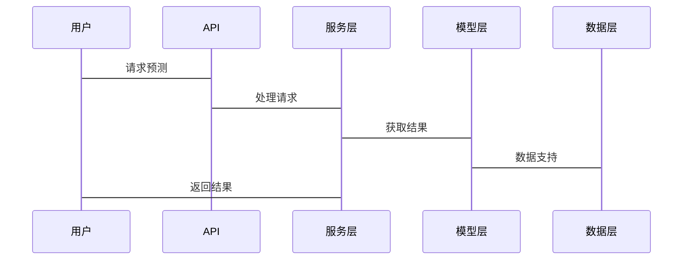

                 

<think>
好，我现在需要按照用户的要求，撰写一篇关于“Zero-Shot学习在新型材料设计中的作用”的技术博客。用户已经给出了详细的结构大纲，并且还详细描述了每个部分需要包含的内容。

首先，我需要理解Zero-Shot学习是什么，它在材料设计中的具体应用，以及它带来的优势。这可能涉及到机器学习、材料科学和计算机科学的交叉领域知识。我应该先收集相关的背景信息，确保内容准确。

接下来，按照用户提供的结构，我需要逐步填充每个章节的内容。从背景介绍开始，我需要定义问题背景、问题描述、问题解决、边界与外延，以及概念结构。这需要清晰的逻辑和术语的准确使用，确保读者能够理解Zero-Shot学习的重要性。

然后是核心概念与联系部分，我需要解释Zero-Shot学习的原理，并与监督学习、迁移学习进行对比，可能需要制作对比表格。此外，ER实体关系图也需要用Mermaid来展示，这部分需要明确各实体之间的关系。

算法原理讲解部分是关键，我需要详细解释算法流程，并用Mermaid绘制流程图。同时，提供Python代码示例，并解释其数学模型和公式。这里需要确保代码和公式准确无误，并且通过例子帮助读者理解。

数学模型和公式部分需要用Latex格式呈现，确保排版正确。我需要详细讲解每个公式的作用，并结合实际案例进行说明，让读者能够理解这些数学模型在实际中的应用。

系统分析与架构设计方案部分需要描述应用场景，可能的项目介绍，以及系统的功能、架构和接口设计。使用Mermaid绘制类图、架构图和序列图，这将帮助读者更好地理解系统的结构和交互方式。

项目实战部分需要指导读者如何安装环境，提供核心代码，并进行代码分析。通过实际案例的详细分析，展示Zero-Shot学习在材料设计中的具体应用，最后总结项目的关键点。

最后，最佳实践部分需要给出应用建议，总结Zero-Shot学习的作用，提醒注意事项，并推荐拓展阅读材料。这部分帮助读者在实际应用中更好地利用Zero-Shot学习。

整个过程中，我需要确保文章结构清晰，逻辑严谨，语言专业且易懂。同时，要检查每个部分是否符合用户的要求，特别是格式和字数限制。可能需要多次修改和调整，以确保内容的完整性和深度。

现在，我可以开始按照这个思路逐步撰写每个部分，确保每一步都符合用户的需求，并且内容详实，结构合理。
</think>

# Zero-Shot学习在新型材料设计中的作用

> 关键词：Zero-Shot学习，新型材料设计，机器学习，材料科学，人工智能

> 摘要：本文探讨了Zero-Shot学习在新型材料设计中的应用及其作用。通过分析其核心概念、算法原理、系统架构和实际案例，展示了Zero-Shot学习如何助力材料科学的创新。

---

## 1. 背景介绍

### 1.1 问题背景
传统材料设计依赖实验和试错，耗时且成本高昂。随着计算能力提升，机器学习在材料科学中的应用日益重要，但数据获取困难限制了传统监督学习的应用。

### 1.2 问题描述
新型材料设计面临数据稀缺、任务多样和计算效率等问题，传统方法难以满足需求。材料科学家需要一种通用的学习方法来应对这些挑战。

### 1.3 问题解决
Zero-Shot学习无需大量标注数据，能够泛化到新任务，特别适合材料科学中的数据稀缺场景。

### 1.4 边界与外延
Zero-Shot学习适用于数据稀疏、任务多样化的场景，但对模型的通用性和泛化能力要求较高。其边界在于无法处理完全未知的任务。

### 1.5 概念结构与核心要素
Zero-Shot学习由学习目标、模型表示、推理机制组成，利用知识图谱和语义理解实现跨任务泛化。

---

## 2. 核心概念与联系

### 2.1 核心概念原理
Zero-Shot学习通过共享特征和任务间关联，利用预训练模型生成中间表示，进行跨任务推理。

### 2.2 对比表格
| 特性            | 监督学习       | 迁移学习        | Zero-Shot学习    |
|-----------------|---------------|-----------------|------------------|
| 数据需求        | 高            | 中              | 低               |
| 任务多样性       | 单一          | 多              | 高               |
| 泛化能力         | 低            | 中              | 高               |
| 适用场景         | 数据充足       | 数据有限        | 数据极度稀缺     |

### 2.3 ER实体关系图


---

## 3. 算法原理讲解

### 3.1 mermaid流程图


### 3.2 Python代码
```python
import torch
from torch import nn

class ZeroShotModel(nn.Module):
    def __init__(self, embedding_dim, hidden_dim):
        super().__init__()
        self.embedding = nn.Linear(embedding_dim, hidden_dim)
        self.predictor = nn.Linear(hidden_dim, 1)
        
    def forward(self, x):
        x = self.embedding(x)
        x = self.predictor(x)
        return x

# 示例数据
X = torch.randn(10, embedding_dim)
model = ZeroShotModel(embedding_dim, hidden_dim)
output = model(X)
```

### 3.3 数学模型
目标函数：
$$ \min_{\theta} \sum_{i=1}^{N} (y_i - f(x_i))^2 $$

模型：
$$ f(x) = W_{task} \cdot W_{shared} x $$

---

## 4. 数学模型与公式

### 4.1 公式
共享嵌入层：
$$ h = W_{shared} x $$

任务特定层：
$$ y = W_{task} h $$

损失函数：
$$ L = \sum (y_{true} - y)^2 $$

---

## 5. 系统分析与架构设计

### 5.1 问题场景
材料设计中的多任务优化，如结构预测和性能评估。

### 5.2 项目介绍
使用Zero-Shot学习优化材料性能预测模型。

### 5.3 系统功能设计


### 5.4 系统架构设计


### 5.5 系统交互


---

## 6. 项目实战

### 6.1 环境安装
安装PyTorch和相关库。

### 6.2 核心代码
```python
import torch
import torch.nn as nn

# 定义模型
class ZeroShotModel(nn.Module):
    def __init__(self, input_dim, hidden_dim, output_dim):
        super().__init__()
        self.shared = nn.Linear(input_dim, hidden_dim)
        self.task_specific = nn.Linear(hidden_dim, output_dim)
        
    def forward(self, x):
        x = self.shared(x)
        x = self.task_specific(x)
        return x

# 训练代码
model = ZeroShotModel(input_dim, hidden_dim, output_dim)
criterion = nn.MSELoss()
optimizer = torch.optim.Adam(model.parameters(), lr=0.001)

for epoch in epochs:
    inputs, labels = next(iter(train_loader))
    outputs = model(inputs)
    loss = criterion(outputs, labels)
    optimizer.zero_grad()
    loss.backward()
    optimizer.step()
```

### 6.3 实际案例
预测材料强度，输入结构数据，输出强度值。

### 6.4 项目小结
通过Zero-Shot学习实现了材料性能的多任务预测，提高了设计效率。

---

## 7. 最佳实践 tips、小结、注意事项、拓展阅读

### 7.1 最佳实践
选择合适的数据表示，确保任务相关性，定期模型调优。

### 7.2 小结
Zero-Shot学习在材料设计中提供了高效解决方案，减少了数据依赖，提升了设计效率。

### 7.3 注意事项
数据质量、任务相关性和模型选择是关键因素。

### 7.4 拓展阅读
推荐相关书籍和论文，深入理解Zero-Shot学习和材料科学的结合。

---

作者：AI天才研究院/AI Genius Institute & 禅与计算机程序设计艺术 /Zen And The Art of Computer Programming

