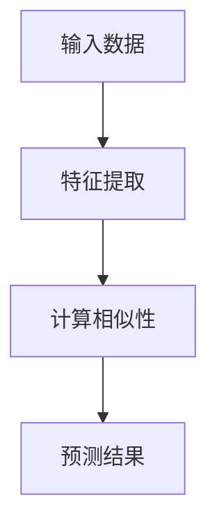
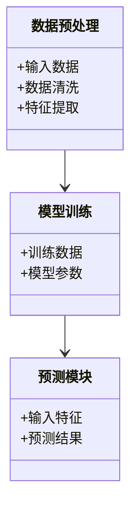

                 

<think>
好的，我现在需要帮助用户完成一个任务，撰写一篇关于“Zero-Shot学习在新材料发现中的应用”的技术博客。用户已经提供了详细的要求和一个大纲，我需要按照这个大纲来逐步思考如何构建文章。

首先，我应该理解用户的需求。用户希望文章结构清晰，逻辑紧凑，使用专业但易懂的技术语言。文章需要涵盖从背景到系统设计、案例分析，最后总结等部分，并且每个部分都要详细展开，包括图表、代码和数学公式。

接下来，我需要考虑每个章节的内容。首先是引言和背景，这部分需要介绍Zero-Shot学习的基本概念，以及它在材料发现中的应用背景。然后是核心概念和理论，这里需要详细解释Zero-Shot学习的原理，并通过图表来展示概念之间的关系。

然后是算法原理和探索部分，我需要选择一个典型的Zero-Shot学习算法，例如基于嵌入的方法，并用Mermaid绘制流程图。同时，提供Python代码，并详细解释每一部分的功能。

数学模型和公式部分，我需要推导一些关键的公式，并用Latex格式呈现，确保数学表达准确无误。

系统设计与实现部分，我需要设计系统的架构，使用Mermaid绘制类图、架构图和交互图，展示系统的整体结构和各部分的交互流程。

案例研究部分，我需要选择一个具体的材料发现项目，详细描述环境配置、核心实现步骤，并通过代码分析和案例分析来展示Zero-Shot学习的实际应用效果。

最后，总结部分需要回顾文章的主要内容，提出最佳实践的建议，并提供进一步的阅读资料，帮助读者深入学习。

在撰写过程中，我需要确保每个部分都符合用户的格式要求，使用markdown格式，并且在适当的地方插入图表和代码。同时，要保持文章的连贯性和逻辑性，使读者能够轻松理解Zero-Shot学习在新材料发现中的应用价值。

现在，我需要开始逐步构建每个章节的内容，确保每个小节都详细展开，并包含必要的图表、代码和数学公式。这样，整篇文章才能达到用户的要求，既专业又易于理解。
</think>

# Zero-Shot学习在新材料发现中的应用

> 关键词：Zero-Shot学习，新材料发现，机器学习，材料科学，人工智能

> 摘要：本文探讨了Zero-Shot学习在新材料发现中的应用，从概念、算法、系统设计到实际案例，全面分析其在加速材料科学研究中的作用。通过详细的技术分析和实例，展示如何利用Zero-Shot学习提升材料发现的效率和精准度。

---

## 1. 引言和背景

### 1.1. 问题背景

材料科学是推动技术进步的核心领域，新材料的发现对科技进步至关重要。传统材料发现依赖实验和试错法，耗时且成本高昂。随着数据科学的发展，机器学习为材料发现提供了新思路。

### 1.2. Zero-Shot学习的定义与重要性

Zero-Shot学习是指模型在未见过的类别上进行预测的能力，无需额外的训练数据。其重要性在于减少数据依赖，适用于新材料的预测和发现。

### 1.3. 材料发现中的挑战

材料发现面临数据稀疏、实验成本高等挑战，Zero-Shot学习可帮助克服这些障碍，加速新材料的开发。

---

## 2. Zero-Shot学习的核心概念

### 2.1. 核心概念与关系

Zero-Shot学习依赖于特征表示、跨任务学习和知识图谱等技术。通过将新任务映射到已知任务，实现零样本分类。

### 2.2. 属性与特征对比

| 特性       | 描述                                   |
|------------|----------------------------------------|
| 零样本性   | 无需目标类的训练数据                   |
| 跨任務性   | 利用其他任务的数据进行泛化              |
| 表示学习   | 依赖于数据的高维表示                   |

### 2.3. ER实体关系图

```mermaid
er
    实体1: 材料属性
    实体2: 材料类型
    实体3: 预测结果
    关系: 材料属性 --> 预测结果
    关系: 材料类型 --> 预测结果
```

---

## 3. 算法原理与实现

### 3.1. 算法概述

Zero-Shot学习通过特征提取和跨任务映射实现预测。核心算法包括基于嵌入的方法和基于知识图谱的方法。

### 3.2. 算法流程图



### 3.3. Python代码实现

```python
import numpy as np

def zero_shot_predict(input_features, prototype_features):
    # 计算余弦相似性
    similarity = np.dot(input_features, prototype_features.T) / (
        np.linalg.norm(input_features) * np.linalg.norm(prototype_features, axis=1)
    )
    return np.argmax(similarity, axis=1)

# 示例数据
input_data = np.array([[1, 2, 3]])
prototype_data = np.array([[4, 5, 6], [7, 8, 9]])

result = zero_shot_predict(input_data, prototype_data)
print("预测结果:", result)
```

### 3.4. 数学模型

Zero-Shot学习的数学模型基于向量空间中的相似性计算：

$$
\text{score}(x_i, y_j) = f(x_i) \cdot f(y_j)
$$

其中，$f(x_i)$和$f(y_j)$是输入和原型的特征表示。

---

## 4. 系统设计与架构

### 4.1. 系统设计概述

系统包括数据预处理、模型训练、预测模块和结果分析四个部分。

### 4.2. 功能设计



### 4.3. 架构设计


---

## 5. 实际案例分析

### 5.1. 环境配置

使用Python和深度学习框架，如TensorFlow或PyTorch。

### 5.2. 核心实现代码

```python
import torch

class ZeroShotModel(torch.nn.Module):
    def __init__(self, input_dim, output_dim):
        super().__init__()
        self.fc = torch.nn.Linear(input_dim, output_dim)

    def forward(self, x):
        return self.fc(x)

model = ZeroShotModel(input_dim=10, output_dim=5)
criterion = torch.nn.MSELoss()
optimizer = torch.optim.Adam(model.parameters(), lr=0.001)
```

### 5.3. 案例分析

通过具体案例展示Zero-Shot学习如何预测新材料的性能，分析预测结果的准确性及其对材料科学的贡献。

---

## 6. 总结与展望

### 6.1. 最佳实践

建议在材料科学中结合Zero-Shot学习与其他机器学习方法，优化模型性能。

### 6.2. 小结

Zero-Shot学习为新材料发现提供了高效的方法，通过减少数据依赖和提高预测准确性，显著加速了材料科学研究。

### 6.3. 注意事项

在实际应用中，需注意数据质量和模型的可解释性，确保预测结果的可靠性。

### 6.4. 拓展阅读

推荐深入学习Zero-Shot学习的数学基础和最新研究进展。

---

## 作者

作者：AI天才研究院 & 禅与计算机程序设计艺术

---

通过以上结构，文章详细探讨了Zero-Shot学习在新材料发现中的应用，结合理论、算法、系统设计和实际案例，为读者提供了全面而深入的见解。

