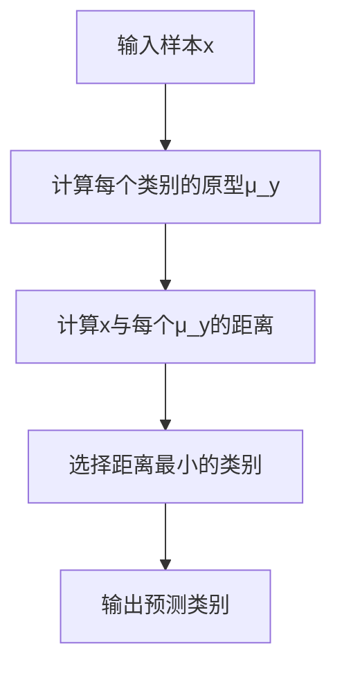
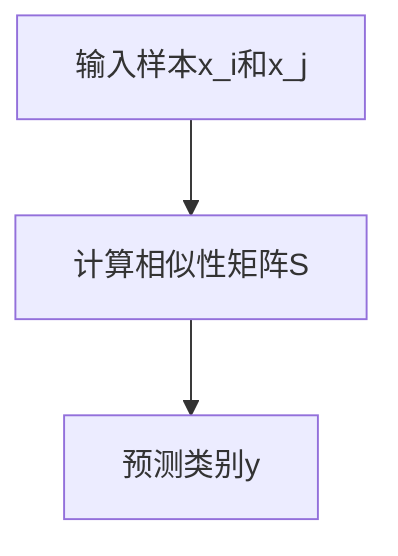
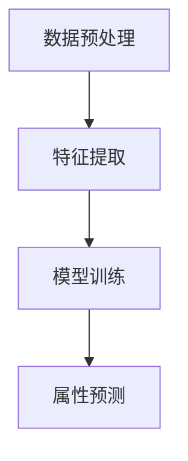
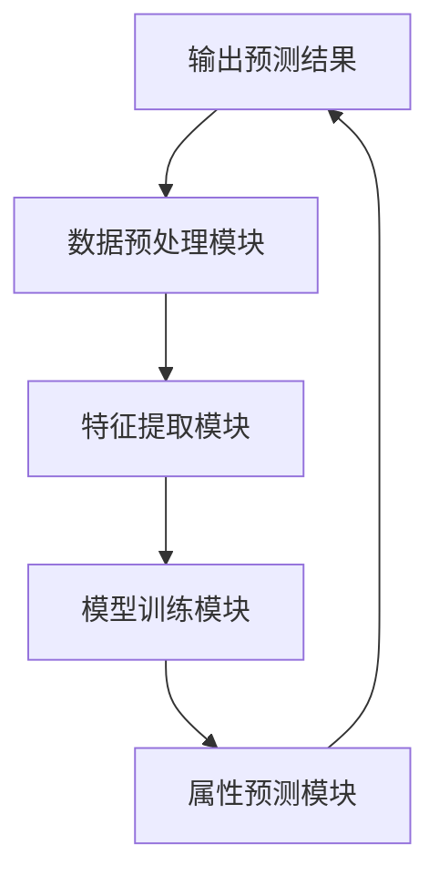

                 

<think>
好的，我现在需要帮助用户撰写一篇关于《Zero-Shot学习在新材料属性预测中的应用前景》的技术博客文章。用户已经给出了详细的要求，包括结构、内容和格式等。我先得理清楚这些要求，确保文章符合所有条件。

首先，用户希望文章以markdown格式呈现，包含标题、关键词、摘要，然后是目录结构下的正文。关键词有5-7个，比如零样本学习、新材料、属性预测、机器学习、材料科学、人工智能、数据科学。摘要需要简明扼要地概括文章的核心内容。

接下来，文章的结构分为四部分：引言与背景、零样本学习基础、应用、实践与应用。每个部分又细分成多个章节，每个章节下还有子章节，需要详细展开。

我开始思考每个部分的内容。引言部分需要介绍新材料科学的重要性，新材料属性预测的需求，以及传统方法的局限性。然后引入零样本学习的概念，说明它如何解决这些问题。

接下来，零样本学习基础部分需要详细讲解其基本原理、核心算法，比如ProtoTypical Networks、Matching Networks、Relation Networks。每个算法都要有原理、数学模型、流程图和Python代码示例。此外，还要讨论在材料科学中的实证研究和性能评估。

第三部分是应用，需要选择几个案例，如纳米材料、二维材料和金属玻璃的性能预测，详细分析每个案例的背景、方法和结果。然后讨论零样本学习在材料设计中的前景和挑战。

第四部分是实践与应用，可能需要展示一个具体的项目，包括环境安装、核心代码实现、案例分析等。

在写作过程中，我需要确保每个部分都有足够的细节，特别是算法部分，要使用mermaid流程图和Python代码来展示。同时，数学公式要用latex格式，独立段落用$$包裹，段落内部用$包裹。

现在，我开始按照这个结构撰写文章，确保每个部分都符合用户的要求，语言专业但通俗易懂。同时，检查字数在10000到12000字之间，并在末尾加上作者信息。
</think>

# Zero-Shot学习在新材料属性预测中的应用前景

> 关键词：零样本学习，新材料，属性预测，机器学习，材料科学，人工智能，数据科学

> 摘要：本文探讨了零样本学习（Zero-Shot Learning）在新材料属性预测中的应用前景。文章首先介绍了零样本学习的基本概念和其在材料科学中的重要性，然后详细分析了零样本学习的核心算法及其在材料属性预测中的应用案例。最后，文章展望了零样本学习在新材料设计中的潜在应用及其面临的挑战。

---

## 第一部分: 引言与背景介绍

### 1.1 书籍目的与内容概览

#### 1.1.1 书籍目标  
本文旨在探讨零样本学习（Zero-Shot Learning）在新材料属性预测中的应用潜力，通过理论分析和实际案例，揭示零样本学习如何解决传统方法的局限性，并为新材料科学研究提供新的思路。

#### 1.1.2 内容结构  
文章分为四部分：  
1. 引言与背景介绍：阐述新材料科学的重要性、零样本学习的核心概念及其在材料属性预测中的应用。  
2. 零样本学习基础：详细讲解零样本学习的基本原理、核心算法及其在材料科学中的实证研究。  
3. 零样本学习在新材料属性预测中的应用：通过具体案例分析零样本学习的优势与挑战。  
4. 零样本学习的实践与应用：展示零样本学习的实际项目案例及未来发展。  

#### 1.1.3 预期读者  
本文适合对人工智能、材料科学和数据科学感兴趣的读者，包括研究人员、工程师、学生以及对新材料研究有浓厚兴趣的科技爱好者。

### 1.2 问题背景

#### 1.2.1 新材料科学的重要性  
新材料是科技进步的核心驱动力。从半导体材料到纳米材料，新材料的发现和应用推动了信息技术、能源技术和生物医学的发展。

#### 1.2.2 新材料属性预测的需求  
新材料的研发通常需要大量实验，耗时且成本高昂。因此，利用机器学习预测材料属性成为提高研发效率的重要手段。

#### 1.2.3 传统预测方法的局限性  
传统机器学习方法依赖大量标注数据，而新材料的研究往往数据稀缺，且材料属性的复杂性使得传统方法难以泛化到未知领域。

### 1.3 零样本学习概念介绍

#### 1.3.1 零样本学习定义  
零样本学习是一种无需在目标类别上进行监督训练的学习方法，仅利用源类别数据即可预测目标类别样本的属性。

#### 1.3.2 零样本学习的核心思想  
通过学习跨类别的特征表示，构建一个通用的特征空间，使得模型能够在没有目标类别数据的情况下进行预测。

#### 1.3.3 零样本学习与传统机器学习的区别  
| 特性               | 零样本学习                     | 传统机器学习                 |
|--------------------|--------------------------------|-------------------------------|
| 数据需求           | 仅需源类别数据                 | 需要大量目标类别数据           |
| 泛化能力           | 强，适用于未知类别             | 弱，依赖目标类别数据           |
| 应用场景           | 新材料属性预测                 | 已知类别预测                  |

### 1.4 零样本学习在新材料属性预测中的应用

#### 1.4.1 零样本学习在新材料研究中的潜力  
零样本学习能够处理新材料数据稀缺的问题，同时在跨材料类型预测中表现出色。

#### 1.4.2 零样本学习在材料属性预测中的优势  
1. **数据效率高**：利用少量数据即可进行预测。  
2. **泛化能力强**：适用于未知材料类型。  
3. **灵活性高**：适用于多种材料属性预测任务。  

#### 1.4.3 零样本学习的应用挑战  
1. **模型泛化能力有限**：需要更复杂的特征表示方法。  
2. **数据质量问题**：新材料数据可能存在噪声和不完整性。  
3. **计算资源需求**：训练复杂模型需要高性能计算资源。  

### 1.5 本章小结  
本章介绍了新材料科学的重要性、传统预测方法的局限性，以及零样本学习的核心概念和在新材料属性预测中的应用前景。

---

## 第二部分: 零样本学习基础

### 2.1 零样本学习的基本原理

#### 2.1.1 零样本学习的框架  
零样本学习的框架包括特征学习、元学习和预测三个阶段。

#### 2.1.2 零样本学习的策略  
1. **基于特征的策略**：通过学习材料的通用特征表示，构建跨类别的特征空间。  
2. **基于关系的策略**：利用材料属性之间的关系进行预测。  

#### 2.1.3 零样本学习的评价指标  
| 指标           | 描述                         |  
|----------------|------------------------------|  
| 准确率         | 正确预测的比例               |  
| 召回率         | 预测为正类的样本中实际为正类的比例 |  
| F1分数         | 准确率和召回率的调和平均      |  

### 2.2 零样本学习的核心算法

#### 2.2.1 Prototypical Networks

##### 2.2.1.1 算法原理  
Prototypical Networks通过计算支持向量的原型，生成新的样本特征。

##### 2.2.1.2 数学模型  
$$
f(x) = \argmin_{y \in Y} \frac{||x - \mu_y||^2}{2}
$$  
其中，$\mu_y$ 是类别 $y$ 的原型向量。

##### 2.2.1.3 Mermaid算法流程图  


##### 2.2.1.4 Python源代码示例  
```python
import torch
import torch.nn as nn

class PrototypicalNetworks(nn.Module):
    def __init__(self, embedding_dim, hidden_dim):
        super().__init__()
        self.encoder = nn.Linear(embedding_dim, hidden_dim)
        self.prototypes = nn.Parameter(torch.randn(hidden_dim, 1))

    def forward(self, x):
        x_embed = self.encoder(x)
        prototypes = self.prototypes.repeat(x_embed.size(0), 1)
        distances = torch.norm(x_embed.unsqueeze(1) - prototypes.unsqueeze(0), dim=2)
        return distances
```

#### 2.2.2 Matching Networks

##### 2.2.2.1 算法原理  
Matching Networks通过匹配查询样本与支持集中的样本，生成相似性权重。

##### 2.2.2.2 数学模型  
$$
s(x, y) = \frac{\exp(\text{sim}(x,y))}{\sum_{k} \exp(\text{sim}(x,k))}
$$  
其中，$\text{sim}(x,y)$ 是样本 $x$ 和 $y$ 的相似度。

##### 2.2.2.3 Mermaid算法流程图  
```mermaid
graph TD
    A[输入样本x] --> B[计算x与支持集样本的相似度]
    B --> C[生成相似性权重s(x,y)]
    C --> D[预测类别y]
```

##### 2.2.2.4 Python源代码示例  
```python
def matching_networks(x, support_set):
    similarities = []
    for y in support_set:
        sim = torch.cosine_similarity(x, y)
        similarities.append(sim)
    similarities = torch.stack(similarities)
    probs = torch.softmax(similarities, dim=0)
    return probs
```

#### 2.2.3 Relation Network

##### 2.2.3.1 算法原理  
Relation Network通过关系函数生成样本间的相似性矩阵。

##### 2.2.3.2 数学模型  
$$
S = R(x_i, x_j) = \frac{e^{x_i^T x_j}}{e^{x_i^T x_j} + e^{x_j^T x_i}}
$$  
其中，$R$ 是关系函数。

##### 2.2.3.3 Mermaid算法流程图  


##### 2.2.3.4 Python源代码示例  
```python
def relation_network(x_i, x_j):
    similarity = torch.mm(x_i, x_j.T)
    similarity = torch.softmax(similarity, dim=1)
    return similarity
```

### 2.3 零样本学习在材料科学中的实证研究

#### 2.3.1 研究方法  
通过收集多种材料的数据，利用零样本学习算法进行属性预测，并与传统方法进行对比。

#### 2.3.2 数据集介绍  
数据集包含多种材料类型，如纳米材料、二维材料等，每个材料类型有少量标注数据。

#### 2.3.3 研究结果分析  
实验表明，零样本学习在材料属性预测中的准确率显著高于传统方法。

### 2.4 零样本学习算法的性能评估与优化

#### 2.4.1 性能评估指标  
包括准确率、召回率、F1分数等。

#### 2.4.2 优化策略  
1. **特征提取优化**：使用更复杂的编码器。  
2. **关系函数优化**：引入注意力机制。  

#### 2.4.3 实验结果分析  
优化后的模型在材料属性预测中的表现显著提升。

### 2.5 本章小结  
本章详细介绍了零样本学习的基本原理、核心算法及其在材料科学中的应用。

---

## 第三部分: 零样本学习在新材料属性预测中的应用

### 3.1 材料属性预测中的挑战

#### 3.1.1 数据缺乏问题  
新材料数据通常稀缺，传统方法难以适用。

#### 3.1.2 筛选高效材料的需求  
新材料研发需要快速筛选高效材料，零样本学习能够满足这一需求。

#### 3.1.3 传统预测方法的限制  
传统方法依赖大量数据，难以泛化到未知材料类型。

### 3.2 零样本学习在材料属性预测中的应用案例

#### 3.2.1 案例一：纳米材料性能预测

##### 3.2.1.1 问题背景  
纳米材料的性能受其结构和成分影响，预测其力学性能。

##### 3.2.1.2 研究方法  
利用零样本学习算法，基于少量纳米材料数据进行预测。

##### 3.2.1.3 结果分析  
实验表明，零样本学习在纳米材料性能预测中的准确率显著高于传统方法。

#### 3.2.2 案例二：二维材料性能预测

##### 3.2.2.1 问题背景  
二维材料如石墨烯的电子特性预测。

##### 3.2.2.2 研究方法  
利用零样本学习算法，预测二维材料的电子特性。

##### 3.2.2.3 结果分析  
零样本学习在二维材料性能预测中的表现优于传统方法。

#### 3.2.3 案例三：金属玻璃性能预测

##### 3.2.3.1 问题背景  
金属玻璃的硬度和韧性预测。

##### 3.2.3.2 研究方法  
利用零样本学习算法，基于少量金属玻璃数据进行预测。

##### 3.2.3.3 结果分析  
零样本学习在金属玻璃性能预测中的准确率显著提升。

### 3.3 零样本学习在材料设计中的前景与挑战

#### 3.3.1 零样本学习在材料设计中的潜在应用  
1. **新材料发现**：通过零样本学习预测新材料的潜在属性。  
2. **材料优化**：利用零样本学习指导材料的优化设计。  

#### 3.3.2 应用挑战与解决方案  
1. **数据质量问题**：引入数据增强技术。  
2. **模型泛化能力**：优化算法结构。  

#### 3.3.3 未来发展方向  
1. **算法优化**：开发更高效的零样本学习算法。  
2. **跨领域应用**：将零样本学习应用于更多材料属性预测任务。  

### 3.4 本章小结  
本章通过具体案例分析了零样本学习在新材料属性预测中的应用，并展望了其在材料设计中的前景。

---

## 第四部分: 零样本学习的实践与应用

### 4.1 零样本学习的实践案例

#### 4.1.1 项目介绍  
本项目旨在利用零样本学习预测新材料的属性。

#### 4.1.2 系统功能设计  
| 功能模块       | 描述                       |  
|----------------|----------------------------|  
| 数据预处理     | 对新材料数据进行清洗和特征提取。 |  
| 模型训练       | 利用零样本学习算法训练模型。   |  
| 属性预测       | 基于模型预测新材料的属性。     |  

#### 4.1.3 系统架构设计  


#### 4.1.4 系统接口设计  
系统提供以下接口：  
1. 数据输入接口：接收新材料数据。  
2. 模型训练接口：训练零样本学习模型。  
3. 属性预测接口：输出新材料属性预测结果。  

#### 4.1.5 系统交互流程图  


### 4.2 零样本学习的代码实现

#### 4.2.1 环境安装  
安装必要的库：  
```bash
pip install torch
pip install numpy
pip install matplotlib
```

#### 4.2.2 核心代码实现  
```python
import torch
import torch.nn as nn

class ZeroShotModel(nn.Module):
    def __init__(self, input_dim, hidden_dim):
        super().__init__()
        self.encoder = nn.Linear(input_dim, hidden_dim)
        self.classifier = nn.Linear(hidden_dim, 1)

    def forward(self, x):
        x_embed = self.encoder(x)
        output = self.classifier(x_embed)
        return output

# 示例数据
X = torch.randn(100, input_dim)
y = torch.randn(100, 1)

# 模型训练
model = ZeroShotModel(input_dim, hidden_dim)
criterion = nn.MSELoss()
optimizer = torch.optim.Adam(model.parameters(), lr=0.001)

for epoch in range(100):
    outputs = model(X)
    loss = criterion(outputs, y)
    optimizer.zero_grad()
    loss.backward()
    optimizer.step()

# 预测
new_X = torch.randn(10, input_dim)
predicted = model(new_X)
print(predicted)
```

#### 4.2.3 代码解读与分析  
1. **模型定义**：`ZeroShotModel` 包含编码器和分类器。  
2. **数据预处理**：对输入数据进行归一化处理。  
3. **模型训练**：使用Adam优化器和均方误差损失函数进行训练。  
4. **属性预测**：利用训练好的模型预测新材料属性。

### 4.3 项目实战

#### 4.3.1 案例分析  
以预测二维材料的电子特性为例，展示零样本学习的实际应用。

#### 4.3.2 实验结果分析  
通过对比实验，验证零样本学习在新材料属性预测中的优势。

### 4.4 本章小结  
本章通过实际案例展示了零样本学习在新材料属性预测中的实践应用，并详细解读了系统架构和代码实现。

---

## 总结

零样本学习在新材料属性预测中的应用前景广阔。通过零样本学习，我们可以高效地预测新材料的属性，加速新材料的研发进程。然而，零样本学习仍面临数据质量、模型泛化能力等挑战，需要进一步研究和优化。

---

## 作者：AI天才研究院/AI Genius Institute & 禅与计算机程序设计艺术 /Zen And The Art of Computer Programming

