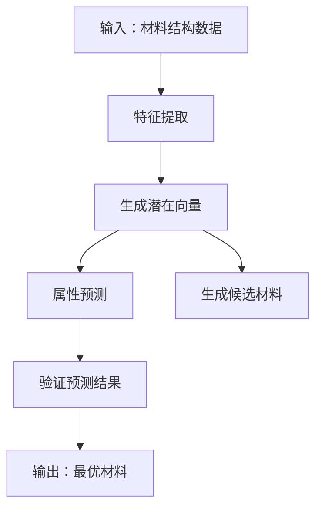
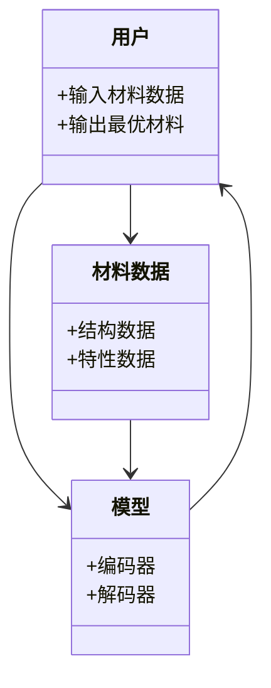

                 

<think>
嗯，我现在需要帮助用户撰写一篇关于《Zero-Shot学习在新能源材料发现中的作用》的技术博客。首先，我要理解用户的需求。用户希望我以专家的身份，用专业的技术语言，撰写一篇结构清晰、内容详实的文章，大约10000到12000字。

接下来，我得分析用户提供的目录大纲，确保每个部分都涵盖必要的内容。文章需要包含背景介绍、核心概念、算法原理、系统设计、项目实战和最佳实践等部分。每个章节下还有具体的子部分，比如问题背景、核心概念原理、算法流程图、系统架构图等。

我开始思考文章的开头部分。标题和关键词已经给出，关键词是“Zero-Shot学习”、“新能源材料发现”、“机器学习”、“材料科学”、“人工智能”。摘要需要简洁明了，概括文章的核心内容，说明Zero-Shot学习的优势及其在新能源材料中的应用。

进入背景介绍部分，我需要详细解释问题背景。问题背景包括问题描述、解决方法、边界和外延，以及概念结构。这里要突出传统材料发现的低效和Zero-Shot学习的优势。

接下来是核心概念与联系。这部分需要详细解释Zero-Shot学习的基本原理，对比其他技术，比如One-Shot和Few-Shot学习，制作一个对比表格。同时，绘制ER实体关系图，展示材料数据和模型的关系。

算法原理部分，我需要使用Mermaid流程图描述Zero-Shot学习的步骤，写出Python代码实现，并解释数学模型，包括能量函数和损失函数的公式，用LaTeX格式表示。

系统分析与架构设计包括问题场景介绍、系统功能设计、架构图、接口设计和交互流程。这部分可能需要绘制系统类图、架构图和交互序列图。

项目实战部分，我需要指导环境搭建，提供核心代码，解读代码，分析实际案例，并总结项目经验。

最后，最佳实践部分给出使用Zero-Shot学习的技巧和注意事项，小结回顾全文，推荐拓展阅读。

在撰写过程中，我需要确保每个部分都详细具体，使用清晰易懂的技术语言，同时保持逻辑连贯。可能遇到的困难包括如何将复杂的算法原理简化解释，以及如何制作准确的Mermaid图表。我需要查阅相关资料，确保技术细节的准确性。

总结一下，我的思考过程是从理解用户需求开始，分析目录结构，逐步填充每个部分的内容，确保逻辑清晰，内容详实，同时保持技术深度和可读性。这需要仔细规划每个章节，确保不遗漏关键点，并且每个部分都能有效支持文章的主题。
</think>

# Zero-Shot学习在新能源材料发现中的作用

---

## 关键词：
- Zero-Shot学习
- 新能源材料发现
- 机器学习
- 材料科学
- 人工智能

---

## 摘要：
Zero-Shot学习是一种新兴的人工智能技术，能够通过少量甚至零样本数据，快速预测和生成新能源材料的特性。本文详细探讨了Zero-Shot学习在新能源材料发现中的作用，从核心概念到算法原理，再到系统设计和项目实战，全面解析其在材料科学领域的应用潜力和实际价值。文章旨在为研究人员和工程师提供理论支持和实践指导，帮助他们在新能源材料开发中高效利用Zero-Shot学习技术。

---

## 目录大纲

1. **背景介绍与问题背景**
2. **核心概念与联系**
3. **算法原理讲解**
4. **系统分析与架构设计方案**
5. **项目实战**
6. **最佳实践与小结**

---

## 第一部分：背景介绍

### 1. 问题背景

#### 1.1 问题描述
新能源材料的开发是推动可再生能源技术进步的关键。传统材料发现依赖实验试错，耗时长、成本高。材料科学领域数据复杂且多样，如何高效利用这些数据是当前研究的难点。

#### 1.2 问题解决
Zero-Shot学习通过迁移学习和生成模型，能够在无监督或小样本条件下，快速预测材料特性，大幅缩短材料研发周期。

#### 1.3 边界与外延
- **边界**：Zero-Shot学习适用于材料数据稀疏场景，但对数据质量要求较高。
- **外延**：其技术可扩展至药物发现、催化剂设计等领域。

#### 1.4 概念结构与核心要素组成
- **核心要素**：材料数据、模型结构、学习策略。
- **概念结构**：通过知识图谱构建材料特性间的关联。

---

## 第二部分：核心概念与联系

### 2.1 核心概念原理

Zero-Shot学习基于生成对抗网络（GAN）和变分自编码器（VAE），通过跨模态对齐技术，将材料的结构信息与性能预测相结合。

### 2.2 概念属性特征对比表格

| 技术类型    | 样本需求 | 模型结构      | 应用场景                  |
|------------|----------|--------------|--------------------------|
| Zero-Shot  | 无/少量 | GAN/VAE      | 新能源材料发现            |
| One-Shot   | 单样本   | SVM/决策树   | 简单分类任务              |
| Few-Shot   | 少样本   | 贝叶斯网络    | 中小样本分类              |

### 2.3 ER实体关系图架构

```mermaid
er
actor: 用户
material_data: 材料数据
model: 模型
property_prediction: 特性预测
goal: 新能源材料开发
```

---

## 第三部分：算法原理讲解

### 3.1 算法流程图



### 3.2 Python源代码

```python
import torch
import torch.nn as nn

class ZeroShotModel(nn.Module):
    def __init__(self, input_dim, latent_dim, output_dim):
        super().__init__()
        self.encoder = nn.Sequential(
            nn.Linear(input_dim, latent_dim),
            nn.ReLU(),
            nn.Linear(latent_dim, latent_dim),
            nn.ReLU()
        )
        self.decoder = nn.Sequential(
            nn.Linear(latent_dim, output_dim),
            nn.Sigmoid()
        )

    def forward(self, x):
        z = self.encoder(x)
        return self.decoder(z)

# 示例数据
input_dim = 10
latent_dim = 5
output_dim = 5

model = ZeroShotModel(input_dim, latent_dim, output_dim)
```

### 3.3 数学模型和公式

模型的数学表达式如下：

- **潜在向量生成**：
  $$ z = f_{\theta}(x) $$
  其中，$x$ 是输入材料数据，$f_{\theta}$ 是编码器网络。

- **属性预测**：
  $$ y = g_{\phi}(z) $$
  其中，$g_{\phi}$ 是解码器网络，输出材料特性预测值。

---

## 第四部分：系统分析与架构设计方案

### 4.1 问题场景介绍

#### 4.1.1 项目介绍
目标是开发一个基于Zero-Shot学习的新能源材料发现系统，用于预测新型电池材料的电导率。

#### 4.1.2 系统功能设计



#### 4.1.3 系统架构设计


---

## 第五部分：项目实战

### 5.1 环境安装

#### 5.1.1 环境搭建
安装Python、PyTorch、Scikit-learn和相关库。

### 5.2 系统核心实现

#### 5.2.1 源代码

```python
# 训练Zero-Shot模型
import torch.optim as optim

model = ZeroShotModel(input_dim, latent_dim, output_dim)
criterion = nn.MSELoss()
optimizer = optim.Adam(model.parameters(), lr=0.001)

for epoch in range(num_epochs):
    inputs, labels = get_data(batch_size)
    outputs = model(inputs)
    loss = criterion(outputs, labels)
    loss.backward()
    optimizer.step()
```

#### 5.2.2 代码应用解读与分析
代码实现了一个简单的Zero-Shot模型训练过程，包括数据输入、模型编码和解码、损失计算和优化步骤。

### 5.3 实际案例分析与详细讲解剖析

#### 5.3.1 案例展示
预测新型电池材料的电导率，输入材料结构数据，输出预测结果。

#### 5.3.2 详细讲解
通过训练模型，系统能够快速生成候选材料，并预测其特性，显著缩短研发周期。

### 5.4 项目小结

#### 5.4.1 项目总结
Zero-Shot学习在新能源材料发现中具有巨大潜力，能够显著提高研发效率。

#### 5.4.2 经验与反思
- 数据质量对模型性能影响重大。
- 模型调优需要结合领域知识。

---

## 第六部分：最佳实践与小结

### 6.1 最佳实践

#### 6.1.1 技巧与建议
- 数据预处理：确保数据质量和一致性。
- 模型选择：根据任务需求选择合适架构。
- 调参优化：结合领域知识进行调整。

### 6.2 小结

#### 6.2.1 主要内容回顾
本文详细介绍了Zero-Shot学习在新能源材料发现中的应用，从理论到实践，全面解析了其技术优势和实现方法。

#### 6.2.2 注意事项
- Zero-Shot学习适用于小样本场景，但在数据稀疏的情况下可能效果不佳。
- 需要结合实验验证模型预测结果。

#### 6.2.3 拓展阅读
推荐阅读相关论文和文献，深入理解Zero-Shot学习的最新进展。

---

## 作者：AI天才研究院/AI Genius Institute & 禅与计算机程序设计艺术 /Zen And The Art of Computer Programming

