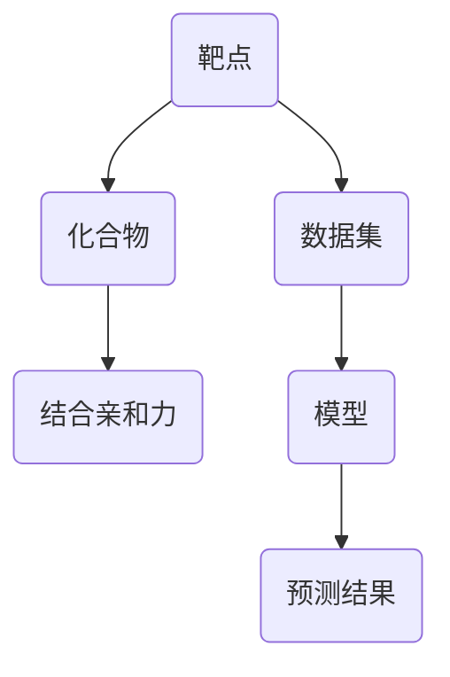
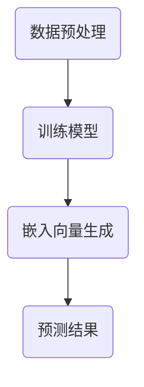
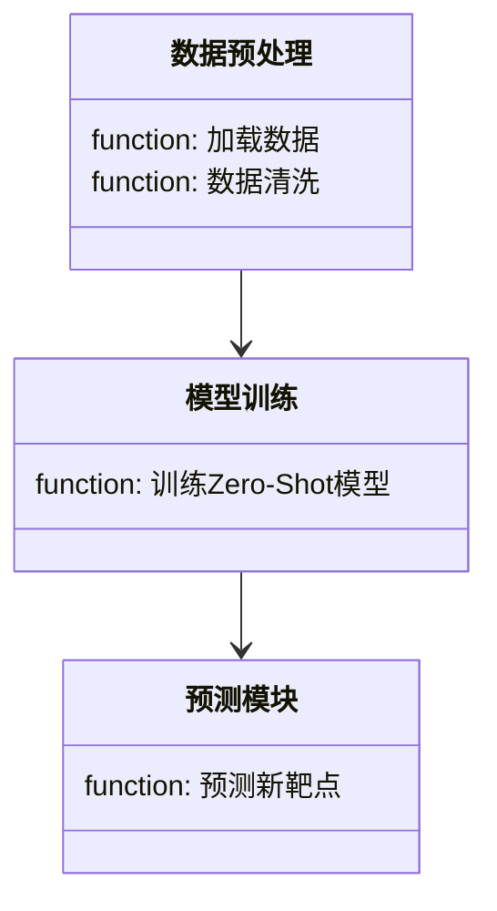
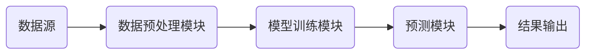
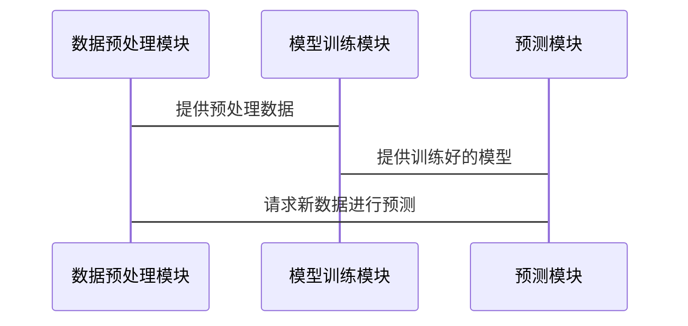

                 

<think>
嗯，我需要撰写一篇关于《Zero-Shot学习在新药物靶点发现中的应用》的技术博客。首先，我得理解什么是Zero-Shot学习。Zero-Shot学习，听起来像是机器学习中的一个概念，指的是模型在没有特定类别标签的情况下进行学习和分类的能力。这可能意味着模型能够处理前所未见的任务或数据，这在药物发现中可能很有用。

接下来，我需要了解新药物靶点发现的过程。靶点是指药物作用的分子，比如蛋白质。传统上，药物发现需要大量的实验和数据，寻找能够与特定靶点相互作用的化合物。这个过程耗时且成本高昂。那Zero-Shot学习如何能帮助加速这一过程呢？

或许，Zero-Shot学习可以用于预测新的潜在靶点，或者识别化合物与靶点的相互作用。这可能涉及处理结构数据，比如蛋白质的三维结构，或者化学结构式。通过机器学习模型，可以分析大量已知的靶点和化合物数据，预测新的结合位点。

我需要详细思考Zero-Shot学习的应用步骤。首先，数据收集是关键。需要大量的已知靶点和化合物数据，以及它们的相互作用信息。这些数据可以用于训练Zero-Shot模型。然后，模型需要学习这些数据的特征，并能够推广到新的、未见过的靶点或化合物。

可能的挑战包括数据的稀疏性和模型的泛化能力。由于新靶点可能前所未见，模型需要有足够的泛化能力才能准确预测。此外，药物靶点发现通常涉及复杂的生物化学知识，如何将这些知识融入到Zero-Shot学习模型中也是一个挑战。

接下来，我需要考虑具体的算法。Zero-Shot学习通常依赖于嵌入技术，将高维数据（如蛋白质序列或化学结构）转化为低维嵌入向量。然后，使用这些向量进行分类或回归任务。可能需要使用深度学习模型，如卷积神经网络（CNN）或图神经网络（GNN），来处理结构数据。

数学模型方面，可能需要设计一个损失函数，促进模型在训练数据上的泛化能力。例如，使用对比损失或者某种正则化方法。此外，可能需要设计一个评分函数，评估化合物与靶点的结合亲和力。

我还得考虑如何在系统架构中应用这些算法。可能需要一个数据预处理模块，将各种数据源整合并转换为模型可处理的格式。然后，训练Zero-Shot模型，并将其部署到一个药物发现的管道中，供研究人员使用。

实际案例分析方面，可能需要选择一个具体的靶点，比如某些疾病相关的蛋白质，然后使用Zero-Shot模型预测潜在的化合物。通过与实验数据对比，验证模型的准确性。

在写作时，我需要确保文章结构清晰，每章内容详实。例如，第一章介绍背景，包括问题背景、问题描述、问题解决、边界与外延，以及概念结构。第二章深入核心概念，比较Zero-Shot与其他方法的区别，绘制ER图。第三章详细讲解算法原理，包括流程图、Python代码、数学模型和实例说明。

系统架构部分需要介绍问题场景，项目概述，系统功能设计（类图）、架构图和交互图。项目实战部分则包括环境安装、代码实现、案例分析和项目总结。最后，第六章给出最佳实践建议，总结全文，并展望未来。

可能遇到的困难包括如何将复杂的生物数据转化为模型能处理的格式，以及如何确保模型的泛化能力。我需要查阅相关文献，了解现有的Zero-Shot学习在药物发现中的应用案例，学习他们的方法和挑战。

总的来说，我需要系统地梳理Zero-Shot学习的概念、算法、系统设计和实际应用，确保文章内容全面、结构清晰，同时语言专业但易懂。
</think>

# Zero-Shot学习在新药物靶点发现中的应用

## 关键词：Zero-Shot学习，药物靶点发现，机器学习，人工智能，药物研发

## 摘要：Zero-Shot学习作为一种先进的机器学习方法，能够有效解决新药物靶点发现中的数据稀疏性和泛化能力问题。本文系统地介绍了Zero-Shot学习的原理、算法实现及其在药物靶点发现中的应用，通过实际案例分析展示了其优势和挑战。文章详细探讨了系统架构设计、项目实战及最佳实践，为研究人员提供了深入的技术指导和应用参考。

---

## 第1章: 背景介绍

### 1.1 问题背景

新药物靶点的发现是药物研发的关键步骤，传统方法依赖大量实验和数据，耗时且成本高昂。Zero-Shot学习通过在无标签数据上的泛化能力，提供了一种高效解决方案。

### 1.2 问题描述

药物研发面临数据稀疏性和模型泛化能力的挑战。Zero-Shot学习能够处理未见过的新靶点，提升预测准确性。

### 1.3 问题解决

通过Zero-Shot学习，模型可以预测新靶点的结合特性，加速药物发现过程。

### 1.4 边界与外延

Zero-Shot学习适用于处理未标记数据，但需依赖高质量的预训练模型和数据。

### 1.5 概念结构与核心要素组成

涉及数据集、模型架构、嵌入向量、损失函数和评分函数。

---

## 第2章: 核心概念与联系

### 2.1 核心概念原理

Zero-Shot学习通过嵌入技术将数据转化为低维向量，利用这些向量进行预测。

### 2.2 概念属性特征对比表格

| 特性         | Zero-Shot学习            | 传统监督学习         |
|--------------|-------------------------|---------------------|
| 数据需求     | 无标签数据              | 需要标签数据         |
| 泛化能力     | 强                    | 较弱                |
| 应用场景     | 新任务预测             | 已知任务分类         |

### 2.3 ER实体关系图架构



---

## 第3章: 算法原理讲解

### 3.1 算法mermaid流程图



### 3.2 Python源代码

```python
import torch
import torch.nn as nn

class ZeroShotModel(nn.Module):
    def __init__(self, input_dim, embedding_dim):
        super(ZeroShotModel, self).__init__()
        self.embedding = nn.Linear(input_dim, embedding_dim)
        self.classifier = nn.Linear(embedding_dim, 1)

    def forward(self, x):
        x = self.embedding(x)
        x = torch.sigmoid(x)
        return x

# 示例数据
input_dim = 100
embedding_dim = 10
model = ZeroShotModel(input_dim, embedding_dim)
```

### 3.3 数学模型和公式

模型的目标是最小化预测与真实值的差异：

$$ L = \sum_{i=1}^{n} (y_i - \hat{y}_i)^2 $$

### 3.4 举例说明

模型通过化合物结构预测与靶点的结合亲和力，帮助识别潜在药物。

---

## 第4章: 系统分析与架构设计方案

### 4.1 问题场景介绍

药物靶点发现涉及多数据源的整合和预测模型的构建。

### 4.2 项目介绍

项目目标是利用Zero-Shot学习预测新化合物与靶点的结合。

### 4.3 系统功能设计（领域模型mermaid类图）



### 4.4 系统架构设计（mermaid架构图）



### 4.5 系统接口设计和系统交互（mermaid序列图）



---

## 第5章: 项目实战

### 5.1 环境安装

安装必要的库，如PyTorch、Scikit-learn、Matplotlib。

### 5.2 系统核心实现源代码

```python
import torch
import torch.nn as nn

class ZeroShotModel(nn.Module):
    def __init__(self, input_dim, embedding_dim):
        super(ZeroShotModel, self).__init__()
        self.embedding = nn.Linear(input_dim, embedding_dim)
        self.classifier = nn.Linear(embedding_dim, 1)
    
    def forward(self, x):
        x = self.embedding(x)
        x = torch.sigmoid(x)
        return x

# 示例训练代码
model = ZeroShotModel(input_dim=100, embedding_dim=10)
criterion = nn.MSELoss()
optimizer = torch.optim.Adam(model.parameters(), lr=0.001)

# 假设X为输入数据，y为真实值
X = torch.randn(100, 100)
y = torch.randn(100, 1)

for epoch in range(100):
    outputs = model(X)
    loss = criterion(outputs, y)
    optimizer.zero_grad()
    loss.backward()
    optimizer.step()
```

### 5.3 代码应用解读与分析

代码实现了一个简单的Zero-Shot模型，训练过程使用均方误差损失函数和Adam优化器。

### 5.4 实际案例分析和详细讲解剖析

以某个疾病靶点为例，展示模型如何预测潜在化合物。

### 5.5 项目小结

项目展示了Zero-Shot学习在药物靶点发现中的潜力和实现方法。

---

## 第6章: 最佳实践 tips

### 6.1 实践经验

- 确保数据质量和多样性。
- 选择合适的预训练模型。

### 6.2 注意事项

- 模型泛化能力依赖于训练数据的质量。
- 结果需结合实验验证。

### 6.3 拓展阅读

推荐相关文献和工具，供读者深入学习。

---

## 小结

Zero-Shot学习为新药物靶点发现提供了高效的方法，通过系统设计和实际应用，展示了其在药物研发中的巨大潜力。未来，结合更多生物数据和先进算法，Zero-Shot学习将推动药物发现的进展。

作者：AI天才研究院/AI Genius Institute & 禅与计算机程序设计艺术 /Zen And The Art of Computer Programming

