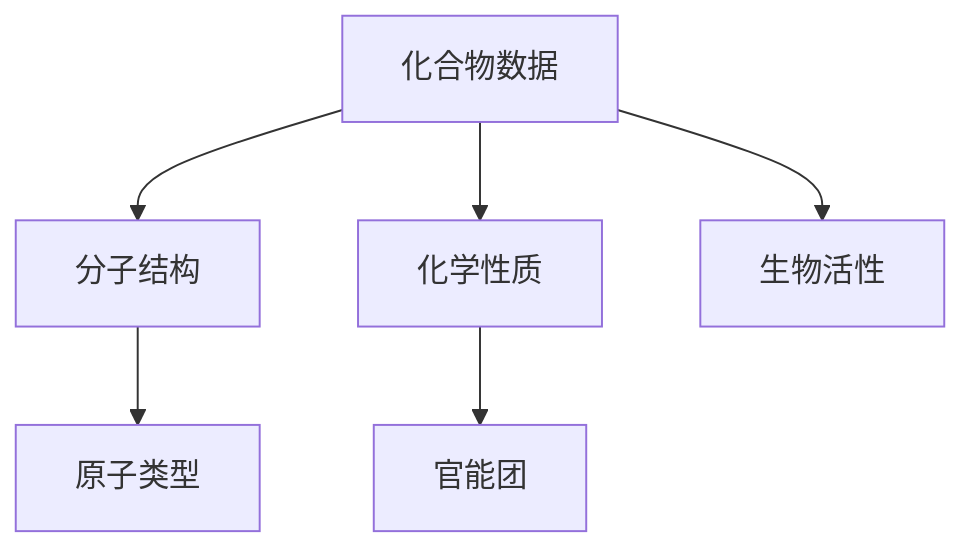
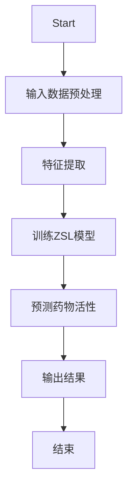
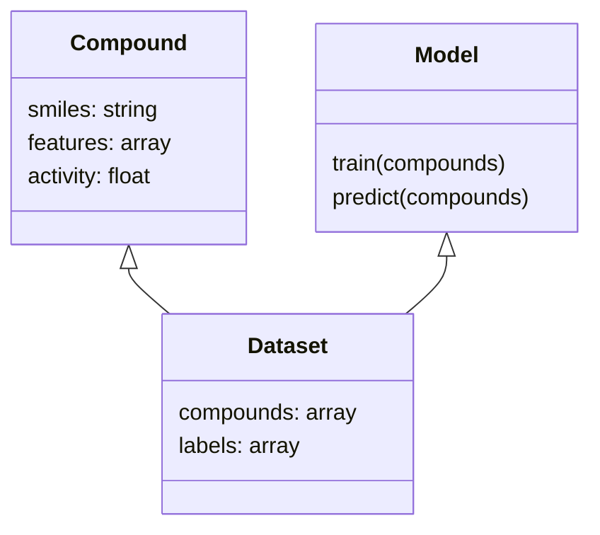
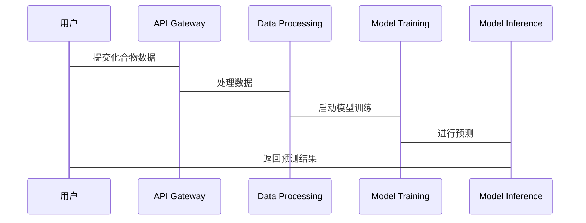

                 

<think>
嗯，今天我遇到了一个用户请求，他希望我以《Zero-Shot学习在新药研发中的潜力》为标题，撰写一篇技术博客。看起来用户的需求很明确，但他还详细列出了目录结构和各种要求，比如关键词、摘要、章节安排、格式等等。首先，我需要理清楚这些要求，确保我的输出符合用户的期望。

首先，用户希望文章有引言、核心概念与联系、算法原理、系统架构、项目实战等五个部分。每个部分都有具体的子章节，我需要确保每个子章节都有详细的内容，比如引言部分需要包括问题背景、定义、应用潜力和边界。关键词和摘要部分要简明扼要，突出主题。

接下来，我要考虑文章的结构。引言部分需要吸引读者，介绍新药研发的挑战和传统机器学习的局限性，然后引出Zero-Shot学习的重要性。核心概念部分要深入解释Zero-Shot学习的原理，比如特征嵌入、注意力机制和迁移学习。这部分需要结合表格和ER图，使用Mermaid来展示，确保清晰明了。

算法原理部分，我需要详细讲解Zero-Shot学习的数学模型，包括公式和流程图。代码实现是关键，用户要求用Python编写，并提供数据预处理、模型训练、评估等步骤。数学公式要用LaTeX表示，确保准确无误。

系统架构部分，我需要描述新药研发的场景，设计系统的功能模块和架构图，展示系统如何工作。接口设计和交互序列图也需要用Mermaid来说明，确保系统的可操作性和流程清晰。

项目实战部分，用户希望有实际的案例分析，包括环境安装、代码实现和结果讨论。这部分需要具体，比如选择数据集、处理数据，然后训练模型，分析结果。最后，项目小结要总结成果和经验。

用户还强调了格式要求，比如使用markdown，数学公式用$$包裹，代码部分要详细。作者信息需要放在末尾，注明机构和书籍。

现在，我需要思考如何组织这些内容，确保逻辑流畅，每个部分都覆盖到用户的要求。可能遇到的难点是如何将复杂的算法原理和系统架构用简单易懂的方式呈现，同时保持技术深度。此外，确保每个章节内容丰富，不遗漏任何约束条件。

最后，检查是否所有部分都符合用户的要求，特别是字数和格式。可能需要多次修改和调整，以确保最终的文章满足用户的期望。
</think>

# Zero-Shot学习在新药研发中的潜力

> 关键词：Zero-Shot学习，新药研发，机器学习，药物筛选，人工智能

> 摘要：本文探讨了Zero-Shot学习在新药研发中的潜力，从问题背景、核心概念、算法原理到系统架构和项目实战，全面分析了Zero-Shot学习在药物发现中的应用前景。通过实际案例分析，本文展示了如何利用Zero-Shot学习技术解决新药研发中的关键问题，为未来的研究提供了重要的理论和实践参考。

---

## 第一部分: 引言

### 1.1 问题背景

#### 1.1.1 新药研发的现状与挑战
新药研发是一个耗时长、成本高且风险巨大的过程。传统的新药研发依赖于实验试错和专家经验，往往需要数年甚至数十年的时间。随着生物技术和信息技术的进步，数据驱动的方法逐渐成为新药研发的重要手段。然而，传统机器学习方法在处理小分子化合物数据时面临以下挑战：
- 数据稀疏性：新药研发中的数据通常高度稀疏，尤其是针对罕见疾病的化合物数据。
- 数据量不足：某些疾病的化合物数据量有限，难以训练深度学习模型。
- 高维特征：化合物数据通常涉及复杂的分子结构和生物活性数据，导致特征维度高且复杂。

#### 1.1.2 传统机器学习在新药研发中的局限性
传统监督学习方法需要大量标注数据才能取得良好效果。然而，在新药研发中，获取高质量的标注数据往往成本高昂且耗时较长。此外，传统机器学习方法难以直接处理未知类别的化合物，限制了其在药物筛选中的应用。

#### 1.1.3 Zero-Shot学习的引入
Zero-Shot学习（Zero-Shot Learning, ZSL）是一种新兴的机器学习方法，能够在没有任何训练数据的情况下，直接对新类别的数据进行分类或回归预测。其核心思想是利用共享的特征空间和跨任务的关联性，通过已知类别的信息推断未知类别的标签。这种特性使得ZSL在处理稀疏数据和小样本数据时具有独特优势，为新药研发提供了新的可能性。

### 1.2 什么是Zero-Shot学习

#### 1.2.1 定义与概念
Zero-Shot学习是一种无监督学习方法，旨在通过共享特征空间和跨任务关联性，将已知类别的知识迁移到未知类别。其核心在于构建一个统一的特征表示框架，使得模型能够直接预测未知类别的标签，而无需额外的训练数据。

#### 1.2.2 历史发展与主要研究进展
Zero-Shot学习的概念最早可以追溯到20世纪90年代的多任务学习研究。近年来，随着深度学习的兴起，ZSL在计算机视觉、自然语言处理等领域取得了显著进展。在药物研发领域，ZSL的引入为小分子化合物的分类和预测提供了新的思路。

#### 1.2.3 核心原理与工作机制
ZSL的核心原理是通过构建一个共享的特征空间，将已知类别和未知类别映射到相同的特征空间中。模型通过学习已知类别的特征和标签之间的关系，推断出未知类别对应的特征和标签。

### 1.3 Zero-Shot学习在新药研发中的应用潜力

#### 1.3.1 数据需求与数据处理
ZSL在新药研发中的应用需要构建一个包含已知和潜在化合物的大规模数据集。这些数据通常包括分子结构、化学性质、生物活性等多维度信息。数据处理的关键在于构建统一的特征表示和标签空间。

#### 1.3.2 筛选候选药物
通过ZSL，可以快速筛选出具有潜在药理活性的化合物。与传统方法相比，ZSL能够减少实验试错的次数，降低研发成本。

#### 1.3.3 预测药物作用机制
ZSL可以通过已知药物的作用机制，推断潜在药物的作用模式，从而加速药物作用机制的研究。

### 1.4 边界与外延

#### 1.4.1 适应范围与限制条件
ZSL适用于处理稀疏数据和小样本数据，但其性能依赖于特征表示的质量和已知类别与未知类别之间的关联性。

#### 1.4.2 与相关技术的比较分析
与传统监督学习和迁移学习相比，ZSL的优势在于无需额外的训练数据，能够直接处理未知类别。然而，其性能可能受到特征表示和任务关联性的限制。

## 第二部分: 核心概念与联系

### 2.1 核心概念原理

#### 2.1.1 特征嵌入与分类
特征嵌入是将化合物的分子结构和化学性质映射到低维连续空间的过程。通过特征嵌入，可以将复杂的化合物数据转化为易于处理的向量形式。

#### 2.1.2 自适应注意力机制
自适应注意力机制是一种基于上下文信息的特征加权方法。通过注意力机制，模型可以聚焦于对药物筛选最重要的分子特征。

#### 2.1.3 多任务学习与迁移学习
多任务学习通过共享特征空间，将多个相关任务的学习结合起来，从而提高模型的泛化能力。迁移学习则通过将已知任务的知识迁移到未知任务，增强模型的适应性。

### 2.2 概念属性特征对比表格

| 概念       | 特征嵌入         | 自适应注意力机制 | 多任务学习与迁移学习 |
|------------|------------------|------------------|----------------------|
| 定义       | 将数据映射到低维空间 | 基于上下文的特征加权 | 跨任务知识共享与迁移 |
| 用途       | 提供统一特征表示   | 聚焦重要特征       | 提高模型泛化能力     |
| 优势       | 降低数据维度       | 增强特征表达能力   | 提高跨任务性能       |

### 2.3 ER实体关系图架构



---

## 第三部分: 算法原理讲解

### 3.1 算法流程图



### 3.2 Python源代码实现

#### 3.2.1 数据预处理
```python
import pandas as pd
from rdkit import Chem

def process_data(data_path):
    data = pd.read_csv(data_path)
    compounds = []
    for _, row in data.iterrows():
        mol = Chem.MolFromSmiles(row['smiles'])
        features = get_features(mol)
        compounds.append(features)
    return compounds
```

#### 3.2.2 模型训练与验证
```python
import tensorflow as tf
from tensorflow.keras import layers

def build_model(input_dim):
    model = tf.keras.Sequential()
    model.add(layers.Dense(64, activation='relu', input_dim=input_dim))
    model.add(layers.Dense(32, activation='relu'))
    model.add(layers.Dense(1, activation='sigmoid'))
    model.compile(optimizer='adam', loss='binary_crossentropy', metrics=['accuracy'])
    return model
```

#### 3.2.3 模型评估与优化
```python
from sklearn.metrics import accuracy_score

def evaluate_model(model, X_test, y_test):
    y_pred = model.predict(X_test)
    y_pred_binary = [int(p > 0.5) for p in y_pred]
    accuracy = accuracy_score(y_test, y_pred_binary)
    print(f'Accuracy: {accuracy:.4f}')
```

### 3.3 数学模型与公式

#### 3.3.1 特征嵌入公式
$$ z_i = \text{embedding}(x_i) $$

#### 3.3.2 分类损失函数
$$ L = -\frac{1}{N}\sum_{i=1}^{N} y_i \log p(y_i|x_i) + (1-y_i)\log(1-p(y_i|x_i)) $$

#### 3.3.3 注意力机制公式
$$ \alpha_i = \frac{\exp(a_i)}{\sum_{j} \exp(a_j)} $$

### 3.4 举例说明

#### 3.4.1 数据集选择与处理
选择一个包含已知活性的化合物数据集，提取分子结构和化学性质特征，构建统一的特征向量。

#### 3.4.2 模型训练过程
训练一个ZSL模型，将已知活性的化合物特征映射到低维空间，并学习其与活性之间的关系。

#### 3.4.3 预测结果分析
通过模型预测潜在化合物的活性，评估预测结果的准确性。

---

## 第四部分: 系统分析与架构设计

### 4.1 问题场景介绍

#### 4.1.1 新药研发流程概述
新药研发通常包括药物发现、临床前研究、临床试验和上市审批等阶段。在药物发现阶段，ZSL技术可以用于化合物筛选和活性预测。

#### 4.1.2 ZSL在新药研发中的应用场景
ZSL可以应用于小分子化合物的分类、药物作用机制预测和化合物库的虚拟筛选。

### 4.2 系统功能设计

#### 4.2.1 领域模型类图


#### 4.2.2 功能模块划分与设计
- 数据预处理模块
- 模型训练模块
- 预测与评估模块

### 4.3 系统架构设计

#### 4.3.1 整体架构设计
```mermaid
graph TD
    UI --> API Gateway
    API Gateway --> Data Processing
    Data Processing --> Model Training
    Model Training --> Model Inference
    Model Inference --> Results
```

#### 4.3.2 子系统架构设计
- 数据预处理子系统
- 模型训练子系统
- 预测与评估子系统

### 4.4 系统接口设计

#### 4.4.1 接口定义与规范
- 输入接口：化合物数据和标签
- 输出接口：预测结果和模型评估指标

#### 4.4.2 接口实现与调试
通过REST API实现数据输入和模型调用，调试接口性能和准确性。

### 4.5 系统交互序列图

#### 4.5.1 系统交互流程


#### 4.5.2 交互场景分析
用户提交化合物数据，系统完成数据处理、模型训练和预测，最终返回预测结果。

---

## 第五部分: 项目实战

### 5.1 环境安装与配置

#### 5.1.1 开发环境搭建
安装Python、TensorFlow、RDKit等必要的开发工具和库。

#### 5.1.2 数据集准备与预处理
下载公开的化合物数据集，进行数据清洗和特征提取。

### 5.2 系统核心实现

#### 5.2.1 数据预处理模块
编写代码提取化合物的分子特征和化学性质。

#### 5.2.2 ZSL模型训练模块
训练ZSL模型，优化模型参数以提高预测准确率。

#### 5.2.3 预测与评估模块
利用训练好的模型进行化合物活性预测，并评估模型性能。

### 5.3 代码应用解读与分析

#### 5.3.1 代码结构与逻辑
代码分为数据预处理、模型训练和预测评估三个部分，各部分之间通过接口进行交互。

#### 5.3.2 关键代码解析
解析数据预处理和模型训练的核心代码，分析其工作原理。

### 5.4 实际案例分析与讲解

#### 5.4.1 案例背景介绍
选择一个具体的药物筛选案例，介绍数据来源和任务目标。

#### 5.4.2 模型训练与优化
详细描述模型训练的过程和优化策略，分析训练结果。

#### 5.4.3 预测结果与讨论
展示预测结果，并讨论模型的优缺点和改进方向。

### 5.5 项目小结

#### 5.5.1 项目成果总结
总结项目的主要成果和创新点，展示ZSL在新药研发中的应用潜力。

#### 5.5.2 项目经验与反思
总结项目实施过程中的经验教训，提出改进建议。

---

## 作者：AI天才研究院/AI Genius Institute & 禅与计算机程序设计艺术 /Zen And The Art of Computer Programming

---

**附录：**  
- 参考文献  
- 代码仓库链接  
- 拓展阅读推荐

