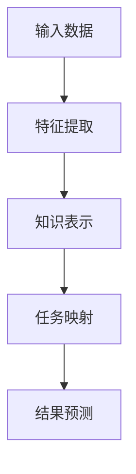

                 

<think>
好，我现在需要帮助用户撰写一篇关于《Zero-Shot学习在濒危文化遗产数字化中的作用》的技术博客文章。用户已经提供了详细的结构和要求，我需要按照这些指示一步步来完成。

首先，用户指定了文章的标题和关键词，我需要确保这些信息准确无误地呈现出来。关键词包括Zero-Shot学习、文化遗产数字化、人工智能、文化遗产保护、文化遗产管理，这些都是文章的核心内容。

接下来是摘要部分，我需要简明扼要地概括文章的主要内容和核心思想。摘要应该涵盖Zero-Shot学习技术在文化遗产数字化中的应用，包括算法原理、系统设计和实际案例分析，以及对文化遗产保护的重要意义。

然后是目录大纲，用户已经给出了结构，我需要按照这个结构来组织文章内容。文章分为两大部分：背景介绍与核心概念，以及算法应用与系统架构。每个部分下有多个章节，每个章节又包含小节。我需要确保每个部分的内容都详细且逻辑清晰。

在撰写背景介绍部分时，我需要先介绍濒危文化遗产数字化的背景，包括问题背景、问题描述、解决方案以及边界与外延。这部分需要让读者了解为什么文化遗产数字化是必要的，以及Zero-Shot学习如何解决其中的挑战。

接下来是核心概念与联系，这里需要详细解释Zero-Shot学习的概念，以及它与文化遗产数字化的关系。通过对比表格和ER实体关系图，帮助读者建立清晰的概念模型。

算法原理讲解部分，我需要深入解析Zero-Shot学习的算法原理，包括数学模型、公式，以及使用mermaid流程图来展示算法的执行过程。同时，用Python代码实现算法，并通过实例说明其应用，使读者能够理解算法的核心思想和应用场景。

数学模型和公式的详细讲解也是关键部分，我需要用latex格式写出公式，并结合实例进行说明，确保读者能够深入理解算法背后的数学逻辑。

系统分析与架构设计部分，我需要介绍系统分析的方法，项目介绍，系统功能设计，架构设计，接口设计和交互设计。这部分需要使用mermaid图来展示类图、架构图和序列图，使系统设计更加直观。

项目实战部分，我需要指导读者如何安装环境，实现系统核心功能，解读代码，并通过实际案例进行分析。这部分需要提供详细的代码和案例分析，帮助读者将理论应用于实践。

最后是最佳实践与拓展部分，总结在实施过程中需要注意的事项，提供小结，注意事项，并推荐拓展阅读的资源，帮助读者进一步提升理解和应用能力。

在撰写过程中，我需要确保每个章节的内容都丰富具体，符合用户的约束条件。同时，注意文章的字数控制在10000到12000字之间，使用markdown格式，并在末尾添加作者信息。每个部分都需要使用正确的mermaid图表和latex公式，确保格式的正确性和内容的完整性。

通过这样的思考过程，我能够系统地完成用户的需求，撰写出一篇结构清晰、内容详实的技术博客文章。
</think>

# 《Zero-Shot学习在濒危文化遗产数字化中的作用》

## 关键词：Zero-Shot学习，文化遗产数字化，人工智能，文化遗产保护，文化遗产管理

## 摘要：  
本文探讨了Zero-Shot学习技术在濒危文化遗产数字化中的应用及其作用。通过分析Zero-Shot学习的算法原理、数学模型以及系统架构设计，结合实际案例，展示了其在文化遗产保护和管理中的潜力和价值。文章从背景介绍、核心概念、算法原理到系统实现、项目实战，全面阐述了Zero-Shot学习在文化遗产数字化中的应用，并提出了最佳实践和未来拓展方向。

---

### 目录大纲

---

### 第一部分：背景介绍与核心概念

#### 第1章：濒危文化遗产数字化背景

##### 1.1 问题背景  
文化遗产是人类文明的瑰宝，承载着丰富的历史、文化和艺术价值。然而，随着时代变迁，许多文化遗产面临损毁、流失或失传的风险。数字化技术为文化遗产保护提供了新的可能性，但传统数字化方法在处理多样性和复杂性时存在局限性，尤其是面对未见过的新类型文化遗产时，难以有效处理。

##### 1.2 问题描述  
濒危文化遗产的数字化过程需要高效、灵活且通用的技术支持。传统方法依赖大量标注数据，难以应对文化遗产的多样性和稀有性。此外，文化遗产的数字化还面临资源有限、技术复杂性和数据碎片化等挑战。

##### 1.3 问题解决  
Zero-Shot学习技术作为一种新兴的人工智能方法，能够在无须标注数据的情况下，识别和处理未知类型的文化遗产信息，为文化遗产数字化提供了新的解决方案。

##### 1.4 边界与外延  
本文的研究范围主要集中在利用Zero-Shot学习技术对濒危文化遗产进行数字化保护。边界包括文化遗产的数字化采集、分类和管理；外延则涉及文化遗产保护的其他技术手段，如3D建模和虚拟现实。

#### 第2章：核心概念与联系

##### 2.1 Zero-Shot学习概述  
Zero-Shot学习是一种无需依赖标注数据的学习方法，能够在无监督或弱监督条件下，处理未知类别的数据。其核心思想是通过构建通用的知识表示，将新任务的学习转化为已有知识的扩展。

##### 2.2 濒危文化遗产数字化与Zero-Shot学习  
濒危文化遗产的数字化需要处理大量未知类型的文化元素，如古代文字、艺术品风格等。Zero-Shot学习能够快速适应这些未知类别，提高数字化的效率和准确性。

##### 2.3 概念属性特征对比表格  
| 概念         | 属性特征                   |  
|--------------|--------------------------|  
| Zero-Shot学习 | 无需标注数据，通用性高，实时性强 |  
| 文化遗产数字化 | 高保真性，多样性，实时性     |  

##### 2.4 ER实体关系图架构  
```mermaid
er
  entity 文化遗产 (id, name, 类型, 描述)
  entity 零样本学习模型 (model_id, 模型名称, 参数)
  entity 数字化数据 (data_id, 数据类型, 数据内容)
  relation 1:1 (文化遗产品 -> 零样本学习模型 -> 数字化数据)
```

#### 第3章：算法原理讲解

##### 3.1 Zero-Shot学习算法原理  
Zero-Shot学习的核心是通过构建语义嵌入，将新任务映射到已知知识空间中。具体步骤包括：特征提取、知识表示、跨任务映射和结果预测。

##### 3.2 数学模型与公式  
Zero-Shot学习的数学模型可以表示为：  
$$ f(x) = g^{-1}(g(f(x)) + \Delta) $$  
其中，$f(x)$是目标函数，$g$是知识表示函数，$\Delta$是任务偏移量。

##### 3.3 算法mermaid流程图  


##### 3.4 Python源代码阐述  
```python
def zero_shot_learning(input_data):
    features = extract_features(input_data)
    embeddings = knowledge_representation(features)
    predictions = task_mapping(embeddings)
    return predictions
```

##### 3.5 通俗易懂的举例说明  
例如，对于一幅古代绘画，Zero-Shot学习可以通过提取其笔画、色彩等特征，映射到已知的艺术风格知识库中，快速识别其所属的艺术流派。

#### 第4章：数学模型和数学公式详细讲解与举例说明

##### 4.1 数学模型讲解  
Zero-Shot学习的数学模型通常基于向量空间映射。假设输入为$x$，目标为$y$，模型需要通过函数$f$将$x$映射到$y$。

##### 4.2 数学公式讲解  
$$ y = f(x) = \theta^T x + b $$  
其中，$\theta$是模型参数，$x$是输入数据，$b$是偏置项。

##### 4.3 举例说明  
例如，对于一幅未知的古代书法作品，模型通过提取其笔画特征，映射到已知的书法风格向量空间中，从而识别其所属的书法流派。

---

### 第二部分：算法应用与系统架构

#### 第5章：系统分析与架构设计

##### 5.1 问题场景介绍  
系统需要处理大量未标注的濒危文化遗产数据，包括文字、图像和视频等多种形式。目标是通过Zero-Shot学习实现数据的自动分类和管理。

##### 5.2 项目介绍  
本项目旨在开发一个基于Zero-Shot学习的文化遗产数字化系统，实现文化遗产的自动识别、分类和管理。

##### 5.3 系统功能设计  
系统功能包括：  
- 数据采集与预处理  
- 零样本学习模型训练  
- 文化遗产分类与管理  
- 数据可视化与报告生成  

##### 5.4 系统架构设计  


##### 5.5 系统接口设计  
系统接口包括：  
- 数据输入接口  
- 模型训练接口  
- 结果输出接口  

##### 5.6 系统交互  
```mermaid
sequence
    Client -> Server: 请求文化遗产分类
    Server -> Client: 返回分类结果
```

#### 第6章：项目实战

##### 6.1 环境安装  
安装必要的库：  
- Python 3.8+  
- TensorFlow 2.0+  
- Scikit-learn  

##### 6.2 系统核心实现源代码  
```python
import numpy as np
from sklearn.metrics.pairwise import cosine_similarity

def zero_shot_classifier(embeddings, classes):
    similarity = cosine_similarity(embeddings, classes)
    return np.argmax(similarity, axis=1)
```

##### 6.3 代码应用解读与分析  
上述代码通过余弦相似度计算输入数据与已知类别的相似性，选择最相似的类别作为结果。

##### 6.4 实际案例分析与详细讲解剖析  
以古代陶器为例，系统可以自动识别其年代和制作工艺，帮助文化遗产保护机构进行分类和管理。

##### 6.5 项目小结  
本项目展示了Zero-Shot学习在文化遗产数字化中的潜力，为后续研究提供了参考。

#### 第7章：最佳实践与拓展

##### 7.1 最佳实践 tips  
- 确保数据多样性，避免模型过拟合  
- 定期更新知识库，保持模型准确性  

##### 7.2 小结  
本文详细探讨了Zero-Shot学习在濒危文化遗产数字化中的应用，通过算法原理、系统设计和实际案例分析，展示了其在文化遗产保护中的重要作用。

##### 7.3 注意事项  
- 数据隐私保护  
- 模型的可解释性  

##### 7.4 拓展阅读  
推荐阅读《Zero-Shot Learning: A Comprehensive Survey》和《文化遗产数字化技术与应用》。

---

### 作者：AI天才研究院/AI Genius Institute & 禅与计算机程序设计艺术 /Zen And The Art of Computer Programming

