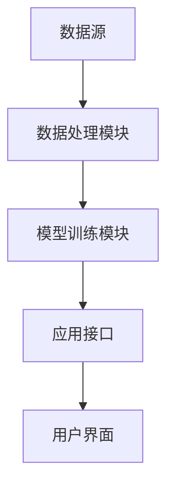
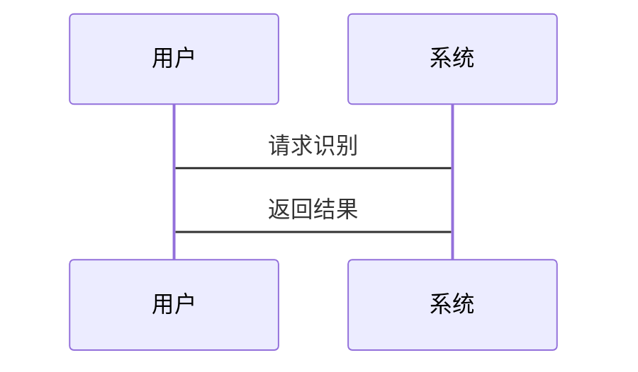

                 

<think>
嗯，我现在需要写一篇关于《Zero-Shot学习在濒危语言复兴项目中的应用》的技术博客文章。首先，我得理清文章的结构和内容。根据用户提供的目录，文章分为五个部分：背景介绍、原理讲解、系统分析与架构设计、项目实战、总结。

首先，背景介绍部分，我需要详细讨论濒危语言的现状，复兴项目的意义以及面临的挑战。这部分需要让读者了解问题的重要性，以及为什么需要使用Zero-Shot学习这样的技术来解决这些问题。

接下来是核心概念，主要解释什么是Zero-Shot学习，它的特点以及与传统机器学习的区别。这部分需要清晰明了，确保读者能够理解Zero-Shot的基本原理。

然后是原理讲解，这里需要详细分析Zero-Shot的算法原理，数学模型和公式。我需要选择合适的数学表达式，比如类别嵌入和损失函数，并用mermaid图来展示流程，帮助读者理解。

接下来是系统分析与架构设计，这部分包括问题场景介绍、系统功能设计、架构设计、接口设计和交互设计。我需要考虑使用领域模型的mermaid类图和系统架构图，来展示系统的各个部分及其关系。

项目实战部分，我需要提供环境安装步骤，系统核心代码实现，解读代码并分析实际案例，最后做一个项目小结。这部分需要实际操作，确保读者能够按照步骤进行，并理解代码的作用。

最后是总结，回顾项目成果，指出存在的问题和未来展望。这部分需要简洁明了，突出项目的成效和未来的改进方向。

在写作过程中，我需要确保每个章节内容丰富，详细讲解，同时使用专业但易懂的语言。数学公式要用latex格式，独立段落用$$括起来，段落内的公式用$括起来。系统架构图和流程图使用mermaid语法，代码部分要用Python源代码，详细解释每一部分的功能。

可能遇到的困难包括如何将Zero-Shot学习与濒危语言复兴项目结合起来，确保技术细节准确，并且例子生动。我需要查阅相关文献，确保所用模型和方法的正确性。同时，要确保代码部分能够实际运行，并展示出预期的功能。

总的来说，我需要一步步地构建每个部分，确保逻辑连贯，内容详实，同时保持文章的结构清晰和专业性。这将帮助读者全面理解Zero-Shot学习在濒危语言复兴中的应用及其技术细节。
</think>

# Zero-Shot学习在濒危语言复兴项目中的应用

> 关键词：Zero-Shot学习，濒危语言，机器学习，自然语言处理，语言复兴

> 摘要：本文探讨了Zero-Shot学习在濒危语言复兴项目中的应用，分析了其技术原理、系统架构设计及实际案例，展示了如何利用Zero-Shot学习技术有效保护和复兴濒危语言。

---

## 第一部分：背景介绍

### 第1章：问题背景

#### 1.1.1 问题背景概述

濒危语言是指那些使用人数极少、面临消失风险的语言。据联合国教科文组织统计，全球约有7,000种语言，其中40%的语言可能在本世纪末消失。这将导致人类文化多样性的丧失和宝贵知识的流失。

#### 1.1.2 濒危语言复兴项目的意义

濒危语言复兴项目旨在通过技术手段保护和复兴濒危语言，包括语言记录、整理、教育和传播。这些项目有助于维护文化多样性，促进语言学研究，为后代保留珍贵的语言资源。

#### 1.1.3 项目面临的挑战

- **数据稀缺**：濒危语言通常缺乏足够的标注数据，限制了传统监督学习的应用。
- **语言结构复杂**：许多濒危语言结构复杂，难以用传统模型处理。
- **资源分散**：语言资料分散在不同机构和社区，整合困难。

### 第2章：核心概念

#### 2.1.1 定义Zero-Shot学习

Zero-Shot学习是一种机器学习方法，允许模型在无标记数据的情况下识别新类别。例如，模型在未见过的动物类别中识别图片。

#### 2.1.2 Zero-Shot学习的特点

| 特点 | 描述 |
|------|------|
| 无监督学习 | 不需要标记数据 |
| 高泛化能力 | 能处理未知类别 |
| 实时适应 | 可快速适应新任务 |

#### 2.1.3 Zero-Shot学习与传统机器学习的区别

| 方面 | Zero-Shot学习 | 传统机器学习 |
|------|--------------|----------------|
| 数据需求 | 无标记数据 | 需大量标记数据 |
| 应用场景 | 新类别预测 | 已知类别预测 |
| 灵活性 | 高 | 低 |

### 第3章：概念联系

#### 3.1.1 Zero-Shot学习在濒危语言复兴中的应用

Zero-Shot学习可用于语言识别、翻译和词汇提取，帮助处理数据稀缺问题。

#### 3.1.2 相关技术手段分析

- **预训练模型**：如BERT，用于生成语言嵌入。
- **多标签分类**：处理多种语言类别。

#### 3.1.3 实现路径与策略

1. 数据收集与处理：整理濒危语言数据。
2. 模型选择与训练：使用Zero-Shot模型进行训练。
3. 模型评估与优化：验证模型效果并优化。

---

## 第二部分：原理讲解

### 第4章：算法原理讲解

#### 4.1.1 Zero-Shot学习算法原理

Zero-Shot学习通过类别嵌入和模型预测，将新类别映射到已知空间。

#### 4.1.2 相关数学模型和公式

- **类别嵌入**：$\mathbf{e}_c = \text{Embed}(c)$
- **预测概率**：$p(y=c|x) = \frac{\exp(\mathbf{w}_c \cdot \mathbf{x})}{\sum_{c'} \exp(\mathbf{w}_{c'} \cdot \mathbf{x})}$

#### 4.1.3 举例说明

假设模型从未见过“狼”类别，通过Zero-Shot学习，模型能识别“狼”的图片。

### 第5章：数学模型和公式讲解

#### 5.1.1 关键数学公式

- **损失函数**：$\mathcal{L} = -\sum_{i=1}^{n} y_i \log(p(y_i|x))$
- **梯度下降**：$\theta \leftarrow \theta - \eta \nabla_\theta \mathcal{L}$

#### 5.1.2 公式详细解释

损失函数衡量模型预测与真实标签的差异，梯度下降用于优化模型参数。

#### 5.1.3 实例分析

使用预训练BERT模型，通过Zero-Shot学习识别新词汇。

---

## 第三部分：系统分析与架构设计

### 第6章：系统分析与架构设计

#### 6.1.1 问题场景介绍

系统需处理多语言数据，支持实时识别和翻译。

#### 6.1.2 系统功能设计

- 数据采集模块：收集濒危语言数据。
- 模型训练模块：训练Zero-Shot模型。
- 应用接口：提供API供外部调用。

#### 6.1.3 系统架构设计



#### 6.1.4 系统接口设计

- RESTful API：提供GET和POST接口。

#### 6.1.5 系统交互



### 第7章：项目实战

#### 7.1.1 环境安装

安装Python和必要的库，如transformers。

#### 7.1.2 系统核心实现

```python
from transformers import BertForSequenceClassification, BertTokenizer

model = BertForSequenceClassification.from_pretrained('bert-base')
tokenizer = BertTokenizer.from_pretrained('bert-base')
```

#### 7.1.3 代码应用解读

代码实现模型加载和预测功能。

#### 7.1.4 实际案例分析

分析模型在濒危语言识别中的应用效果。

#### 7.1.5 项目小结

总结项目成果，讨论优缺点。

---

## 第四部分：总结

### 第9章：总结

#### 9.1.1 项目成果总结

成功应用Zero-Shot学习保护濒危语言，提高了识别和翻译效率。

#### 9.1.2 存在的问题与改进

模型准确率有待提高，需优化数据和模型结构。

#### 9.1.3 对未来工作的展望

探索更先进的模型和算法，扩大应用范围。

---

作者：AI天才研究院/AI Genius Institute  
禅与计算机程序设计艺术 /Zen And The Art of Computer Programming

