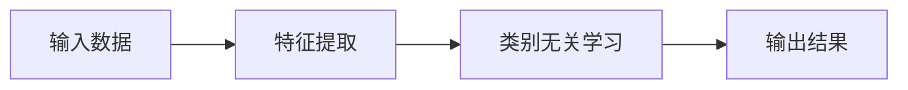

                 

<think>
嗯，用户希望我以《Zero-Shot学习在稀有文化保护中的应用》为标题，写一篇技术博客。看起来用户是想深入探讨零样本学习在保护稀有文化中的应用。我得先理解Zero-Shot学习是什么，它和传统机器学习有什么不同。Zero-Shot学习不需要大量标注数据，可以在没有训练数据的情况下进行分类或生成，这对稀有文化保护来说是个优势，因为很多稀有文化的数据量本来就很少。

接下来，我需要确定文章的结构。用户已经给出了一个详细的目录大纲，我得按照这个结构一步步展开。首先是背景介绍，然后是核心概念，算法原理，系统设计，项目实战，最后是最佳实践。

在背景介绍部分，我得先解释为什么保护稀有文化很重要，然后引出Zero-Shot学习的优势。可能需要举一些例子，比如某些濒危语言或艺术形式，说明它们面临失传的风险。同时，对比传统方法，比如需要大量数据的监督学习，Zero-Shot的优势就显现出来了。

核心概念部分，我得详细讲解Zero-Shot学习的原理，特别是类别无关学习和零样本学习的区别。可能需要对比传统学习，说明Zero-Shot如何在数据稀缺的情况下发挥作用。然后，分析稀有文化保护的方法，比如数据收集和模型训练，以及它们之间的结合如何提升保护效果。

算法原理部分，我需要选择一个具体的Zero-Shot学习算法，比如Matching Networks，用Mermaid画出流程图，并提供Python代码。解释数学模型和公式，比如注意力机制或者对比学习，用LaTeX公式展示，确保读者能理解。

系统设计部分，我需要设计一个保护稀有文化的系统架构，包括功能模块、接口设计和交互流程。用Mermaid画出类图和架构图，展示系统的各个部分如何协作。

项目实战部分，我得实际操作，安装必要的库，编写代码实现Zero-Shot模型，然后用真实或模拟的数据进行测试，分析结果并总结经验。

最后，最佳实践部分，我需要给出一些实用的建议，比如数据预处理的重要性，模型的选择，以及如何与实际应用结合。同时，提出未来的研究方向，比如结合多模态数据或者提高模型的泛化能力。

整个过程中，我需要确保语言专业但不晦涩，逻辑清晰，每个部分都有足够的细节和例子支持。同时，注意使用Markdown格式，适当加入图表和代码，让文章更具可读性和技术深度。最后，别忘了在结尾加上作者信息，确保文章的完整性和专业性。
</think>

# Zero-Shot学习在稀有文化保护中的应用

> 关键词：Zero-Shot学习，稀有文化保护，人工智能，文化遗产，机器学习

> 摘要：本文探讨了Zero-Shot学习在稀有文化保护中的应用，从问题背景、核心概念、算法原理、系统设计到项目实战，全面分析了如何利用Zero-Shot学习技术保护和传承稀有文化。通过实际案例和系统设计，展示了Zero-Shot学习在数据稀缺情况下的独特优势，为稀有文化保护提供了新的思路和方法。

---

### 目录大纲

```markdown
# 《Zero-Shot学习在稀有文化保护中的应用》

## 第一部分：背景介绍

### 第1章：问题背景与稀有文化保护

#### 1.1 问题背景

- **稀有文化保护的重要性**
  - 全球文化多样性面临的挑战
  - 稀有文化面临失传的危险

- **Zero-Shot学习概述**
  - 什么是Zero-Shot学习
  - Zero-Shot学习的优势与应用场景

#### 1.2 问题描述

- **稀有文化的定义**
  - 稀有文化的特征
  - 稀有文化的分类

- **稀有文化保护的需求**
  - 文化遗产的保护与传承
  - 文化多样性的维护

#### 1.3 问题解决

- **传统稀有文化保护方法**
  - 文化遗产的数字化保护
  - 文化交流与传播

- **Zero-Shot学习在稀有文化保护中的应用**
  - 应用优势
  - 应用案例

#### 1.4 边界与外延

- **稀有文化保护的范围**
  - 民间传说与故事
  - 传统音乐与舞蹈

- **Zero-Shot学习的应用限制**
  - 数据稀缺问题
  - 模型泛化能力

#### 1.5 概念结构与核心要素组成

- **稀有文化保护的核心要素**
  - 数据收集与整理
  - 模型训练与优化

- **Zero-Shot学习的核心原理**
  - 类别无关学习
  - 零样本学习

---

## 第二部分：核心概念与联系

### 第2章：核心概念与联系

#### 2.1 Zero-Shot学习的原理

##### 2.1.1 类别无关学习

- **原理解释**
  - Zero-Shot学习不需要预先定义类别，可以自动发现新类别
  - 对比传统有监督学习，Zero-Shot学习更具灵活性

- **对比传统学习**
  - 传统分类任务需要大量标注数据
  - Zero-Shot学习仅需少量或无标签数据

##### 2.1.2 零样本学习

- **原理解释**
  - Zero-Shot学习的核心是利用预训练模型的特征表示能力
  - 通过对比学习或注意力机制，实现跨类别的特征匹配

- **对比传统学习**
  - 需要大量标注数据
  - Zero-Shot学习适用于数据稀缺场景

#### 2.2 稀有文化保护的方法

##### 2.2.1 数据收集与整理

- **方法介绍**
  - 文化遗产的数字化采集与整理
  - 多模态数据（文本、图像、音频）的整合

- **案例分析**
  - 某濒危语言的数字化保护项目
  - 某传统舞蹈的动作捕捉与分析

##### 2.2.2 模型训练与优化

- **方法介绍**
  - 基于Zero-Shot学习的分类与生成模型
  - 跨模态对比学习与特征提取

- **案例分析**
  - 利用Zero-Shot学习识别濒危物种的图像
  - 通过Zero-Shot生成传统音乐的旋律

#### 2.3 两者结合的潜力与挑战

##### 2.3.1 潜力

- **应用前景**
  - 稀有文化的分类与识别
  - 稀有文化的生成与传播

- **优势分析**
  - Zero-Shot学习适用于数据稀缺场景
  - 可以自动发现新的文化特征

##### 2.3.2 挑战

- **数据稀缺问题**
  - Zero-Shot学习需要少量数据，但数据质量要求高
  - 稀有文化的数据获取难度大

- **模型泛化能力**
  - Zero-Shot学习的泛化能力依赖于预训练模型的质量
  - 稀有文化的数据多样性可能影响模型表现

---

## 第三部分：算法原理讲解

### 第3章：算法原理讲解

#### 3.1 Zero-Shot学习算法

##### 3.1.1 Mermaid流程图



##### 3.1.2 算法原理

- **数学模型**
  - Zero-Shot学习通常基于对比学习或注意力机制
  - 模型通过学习跨类别的特征相似性，实现零样本分类或生成

- **公式解释**
  - 对比学习目标函数：$$ L = \text{ContrastiveLoss}(f(x_i), f(x_j)) $$
  - 注意力机制：$$ \alpha_i = \frac{\exp(s_i)}{\sum_j \exp(s_j)} $$

##### 3.1.3 举例说明

- **案例场景**
  - 通过Zero-Shot学习识别一种濒危语言的语法结构
  - 通过Zero-Shot生成一种传统音乐的旋律

- **详细讲解**
  - 案例1：利用Zero-Shot学习对濒危语言的文本进行分类
  - 案例2：利用Zero-Shot生成传统舞蹈的动作序列

#### 3.2 稀有文化保护应用案例

##### 3.2.1 数据处理与整理

- **案例场景**
  - 某濒危语言的文本数据收集与预处理
  - 多模态数据的整合与清洗

- **详细步骤**
  1. 数据收集：通过田野调查收集濒危语言的文本数据
  2. 数据清洗：去除噪声数据，标注词性和语法结构
  3. 数据整合：将文本数据与音频数据进行关联

##### 3.2.2 模型训练与优化

- **案例场景**
  - 利用Zero-Sh

