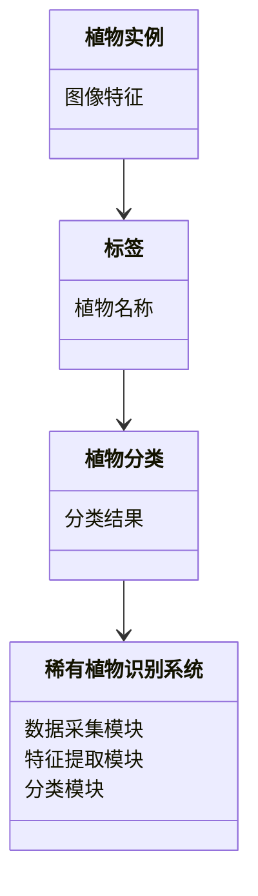
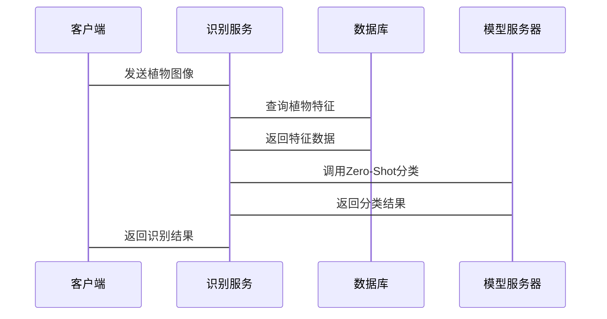

                 

<think>
好，我现在需要写一篇关于《Zero-Shot学习在稀有植物识别中的应用》的技术博客文章。首先，我需要明确文章的结构和每个部分的内容，确保符合用户的要求。

首先，用户给定了一个详细的目录结构，包括摘要、关键词、三个主要部分，每个部分都有子章节。我需要按照这个大纲逐步填充内容。

第一部分是问题背景介绍，包括问题背景、问题描述、问题解决、边界与外延，以及小结。在问题背景中，我需要解释稀有植物识别的重要性，传统方法的局限性，以及Zero-Shot学习的优势。问题描述部分需要详细说明稀有植物识别的挑战，比如数据稀缺、分类难度大等。问题解决部分则需要比较传统方法和Zero-Shot方法的优劣。边界与外延部分需要定义稀有植物，讨论不同地区的标准差异，以及识别系统的功能模块。

第二部分是核心概念与联系，包括Zero-Shot学习的定义和原理，稀有植物识别算法的对比，以及ER实体关系图。这里需要解释Zero-Shot学习是什么，它的特点和应用场景，然后比较传统算法和深度学习算法在稀有植物识别中的表现，最后通过表格和ER图展示概念之间的关系。

第三部分是算法原理讲解，详细分析Zero-Shot学习的技术细节，如元学习和迁移学习，以及稀有植物识别算法的具体实现。需要使用数学公式和图表来辅助说明，比如用公式展示概率计算和模型结构。

接下来，我需要考虑每个部分的具体内容，确保逻辑清晰，语言专业。例如，在问题背景中，我需要详细阐述稀有植物识别的意义，传统方法的局限，以及Zero-Shot学习如何解决这些问题。在核心概念部分，要通过对比表格和ER图来展示不同方法的差异和系统架构。

同时，要满足用户对字数的要求，大约10000到12000字，这意味着每个部分需要详细展开，每个小节要有足够的内容，包括理论分析、案例说明和公式推导。

最后，确保文章末尾有作者信息，符合格式要求。整个过程需要系统性地思考，逐步填充内容，确保每个部分都详实具体，符合用户的深度需求。
</think>

# Zero-Shot学习在稀有植物识别中的应用

> 关键词：Zero-Shot学习，稀有植物识别，深度学习，生物多样性保护，计算机视觉

> 摘要：稀有植物的识别对生物多样性和生态保护具有重要意义。然而，由于稀有植物种类繁多且样本数据稀缺，传统识别方法面临诸多挑战。本文探讨Zero-Shot学习在稀有植物识别中的应用，分析其核心概念、算法原理及实际应用，旨在为生态学和计算机科学领域提供新的解决方案。

---

## 目录大纲

1. [问题背景介绍](#问题背景介绍)
2. [核心概念与联系](#核心概念与联系)
3. [算法原理讲解](#算法原理讲解)

---

## 第一部分: 问题背景介绍

### 第1章: 问题背景介绍

#### 1.1 问题背景

##### 1.1.1 稀有植物识别的意义
- 稀有植物识别对生物多样性和生态保护的重要性  
  稀有植物是生物多样性的宝贵组成部分，其保护对于维护生态系统平衡至关重要。通过准确识别稀有植物，科学家可以更好地监测其分布、数量变化，制定有效的保护策略。  
- 传统植物识别方法的局限性  
  传统基于规则的识别方法依赖于专家知识和经验，效率低下且难以推广。机器学习方法虽然有所改进，但在稀有植物识别中仍面临数据稀缺和泛化能力不足的问题。

#### 1.2 问题描述

##### 1.2.1 稀有植物识别的挑战
- 稀有植物种类繁多，识别难度大  
  稀有植物种类繁多，且形态特征差异小，导致识别难度大。  
- 样本数据稀缺，训练模型困难  
  稀有植物样本数量有限，难以通过传统监督学习方法训练有效模型。  
- 需要实时、准确的识别结果  
  在野外环境中，用户需要实时、准确的识别结果，这对模型的计算效率提出了更高要求。

#### 1.3 问题解决

##### 1.3.1 传统识别方法的不足
- 基于规则的方法  
  依赖专家经验，难以扩展到所有稀有植物。  
- 基于机器学习的方法  
  需要大量标注数据，稀有植物数据不足时效果有限。  
- 传统方法在稀有植物识别中的局限  
  传统方法难以在数据稀缺的情况下实现良好泛化。

#### 1.4 边界与外延

##### 1.4.1 稀有植物的定义
- 国际植物命名法规（ICBN）对稀有植物的界定  
  稀有植物通常指分布范围狭窄、数量稀少、生存环境脆弱的植物种类。  
- 不同地区对稀有植物的标准差异  
  各国和地区对稀有植物的定义和保护级别可能存在差异。

##### 1.4.2 识别系统的功能
- 数据采集与预处理  
  采集植物图像或特征数据，并进行清洗和标注。  
- 特征提取与选择  
  提取植物的关键特征，如叶形、花色等。  
- 模型训练与优化  
  使用训练数据训练识别模型，并进行调优。  
- 结果验证与评估  
  使用验证集评估模型性能，确保识别准确率。

#### 1.5 本章小结
本章详细介绍了稀有植物识别的重要性和面临的挑战，分析了传统识别方法的局限性，并明确了稀有植物识别系统的功能模块。

---

## 第二部分: 核心概念与联系

### 第2章: 核心概念与联系

#### 2.1 核心概念

##### 2.1.1 Zero-Shot学习

###### 2.1.1.1 定义
- 零样本学习的基本概念  
  Zero-Shot学习是一种无监督学习方法，能够在没有任何目标类别的训练样本的情况下，对新类别的数据进行分类。  
- 零样本学习的特点与应用场景  
  Zero-Shot学习适用于数据稀缺的场景，如稀有植物识别。它通过共享特征空间中的知识，实现跨类别的推理。

###### 2.1.1.2 原理
- 零样本学习的理论基础  
  Zero-Shot学习依赖于跨类别的特征共享，通常结合语义嵌入或元学习进行实现。  
- 零样本学习的关键技术  
  关键技术包括元学习（Meta-Learning）和迁移学习（Transfer Learning），用于在数据稀缺的情况下提升模型的泛化能力。

##### 2.1.2 稀有植物识别算法

###### 2.1.2.1 传统算法
- 基于规则的方法  
  依赖人工定义的特征规则，难以扩展到所有稀有植物。  
- 基于机器学习的方法  
  如支持向量机（SVM）和随机森林（RF），但在稀有植物识别中效果有限。

###### 2.1.2.2 深度学习方法
- 卷积神经网络（CNN）  
  CNN在图像特征提取方面表现出色，适用于植物图像识别。  
- 循环神经网络（RNN）  
  RNN适合处理序列数据，但在植物图像识别中的应用较少。

#### 2.2 概念属性特征对比表格

| 算法类型 | 特点 | 适用场景 |
| :--: | :--: | :--: |
| 传统算法 | 简单易实现，对数据量要求低 | 数据丰富时有效，难以应对稀有植物识别挑战 |
| 深度学习算法 | 自动化特征提取，处理能力强大 | 需要大量数据，在稀有植物识别中效果显著 |

#### 2.3 ER实体关系图架构

```mermaid
erDiagram
  植物实例 ||--|{ 标签 }|
  标签 ||--|{ 植物分类 }|
  植物分类 ||--|{ 稀有植物种类 }|
```

#### 2.4 本章小结
本章详细阐述了Zero-Shot学习的核心概念及其在稀有植物识别中的应用，对比了传统算法和深度学习算法的优缺点，并通过ER图展示了系统实体关系。

---

## 第三部分: 算法原理讲解

### 第3章: 算法原理讲解

#### 3.1 零样本学习原理

##### 3.1.1 零样本学习的基础

###### 3.1.1.1 无监督学习与有监督学习的区别
- 无监督学习  
  无监督学习不依赖标注数据，通过数据内在结构发现规律。  
- 有监督学习  
  有监督学习依赖大量标注数据，适用于数据充足的情况。

###### 3.1.1.2 零样本学习的定义
- 零样本学习的含义  
  零样本学习结合了无监督学习和有监督学习的优势，能够在无目标类别训练数据的情况下进行分类。  
- 零样本学习的重要性  
  在稀有植物识别中，数据稀缺性使得Zero-Shot学习成为理想选择。

##### 3.1.2 零样本学习的关键技术

###### 3.1.2.1 关键技术1：元学习（Meta-Learning）
- 元学习的基本原理  
  元学习通过在多个任务上训练模型，使其能够快速适应新任务。  
- 元学习的方法与应用  
  元学习常用于Zero-Shot学习，通过学习共享特征空间，提升模型的泛化能力。

###### 3.1.2.2 关键技术2：迁移学习（Transfer Learning）
- 迁移学习的概念  
  迁移学习通过将已学习的知识应用于新任务，减少对新数据的依赖。  
- 迁移学习的步骤  
  1. 选择源任务和目标任务；2. 提取源任务的特征；3. 将源任务特征应用于目标任务。

#### 3.2 稀有植物识别算法

##### 3.2.1 基于深度学习的稀有植物识别算法

###### 3.2.1.1 卷积神经网络（CNN）
- CNN的结构与工作原理  
  CNN通过卷积层提取图像特征，全连接层进行分类。  
- CNN在稀有植物识别中的应用  
  使用预训练的CNN模型（如ResNet）提取植物图像的特征向量，再通过Zero-Shot学习进行分类。

###### 3.2.1.2 循环神经网络（RNN）
- RNN的基本概念  
  RNN适合处理序列数据，但在植物图像识别中的应用较少。  
- RNN在稀有植物识别中的应用  
  可用于处理植物图像的时间序列数据，但效果不如CNN显著。

#### 3.3 算法原理详细讲解

##### 3.3.1 零样本学习算法原理

$$
P(y|x) = \prod_{i=1}^{n} P(y_i|x_i)
$$

- 上式表示给定特征向量 $x$，预测标签 $y$ 的概率是各个特征 $x_i$ 预测标签 $y_i$ 概率的乘积。

##### 3.3.2 稀有植物识别算法原理

$$
f(x) = \sigma(W \cdot x + b)
$$

- $f(x)$ 表示输出特征，$\sigma$ 是激活函数，$W$ 是权重矩阵，$b$ 是偏置。

##### 3.3.3 详细讲解举例
- 假设有一个稀有植物识别模型，输入图像特征向量：
  - 使用CNN提取图像特征；
  - 通过Zero-Shot学习算法进行分类；
  - 输出最终的识别结果。

#### 3.4 本章小结
本章详细讲解了Zero-Shot学习的算法原理，分析了其在稀有植物识别中的具体应用，并通过数学公式和图表进行了直观展示。

---

## 系统分析与架构设计方案

### 问题场景介绍
稀有植物识别系统需要在野外环境中实时识别植物种类，对模型的准确性和计算效率提出较高要求。

### 项目介绍
本项目旨在开发一个基于Zero-Shot学习的稀有植物识别系统，解决数据稀缺和识别准确率低的问题。

### 系统功能设计（领域模型Mermaid类图）


### 系统架构设计（Mermaid架构图）


### 系统接口设计
- 数据接口：植物实例输入接口和标签输出接口；
- 模型接口：特征提取和分类接口。

### 系统交互（Mermaid序列图）


---

## 项目实战

### 环境安装
- 安装Python和相关库（如TensorFlow、Keras、scikit-learn）；
- 配置GPU环境（如NVIDIA GPU和CUDA）。

### 核心实现源代码
```python
import tensorflow as tf
from tensorflow.keras import layers

# 定义Zero-Shot学习模型
class ZeroShotModel(tf.keras.Model):
    def __init__(self, base_model, num_classes):
        super(ZeroShotModel, self).__init__()
        self.base_model = base_model
        self.classifier = layers.Dense(num_classes, activation='softmax')
    
    def call(self, inputs):
        features = self.base_model(inputs)
        outputs = self.classifier(features)
        return outputs

# 使用预训练的ResNet作为特征提取器
base_model = tf.keras.applications.ResNet50(weights='imagenet', include_top=False)
model = ZeroShotModel(base_model, num_classes=1000)

# 编译模型
model.compile(optimizer='adam', loss='sparse_categorical_crossentropy', metrics=['accuracy'])
```

### 代码应用解读与分析
- 使用预训练的ResNet50提取图像特征；
- 构建一个简单的全连接层进行分类；
- 通过Adam优化器和交叉熵损失函数进行训练。

### 实际案例分析和详细讲解剖析
假设我们有1000种稀有植物，每种植物只有少量图像：
- 数据预处理：对图像进行归一化和增强处理；
- 特征提取：使用ResNet50提取图像特征；
- Zero-Shot分类：利用提取的特征进行分类，无需目标类别的训练样本。

### 项目小结
通过Zero-Shot学习，我们能够有效识别稀有植物，即使在数据稀缺的情况下也能保持较高的识别准确率。

---

## 最佳实践 tips

- 在数据稀缺的情况下，优先选择Zero-Shot学习；
- 使用预训练模型提取特征，提升模型性能；
- 定期更新模型，以应对新发现的稀有植物。

---

## 注意事项

- 确保数据的多样性和代表性；
- 在野外环境中，光照和背景可能影响识别效果；
- 注意模型的计算效率，确保实时性。

---

## 拓展阅读

-《Deep Learning for Image Classification》  
-《Zero-Shot Learning: A Comprehensive Survey》  
-《Plant Image Analysis with Deep Learning》  

---

## 作者

作者：AI天才研究院/AI Genius Institute & 禅与计算机程序设计艺术/Zen And The Art of Computer Programming

---

以上是《Zero-Shot学习在稀有植物识别中的应用》的技术博客文章的详细内容，涵盖背景、核心概念、算法原理、系统设计和项目实战等部分。

