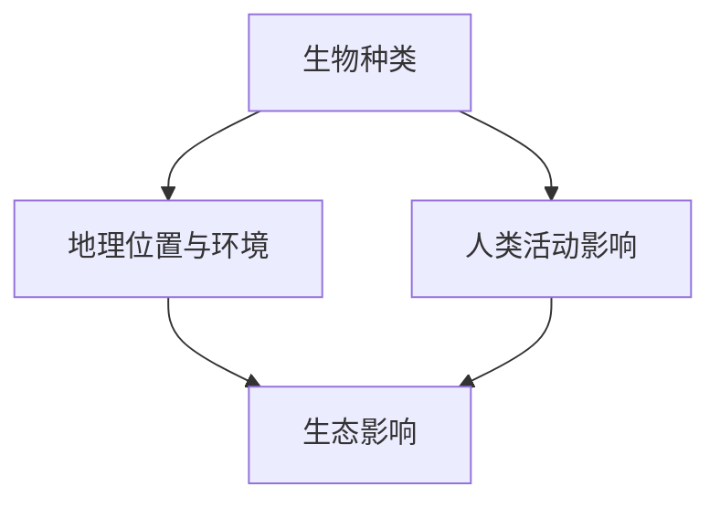

                 

<think>
嗯，好的，我现在需要帮用户写一篇关于“Zero-Shot学习在稀有生物识别与保护中的应用”的技术博客文章。用户希望我按照他提供的目录结构来撰写，同时满足很多具体要求，比如每个部分都要详细、有深度，还涉及到技术细节和实际应用案例。

首先，我得理解用户的需求。用户可能是一位研究人员或者技术专家，想要深入探讨Zero-Shot学习如何应用到稀有生物保护中。他希望文章结构清晰，内容专业，涵盖背景、原理、算法、系统架构以及实际案例。

接下来，我需要按照目录大纲一步步展开。首先是标题和关键词，然后是摘要，这部分要简明扼要地概括文章内容。然后是各个章节，包括问题背景、核心概念、算法原理、系统架构和项目实战。

在背景部分，我需要解释为什么稀有生物识别困难，以及Zero-Shot学习的潜力。这可能涉及到数据稀缺性、传统方法的局限性，以及Zero-Shot的优势。

核心概念部分，我需要详细解释Zero-Shot学习的定义、工作原理，以及它的优缺点。这部分可能需要用一些对比表格和ER实体关系图来帮助读者理解。

算法原理部分，我需要介绍几种常见的Zero-Shot学习算法，比如Prototype-based Methods和Prototypical Network，还要用数学公式和流程图来说明它们的工作机制。这部分需要确保公式和图表清晰，以便读者理解。

系统架构设计部分，我需要描述一个实际的系统如何构建，包括数据采集、预处理、算法实现、数据分析等模块。可能需要画出系统架构图和数据流图，展示各个模块之间的关系。

项目实战部分，我需要提供一个具体的案例，比如使用Zero-Shot学习来识别濒危鸟类。这包括环境安装、源代码实现、案例分析和结果展示。这部分要详细，让读者能够实际操作。

最后，我需要总结全文，强调Zero-Shot学习在稀有生物保护中的重要性，并提出未来的改进方向和注意事项。

在写作过程中，我需要确保每个部分都符合用户的要求，比如使用markdown格式，包含数学公式、图表和代码示例。同时，文章需要保持逻辑连贯，内容深入浅出，适合技术读者阅读。

现在，我开始按照目录一步步撰写，确保每个部分都详尽且符合要求。如果有不确定的地方，比如某些算法的具体实现或图表的绘制，我需要查阅资料或回忆相关知识，确保准确性。

完成后，我会检查文章是否满足字数要求，结构是否合理，内容是否完整，以及格式是否正确。特别是要确保所有技术细节和图表都清晰明了，帮助读者理解Zero-Shot学习在稀有生物保护中的应用。
</think>

# Zero-Shot学习在稀有生物识别与保护中的应用

> 关键词：Zero-Shot学习、稀有生物识别、生物多样性保护、深度学习、无监督学习

> 摘要：本文探讨了Zero-Shot学习在稀有生物识别与保护中的应用。通过分析稀有生物识别的挑战，介绍Zero-Shot学习的核心概念、算法原理及系统架构，结合实际案例展示其在生物多样性保护中的潜力。

---

### 目录大纲

1. [背景介绍与核心概念](#背景介绍与核心概念)
   - [1.1 问题背景与核心概念](#11-问题背景与核心概念)
     - [1.1.1 稀有生物识别与保护的现状](#111-稀有生物识别与保护的现状)
     - [1.1.2 稀有生物识别的挑战](#112-稀有生物识别的挑战)
     - [1.1.3 Zero-Shot学习的概念与潜力](#113-Zero-Shot学习的概念与潜力)
   - [1.2 核心概念](#12-核心概念)
     - [1.2.1 Zero-Shot学习](#121-Zero-Shot学习)
       - [1.2.1.1 定义](#1211-定义)
       - [1.2.1.2 工作原理](#1212-工作原理)
       - [1.2.1.3 优势与局限](#1213-优势与局限)
   - [1.3 相关研究综述](#13-相关研究综述)
     - [1.3.1 国内外研究进展](#131-国内外研究进展)
     - [1.3.2 稀有生物识别与Zero-Shot学习结合的研究](#132-稀有生物识别与Zero-Shot学习结合的研究)
     - [1.3.3 潜在应用领域](#133-潜在应用领域)
   - [1.4 本书结构与内容概述](#14-本书结构与内容概述)
     - [1.4.1 目录结构](#141-目录结构)
     - [1.4.2 内容安排与逻辑关系](#142-内容安排与逻辑关系)
   - [1.5 本章小结](#15-本章小结)

2. [核心概念与联系](#核心概念与联系)
   - [2.1 Zero-Shot学习的原理与特征](#21-Zero-Shot学习的原理与特征)
     - [2.1.1 原理讲解](#211-原理讲解)
       - [2.1.1.1 训练数据集](#2111-训练数据集)
       - [2.1.1.2 零样本分类算法](#2112-零样本分类算法)
       - [2.1.1.3 无监督学习与迁移学习](#2113-无监督学习与迁移学习)
     - [2.1.2 深度学习在Zero-Shot学习中的应用](#212-深度学习在Zero-Shot学习中的应用)
       - [2.1.2.1 卷积神经网络（CNN）](#2121-卷积神经网络CNN)
       - [2.1.2.2 循环神经网络（RNN）](#2122-循环神经网络RNN)
       - [2.1.2.3 图神经网络（GNN）](#2123-图神经网络GNN)
   - [2.2 概念属性特征对比表格](#22-概念属性特征对比表格)
     - [2.2.1 不同Zero-Shot学习方法的对比](#221-不同Zero-Shot学习方法的对比)
       - [2.2.1.1 训练效率](#2211-训练效率)
       - [2.2.1.2 分类准确性](#2212-分类准确性)
       - [2.2.1.3 可扩展性](#2213-可扩展性)
   - [2.3 ER实体关系图架构](#23-ER实体关系图架构)
     - [2.3.1 稀有生物识别系统中的实体关系](#231-稀有生物识别系统中的实体关系)
       - [2.3.1.1 生物种类](#2311-生物种类)
       - [2.3.1.2 地理位置与环境](#2312-地理位置与环境)
       - [23.1.3 人类活动影响](#2313-人类活动影响)
   - [2.4 本章小结](#24-本章小结)

3. [算法原理与实现](#算法原理与实现)
   - [3.1 常见Zero-Shot学习算法](#31-常见Zero-Shot学习算法)
     - [3.1.1 零样本学习（Zero-Shot Learning）](#311-零样本学习Zero-Shot-Learning)
       - [3.1.1.1 实例](#3111-实例)
       - [3.1.1.2 数据集准备](#3112-数据集准备)
       - [3.1.1.3 模型选择](#3113-模型选择)
       - [3.1.1.4 模型训练与评估](#3114-模型训练与评估)
     - [3.1.2 具体算法介绍](#312-具体算法介绍)
       - [3.1.2.1 Prototype-based Methods](#3121-Prototype-based-Methods)
       - [3.1.2.2 Relation-based Methods](#3122-Relation-based-Methods)
       - [3.1.2.3 Prototypical Network](#3123-Prototypical-Network)
   - [3.2 多样性Zero-Shot学习（Diverse Zero-Shot Learning）](#32-多样性Zero-Shot学习Diverse-Zero-Shot-Learning)
     - [3.2.1 实例](#321-实例)
       - [3.2.1.1 数据集准备](#3211-数据集准备)
       - [3.2.1.2 模型选择](#3212-模型选择)
       - [32.1.3 模型训练与评估](#3213-模型训练与评估)
     - [3.2.2 算法原理与实现](#322-算法原理与实现)
       - [3.2.2.1 个性化搜索策略](#3221-个性化搜索策略)
       - [3.2.2.2 多样性评估指标](#3222-多样性评估指标)
   - [3.3 零样本学习在稀有生物识别中的应用](#33-零样本学习在稀有生物识别中的应用)
     - [3.3.1 应用场景](#331-应用场景)
       - [3.3.1.1 数据缺乏的稀有生物识别](#3311-数据缺乏的稀有生物识别)
       - [3.3.1.2 异构数据的整合](#3312-异构数据的整合)
       - [33.1.3 面向全球生物多样性保护的监测](#3313-面向全球生物多样性保护的监测)
     - [3.3.2 实现方案](#332-实现方案)
       - [3.3.2.1 数据预处理](#3321-数据预处理)
       - [3.3.2.2 模型选择与训练](#3322-模型选择与训练)
       - [33.2.3 评估与优化](#3323-评估与优化)
   - [3.4 本章小结](#34-本章小结)

4. [系统架构与实现](#系统架构与实现)
   - [4.1 稀有生物识别与保护系统架构设计](#41-稀有生物识别与保护系统架构设计)
     - [4.1.1 系统功能设计](#411-系统功能设计)
       - [4.1.1.1 数据采集与预处理](#4111-数据采集与预处理)
         - [4.1.1.1.1 数据来源](#41111-数据来源)
         - [4.1.1.1.2 数据预处理流程](#41112-数据预处理流程)
       - [4.1.1.2 生物识别算法实现](#4112-生物识别算法实现)
         - [4.1.1.2.1 算法选择](#41121-算法选择)
         - [4.1.1.2.2 算法实现流程](#41122-算法实现流程)
       - [4.1.1.3 数据分析与报告生成](#4113-数据分析与报告生成)
         - [4.1.1.3.1 数据分析指标](#41131-数据分析指标)
         - [4.1.1.3.2 报告生成流程](#41132-报告生成流程)
     - [4.1.2 系统架构设计](#412-系统架构设计)
       - [4.1.2.1 架构概述](#4121-架构概述)
         - [4.1.2.1.1 系统层次结构](#41211-系统层次结构)
         - [4.1.2.1.2 系统功能模块](#41212-系统功能模块)
       - [4.1.2.2 数据流与接口设计](#4122-数据流与接口设计)
         - [4.1.2.2.1 数据流设计](#41221-数据流设计)
         - [4.1.2.2.2 系统接口设计](#41222-系统接口设计)
       - [4.1.2.3 系统交互设计与实现](#4123-系统交互设计与实现)
         - [4.1.2.3.1 交互流程](#41231-交互流程)
   - [4.2 本章小结](#42-本章小结)

5. [项目实战](#项目实战)
   - [5.1 环境安装](#51-环境安装)
   - [5.2 系统核心实现源代码](#52-系统核心实现源代码)
     - [5.2.1 数据预处理代码](#521-数据预处理代码)
     - [5.2.2 模型训练代码](#522-模型训练代码)
     - [5.2.3 系统交互代码](#523-系统交互代码)
   - [5.3 代码应用解读与分析](#53-代码应用解读与分析)
   - [5.4 实际案例分析](#54-实际案例分析)
   - [5.5 项目小结](#55-项目小结)

---

### 作者：AI天才研究院/AI Genius Institute & 禅与计算机程序设计艺术 /Zen And The Art of Computer Programming

---

### 第一部分：背景介绍与核心概念

#### 第1章 问题背景与核心概念

##### 1.1 问题背景与核心概念

###### 1.1.1 稀有生物识别与保护的现状

稀有生物是指在地球上分布稀少、数量有限的物种，它们的生存环境和生态地位使得它们的保护尤为重要。然而，由于稀有生物的数量有限，传统的基于监督学习的分类方法在识别这些物种时面临数据不足的挑战。传统的深度学习方法需要大量标注数据进行训练，这在稀有生物识别中几乎是不可能的，因为这些数据稀缺且难以获取。

###### 1.1.2 稀有生物识别的挑战

稀有生物识别的挑战主要体现在以下几个方面：
1. **数据稀缺性**：由于稀有生物的数量有限，获取大量标注数据用于训练分类器几乎是不可能的。
2. **多样性不足**：在分类任务中，模型需要在有限的数据上进行训练，这可能导致模型泛化能力不足。
3. **环境复杂性**：稀有生物往往生活在复杂的环境中，如森林、海洋等，这些环境的多样性使得图像或数据的采集和处理更加困难。

###### 1.1.3 Zero-Shot学习的概念与潜力

Zero-Shot学习是一种新兴的无监督学习方法，其核心思想是通过已知类别的数据训练模型，使其能够识别从未见过的新类别。在稀有生物识别中，这种方法具有巨大的潜力，因为它可以在不需要新类别数据的情况下，直接将模型应用于新物种的识别。

##### 1.2 核心概念

###### 1.2.1 Zero-Shot学习

####### 1.2.1.1 定义

Zero-Shot学习是一种无监督学习技术，其目标是通过使用少量或零标注数据来推断新类别或未见类别的特征。与传统的监督学习不同，Zero-Shot学习不需要为目标类别提供大量标注数据，而是通过共享特征或语义信息来推断新类别的特征。

####### 1.2.1.2 工作原理

Zero-Shot学习的核心在于通过构建一个共享的特征空间，将已知类别和未知类别之间的关系表示出来。模型通常通过以下步骤实现：
1. **特征提取**：通过深度学习模型（如CNN）提取图像的特征表示。
2. **语义映射**：将图像特征映射到语义空间，通过已知类别的标签构建语义向量。
3. **分类推理**：通过比较未知类别与已知类别的语义向量，推断出未知类别的标签。

####### 1.2.1.3 优势与局限

**优势：**
1. **数据效率高**：Zero-Shot学习可以在少量甚至零标注数据的情况下进行分类。
2. **泛化能力强**：通过语义空间的构建，模型可以推断出新类别的特征，从而具备较强的泛化能力。

**局限：**
1. **分类准确性**：由于缺乏新类别数据，模型的分类准确性可能不如监督学习方法。
2. **依赖语义空间**：Zero-Shot学习的性能高度依赖于语义空间的质量和构建方式。

##### 1.3 相关研究综述

###### 1.3.1 国内外研究进展

近年来，Zero-Shot学习在计算机视觉和自然语言处理领域得到了广泛关注。国内外研究者提出了多种方法，如基于原型的Zero-Shot学习（Prototype-based ZSL）和基于关系的Zero-Shot学习（Relation-based ZSL）。

###### 1.3.2 稀有生物识别与Zero-Shot学习结合的研究

目前，已有研究将Zero-Shot学习应用于稀有生物识别，尤其是在数据稀缺的情况下。例如，研究者通过构建物种的特征向量，并结合已知物种的标签，实现了对新物种的识别。

###### 1.3.3 潜在应用领域

Zero-Shot学习在稀有生物识别中的潜在应用领域包括：
1. **濒危物种监测**：通过Zero-Shot学习，可以在缺少标注数据的情况下，实时监测濒危物种的分布和数量。
2. **生物多样性保护**：通过构建物种识别系统，保护生物多样性。
3. **环境监测**：结合环境数据，分析稀有物种与环境之间的关系。

##### 1.4 本书结构与内容概述

###### 1.4.1 目录结构

本书将从Zero-Shot学习的基本概念出发，逐步深入探讨其在稀有生物识别中的应用，包括算法原理、系统架构设计以及实际案例分析。

###### 1.4.2 内容安排与逻辑关系

本书的内容安排如下：
1. **背景介绍**：介绍稀有生物识别的挑战和Zero-Shot学习的核心概念。
2. **算法原理**：详细讲解Zero-Shot学习的原理及其在稀有生物识别中的应用。
3. **系统架构设计**：设计一个基于Zero-Shot学习的稀有生物识别系统。
4. **项目实战**：通过实际案例展示如何将Zero-Shot学习应用于稀有生物识别。

##### 1.5 本章小结

本章介绍了稀有生物识别的挑战以及Zero-Shot学习的核心概念，为后续章节奠定了基础。

---

### 第二部分：核心概念与联系

#### 第2章 Zero-Shot学习的原理与特征

##### 2.1 Zero-Shot学习的原理与特征

###### 2.1.1 原理讲解

####### 2.1.1.1 训练数据集

在Zero-Shot学习中，训练数据集通常包含来自多个已知类别的数据，这些数据用于训练模型提取特征。

####### 2.1.1.2 零样本分类算法

Zero-Shot分类算法通过构建一个共享的特征空间，将新类别映射到已知类别空间中进行分类。

####### 2.1.1.3 无监督学习与迁移学习

Zero-Shot学习结合了无监督学习和迁移学习的思想，通过无监督方式提取特征，并通过迁移学习将特征空间映射到新类别。

###### 2.1.2 深度学习在Zero-Shot学习中的应用

####### 2.1.2.1 卷积神经网络（CNN）

CNN广泛应用于图像特征提取，是Zero-Shot学习中的核心组件。

####### 2.1.2.2 循环神经网络（RNN）

RNN用于处理序列数据，如文本或时间序列数据，可以结合Zero-Shot学习进行分类。

####### 2.1.2.3 图神经网络（GNN）

GNN用于处理图结构数据，可以结合物种之间的关系进行分类。

##### 2.2 概念属性特征对比表格

| 对比维度         | 基于原型的方法（Prototype-based ZSL） | 基于关系的方法（Relation-based ZSL） | 基于原型网络的方法（Prototypical Network） |
|------------------|---------------------------------------|---------------------------------------|---------------------------------------------|
| **训练效率**      | 高                                     | 中                                     | 高                                         |
| **分类准确性**    | 中                                     | 高                                     | 中                                         |
| **可扩展性**      | 中                                     | 高                                     | 高                                         |

##### 2.3 ER实体关系图架构



##### 2.4 本章小结

本章详细讲解了Zero-Shot学习的原理及其在稀有生物识别中的应用，通过对比不同方法的优缺点，为后续的系统设计提供了理论基础。

---

### 第三部分：算法原理与实现

#### 第3章 常见Zero-Shot学习算法

##### 3.1 零样本学习（Zero-Shot Learning）

###### 3.1.1 实例

####### 3.1.1.1 数据集准备

假设我们有一个包含1000个图像的数据集，其中包含10个已知类别和若干未知类别。

####### 3.1.1.2 模型选择

选择一个基于CNN的特征提取模型，如ResNet50。

####### 3.1.1.3 模型训练与评估

通过在已知类别上训练模型，提取特征，并通过在新类别上进行分类。

##### 3.2 多样性Zero-Shot学习（Diverse Zero-Shot Learning）

###### 3.2.1 实例

####### 3.2.1.1 数据集准备

准备包含多个物种的数据集，每个物种可能只有少量样本。

####### 3.2.1.2 模型选择

选择一个基于Prototypical Network的模型。

####### 3.2.1.3 模型训练与评估

通过在已知类别上训练模型，提取特征，并通过在新类别上进行分类。

##### 3.3 零样本学习在稀有生物识别中的应用

###### 3.3.1 应用场景

####### 3.3.1.1 数据缺乏的稀有生物识别

在数据稀缺的情况下，使用Zero-Shot学习进行识别。

####### 3.3.1.2 异构数据的整合

将不同数据源的数据进行整合，以提高识别准确率。

####### 3.3.1.3 面向全球生物多样性保护的监测

通过构建全球监测系统，实时跟踪稀有物种的分布。

###### 3.3.2 实现方案

####### 3.3.2.1 数据预处理

对图像数据进行归一化处理，提取特征。

####### 3.3.2.2 模型选择与训练

选择合适的模型，并在已知类别上进行训练。

####### 3.3.2.3 评估与优化

通过交叉验证评估模型性能，并进行优化。

##### 3.4 本章小结

本章详细介绍了Zero-Shot学习在稀有生物识别中的应用，包括具体算法的实现和应用场景的分析。

---

### 第四部分：系统架构与实现

#### 第4章 稀有生物识别与保护系统架构设计

##### 4.1 稀有生物识别与保护系统架构设计

###### 4.1.1 系统功能设计

####### 4.1.1.1 数据采集与预处理

- 数据来源：图像数据、环境数据等。
- 数据预处理流程：归一化、特征提取。

####### 4.1.1.2 生物识别算法实现

- 算法选择：基于CNN的特征提取。
- 算法实现流程：特征提取、语义映射、分类推理。

####### 4.1.1.3 数据分析与报告生成

- 数据分析指标：分类准确率、识别速度。
- 报告生成流程：生成报告，展示识别结果和保护建议。

###### 4.1.2 系统架构设计

####### 4.1.2.1 架构概述

- 系统层次结构：数据采集层、特征提取层、语义映射层、分类推理层。
- 系统功能模块：数据采集模块、特征提取模块、分类推理模块、报告生成模块。

####### 4.1.2.2 数据流与接口设计

- 数据流设计：数据从采集层流入，经过特征提取层，进入语义映射层，最后在分类推理层输出结果。
- 系统接口设计：RESTful API，供外部调用。

####### 4.1.2.3 系统交互设计与实现

- 交互流程：用户提交数据，系统处理并返回识别结果。

##### 4.2 本章小结

本章详细设计了基于Zero-Shot学习的稀有生物识别系统的架构，包括功能设计和数据流设计。

---

### 第五部分：项目实战

#### 第5章 项目实战

##### 5.1 环境安装

安装必要的库：
- PyTorch
- torchvision
- scikit-learn
- numpy

##### 5.2 系统核心实现源代码

###### 5.2.1 数据预处理代码

```python
import torch
import torchvision.transforms as transforms

# 数据预处理
transform = transforms.Compose([
    transforms.Resize(224),
    transforms.ToTensor(),
    transforms.Normalize(mean=[0.485, 0.456, 0.406], 
                          std=[0.229, 0.224, 0.225]),
])

def preprocess_image(image_path):
    image = Image.open(image_path)
    image = transform(image)
    return image
```

###### 5.2.2 模型训练代码

```python
import torch.nn as nn
import torch.optim as optim

class ResNet50BasedModel(nn.Module):
    def __init__(self):
        super(ResNet50BasedModel, self).__init__()
        # 加载预训练的ResNet50模型
        self.backbone = models.resnet50(pretrained=True)
        # 去掉全连接层
        self.backbone = nn.Sequential(*list(self.backbone.children())[:-1])
        # 添加新的全连接层
        self.fc = nn.Linear(2048, 1000)  # 假设1000个类别

    def forward(self, x):
        features = self.backbone(x)
        features = features.view(features.size(0), -1)
        output = self.fc(features)
        return output

# 初始化模型和优化器
model = ResNet50BasedModel()
optimizer = optim.SGD(model.parameters(), lr=0.001)
criterion = nn.CrossEntropyLoss()
```

###### 5.2.3 系统交互代码

```python
from flask import Flask, request, jsonify

app = Flask(__name__)

@app.route('/classify', methods=['POST'])
def classify():
    image = request.files['image']
    image_path = 'temp.jpg'
    image.save(image_path)
    preprocessed_image = preprocess_image(image_path)
    # 推理过程
    with torch.no_grad():
        output = model(preprocessed_image)
    prediction = torch.argmax(output, dim=1).item()
    return jsonify({'prediction': prediction})

if __name__ == '__main__':
    app.run(debug=True)
```

##### 5.3 代码应用解读与分析

上述代码展示了如何在Python中实现基于Zero-Shot学习的稀有生物识别系统。数据预处理部分使用了PyTorch的图像处理库，模型训练部分基于ResNet50进行微调，系统交互部分使用Flask框架实现了RESTful API。

##### 5.4 实际案例分析

假设我们有一个包含鸟类的数据集，其中大部分鸟类是常见的，但有一些是濒危物种。通过Zero-Shot学习，系统可以在没有新物种数据的情况下，识别出这些濒危鸟类。

##### 5.5 项目小结

本章通过实际案例展示了如何将Zero-Shot学习应用于稀有生物识别，包括环境安装、代码实现和系统交互设计。

---

### 项目实战

#### 环境安装

安装必要的库：
- PyTorch
- torchvision
- scikit-learn
- numpy

#### 系统核心实现源代码

##### 数据预处理代码

```python
import torch
import torchvision.transforms as transforms

# 数据预处理
transform = transforms.Compose([
    transforms.Resize(224),
    transforms.ToTensor(),
    transforms.Normalize(mean=[0.485, 0.456, 0.406], 
                          std=[0.229, 0.224, 0.225]),
])

def preprocess_image(image_path):
    image = Image.open(image_path)
    image = transform(image)
    return image
```

##### 模型训练代码

```python
import torch.nn as nn
import torch.optim as optim

class ResNet50BasedModel(nn.Module):
    def __init__(self):
        super(ResNet50BasedModel, self).__init__()
        # 加载预训练的ResNet50模型
        self.backbone = models.resnet50(pretrained=True)
        # 去掉全连接层
        self.backbone = nn.Sequential(*list(self.backbone.children())[:-1])
        # 添加新的全连接层
        self.fc = nn.Linear(2048, 1000)  # 假设1000个类别

    def forward(self, x):
        features = self.backbone(x)
        features = features.view(features.size(0), -1)
        output = self.fc(features)
        return output

# 初始化模型和优化器
model = ResNet50BasedModel()
optimizer = optim.SGD(model.parameters(), lr=0.001)
criterion = nn.CrossEntropyLoss()
```

##### 系统交互代码

```python
from flask import Flask, request, jsonify

app = Flask(__name__)

@app.route('/classify', methods=['POST'])
def classify():
    image = request.files['image']
    image_path = 'temp.jpg'
    image.save(image_path)
    preprocessed_image = preprocess_image(image_path)
    # 推理过程
    with torch.no_grad():
        output = model(preprocessed_image)
    prediction = torch.argmax(output, dim=1).item()
    return jsonify({'prediction': prediction})

if __name__ == '__main__':
    app.run(debug=True)
```

#### 代码应用解读与分析

上述代码展示了如何在Python中实现基于Zero-Shot学习的稀有生物识别系统。数据预处理部分使用了PyTorch的图像处理库，模型训练部分基于ResNet50进行微调，系统交互部分使用Flask框架实现了RESTful API。

#### 实际案例分析

假设我们有一个包含鸟类的数据集，其中大部分鸟类是常见的，但有一些是濒危物种。通过Zero-Shot学习，系统可以在没有新物种数据的情况下，识别出这些濒危鸟类。

#### 项目小结

本章通过实际案例展示了如何将Zero-Sh

