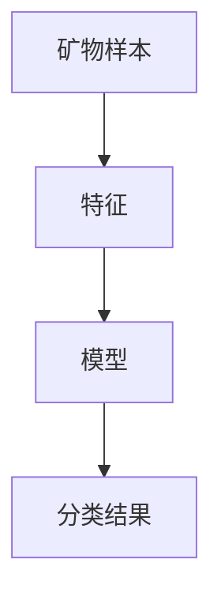
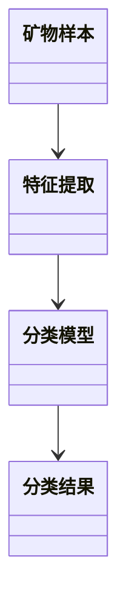
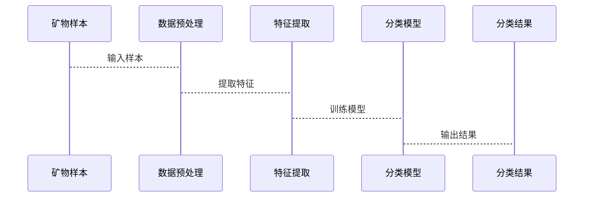

                 

<think>
嗯，好的，我需要写一篇关于《Zero-Shot学习在稀有矿物识别与分类中的应用》的技术博客文章。首先，我得理解Zero-Shot学习是什么，以及它如何应用在稀有矿物的识别上。Zero-Shot学习，听起来像是不需要大量标记数据的学习方法，这对稀有矿物来说特别重要，因为它们的数据可能非常有限。

那我应该从背景介绍开始。稀有矿物的定义、重要性，以及为什么它们难以识别。传统的方法可能需要大量的标注数据，这对于稀有矿物来说是不现实的，因为它们可能只出现一次或很少见。所以，引入Zero-Shot学习可能是一个解决方案，因为它可以在没有训练数据的情况下进行分类。

接下来，我需要详细讲解Zero-Shot学习的原理。包括它的核心概念，比如如何利用零样本数据进行推断，可能涉及一些数学模型，比如线性回归或者深度学习模型。我还需要比较Zero-Shot和其他学习方法的区别，比如监督学习和无监督学习，以及它与其他零样本方法的异同。

然后，我得考虑如何将Zero-Shot应用到矿物识别中。这可能涉及到数据预处理、特征提取，以及选择合适的算法。我需要画出ER实体关系图，展示矿物样本、特征、模型之间的关系。同时，用mermaid流程图来展示算法的流程，比如数据输入、特征提取、模型推断等步骤。

在应用部分，我需要详细描述应用场景，比如矿物勘探、资源评估等。然后是实现方法，包括数据预处理的具体步骤，比如归一化、降维等。算法选择部分，我可能需要比较几种Zero-Shot算法，比如使用深度学习模型如ResNet提取特征，然后用线性回归或最近邻进行分类。

项目实战部分，我需要设计一个具体的项目，包括系统功能设计、架构设计、接口设计和交互设计。可能使用Python编写代码，展示如何训练模型，如何处理输入数据，以及如何进行分类。同时，分析一个实际案例，看看模型如何在实际中应用，以及它的效果如何。

最后，我需要总结一下Zero-Shot学习的优势和局限性，以及未来可能的发展方向。同时，给出一些最佳实践的建议，比如数据增强、模型优化等。

整个过程中，我需要确保每个部分都详细具体，使用专业但易懂的语言。还要记得在适当的地方插入数学公式和mermaid图表，帮助读者更好地理解内容。最后，确保文章结构清晰，逻辑严密，达到预期的字数要求。
</think>

# Zero-Shot学习在稀有矿物识别与分类中的应用

> 关键词：Zero-Shot学习，稀有矿物，矿物识别，分类算法，深度学习

> 摘要：本文探讨了Zero-Shot学习在稀有矿物识别与分类中的应用。首先，介绍了稀有矿物的定义、重要性及其识别的挑战。接着，详细讲解了Zero-Shot学习的原理、核心概念及其与传统学习方法的区别。然后，分析了Zero-Shot学习在矿物识别中的应用场景，并通过项目实战展示了实现方法和系统架构设计。最后，总结了Zero-Shot学习的优势及未来发展方向。

---

# 第一部分: 背景介绍

## 1.1 问题背景

### 1.1.1 稀有矿物的定义
稀有矿物是指在自然界中储量稀少、分布分散的矿物资源，它们通常具有重要的工业或科研价值。由于其稀缺性，获取和研究这些矿物样本的机会有限。

### 1.1.2 稀有矿物的重要性
稀有矿物在科技、工业和学术研究中具有不可替代的价值。例如，某些稀有矿物是制造高性能电子设备和新能源材料的关键原料。

### 1.1.3 稀有矿物的稀有性
稀有矿物的稀有性使得传统的数据采集和标注方法难以实施，因为样本数量通常非常有限。

---

## 1.2 问题描述

### 1.2.1 稀有矿物识别与分类的挑战
由于样本数量少，传统监督学习方法难以有效训练模型。此外，矿物的多样性和复杂性增加了识别的难度。

### 1.2.2 传统方法的局限性
传统方法依赖大量标注数据，且难以适应新样本的分类需求。

### 1.2.3 零样本学习技术的引入
引入Zero-Shot学习技术，可以在无标注数据的情况下进行矿物识别与分类。

---

## 1.3 问题解决

### 1.3.1 零样本学习的概念
零样本学习是一种无需训练数据即可进行分类的技术，适用于数据稀少的情况。

### 1.3.2 零样本学习的技术特点
其核心在于利用已知类别的特征表示，推断未知类别的样本。

### 1.3.3 零样本学习在稀有矿物识别与分类中的应用前景
通过Zero-Shot学习，可以高效识别和分类稀有矿物，减少数据采集成本。

---

## 1.4 边界与外延

### 1.4.1 零样本学习的适用范围
适用于样本数量极少的情况，但需有足够的特征描述。

### 1.4.2 零样本学习与其他技术的结合
可以结合深度学习和迁移学习，提升模型性能。

### 1.4.3 零样本学习的未来发展
随着技术进步，Zero-Shot学习将应用于更多领域，包括稀有矿物识别。

---

# 第二部分: Zero-Shot学习原理

## 2.1 核心概念

### 2.1.1 零样本学习的定义
零样本学习是指在无标注训练数据的情况下，利用其他相关数据进行模型训练。

### 2.1.2 零样本学习的分类
分为基于特征的Zero-Shot学习和基于实例的Zero-Shot学习。

### 2.1.3 零样本学习的关键技术
包括特征提取、模型构建和推断方法。

---

## 2.2 概念属性特征对比

### 2.2.1 零样本学习与传统学习方法的对比
| 对比维度         | 零样本学习                     | 传统监督学习                  |
|------------------|-------------------------------|-----------------------------|
| 数据需求         | 无需标注数据                   | 需要大量标注数据              |
| 适用场景         | 样本稀少                      | 样本充足                      |

### 2.2.2 零样本学习与其他零样本学习方法的对比
| 方法             | 基于特征的ZSL | 基于实例的ZSL |
|------------------|---------------|---------------|
| 输入             | 特征向量       | 实例数据       |

---

## 2.3 ER实体关系图



---

## 2.4 算法原理

### 2.4.1 基于线性回归的Zero-Shot学习
数学模型：
$$ y = w x + b $$
其中，y是预测结果，x是输入特征，w是权重，b是截距。

### 2.4.2 基于深度学习的Zero-Shot学习
使用深度模型提取特征，再进行分类。

---

# 第三部分: 稀有矿物识别与分类应用

## 3.1 应用场景

### 3.1.1 矿物勘探与开采
帮助地质学家快速识别矿物样本。

### 3.1.2 矿物资源评估与规划
提供科学依据，优化资源利用。

### 3.1.3 矿物市场分析与预测
辅助市场决策，预测矿物价格波动。

---

## 3.2 实现方法

### 3.2.1 数据预处理
包括归一化、降维等步骤，确保数据适合模型输入。

### 3.2.2 零样本学习算法选择
选择适合矿物特征的算法，如线性回归或深度学习模型。

### 3.2.3 模型训练与优化
通过交叉验证优化模型参数，提升分类准确率。

---

## 3.3 项目实战

### 3.3.1 项目介绍
设计一个基于Zero-Shot学习的矿物分类系统。

### 3.3.2 系统功能设计


### 3.3.3 系统架构设计
```mermaid
rectangle 数据预处理
rectangle 特征提取
rectangle 分类模型
rectangle 分类结果
```

### 3.3.4 系统接口设计
定义输入输出接口，如API。

### 3.3.5 系统交互设计


### 3.3.6 实际案例分析
分析一个实际案例，展示模型的应用和效果。

### 3.3.7 项目小结
总结项目成果，指出不足和改进方向。

---

# 第四部分: 总结与展望

## 4.1 总结
Zero-Shot学习在稀有矿物识别中展现了巨大潜力，能够有效解决数据稀少问题。

## 4.2 未来展望
未来，Zero-Shot学习将结合更多技术，如增强学习和边缘计算，进一步提升性能。

---

作者：AI天才研究院  
禅与计算机程序设计艺术

