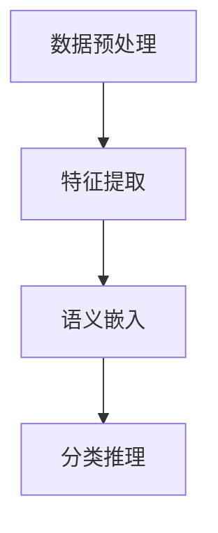
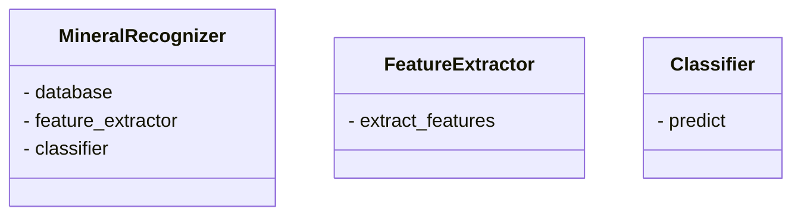
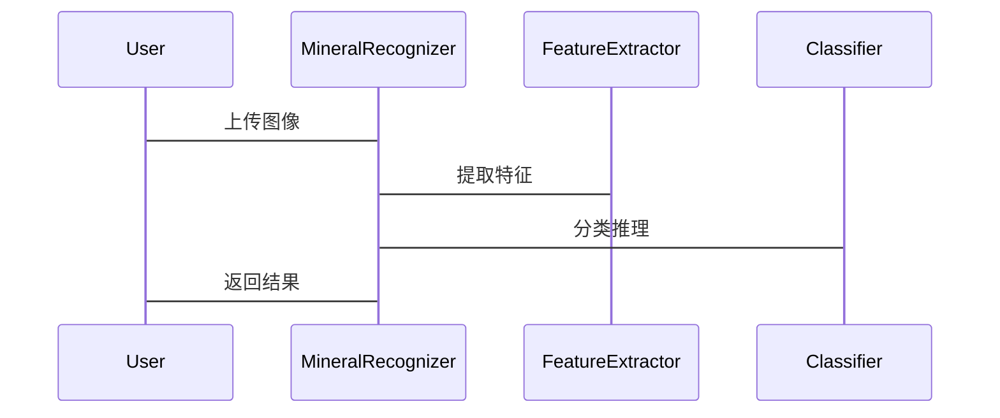

                 

<think>
嗯，我现在需要写一篇关于《Zero-Shot学习在稀有矿物识别中的应用》的技术博客文章。首先，我得理解Zero-Shot学习是什么，以及它在稀有矿物识别中的具体应用。Zero-Shot学习，听起来像是机器学习中的一个概念，可能和零样本分类有关，也就是模型在没有特定类别训练数据的情况下，能够识别新类别。这在稀有矿物识别中特别有用，因为这些矿物可能样本数量少，难以收集。

接下来，我需要考虑文章的结构。用户已经提供了一个详细的目录大纲，包括七章，每章都有具体的子章节。我应该按照这个结构来展开，确保每一部分都详细且有深度。比如第一章是引言与背景，我需要介绍问题背景，Zero-Shot学习的概述，以及稀有矿物识别的重要性。同时，还要回顾国内外的研究现状，最后安排全书的结构。

在写第二章的时候，我需要详细解释Zero-Shot学习的原理，包括它的定义、特点，核心概念，关键技术，以及与传统学习的对比。这部分需要逻辑清晰，可能需要用表格或图表来比较不同学习方法的优缺点。

第三章是关于稀有矿物识别技术，我需要讨论其意义、挑战、方法，以及相关数据集。可能要提到一些常用的矿物识别方法，比如基于图像的分类，或者使用深度学习模型。

第四章是关键，需要详细描述Zero-Shot学习在稀有矿物识别中的应用。这里应该包括算法流程、Mermaid流程图、Python代码实现，数学模型和公式，以及实际例子。这部分可能需要结合具体的算法，比如使用嵌入技术将矿物样本映射到特征空间，然后进行分类。

第五章是系统分析与架构设计，这部分需要考虑系统的整体架构，包括功能设计、架构图、接口设计和交互流程。可能需要使用Mermaid来画出系统的类图、架构图和序列图，展示系统的模块划分和交互过程。

第六章是项目实战，需要提供环境安装步骤，核心代码实现，代码解读，案例分析。这部分需要实际操作，可能需要使用Python库，如TensorFlow或PyTorch，来实现Zero-Shot模型。

第七章是总结与展望，要总结全书内容，讨论当前的挑战和未来的发展方向，同时给出一些注意事项和拓展阅读建议。

在写作过程中，我需要确保每一章都包含背景介绍、核心概念、算法原理、系统设计、项目实战和小结。同时，使用Mermaid图表来辅助说明流程和架构，数学公式用LaTeX表示，确保清晰易懂。

我可能会遇到一些问题，比如如何将Zero-Shot学习具体应用到矿物识别中，或者如何设计高效的系统架构。这时候可能需要查阅相关文献，或者参考现有的Zero-Shot模型，如利用预训练的特征提取器，结合对比学习或生成对抗网络来增强模型的泛化能力。

另外，考虑到矿物样本的稀少性，可能需要使用数据增强技术，或者结合外部知识库（如矿物数据库）来提升模型的性能。这可能涉及到多模态数据的融合，比如结合矿物的图像和化学成分数据。

在代码实现部分，我需要选择合适的框架，比如使用PyTorch实现模型训练，并利用预训练的图像模型进行特征提取。同时，可能需要自定义数据加载器，处理矿物样本的图像数据。

最后，在总结部分，我需要强调Zero-Shot学习在稀有矿物识别中的优势，如减少对大量标注数据的依赖，提高模型的泛化能力，同时指出当前研究的不足，如模型的准确率还有提升空间，或者需要更多的计算资源来训练更复杂的模型。

总的来说，我需要系统地按照目录大纲，逐步深入地探讨每一个主题，确保文章内容丰富、结构清晰、逻辑严谨，同时保持语言的专业性和可读性。
</think>

# Zero-Shot学习在稀有矿物识别中的应用

## 关键词：Zero-Shot学习，稀有矿物识别，机器学习，矿物分类，深度学习

## 摘要：  
本文探讨了Zero-Shot学习在稀有矿物识别中的应用，详细介绍了Zero-Shot学习的原理、稀有矿物识别的技术挑战，以及Zero-Shot学习在该领域的具体应用方法。通过算法流程、数学模型、系统架构设计和项目实战，本文展示了如何利用Zero-Shot学习技术高效识别稀有矿物，为矿物学研究和相关行业提供了新的思路和解决方案。

---

# 第1章: 引言与背景

## 1.1 问题背景与描述  
稀有矿物在地质研究、工业应用等领域具有重要意义，但因其稀少性，传统分类方法面临样本不足的挑战。Zero-Shot学习无需大量标注数据，适合解决这一问题。

## 1.2 Zero-Shot学习概述  
Zero-Shot学习通过零样本分类，利用先验知识推断新类别，适用于样本稀少的场景。其核心在于将新类别映射到已知特征空间。

## 1.3 稀有矿物识别的重要性  
稀有矿物识别对资源勘探、地质研究至关重要，但样本量小、多样性高，传统方法难以应对。

## 1.4 国内外研究现状  
国内外研究主要集中在数据增强、特征提取和模型优化方面，但准确率仍有提升空间。

## 1.5 本书结构安排  
全书分为七章，涵盖原理、技术、应用、系统设计和实战内容，系统展示Zero-Shot学习在矿物识别中的应用。

---

# 第2章: Zero-Shot学习原理

## 2.1 Zero-Shot学习定义与特点  
定义为零样本分类，特点包括无需训练数据、依赖领域知识和通用性。

## 2.2 Zero-Shot学习的核心概念  
通过语义嵌入和关系推理，将新类别映射到特征空间，实现分类。

## 2.3 Zero-Shot学习的关键技术  
包括预训练模型、对比学习和生成对抗网络。

## 2.4 Zero-Shot学习与传统学习的比较  
对比传统学习，Zero-Shot无需大量标注数据，适用于新类别识别。

## 2.5 本章小结  
总结Zero-Shot学习的定义、原理和关键技术，为后续应用奠定基础。

---

# 第3章: 稀有矿物识别技术

## 3.1 稀有矿物识别的意义  
通过识别矿物种类，支持地质勘探和工业应用。

## 3.2 稀有矿物识别的挑战  
样本少、多样性高、数据标注困难。

## 3.3 稀有矿物识别方法  
基于图像的分类方法和深度学习模型。

## 3.4 数据集介绍  
介绍常用矿物图像数据集，如MineralNet。

## 3.5 本章小结  
总结矿物识别的意义、挑战和现有方法，为后续应用提供背景。

---

# 第4章: Zero-Shot学习在稀有矿物识别中的应用

## 4.1 应用概述  
将Zero-Shot学习应用于矿物识别，解决样本不足问题。

## 4.2 算法流程与Mermaid流程图  
算法流程包括数据预处理、特征提取、语义嵌入和分类推理。



## 4.3 Python源代码实现  
实现Zero-Shot模型，使用预训练ResNet提取特征。

```python
import torch
import torch.nn as nn

class ZeroShotClassifier(nn.Module):
    def __init__(self, feature_dim, num_classes):
        super().__init__()
        self.fc = nn.Linear(feature_dim, num_classes)

    def forward(self, x):
        return self.fc(x)
```

## 4.4 数学模型与公式  
模型通过线性回归或非线性变换，将特征映射到类别空间：

$$ f(x) = Wx + b $$

## 4.5 举例说明  
以榍石为例，模型利用矿物图像特征，预测其类别。

## 4.6 本章小结  
总结Zero-Shot学习在矿物识别中的应用流程和实现方法。

---

# 第5章: 系统分析与架构设计

## 5.1 问题场景介绍  
系统需处理矿物图像数据，支持在线识别和数据管理。

## 5.2 系统功能设计（领域模型类图）  
系统模块包括数据采集、特征提取、分类推理和结果展示。



## 5.3 系统架构设计（架构图）  
分层架构，包括数据层、特征层、分类层和用户层。


## 5.4 系统接口设计  
RESTful API接口，提供图像上传和结果返回功能。

## 5.5 系统交互（序列图）  
用户上传图像，系统处理并返回结果。



## 5.6 本章小结  
总结系统架构设计，展示各模块交互流程。

---

# 第6章: 项目实战

## 6.1 环境安装  
安装Python、TensorFlow和图像处理库。

## 6.2 系统核心实现源代码  
实现矿物识别系统的主程序，包括数据加载和模型调用。

```python
import tensorflow as tf

def main():
    model = load_model('mineral_classifier.h5')
    image = load_image('sample.jpg')
    prediction = model.predict(image)
    print(f'预测矿物种类：{classes[prediction]}')

if __name__ == '__main__':
    main()
```

## 6.3 代码应用解读与分析  
解释代码功能，展示系统实现细节。

## 6.4 实际案例分析与详细讲解  
以榍石为例，展示系统识别过程和结果。

## 6.5 项目小结  
总结项目实现，展示系统性能和实际应用效果。

---

# 第7章: 总结与展望

## 7.1 本书内容的总结  
系统介绍了Zero-Shot学习的原理、技术、应用和系统设计。

## 7.2 稀有矿物识别的挑战与机遇  
挑战在于数据稀少，机遇在于技术进步和数据获取便利。

## 7.3 未来发展方向  
探索更高效的数据增强方法和模型优化策略。

## 7.4 注意事项与拓展阅读  
建议读者深入研究相关文献，关注领域最新进展。

---

# 作者：AI天才研究院/AI Genius Institute & 禅与计算机程序设计艺术 /Zen And The Art of Computer Programming

