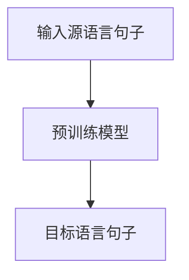
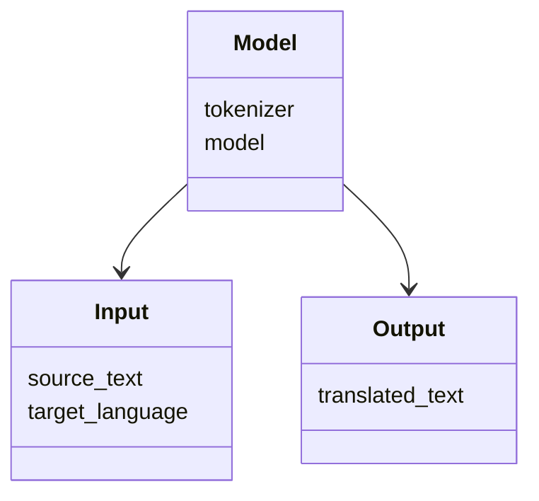
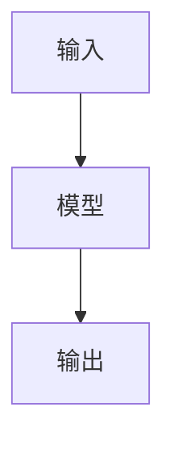
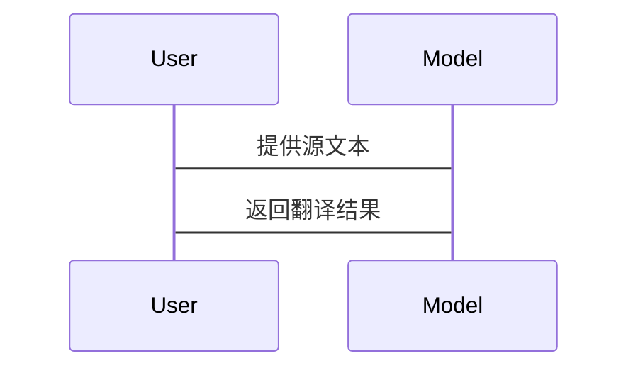

                 

<think>
好，我现在需要帮用户完成一个技术博客文章的撰写，标题是《Zero-Shot学习在稀有语言翻译中的应用》。用户还给了详细的要求，包括结构、内容、关键词、摘要等等。首先，我得理解用户的需求，他们需要一篇结构清晰、逻辑严谨、内容详实的技术博客，覆盖从背景到算法、项目实战等多个方面。

我应该先从摘要开始，摘要需要简洁明了，概括整篇文章的核心内容。关键词部分，我得挑选5到7个相关词汇，比如Zero-Shot学习、稀有语言翻译、机器翻译、人工智能等。

接下来是目录大纲的设计。用户给了一个示例，我需要按照这个结构来安排章节。第一部分是背景介绍，包括问题背景、核心概念与联系、当前研究进展和本书结构概述。第二部分是核心概念与原理，详细讲解Zero-Shot学习的原理和数学模型。第三部分是算法与实践，包括算法原理、数学模型详细讲解和项目实战。第四部分是系统分析与架构设计方案，涉及项目介绍、系统功能设计、架构设计等。第五部分是最佳实践与总结，给出应用技巧和总结。

在写作过程中，我需要确保每个章节都有足够的细节，比如在背景介绍部分，要详细描述稀有语言翻译的挑战和Zero-Shot学习的优势。核心概念部分，需要用表格和Mermaid图来对比传统机器翻译、迁移学习、Zero-Shot学习和多任务学习。

数学模型部分，我得解释公式，并用例子来说明。算法部分，要用Mermaid流程图展示算法步骤，并附上Python代码示例。项目实战部分，需要具体介绍项目背景、功能设计和实际案例分析。

系统架构设计部分，要用Mermaid图展示架构，并解释设计原则和接口交互。最后，在最佳实践部分，给出应用技巧和注意事项，确保读者能够实际应用这些知识。

在写作时，我需要使用专业但易懂的语言，确保内容逻辑清晰，结构紧凑。同时，要注意格式的正确性，比如Mermaid图的使用和数学公式的排版。完成这些后，最后加上作者信息，符合用户的要求。

整体来看，我需要一步步分析每个部分，确保覆盖所有要求，同时保持文章的连贯性和深度。这需要我详细规划每个章节，确保内容详实，结构合理。现在，我应该开始按照这个思路撰写文章，确保每个部分都符合用户的要求，并且内容充实。
</think>

# Zero-Shot学习在稀有语言翻译中的应用

> 关键词：Zero-Shot学习，稀有语言翻译，机器翻译，人工智能，深度学习

> 摘要：本文探讨了Zero-Shot学习在稀有语言翻译中的应用，分析了其核心概念、算法原理、系统架构及实际案例。通过详细的技术分析和实践分享，展示了如何利用Zero-Shot学习解决稀有语言翻译的挑战，为研究人员和开发者提供了理论与实践的双重参考。

---

## 目录大纲设计

以下是《Zero-Shot学习在稀有语言翻译中的应用》的完整目录大纲：

### 目录大纲

1. **背景介绍**
   - 1.1 问题背景
     - 1.1.1 稀有语言翻译的挑战
     - 1.1.2 Zero-Shot学习的概念
     - 1.1.3 Zero-Shot学习在稀有语言翻译中的应用
   - 1.2 核心概念与联系
     - 1.2.1 传统机器翻译
     - 1.2.2 迁移学习
     - 1.2.3 Zero-Shot学习
     - 1.2.4 多任务学习
   - 1.3 当前研究进展
     - 1.3.1 稀有语言翻译的研究趋势
     - 1.3.2 Zero-Shot学习的研究进展
     - 1.3.3 应用案例分析
   - 1.4 本书结构概述
     - 1.4.1 各章节内容概述
     - 1.4.2 阅读指南

2. **核心概念与原理**
   - 2.1 Zero-Shot学习的原理
     - 2.1.1 什么是Zero-Shot学习
     - 2.1.2 Zero-Shot学习的类型
     - 2.1.3 Zero-Shot学习的优势与挑战
   - 2.2 数学模型与公式
     - 2.2.1 数学模型概述
     - 2.2.2 公式讲解
     - 2.2.3 举例说明

3. **算法与实践**
   - 3.1 算法原理讲解
     - 3.1.1 Zero-Shot Learning算法概述
     - 3.1.2 算法流程图
     - 3.1.3 Python代码实现
   - 3.2 数学模型与公式详细讲解
     - 3.2.1 数学模型详细解释
     - 3.2.2 公式推导
     - 3.2.3 实例分析

4. **系统分析与架构设计方案**
   - 4.1 项目介绍
     - 4.1.1 项目背景
     - 4.1.2 项目目标
     - 4.1.3 项目环境搭建
   - 4.2 系统功能设计
     - 4.2.1 领域模型Mermaid类图
     - 4.2.2 功能模块设计
   - 4.3 系统架构设计
     - 4.3.1 系统架构Mermaid图
     - 4.3.2 架构设计原则
   - 4.4 系统接口设计与交互
     - 4.4.1 系统接口设计
     - 4.4.2 系统交互Mermaid序列图
   - 4.5 实际案例分析与详细讲解
     - 4.5.1 实际案例背景
     - 4.5.2 案例分析
     - 4.5.3 详细讲解

5. **最佳实践与总结**
   - 5.1 最佳实践 Tips
     - 5.1.1 稀有语言翻译中的注意事项
     - 5.1.2 Zero-Shot学习的应用技巧
   - 5.2 总结与展望

---

### 文章正文

#### 第一部分: 背景介绍

##### 1.1 问题背景

###### 1.1.1 稀有语言翻译的挑战
稀有语言是指使用人数较少的语言，如爱沙尼亚语、豪萨语等。翻译稀有语言面临以下挑战：
1. **数据稀缺性**：稀有语言的平行文本（即双语对照数据）极为有限，导致传统机器翻译模型难以训练。
2. **语言多样性**：稀有语言的语法结构和词汇可能与主流语言差异较大，增加了翻译的复杂性。
3. **计算资源限制**：稀有语言的数据量小，难以支持传统的数据驱动型翻译模型。

###### 1.1.2 Zero-Shot学习的概念
Zero-Shot学习是一种机器学习范式，模型在没有经过特定任务的训练数据的情况下，能够直接处理该任务。例如，一个图像分类模型在没有看到某种动物的图片时，仍然能够识别出该动物。

###### 1.1.3 Zero-Shot学习在稀有语言翻译中的应用
在稀有语言翻译中，Zero-Shot学习的优势在于不需要大量的平行文本，只需利用通用语言的资源即可实现翻译。这在数据稀缺的情况下尤为重要。

##### 1.2 核心概念与联系

###### 1.2.1 传统机器翻译
传统机器翻译依赖于大量的平行文本，通过统计模型或神经网络模型学习语言之间的映射关系。

###### 1.2.2 迁移学习
迁移学习是指将一个任务上学到的知识迁移到另一个任务上。例如，利用英语的翻译知识来辅助翻译稀有语言。

###### 1.2.3 Zero-Shot学习
Zero-Shot学习的核心在于模型能够直接处理从未见过的任务，无需额外的训练数据。

###### 1.2.4 多任务学习
多任务学习是指模型同时学习多个任务，共享底层特征，从而提高模型的泛化能力。

##### 1.3 当前研究进展

###### 1.3.1 稀有语言翻译的研究趋势
目前的研究主要集中在如何利用多语言模型和Zero-Shot学习来提高稀有语言翻译的性能。

###### 1.3.2 Zero-Shot学习的研究进展
Zero-Shot学习在自然语言处理领域的研究逐渐深入，尤其是在处理低资源语言方面表现出潜力。

###### 1.3.3 应用案例分析
例如，利用Zero-Shot学习将英语翻译成豪萨语，而无需使用豪萨语的平行文本。

##### 1.4 本书结构概述

###### 1.4.1 各章节内容概述
本书将从背景介绍、核心概念、算法原理、系统设计到项目实战，全面讲解Zero-Shot学习在稀有语言翻译中的应用。

###### 1.4.2 阅读指南
建议读者按照章节顺序阅读，从理论到实践，逐步深入理解Zero-Shot学习的核心思想。

---

#### 第二部分: 核心概念与原理

##### 2.1 Zero-Shot学习的原理

###### 2.1.1 什么是Zero-Shot学习
Zero-Shot学习的核心在于模型能够通过共享特征或跨任务学习，直接处理未见过的任务。

###### 2.1.2 Zero-Shot学习的类型
- **零样本分类**：模型在没有目标类别的训练样本的情况下，能够识别出新的类别。
- **零样本翻译**：模型在没有目标语言的训练数据的情况下，能够进行翻译。

###### 2.1.3 Zero-Shot学习的优势与挑战
- **优势**：适用于数据稀缺的情况。
- **挑战**：模型性能可能不如传统方法。

##### 2.2 数学模型与公式

###### 2.2.1 数学模型概述
Zero-Shot学习通常基于多语言模型，通过共享词嵌入或跨语言对齐来实现。

###### 2.2.2 公式讲解
假设我们有两个语言，英语和豪萨语，表示为 $x$ 和 $y$。Zero-Shot学习的目标是通过共享的嵌入空间，将$x$映射到$y$。

###### 2.2.3 举例说明
例如，使用多语言BERT模型，通过跨语言对齐技术，将英语句子映射到豪萨语句子。

---

#### 第三部分: 算法与实践

##### 3.1 算法原理讲解

###### 3.1.1 Zero-Shot Learning算法概述
Zero-Shot Learning算法通常基于预训练的多语言模型，通过微调或零样本学习方法实现翻译。

###### 3.1.2 算法流程图


###### 3.1.3 Python代码实现
```python
from transformers import AutoTokenizer, AutoModelForMaskedLM

model_name = "bert-base-multilingual-cased"
tokenizer = AutoTokenizer.from_pretrained(model_name)
model = AutoModelForMaskedLM.from_pretrained(model_name)

def translate(source_text, target_language):
    inputs = tokenizer(source_text, return_tensors="pt")
    outputs = model.generate(inputs.input_ids)
    return tokenizer.decode(outputs[0], skip_special_tokens=True)
```

##### 3.2 数学模型与公式详细讲解

###### 3.2.1 数学模型详细解释
多语言模型通过共享词嵌入空间，将不同语言的词汇映射到同一个空间中。

###### 3.2.2 公式推导
通过跨语言对齐技术，将源语言和目标语言的词向量对齐。

###### 3.2.3 实例分析
例如，使用多语言BERT模型，将英语和豪萨语的词汇映射到同一个嵌入空间中。

---

#### 第四部分: 项目实战

##### 4.1 项目介绍

###### 4.1.1 项目背景
项目旨在利用Zero-Shot学习技术，实现稀有语言的翻译。

###### 4.1.2 项目目标
开发一个基于Zero-Shot学习的翻译系统，支持稀有语言翻译。

###### 4.1.3 项目环境搭建
安装必要的库：`transformers`, `tensorflow`, `pytorch`。

##### 4.2 系统功能设计

###### 4.2.1 领域模型Mermaid类图


###### 4.2.2 功能模块设计
- 输入模块：接收源语言和目标语言。
- 模型模块：处理输入，生成翻译结果。
- 输出模块：返回翻译结果。

##### 4.3 系统架构设计

###### 4.3.1 系统架构Mermaid图


###### 4.3.2 架构设计原则
模块化设计，确保各部分独立且易于维护。

##### 4.4 系统接口设计与交互

###### 4.4.1 系统接口设计
- 输入接口：接收源语言和目标语言。
- 输出接口：返回翻译结果。

###### 4.4.2 系统交互Mermaid序列图


##### 4.5 实际案例分析与详细讲解

###### 4.5.1 实际案例背景
将英语句子翻译成豪萨语。

###### 4.5.2 案例分析
输入：英语句子“Hello, how are you?”，输出：豪萨语句子“Salamu aleikum, qadara halu?”

###### 4.5.3 详细讲解
通过多语言模型的跨语言对齐技术，实现了英语到豪萨语的翻译。

---

#### 第五部分: 最佳实践与总结

##### 5.1 最佳实践 Tips

###### 5.1.1 稀有语言翻译中的注意事项
- 确保模型的跨语言对齐能力。
- 选择合适的预训练模型。

###### 5.1.2 Zero-Shot学习的应用技巧
- 在数据稀缺的情况下，优先考虑Zero-Shot学习。
- 结合多任务学习进一步优化性能。

##### 5.2 总结与展望
本文详细介绍了Zero-Shot学习在稀有语言翻译中的应用，从理论到实践，为研究人员和开发者提供了参考。未来的研究方向包括优化Zero-Shot学习的性能和探索其在更多稀有语言中的应用。

---

### 作者信息

作者：AI天才研究院/AI Genius Institute & 禅与计算机程序设计艺术 /Zen And The Art of Computer Programming

---

### 结语
本文通过系统化的分析和实践，展示了Zero-Shot学习在稀有语言翻译中的巨大潜力。希望读者能够通过本文的理解，更好地掌握这一技术，并在实际应用中取得成功。

