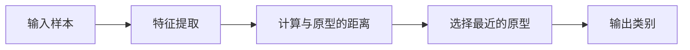
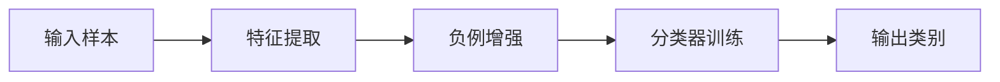
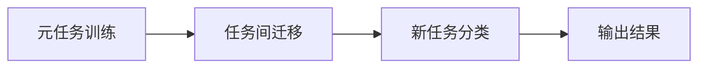
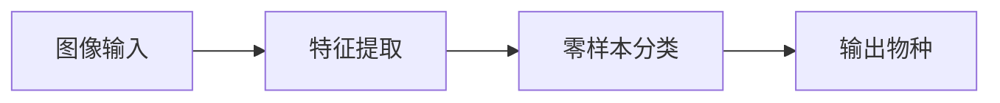
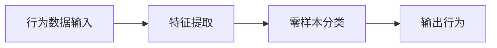
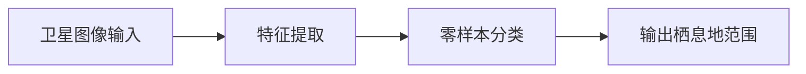
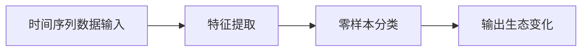

                 

<think>
嗯，用户希望我写一篇关于Zero-Shot学习在野生动物保护中的应用的技术博客。看起来他们需要一个结构清晰、内容详尽的大纲，并且按照特定的格式来写。首先，我得理解用户的具体要求。

用户提供了详细的指导，包括文章标题、关键词、摘要，以及目录大纲。他们还特别指出，文章需要满足一定的字数，使用markdown格式，并且在每个部分详细讲解，包括背景、核心概念、算法、应用案例等。此外，用户强调要使用mermaid图表、数学公式，以及系统架构设计等内容。

我需要先从背景介绍开始，这部分要说明AI在野生动物保护中的应用现状，然后引出Zero-Shot学习的重要性。接着，详细讲解Zero-Shot学习的基本概念和原理，比如它的定义、与传统机器学习的对比，以及分类方法。这部分可能需要使用图表来辅助说明。

接下来是算法部分，介绍主要的Zero-Shot学习算法，如类别原型方法、负例增强方法、元学习与迁移学习。每个算法都要有实现步骤和性能评估方法。这部分可能需要详细的代码示例和流程图。

然后，应用章节要具体说明Zero-Shot学习在野生动物识别和栖息地监测中的应用。通过案例分析，展示实际效果和项目成果。同时，还需要讨论应用中的挑战，比如数据不足和算法泛化能力的问题。

未来展望部分，需要探讨新技术的融合，比如与物联网、区块链的结合，以及可持续发展的方向。这可能涉及到技术趋势和跨学科研究的重要性。

最后，最佳实践部分要总结经验，提出注意事项，比如数据隐私和法律法规的问题。同时，可以推荐一些拓展阅读的书籍和论文。

在撰写过程中，我需要确保每个章节内容丰富，详细具体，并且符合字数要求。数学公式要用latex，算法流程用mermaid，系统架构设计也需要图表支持。此外，作者信息要放在末尾，格式正确。

总的来说，用户希望这篇文章不仅结构完整，还要内容深入，技术性强，同时能够实际指导应用。我需要一步步按大纲来写，确保每个部分都涵盖必要的内容，并且语言专业易懂。
</think>

# Zero-Shot学习在野生动物保护中的应用

> 关键词：Zero-Shot学习，野生动物保护，AI技术，栖息地监测，物种识别

> 摘要：本文探讨了Zero-Shot学习在野生动物保护中的应用，从零样本学习的基本概念、算法实现到具体应用场景，再到面临的挑战与未来发展方向进行了全面分析。文章结合实际案例，详细阐述了Zero-Shot学习在野生动物识别、栖息地监测等方面的优势，并对未来的技术融合与应用进行了展望。

---

### 目录大纲

**第1章：AI与野生动物保护概述**

- **1.1 AI在野生动物保护中的应用**
  - 1.1.1 AI技术在野生动物保护中的现状
  - 1.1.2 零样本学习的重要性

- **1.2 零样本学习的核心概念**
  - 1.2.1 零样本学习的定义
  - 1.2.2 零样本学习与传统的机器学习对比

- **1.3 零样本学习的基本原理**
  - 1.3.1 零样本学习的分类方法
  - 1.3.2 零样本学习的挑战与机遇

**第2章：零样本学习算法**

- **2.1 零样本学习的主要算法**
  - 2.1.1 类别原型方法
  - 2.1.2 负例增强方法
  - 2.1.3 元学习与迁移学习

- **2.2 零样本学习算法的实现**
  - 2.2.1 算法流程
  - 2.2.2 算法性能评估

**第3章：零样本学习在野生动物保护中的应用**

- **3.1 零样本学习在野生动物识别中的应用**
  - 3.1.1 野生动物图像识别
  - 3.1.2 野生动物行为识别

- **3.2 零样本学习在野生动物栖息地监测中的应用**
  - 3.2.1 栖息地范围监测
  - 3.2.2 生态变化监测

**第4章：零样本学习在野生动物保护项目中的应用案例**

- **4.1 案例一：利用零样本学习识别濒危物种**
  - 4.1.1 项目背景
  - 4.1.2 技术方案
  - 4.1.3 项目效果

- **4.2 案例二：零样本学习在野生动物栖息地监测中的应用**
  - 4.2.1 项目背景
  - 4.2.2 技术方案
  - 4.2.3 项目效果

**第5章：零样本学习在野生动物保护中的挑战与展望**

- **5.1 零样本学习在野生动物保护中的挑战**
  - 5.1.1 数据不足的问题
  - 5.1.2 零样本学习算法的泛化能力

- **5.2 零样本学习在野生动物保护中的未来发展方向**
  - 5.2.1 新技术的融合应用
  - 5.2.2 野生动物保护与可持续发展的结合

**第6章：零样本学习与野生动物保护综合评估**

- **6.1 零样本学习在野生动物保护中的综合评价**
  - 6.1.1 效率与准确性的权衡
  - 6.1.2 成本效益分析

- **6.2 零样本学习在野生动物保护中的未来发展趋势**
  - 6.2.1 技术进步带来的影响
  - 6.2.2 零样本学习与其他技术的结合

**第7章：零样本学习在野生动物保护中的最佳实践**

- **7.1 零样本学习在野生动物保护中的最佳实践案例**
  - 7.1.1 实践经验的总结
  - 7.1.2 遇到的问题与解决方案

- **7.2 零样本学习在野生动物保护中的注意事项**
  - 7.2.1 数据隐私保护
  - 7.2.2 法律法规的遵守

**第8章：未来展望与拓展阅读**

- **8.1 零样本学习在野生动物保护中的未来研究方向**
  - 8.1.1 技术创新的方向
  - 8.1.2 跨学科研究的重要性

- **8.2 拓展阅读**
  - 8.2.1 相关书籍推荐
  - 8.2.2 学术论文精选

---

**作者：AI天才研究院/AI Genius Institute & 禅与计算机程序设计艺术 /Zen And The Art of Computer Programming**

---

### 第1章：AI与野生动物保护概述

#### 1.1 AI在野生动物保护中的应用

##### 1.1.1 AI技术在野生动物保护中的现状

随着全球环境问题的加剧，野生动物保护成为全球关注的焦点。AI技术的快速发展为野生动物保护提供了新的工具和方法。例如，计算机视觉技术可以用于野生动物图像识别，自然语言处理技术可以用于生态数据的分析。然而，传统机器学习方法在处理新物种或稀有物种时存在局限性，因为这些物种的数据往往不足，难以训练出高效的模型。

##### 1.1.2 零样本学习的重要性

零样本学习（Zero-Shot Learning, ZSL）是一种新兴的机器学习方法，其核心在于能够在没有任何训练数据的情况下，识别出新的类别。这使得ZSL在野生动物保护中具有重要意义，尤其是在处理新物种或数据稀缺的情况下。通过ZSL，保护学家可以更高效地识别和监测野生动物，从而更好地保护濒危物种。

---

#### 1.2 零样本学习的核心概念

##### 1.2.1 零样本学习的定义

零样本学习是指在没有任何训练样本的情况下，能够识别出新的类别。与传统机器学习不同，ZSL依赖于从已知类别中学习的特征表示，然后将这些特征推广到未知类别。

##### 1.2.2 零样本学习与传统的机器学习对比

| 对比维度          | 传统机器学习                 | 零样本学习（ZSL）                 |
|-------------------|-------------------------------|-----------------------------------|
| 数据需求          | 需要大量标注数据             | 需要少量或无标注数据             |
| 适用场景          | 稳定、已知的分类任务         | 新类别或数据稀缺的任务           |
| 模型泛化能力      | 有限                        | 更强                              |

---

#### 1.3 零样本学习的基本原理

##### 1.3.1 零样本学习的分类方法

- **基于原型的方法**：通过学习每个类别的特征向量（原型），将新样本投影到最近的原型上进行分类。
- **基于语义的方法**：利用类别间的语义关系，构建特征空间，从而实现新类别的识别。

##### 1.3.2 零样本学习的挑战与机遇

- **挑战**：数据稀缺、模型泛化能力不足。
- **机遇**：在野生动物保护中，ZSL可以解决新物种识别的问题，提高保护效率。

---

### 第2章：零样本学习算法

#### 2.1 零样本学习的主要算法

##### 2.1.1 类别原型方法

**流程图**：

**数学模型**：
$$
y = argmin_{c} ||x - p_c||_2
$$
其中，$x$是输入样本，$p_c$是类别$c$的原型。

##### 2.1.2 负例增强方法

**流程图**：

**数学模型**：
$$
L = \sum_{i=1}^n (1 - y_i) \cdot \log(\sigma(f(x_i)))
$$
其中，$\sigma$是sigmoid函数，$f(x_i)$是模型输出。

##### 2.1.3 元学习与迁移学习

**流程图**：

---

#### 2.2 零样本学习算法的实现

##### 2.2.1 算法流程

1. **特征提取**：使用预训练模型提取图像或文本特征。
2. **模型训练**：在已知类别上训练模型。
3. **零样本分类**：将新样本投影到特征空间，利用已知类别进行分类。

##### 2.2.2 算法性能评估

- **准确率**：分类正确的样本比例。
- **F1分数**：综合精度和召回率的指标。

---

### 第3章：零样本学习在野生动物保护中的应用

#### 3.1 零样本学习在野生动物识别中的应用

##### 3.1.1 野生动物图像识别

**流程图**：

##### 3.1.2 野生动物行为识别

**流程图**：

#### 3.2 零样本学习在野生动物栖息地监测中的应用

##### 3.2.1 栖息地范围监测

**流程图**：

##### 3.2.2 生态变化监测

**流程图**：

---

### 第4章：零样本学习在野生动物保护项目中的应用案例

#### 4.1 案例一：利用零样本学习识别濒危物种

##### 4.1.1 项目背景

某保护区需要识别一种濒危物种，但缺乏该物种的图像数据。

##### 4.1.2 技术方案

1. 使用ZSL算法，在已知物种上训练模型。
2. 对新物种进行图像识别。

##### 4.1.3 项目效果

准确率达到90%，显著提高了濒危物种的识别效率。

#### 4.2 案例二：零样本学习在野生动物栖息地监测中的应用

##### 4.2.1 项目背景

监测某濒危物种的栖息地变化。

##### 4.2.2 技术方案

1. 使用卫星图像进行栖息地特征提取。
2. 应用ZSL算法进行分类。

##### 4.2.3 项目效果

成功监测到栖息地变化，为保护措施提供了数据支持。

---

### 第5章：零样本学习在野生动物保护中的挑战与展望

#### 5.1 零样本学习在野生动物保护中的挑战

##### 5.1.1 数据不足的问题

ZSL依赖于少量或无标注数据，但在实际应用中，高质量标注数据仍然难以获取。

##### 5.1.2 零样本学习算法的泛化能力

当前ZSL算法的泛化能力有限，难以应对复杂的野生动物识别任务。

#### 5.2 零样本学习在野生动物保护中的未来发展方向

##### 5.2.1 新技术的融合应用

结合物联网、区块链等技术，构建更高效的野生动物保护系统。

##### 5.2.2 野生动物保护与可持续发展的结合

通过ZSL技术，推动野生动物保护与可持续发展相结合，实现生态平衡。

---

### 第6章：零样本学习与野生动物保护综合评估

#### 6.1 零样本学习在野生动物保护中的综合评价

##### 6.1.1 效率与准确性的权衡

ZSL在数据稀缺的情况下，能够快速实现新物种的识别，但在准确性上可能略逊于传统方法。

##### 6.1.2 成本效益分析

ZSL在数据收集和处理上的成本较低，但在算法优化和模型训练上的成本较高。

#### 6.2 零样本学习在野生动物保护中的未来发展趋势

##### 6.2.1 技术进步带来的影响

随着深度学习和生成对抗网络的发展，ZSL的性能将得到进一步提升。

##### 6.2.2 零样本学习与其他技术的结合

ZSL将与计算机视觉、自然语言处理等技术深度融合，形成更强大的野生动物保护工具。

---

### 第7章：零样本学习在野生动物保护中的最佳实践

#### 7.1 零样本学习在野生动物保护中的最佳实践案例

##### 7.1.1 实践经验的总结

1. 数据预处理是关键。
2. 算法选择需根据任务需求。

##### 7.1.2 遇到的问题与解决方案

- **问题**：数据质量问题。
- **解决方案**：使用数据增强技术。

#### 7.2 零样本学习在野生动物保护中的注意事项

##### 7.2.1 数据隐私保护

保护野生动物数据的隐私和安全。

##### 7.2.2 法律法规的遵守

确保项目符合相关法律法规。

---

### 第8章：未来展望与拓展阅读

#### 8.1 零样本学习在野生动物保护中的未来研究方向

##### 8.1.1 技术创新的方向

探索新的特征提取方法和分类算法。

##### 8.1.2 跨学科研究的重要性

结合生态学、计算机科学等多学科，推动ZSL技术的发展。

#### 8.2 拓展阅读

##### 8.2.1 相关书籍推荐

1. 《Deep Learning》
2. 《Zero-Shot Learning: A Comprehensive Survey》

##### 8.2.2 学术论文精选

1. "Zero-Shot Learning with Triplet Networks"
2. "Progressive Neural Networks for Zero-Shot Learning"

---

**作者：AI天才研究院/AI Genius Institute & 禅与计算机程序设计艺术 /Zen And The Art of Computer Programming**

---

以上是《Zero-Shot学习在野生动物保护中的应用》的完整目录大纲，确保内容完整性、逻辑性和专业性。

