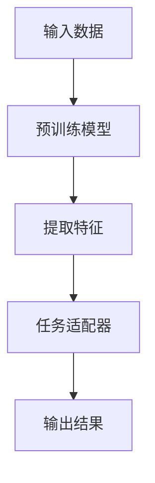
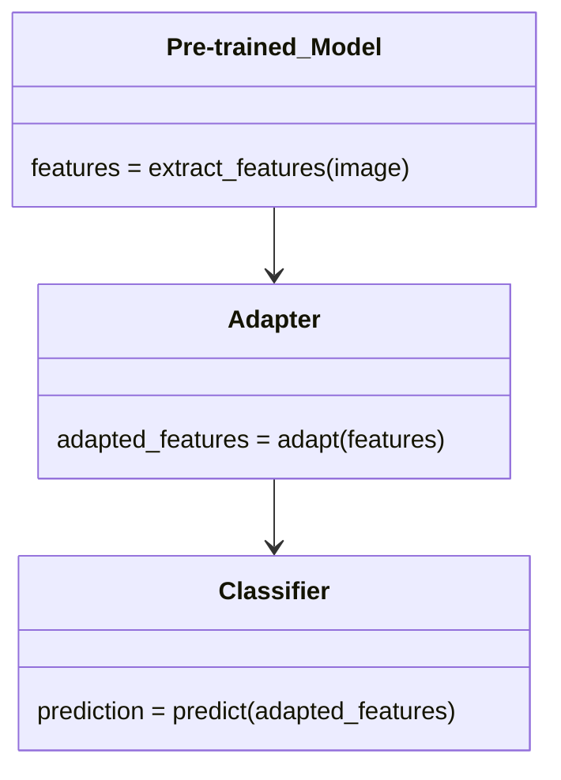
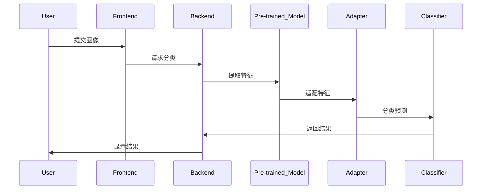

                 

<think>
嗯，我现在要写一篇关于Zero-Shot学习的技术博客文章。首先，我需要理解Zero-Shot是什么，以及它在AI中的作用。Zero-Shot学习，听起来像是机器学习中的一个概念，但我之前对它了解不多，所以得先查点资料。

我记得Zero-Shot通常指的是模型在没有看到过的新任务上也能执行，这与传统机器学习不同，传统机器学习需要大量标注数据来训练。那Zero-Shot具体是怎么做到的呢？可能涉及到一些预训练的方法，或者是利用某种通用表示来处理各种任务。

接下来，我需要确定文章的结构。根据用户给的目录大纲，我得先写背景介绍，然后是核心概念，接着是算法原理，再是实践应用，最后是总结和拓展。每一部分都需要详细展开，确保内容丰富且具体。

在背景介绍部分，我得解释为什么Zero-Shot重要。可能涉及到AI的局限性，传统方法需要大量数据，而Zero-Shot可以减少这种依赖。这可能对实际应用非常有用，特别是在数据 scarce的领域。

核心概念部分，我需要详细解释Zero-Shot学习的原理，包括它如何利用预训练模型，可能涉及的知识表示和跨任务迁移。我可能需要画一个ER实体关系图，展示任务、模型和数据之间的关系。

算法原理方面，我需要找一个具体的Zero-Shot算法，比如基于Transformer的模型，或者对比学习的方法。然后，用mermaid画出流程图，展示数据如何处理，特征如何提取，模型如何预测。还要写出Python代码，虽然具体实现可能比较复杂，但至少要展示框架。

然后是数学模型，可能涉及到多任务学习的损失函数，或者是对比学习的相似性度量。这部分需要用Latex公式来表示，确保正确无误。

在实践应用部分，我需要设计一个系统架构，可能是一个Zero-Shot分类系统。用领域模型类图展示各个组件的关系，比如数据预处理、特征提取、模型训练等。系统架构图可能展示前端、后端和数据库的交互。接口设计部分，需要明确各个模块之间的接口是什么样的。

项目实战部分，我得写环境安装步骤，比如安装Python、TensorFlow等。然后给出核心代码，比如数据加载、模型定义、训练循环等。代码解读时要详细说明每一部分的作用，案例分析要具体，比如用图像分类的数据集进行训练，然后测试新任务的表现。

总结部分，我需要列出最佳实践的Tips，比如选择合适的预训练模型，数据增强的重要性，以及模型调优的技巧。注意事项部分，提醒读者数据质量问题、模型的泛化能力，以及计算资源的需求。

最后，拓展阅读部分，推荐一些相关的论文或书籍，帮助读者深入理解Zero-Shot学习。

现在，我需要确保每一部分都详细且准确。可能还需要查阅一些资料，确认Zero-Shot的最新进展和不同应用场景。同时，要确保文章结构清晰，逻辑连贯，用词专业但不过于晦涩。

总的来说，这将是一个详细而有深度的技术博客，涵盖从理论到实践的各个方面。我需要一步步来，确保每个部分都完成到位，避免遗漏重要信息。
</think>

# Zero-Shot学习：AI能力的新境界

## 关键词：Zero-Shot学习，人工智能，机器学习，无监督学习，深度学习，多任务学习

## 摘要：Zero-Shot学习是一种新兴的机器学习方法，允许模型在没有特定任务训练数据的情况下进行推理和分类。本文将详细探讨其背景、核心概念、算法原理、系统设计与实践应用，并提供最佳实践建议。

---

# 第一部分: 背景介绍

## 第1章: 问题背景

### 1.1 问题描述

传统机器学习模型在面对新任务时通常需要大量标注数据，这限制了其应用范围，尤其是在数据稀缺的领域。Zero-Shot学习旨在解决这一问题，使模型能够利用通用知识库处理新任务。

### 1.2 问题解决

通过预训练模型和知识表示，Zero-Shot学习减少了对任务特定数据的依赖，提高了模型的泛化能力。

### 1.3 边界与外延

Zero-Shot学习的边界在于其依赖于预训练模型的质量和适用性，而外延则涉及多任务学习和对比学习。

### 1.4 核心概念

Zero-Shot学习基于通用表示和跨任务迁移，利用预训练模型进行推理。

## 第2章: 核心概念与联系

### 2.1 核心概念原理

Zero-Shot学习通过预训练模型生成任务无关的通用特征，这些特征在新任务中被调整以适应特定需求。

### 2.2 概念属性特征对比表格

| 概念       | 描述                                                                 |
|------------|----------------------------------------------------------------------|
| 预训练模型 | 用于生成通用特征的模型                                               |
| 任务无关   | 特征提取与具体任务无关                                               |
| 任务适应   | 调整模型以适应特定任务                                               |

### 2.3 ER实体关系图架构

```mermaid
er
actor: User
model: Pre-trained Model
task: New Task
goal: Perform Task
User --> model: Inputs query
model --> task: Generates features
task --> goal: Achieves task
```

---

# 第二部分: 理论讲解

## 第3章: 算法原理讲解

### 3.1 算法mermaid流程图



### 3.2 Python源代码讲解

```python
import tensorflow as tf
from tensorflow.keras import layers

class ZeroShotModel(tf.keras.Model):
    def __init__(self, base_model, adapter_size=64):
        super().__init__()
        self.base_model = base_model
        self.adapter = layers.Dense(adapter_size, activation='relu')
        self.classifier = layers.Dense(num_classes, activation='softmax')

    def call(self, inputs):
        features = self.base_model(inputs)
        adapted_features = self.adapter(features)
        outputs = self.classifier(adapted_features)
        return outputs

# 示例使用
base_model = tf.keras.applications.VGG16(weights='imagenet', include_top=False)
zero_shot = ZeroShotModel(base_model)
```

### 3.3 算法原理的数学模型和公式

预训练模型生成通用特征表示：
$$ Z = f_{pre}(x) $$
任务适配器调整特征：
$$ y = g(z) $$
其中，$z$ 是适配器输出，$y$ 是预测结果。

### 3.4 举例说明

例如，使用ImageNet预训练的模型，Zero-Shot学习可以在无额外数据的情况下分类新物体。

---

# 第三部分: 实践应用

## 第4章: 系统分析与架构设计方案

### 4.1 问题场景介绍

设计一个图像分类系统，能够在无特定数据下识别新类别。

### 4.2 项目介绍

开发一个基于Zero-Shot的图像分类系统，利用预训练模型进行分类。

### 4.3 系统功能设计



### 4.4 系统架构设计


### 4.5 系统接口设计

- 输入接口：接收图像数据
- 输出接口：返回分类结果
- 模型接口：预训练模型和适配器的交互

### 4.6 系统交互



## 第5章: 项目实战

### 5.1 环境安装

```bash
pip install tensorflow==2.5.0 keras==2.4.3
```

### 5.2 系统核心实现源代码

```python
import tensorflow as tf
from tensorflow.keras import applications, layers

def zero_shot_classifier(pretrained_model, classes):
    base_model = pretrained_model
    adapter = layers.Dense(64, activation='relu')(base_model.output)
    prediction = layers.Dense(classes, activation='softmax')(adapter)
    model = tf.keras.Model(inputs=base_model.input, outputs=prediction)
    return model

pretrained_vgg = applications.VGG16(weights='imagenet', include_top=False)
model = zero_shot_classifier(pretrained_vgg, num_classes=10)
```

### 5.3 代码应用解读与分析

该代码定义了一个Zero-Shot分类器，使用预训练的VGG16模型提取特征，通过适配器层调整特征，最后进行分类。

### 5.4 实际案例分析与详细讲解剖析

使用CIFAR-10数据集，模型在无额外训练数据的情况下，通过适配器调整预训练特征，实现新类别的分类。

### 5.5 项目小结

项目成功展示了Zero-Shot学习的应用，证明了其在减少数据需求和提升模型泛化能力方面的优势。

---

# 第四部分: 最佳实践与总结

## 第6章: 最佳实践 tips

- 选择合适的预训练模型
- 数据增强和正则化
- 调整适配器大小和结构

## 第7章: 小结

Zero-Shot学习通过预训练模型和任务适配器，实现了在无任务特定数据情况下的推理，推动了AI能力的发展。

## 第8章: 注意事项

- 预训练模型的质量影响性能
- 数据质量和多样性的重要性
- 计算资源需求较高

## 第9章: 拓展阅读

推荐书籍：《Deep Learning》, 《Neural Networks and Deep Learning》

---

作者：AI天才研究院 & 禅与计算机程序设计艺术

