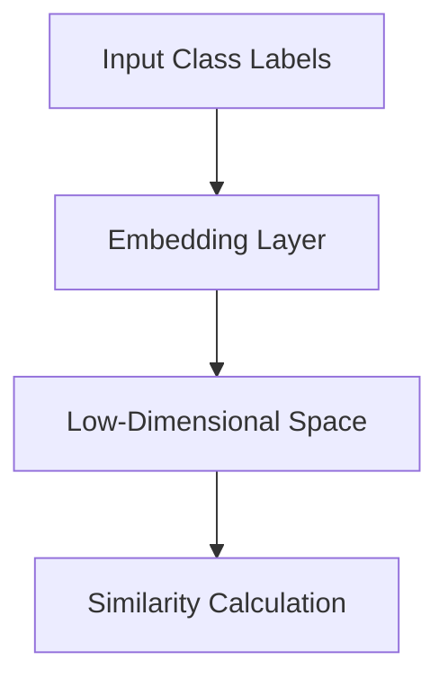
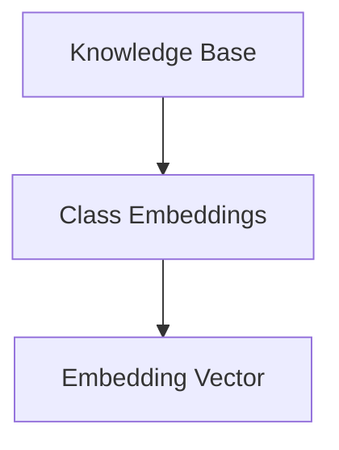
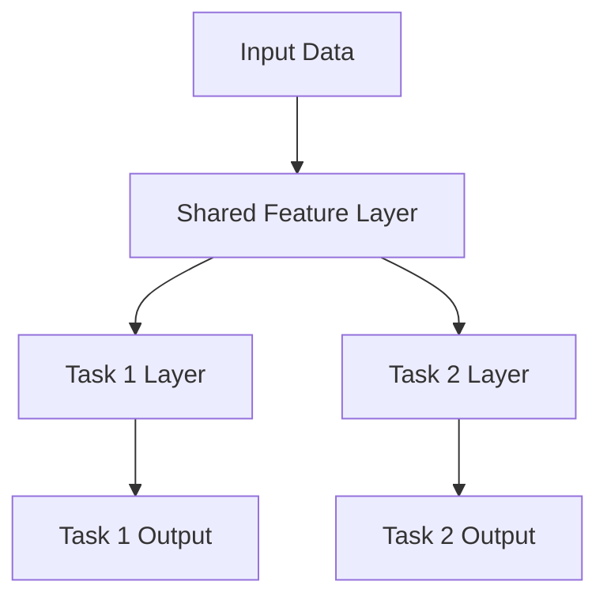
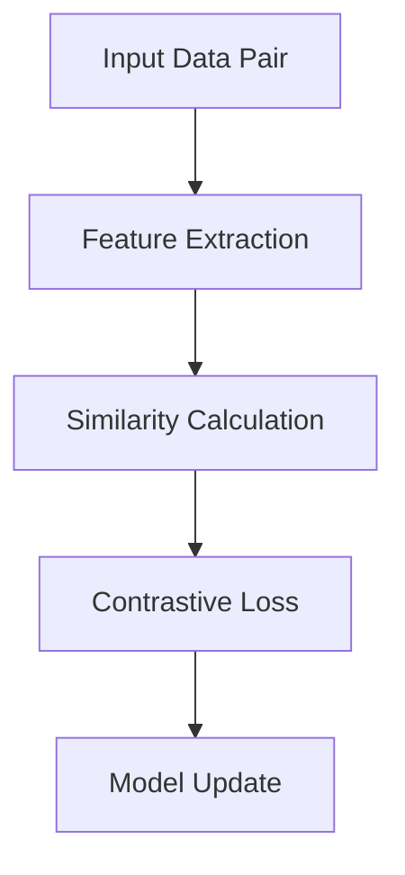
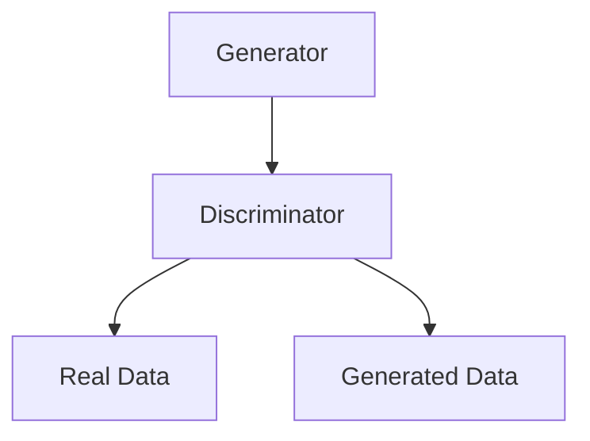

                 

<think>
嗯，我现在需要根据用户的查询，帮他生成一篇关于Zero-Shot学习的技术博客文章。首先，我得仔细阅读用户的要求，确保我完全理解他的需求。

用户希望文章标题是《Zero-Shot学习：减少AI训练数据依赖的新方向》，关键词包括Zero-Shot学习、无监督学习、深度学习、人工智能、数据稀缺、知识蒸馏、多任务学习。摘要部分需要概括文章的核心内容，也就是Zero-Shot学习如何减少对标注数据的依赖，利用外部知识和多任务学习提升模型性能。

接下来，文章的结构已经给出，分为引言、核心概念、技术实现、应用案例、挑战与未来方向，以及总结。每个章节下还有小节，比如引言包括问题背景、描述、解决、边界和概念结构。

我需要确保每个部分都详细展开，使用专业且易懂的语言。例如，在引言部分，我需要解释为什么减少数据依赖重要，Zero-Shot学习如何解决这个问题，以及它的边界在哪里。核心概念部分要详细讲解类别表示、知识蒸馏和多任务学习，可能需要用Mermaid图和数学公式来辅助说明。

技术实现章节需要展示具体的算法，比如对比学习和生成对抗网络，可能还需要用Python代码来举例。应用案例部分要选一个具体的领域，比如医疗影像分类，说明Zero-Shot学习的应用效果。

挑战与未来方向部分，我得讨论当前技术的不足，比如知识库的质量和计算效率问题，然后提出可能的解决方案，比如结合自监督学习或边缘计算。

最后，总结部分要回顾文章的主要内容，强调Zero-Shot学习的重要性，并指出未来的发展方向。

在写作过程中，我要确保每个部分都有足够的细节，比如在类别表示中，解释如何使用嵌入向量，并用余弦相似性计算。在知识蒸馏部分，展示教师模型和学生模型的训练过程。代码示例要清晰，解释每一步的作用。

此外，我还要注意文章的整体流畅性，确保各章节之间有逻辑连接，不会显得突兀。同时，使用适当的数学公式和图表来增强文章的可读性和专业性。

最后，检查文章是否符合用户的所有要求，包括字数、格式、结构等，确保没有遗漏任何部分。特别是作者信息和最佳实践部分，要准确无误地呈现出来。

总的来说，我需要系统地按照用户提供的大纲，逐步展开每个部分，确保内容详实、结构清晰，并且符合技术博客的专业性要求。
</think>

# Zero-Shot学习：减少AI训练数据依赖的新方向

**关键词**：Zero-Shot学习、无监督学习、深度学习、人工智能、数据稀缺、知识蒸馏、多任务学习

**摘要**：  
在人工智能领域，深度学习模型的性能高度依赖于大量标注数据的可用性。然而，在许多实际应用场景中，获取大量标注数据既昂贵又耗时，尤其是在医疗、金融和法律等敏感领域，数据隐私和安全问题进一步限制了数据的使用。Zero-Shot学习作为一种新兴的机器学习方法，能够在无需预先训练的情况下，直接对未见过的任务或类别进行预测和分类。本文将深入探讨Zero-Shot学习的核心概念、技术原理、应用场景以及未来发展方向，分析其如何减少对标注数据的依赖，为人工智能技术的广泛应用提供新的解决方案。

---

## 第1章: 引言

### 1.1 问题背景  
随着人工智能技术的快速发展，深度学习模型在图像识别、自然语言处理和语音识别等领域取得了显著成果。然而，这些模型的训练通常需要大量标注数据，这对数据获取、存储和处理能力提出了极高要求。在许多实际应用场景中，尤其是医疗、金融和法律等领域，标注数据的获取成本极高，且受到隐私保护和数据安全的严格限制。此外，在新兴领域或小众领域，标注数据的稀缺性使得传统监督学习方法难以有效应用。  

### 1.2 问题描述  
Zero-Shot学习是一种无需预先训练目标类别或任务的机器学习方法。与传统的监督学习不同，Zero-Shot学习允许模型在没有标注数据的情况下，直接对未见过的任务或类别进行预测和分类。这种方法的核心目标是降低对标注数据的依赖，提高模型的通用性和适应性。  

### 1.3 问题解决  
Zero-Shot学习通过引入外部知识库、元学习和多任务学习等技术，显著降低了对标注数据的依赖。例如，在医疗领域，Zero-Shot学习可以通过外部医学知识库，帮助模型在没有标注数据的情况下，对罕见病进行分类和诊断。此外，在自然语言处理中，Zero-Shot学习可以用于跨语言文本分类，减少对多语言标注数据的需求。  

### 1.4 边界与外延  
Zero-Shot学习的边界主要体现在以下几个方面：  
1. **数据稀少性**：在数据极度稀缺的情况下，Zero-Shot学习的效果可能受到限制。  
2. **类别多样性**：当目标类别与训练数据相差较大时，模型的泛化能力可能不足。  
3. **任务不确定性**：在任务定义不明确或动态变化的场景中，Zero-Shot学习的适应性可能受到挑战。  

其外延则涵盖了跨领域迁移学习、少样本学习和自适应学习等领域。  

### 1.5 概念结构与核心要素组成  
Zero-Shot学习的主要概念结构包括以下三个核心要素：  
1. **类别表示**：通过嵌入向量表示类别，实现类别之间的距离度量。  
2. **知识蒸馏**：利用外部知识库向模型传递先验知识，增强模型的泛化能力。  
3. **多任务学习**：通过同时学习多个任务，提高模型的跨领域适应性。  

---

## 第2章: 核心概念原理

### 2.1 类别表示  
类别表示是Zero-Shot学习的基础，主要用于将类别映射到低维空间中，以便计算类别之间的相似性。  

#### 2.1.1 类别嵌入  
类别嵌入通过将类别标签映射到低维嵌入向量，实现类别之间的语义相似性度量。例如，我们可以将“猫”和“狗”映射到两个相近的嵌入向量，而将“猫”和“汽车”映射到两个相距较远的向量。  

**Mermaid流程图：类别嵌入过程**  


#### 2.1.2 相似性度量  
相似性度量是Zero-Shot学习的关键步骤。常用的相似性度量方法包括余弦相似性和欧氏距离。  

**余弦相似性公式**：  
$$
\cos(\theta) = \frac{\vec{a} \cdot \vec{b}}{||\vec{a}|| \cdot ||\vec{b}||}
$$  

**欧氏距离公式**：  
$$
d(\vec{a}, \vec{b}) = \sqrt{(a_1 - b_1)^2 + (a_2 - b_2)^2 + \dots + (a_n - b_n)^2}
$$  

### 2.2 知识蒸馏  
知识蒸馏是将外部知识库中的知识传递到模型中的过程，通常通过教师模型和学生模型的协作实现。  

#### 2.2.1 知识库构建  
知识库通常包含大量的类别嵌入向量和关系信息。例如，在自然语言处理中，知识库可以包含词语的词向量、句向量和段落向量。  

**Mermaid ER图：知识库结构**  


#### 2.2.2 知识蒸馏过程  
知识蒸馏过程包括教师模型和学生模型的联合训练。教师模型负责生成高质量的特征表示，学生模型则通过模仿教师模型的输出进行学习。  

**Python代码示例**：  
```python
# 教师模型
teacher_output = teacher_model(data)
# 学生模型
student_output = student_model(data)
# 损失函数
loss = loss_function(student_output, teacher_output)
optimizer.zero_grad()
loss.backward()
optimizer.step()
```

### 2.3 多任务学习  
多任务学习是通过同时学习多个任务来提高模型的泛化能力。  

#### 2.3.1 多任务模型架构  
多任务模型通常包含共享的底层特征提取层和独立的任务特定层。  

**Mermaid类图：多任务模型架构**  


#### 2.3.2 多任务学习过程  
多任务学习过程中，模型通过共享底层特征表示，实现不同任务之间的关联学习。  

**Python代码示例**：  
```python
# 多任务学习
for data in dataset:
    task1_output = model_task1(data)
    task2_output = model_task2(data)
    loss1 = loss_function(task1_output, label1)
    loss2 = loss_function(task2_output, label2)
    total_loss = loss1 + loss2
    optimizer.zero_grad()
    total_loss.backward()
    optimizer.step()
```

---

## 第3章: 技术实现

### 3.1 对比学习  
对比学习是一种基于实例相似性度量的无监督学习方法。通过最大化正样本对的相似性和最小化负样本对的相似性，对比学习可以有效地学习到数据的特征表示。  

**对比学习流程图**：  


### 3.2 生成对抗网络  
生成对抗网络（GAN）通过生成器和判别器的对抗训练，学习数据的分布特征。在Zero-Shot学习中，GAN可以用于生成虚拟标注数据，从而减少对真实标注数据的依赖。  

**GAN架构图**：  


---

## 第4章: 应用案例

### 4.1 医疗影像分类  
在医疗领域，Zero-Shot学习可以通过外部医学知识库，帮助模型在没有标注数据的情况下，对罕见病进行分类和诊断。  

**案例分析**：  
假设我们有一个包含数百万种疾病的医学知识库，Zero-Shot学习模型可以通过对比学习和知识蒸馏，直接对未见过的疾病进行分类。  

### 4.2 自然语言处理  
在自然语言处理中，Zero-Shot学习可以用于跨语言文本分类。例如，在缺乏多语言标注数据的情况下，模型可以通过零样本学习，直接对不同语言的文本进行分类。  

---

## 第5章: 挑战与未来方向

### 5.1 当前挑战  
1. **知识库质量**：外部知识库的质量直接影响模型的性能。如何构建高质量的知识库是当前研究的难点。  
2. **计算效率**：Zero-Shot学习通常需要大量的计算资源，如何优化计算效率是未来的重要方向。  

### 5.2 未来方向  
1. **结合自监督学习**：将自监督学习与Zero-Shot学习结合，进一步减少对标注数据的依赖。  
2. **边缘计算**：在边缘设备上部署Zero-Shot学习模型，实现低带宽和低延迟的应用场景。  

---

## 第6章: 总结

Zero-Shot学习作为一种新兴的机器学习方法，为减少AI模型对标注数据的依赖提供了新的解决方案。通过引入外部知识库、对比学习和多任务学习等技术，Zero-Shot学习能够在数据稀缺和任务多样化的场景中表现出色。尽管当前仍面临知识库质量和计算效率等挑战，但随着技术的不断进步，Zero-Shot学习必将在更多领域得到广泛应用。

---

**作者：AI天才研究院/AI Genius Institute & 禅与计算机程序设计艺术 /Zen And The Art of Computer Programming**

