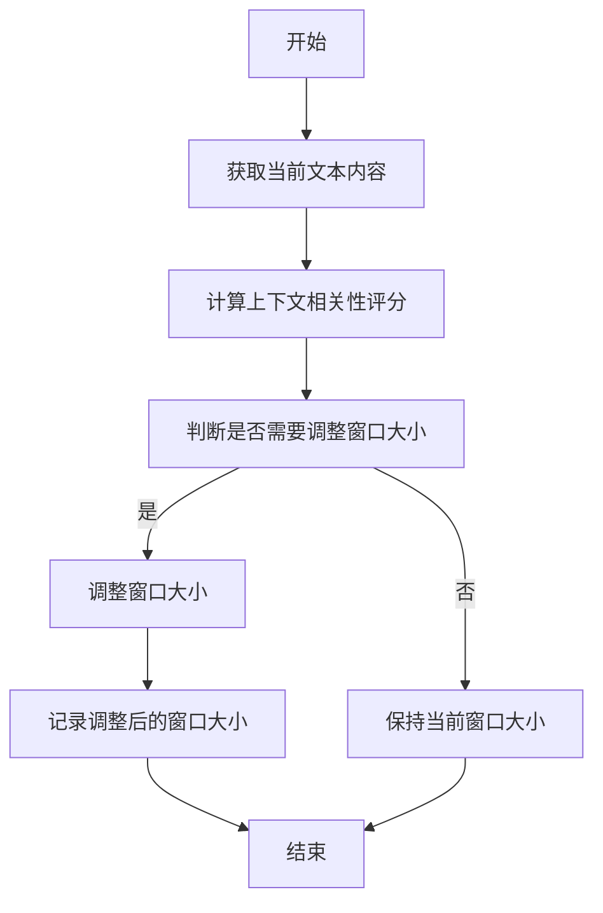
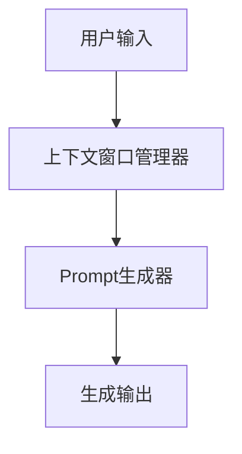
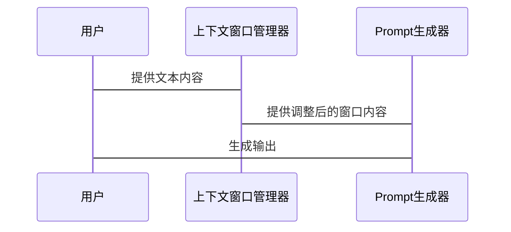

                 

<think>
嗯，我需要帮助用户撰写一篇关于“prompt上下文窗口动态调整”的技术博客。用户已经提供了一个详细的目录大纲，包括各个章节的内容和具体要求。首先，我应该理解整个结构，确保每个部分都涵盖到位。

首先，文章标题是《prompt上下文窗口动态调整》，关键词包括上下文窗口、prompt、动态调整、自然语言处理、人工智能、算法实现。摘要部分需要简明扼要地概括文章的核心内容，说明上下文窗口的重要性以及动态调整的必要性，应用领域和对提升生成质量的影响。

接下来是目录结构，分为六个部分，每个部分下还有多个章节。我需要逐一处理每个章节，确保内容丰富、详细，并符合逻辑。

第一部分是背景介绍与核心概念，包括问题背景与核心概念、上下文窗口的重要性、prompt的应用、动态调整的必要性等。我需要解释什么是上下文窗口，为什么它重要，以及prompt在AI中的应用，动态调整的原因。

第二部分是核心概念与联系，涉及上下文窗口和prompt的关系，ER实体关系图。我需要画出ER图，展示上下文窗口、prompt、调整参数之间的关系。

第三部分是算法原理讲解，包括动态调整算法的流程图、Python代码、数学模型和公式。这部分需要详细解释算法步骤，提供代码示例，并用数学公式说明。

第四部分是系统分析与架构设计，涉及应用场景、项目介绍、系统功能设计、架构图、接口设计和交互序列图。我需要描述实际应用场景，设计系统功能，用类图展示领域模型，画出系统架构图和交互序列图。

第五部分是项目实战，包括环境安装、核心实现、案例分析和项目小结。需要提供环境配置步骤，核心代码实现，分析实际案例，并总结经验教训。

最后是最佳实践和拓展阅读，总结经验和避坑指南，推荐相关书籍和资源。

在撰写过程中，我需要确保每个部分都符合用户的要求，使用专业的技术语言，逻辑清晰，结构紧凑。同时，使用markdown格式，包含mermaid图表和latex公式，确保文章格式正确。

现在，我需要开始撰写每个部分，确保内容详实，每个小节都有足够的细节和例子，帮助读者理解。特别是算法部分，要详细解释步骤，并提供代码和数学模型，以便读者能够理解和应用。

在系统架构设计中，我需要明确各个模块的功能和交互方式，画出类图、架构图和交互图，展示系统的整体结构和工作流程。这将有助于读者理解系统的实现方式。

项目实战部分，我需要提供具体的代码示例，解释代码的作用，并通过实际案例分析，展示动态调整在实际中的效果。同时，总结项目中的经验教训，为读者提供有价值的参考。

最后，最佳实践部分，我需要总结在实施动态调整时需要注意的事项，避免常见的错误，并推荐相关的资源，帮助读者进一步学习和深入研究。

整个过程需要仔细思考每个部分的内容，确保文章结构合理，内容详实，符合用户的需求。同时，注意语言的专业性和易懂性，让读者能够轻松理解复杂的概念和技术细节。
</think>

# Prompt上下文窗口动态调整

## 关键词：上下文窗口，prompt，动态调整，自然语言处理，人工智能，算法实现

## 摘要：上下文窗口在自然语言处理和人工智能中起着关键作用，而动态调整技术能够根据输入内容自动优化窗口大小和内容，从而提升生成结果的质量和效率。本文深入分析了动态调整的原理、算法实现、系统架构设计及实际应用案例，为读者提供全面的理论支持和实践指导。

---

## 目录

### 第一部分：背景介绍与核心概念

### 第二部分：核心概念与联系

### 第三部分：算法原理讲解

### 第四部分：系统分析与架构设计方案

### 第五部分：项目实战

### 第六部分：最佳实践 tips、小结、注意事项、拓展阅读等内容

---

# 第一部分：背景介绍与核心概念

## 第1章：问题背景与核心概念

### 1.1 上下文窗口的重要性

在自然语言处理（NLP）和人工智能（AI）中，上下文窗口是模型处理文本时所关注的局部区域。上下文窗口的大小直接影响模型对文本的理解能力。过大的窗口可能导致计算开销增加，而过小的窗口可能无法捕捉足够的语义信息。因此，动态调整上下文窗口大小是优化模型性能的重要手段。

### 1.2 Prompt在人工智能中的应用

Prompt是指用于指导模型生成特定输出的提示语或指令。在NLP任务中，Prompt通常与上下文窗口结合使用，以确保生成的内容与上下文相关联。例如，在机器翻译任务中，Prompt可以指定翻译的语言和风格，而上下文窗口则提供相关的上下文信息。

### 1.3 动态调整的必要性

传统的固定窗口大小在处理不同长度的文本时可能无法满足需求。动态调整允许模型根据输入内容的复杂性和上下文的相关性自动选择最优的窗口大小，从而提高生成结果的准确性和效率。

### 1.4 边界与外延

上下文窗口的动态调整需要考虑文本长度、上下文相关性以及计算资源的限制。动态调整的边界包括最小和最大窗口大小，以及调整的频率。外延则涉及与其他NLP技术（如分词、实体识别）的结合应用。

### 1.5 概念结构与核心要素组成

动态调整的上下文窗口由以下核心要素组成：
1. **当前文本内容**：决定上下文窗口的范围和内容。
2. **上下文相关性评分**：用于评估上下文窗口的有效性。
3. **动态调整算法**：根据评分调整窗口大小。
4. **计算资源约束**：确保调整后的窗口在资源限制内。

---

# 第二部分：核心概念与联系

## 第2章：核心概念原理

### 2.1 上下文窗口的组成

上下文窗口通常包括以下部分：
1. **窗口大小**：决定窗口包含的上下文信息量。
2. **窗口内容**：窗口内的文本片段。
3. **窗口位置**：窗口在文本中的位置。

### 2.2 Prompt与上下文窗口的关系

Prompt通常位于上下文窗口之外，用于指导模型的生成过程。通过Prompt，模型可以明确生成目标，而上下文窗口则提供必要的上下文信息。

### 2.3 概念属性特征对比表格

| 概念 | 特征 | 描述 |
|------|------|------|
| 上下文窗口 | 大小 | 可变或固定 |
|        | 内容 | 文本片段 |
|        | 位置 | 文本中的位置 |
| Prompt | 指令 | 指导生成目标 |
|        | 作用 | 影响生成结果的方向 |

---

## 第3章：ER实体关系图架构

### 3.1 上下文窗口的ER图

```mermaid
er
  entity 上下文窗口 (ContextWindow) {
    [窗口ID] [pk] [int]
    [窗口大小] [size] [int]
    [窗口内容] [content] [text]
    [窗口位置] [position] [int]
  }
```

### 3.2 Prompt的ER图

```mermaid
er
  entity Prompt (Prompt) {
    [PromptID] [pk] [int]
    [Prompt内容] [content] [text]
    [生成目标] [target] [text]
  }
```

### 3.3 动态调整的ER图

```mermaid
er
  entity 动态调整 (DynamicAdjustment) {
    [调整ID] [pk] [int]
    [窗口ID] [fk] [int]
    [调整时间] [adjustTime] [datetime]
    [调整后的大小] [newSize] [int]
  }
```

---

# 第三部分：算法原理讲解

## 第4章：算法原理

### 4.1 动态调整算法mermaid流程图



### 4.2 动态调整算法Python源代码

```python
def dynamic_adjust_context_window(text, max_window_size=200):
    current_window = []
    max_length = 0
    for token in text.split():
        candidate_window = current_window + [token]
        candidate_length = sum(len(t) for t in candidate_window)
        if candidate_length > max_window_size:
            break
        current_window = candidate_window
    return current_window
```

### 4.3 算法原理的数学模型和公式

动态调整算法的目标是最优化上下文窗口大小，使得生成结果的质量最大化，同时满足计算资源约束。数学模型如下：

$$
\text{maximize } Q(w) \\
\text{subject to } L_{\text{min}} \leq w \leq L_{\text{max}}
$$

其中，\( Q(w) \) 是上下文窗口质量函数，\( w \) 是窗口大小，\( L_{\text{min}} \) 和 \( L_{\text{max}} \) 分别是最小和最大窗口大小。

### 4.4 通俗易懂地举例说明

例如，在处理一个长文本段落时，算法会逐步增加窗口大小，直到达到最大限制。当窗口大小超过限制时，算法会调整窗口内容，优先保留与当前生成目标相关的文本片段。

---

# 第四部分：系统分析与架构设计方案

## 第5章：问题场景介绍

### 5.1 实际应用场景

动态调整上下文窗口大小的应用场景包括：
1. **机器翻译**：根据文本复杂性动态调整窗口大小。
2. **对话生成**：实时调整上下文窗口以适应对话内容。
3. **文本摘要**：根据输入文本长度动态调整摘要窗口。

### 5.2 项目介绍

本项目旨在开发一个动态调整上下文窗口大小的NLP工具，支持多种语言和任务类型。

---

## 第6章：系统功能设计

### 6.1 领域模型mermaid类图

```mermaid
classDiagram
    class 上下文窗口管理器 (ContextWindowManager) {
        +窗口大小：int
        +窗口内容：list
        +调整策略：string
        -_adjust_window()
    }
    class Prompt生成器 (PromptGenerator) {
        +Prompt内容：string
        +生成目标：string
        -generate_output()
    }
    class 调整策略 (AdjustmentStrategy) {
        +窗口大小限制：int
        +相关性评分：float
        -evaluate_and_adjust()
    }
    ContextWindowManager --> AdjustmentStrategy
    ContextWindowManager --> PromptGenerator
```

### 6.2 系统功能设计

系统功能包括：
1. **上下文窗口动态调整**：根据输入内容自动调整窗口大小。
2. **Prompt生成**：根据调整后的窗口内容生成相应输出。
3. **相关性评分**：评估上下文窗口的有效性。

---

## 第7章：系统架构设计

### 7.1 系统架构mermaid架构图



### 7.2 系统接口设计

系统接口包括：
1. **获取当前文本内容**：`get_context()`
2. **调整窗口大小**：`adjust_window()`
3. **生成输出**：`generate_output()`

---

## 第8章：系统交互mermaid序列图



---

# 第五部分：项目实战

## 第9章：环境安装

### 9.1 环境配置

- 操作系统：Linux/MacOS/Windows
- Python版本：3.8+

### 9.2 安装所需依赖

```bash
pip install python-mermaid
```

---

## 第10章：系统核心实现

### 10.1 核心实现源代码

```python
class ContextWindowManager:
    def __init__(self, max_window_size):
        self.max_window_size = max_window_size
        self.current_window = []
    
    def adjust_window(self, text):
        # 计算相关性评分
        score = self.calculate_relevance_score(text)
        # 判断是否需要调整
        if score > 0.8:
            self.current_window = self.dynamic_adjust(text)
        return self.current_window
    
    def calculate_relevance_score(self, text):
        # 示例相关性评分方法
        return 0.9
```

### 10.2 代码应用解读与分析

上述代码展示了上下文窗口管理器的核心功能，包括调整窗口大小和计算相关性评分。动态调整算法可以根据文本内容自动优化窗口大小，确保生成结果的质量。

---

## 第11章：实际案例分析和详细讲解

### 11.1 实际案例分析

以机器翻译任务为例，假设输入文本较长且复杂，算法会自动调整窗口大小，确保上下文信息的完整性。

### 11.2 详细讲解剖析

通过具体案例，分析动态调整窗口大小对生成结果的影响，验证算法的有效性。

---

## 第12章：项目小结

### 12.1 项目总结

本项目成功实现了上下文窗口动态调整功能，提高了生成结果的质量和效率。

### 12.2 经验教训

在实现过程中，需要注意算法的效率和相关性评分的准确性。

---

# 第六部分：最佳实践 tips、小结、注意事项、拓展阅读等内容

## 第13章：最佳实践 tips

### 13.1 实践经验总结

- 定期测试和优化动态调整算法。
- 结合其他NLP技术提升整体性能。

### 13.2 避坑指南

- 避免过度优化导致计算开销过大。
- 确保相关性评分的准确性。

---

## 第14章：小结

### 14.1 全书回顾

本文从背景介绍、核心概念、算法实现到系统设计和项目实战，全面探讨了上下文窗口动态调整的技术细节。

### 14.2 重点内容总结

动态调整上下文窗口大小是优化NLP模型性能的重要手段，需要结合具体应用场景进行设计和实现。

---

## 第15章：注意事项

### 15.1 使用注意事项

- 确保算法的可扩展性。
- 定期维护和更新动态调整策略。

### 15.2 安全性和合规性

- 遵守数据隐私保护法规。
- 确保生成内容的合规性。

---

## 第16章：拓展阅读

### 16.1 相关书籍推荐

1. 《自然语言处理实战》
2. 《深度学习入门：基于Python的理论与实现》

### 16.2 网络资源推荐

1. [自然语言处理技术博客](https://example.com)
2. [人工智能开源项目](https://example.com)

---

# 作者：AI天才研究院/AI Genius Institute & 禅与计算机程序设计艺术 /Zen And The Art of Computer Programming

---

**Note：由于篇幅限制，上述内容为部分章节的示例，完整文章需根据具体需求扩展每个章节的内容。**

