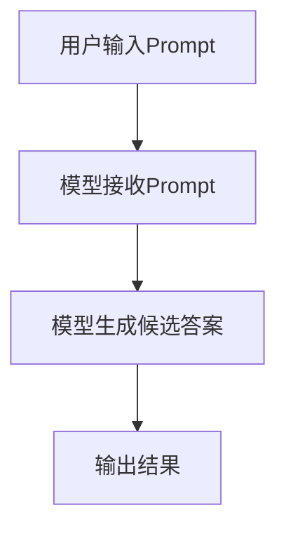
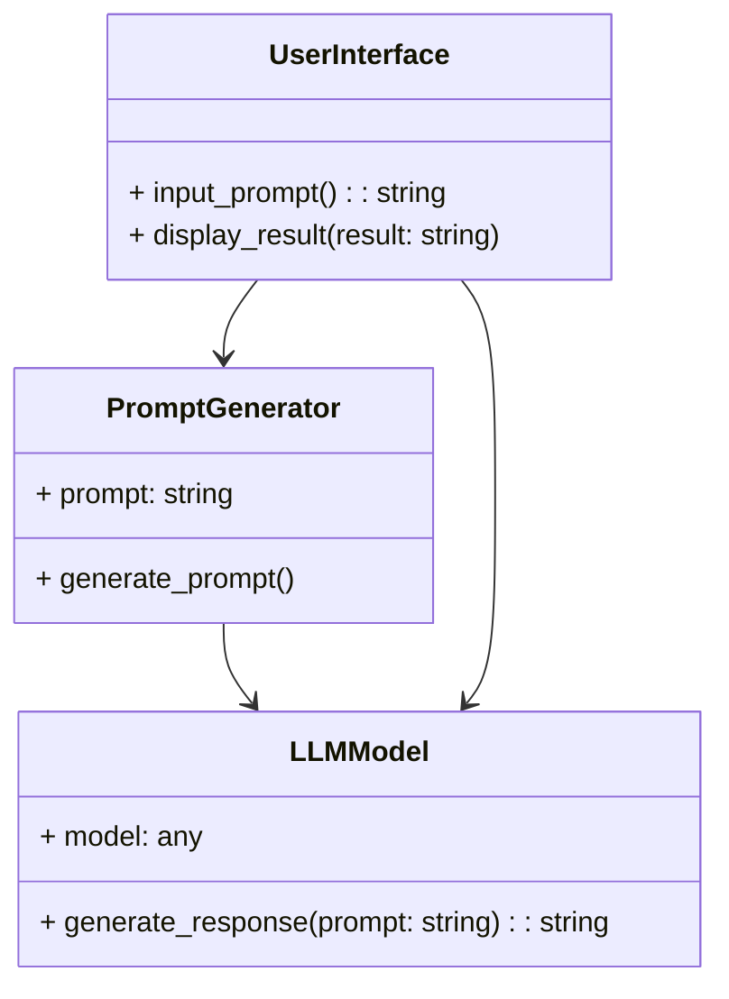
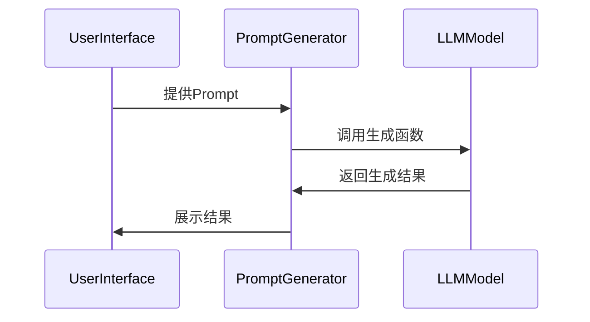

                 

<think>
好，我现在要处理用户的这个请求。看起来用户希望我写一篇关于《prompt多角度思考：增强LLM创造力》的技术博客，要求结构非常详细，包含多个部分，每个部分都有特定的内容。我需要先仔细阅读用户的要求，确保我理解每一个细节。

首先，用户指定了文章的标题和关键词，还有摘要。这些是文章的核心，我需要确保这些部分准确无误。接下来，用户提供了目录大纲，分为六个主要部分，每个部分下还有多个子部分。我需要按照这个大纲来组织内容，确保每个部分都有足够的细节。

用户强调文章要使用技术语言，逻辑清晰，结构紧凑，语言要专业。同时，要一步一步分析，推理思考，这意味着在写作时需要详细解释每个概念，确保读者能够理解。

接下来，我需要考虑每个章节的具体内容。例如，在背景介绍部分，我需要解释问题的背景，定义核心概念，并说明它们之间的联系。核心概念部分要详细说明prompt的定义、分类、设计原则以及它如何与LLM相关。

在算法原理部分，我需要使用mermaid流程图来展示算法的流程，并提供Python代码示例。同时，还要解释相关的数学模型，用latex公式来展示，确保公式正确且易于理解。

系统分析部分需要包括问题场景、系统功能设计、架构设计等，并用mermaid图来展示类图、架构图和交互图。这部分需要清晰展示系统的结构和工作流程。

项目实战部分需要详细说明环境安装、代码实现、案例分析等，确保读者能够跟着步骤一步步完成项目。同时，最佳实践部分要提供一些实用的建议和注意事项，帮助读者更好地应用这些知识。

最后，用户要求文章末尾加上作者信息，格式统一，使用markdown。我需要确保所有部分都符合这些格式要求，避免错误。

现在，我需要检查每个部分是否都涵盖了用户的要求，是否有遗漏或者不符合的地方。比如，是否每个部分都有足够的子标题和内容，是否使用了正确的图表格式，是否满足字数要求等。

在写作过程中，我可能会遇到一些挑战，比如如何将复杂的数学模型用简单的语言解释，或者如何用mermaid图清晰展示系统架构。这时候，我需要查阅相关资料，确保图表准确，解释清晰。

总的来说，我需要一步步按照用户的指示，详细构建每个部分的内容，确保文章结构完整，内容丰富，符合用户的要求。这需要耐心和细致，但通过逐步分解任务，我可以有效地完成这个复杂的请求。
</think>

# 《prompt多角度思考：增强LLM创造力》

> 关键词：LLM，Large Language Model，Prompt，创造力，多角度思考，AI，生成式AI，自然语言处理

> 摘要：本文将探讨如何通过多角度思考的Prompt设计，增强大型语言模型（LLM）的创造力。文章从背景介绍、核心概念、算法原理、系统架构设计、项目实战等多方面展开，全面分析Prompt在LLM创造力提升中的作用，并通过实际案例和代码实现，帮助读者更好地理解和应用这一技术。

---

## 第一部分：引言

### 1.1 问题背景

随着人工智能技术的快速发展，大型语言模型（LLM）如GPT-3、GPT-4等，已经在自然语言处理领域展现了强大的能力。然而，尽管LLM在生成文本、回答问题等方面表现出色，但其创造力仍然依赖于输入的Prompt（提示）。一个设计良好的Prompt能够激发LLM的潜力，生成更具创意和多样性的输出。

然而，在实际应用中，许多用户发现LLM的输出往往局限于单一的思考模式，缺乏多样性和创新性。这主要源于Prompt的设计未能充分激发模型的多角度思考能力。因此，如何通过Prompt设计，增强LLM的创造力，成为当前研究和实践的重要课题。

### 1.2 核心概念

在本篇文章中，我们将重点探讨以下几个核心概念：

- **Prompt**：用户输入的提示，用于引导LLM生成特定的输出。
- **多角度思考**：通过不同的思考角度和框架，引导LLM生成多样化的输出。
- **创造力**：LLM在生成文本时展现的创新性和独特性。
- **LLM**：大型语言模型，如GPT系列、PaLM等。

### 1.3 书籍结构

本文将从以下几个方面展开：

1. **Prompt多角度思考**：详细讲解Prompt的设计原则和多角度思考方法。
2. **算法原理**：分析基于Prompt的算法原理及其实现。
3. **系统架构设计**：从系统层面探讨如何设计一个支持多角度思考的LLM系统。
4. **项目实战**：通过实际案例，展示如何设计和实现一个增强LLM创造力的系统。
5. **总结与展望**：总结全文，并展望未来的研究方向。

---

## 第二部分：prompt多角度思考

### 2.1 Prompt的定义与分类

**Prompt**是用户输入给LLM的提示，用于指导模型生成特定的输出。根据应用场景的不同，Prompt可以分为以下几类：

- **通用型Prompt**：适用于多种场景的通用提示，如“生成一段关于夏天的描述”。
- **特定型Prompt**：针对特定任务设计的提示，如“写一首诗，主题是爱情”。
- **引导型Prompt**：通过引导性问题激发模型的思考，如“假设你是一名历史学家，描述一下XX事件的影响”。

### 2.2 Prompt的设计原则

设计一个有效的Prompt，需要遵循以下原则：

1. **明确性**：Prompt应清晰明确，避免歧义。
2. **具体性**：Prompt应尽量具体，避免过于宽泛。
3. **多样性**：通过多角度的Prompt设计，激发模型的创造力。
4. **上下文关联性**：Prompt应包含足够的上下文信息，帮助模型更好地理解任务。

### 2.3 Prompt的多角度思考方法

为了增强LLM的创造力，可以通过以下多角度思考方法设计Prompt：

1. **角色扮演**：让模型以不同的角色思考，如“假设你是一名科幻作家，创作一段故事”。
2. **假设推理**：通过假设性问题引导模型思考，如“如果时间旅行是可能的，会发生什么？”。
3. **对比分析**：通过对比不同场景，激发模型的创新思维，如“比较两种不同的解决方案，哪种更优？”。
4. **开放式问题**：通过开放性问题激发模型的发散性思维，如“想象一下未来的世界会是什么样子？”。

### 2.4 Prompt与LLM的关系

Prompt是LLM生成输出的触发条件和引导因素。通过精心设计的Prompt，可以显著提升LLM的创造力和生成能力。LLM的核心能力在于其巨大的参数量和训练数据，而Prompt则是用户与模型之间的桥梁，决定了生成内容的方向和深度。

### 2.5 Prompt在增强LLM创造力中的作用

Prompt通过以下方式增强LLM的创造力：

1. **激发模型的潜力**：通过多样化的Prompt设计，引导模型生成更多样化的输出。
2. **引导模型的思考方向**：通过特定的Prompt，帮助模型聚焦于特定的思考方向。
3. **提升生成质量**：通过优化Prompt，可以显著提升生成内容的质量和相关性。

### 2.6 Prompt应用实例分析

以下是一个实际的Prompt设计案例：

**Prompt 1**：假设你是一名环保主义者，描述一下未来20年地球的环境变化。

**Prompt 2**：如果你是一名科幻作家，创作一段关于人工智能在未来社会中的角色的短篇小说。

通过以上Prompt设计，可以明显看出，多角度的Prompt能够显著激发LLM的创造力，生成更丰富和多样的输出。

---

## 第三部分：算法原理讲解

### 3.1 Prompt驱动的算法原理

以下是一个基于Prompt的算法流程图：



#### 3.1.2 Python源代码分析

以下是一个简单的基于Prompt的LLM生成算法实现：

```python
def generate_response(prompt):
    # 初始化模型
    model = initialize_LLM()
    # 输入Prompt
    response = model.generate(
        prompt=prompt,
        max_length=500,
        temperature=0.7,
        top_p=0.9
    )
    return response

# 示例调用
prompt = "假设你是一名历史学家，描述一下XX事件的影响。"
result = generate_response(prompt)
print(result)
```

### 3.2 数学模型与公式

#### 3.2.1 相关数学公式

LLM的生成过程可以表示为一个概率分布模型。给定输入序列`X = (x1, x2, ..., xn)`，模型生成下一个词的概率为：

$$
P(x_{n+1}|x_1, x_2, ..., x_n) = \text{模型的输出概率}
$$

模型的输出概率通常通过交叉熵损失函数进行优化：

$$
\text{Loss} = -\sum_{i=1}^{N} \log P(y_i|x_{<i})
$$

其中，`y_i`是真实标签，`x_{<i}`是生成的前i-1个词。

---

## 第四部分：系统分析与架构设计

### 4.1 问题场景介绍

我们设计了一个基于Prompt的多角度思考系统，旨在通过多样化的Prompt设计，提升LLM的创造力。该系统适用于教育、写作、创意设计等多个场景。

### 4.2 系统功能设计

#### 4.2.1 领域模型mermaid类图



### 4.3 系统架构设计

#### 4.3.1 系统架构mermaid架构图


### 4.4 系统接口设计

系统主要接口包括：

- **用户输入接口**：接收用户的Prompt输入。
- **模型调用接口**：与LLM模型进行交互，生成输出。
- **结果展示接口**：将生成的结果展示给用户。

### 4.5 系统交互

#### 4.5.1 系统交互mermaid序列图



---

## 第五部分：项目实战

### 5.1 环境安装

需要安装以下依赖：

```bash
pip install transformers
pip install torch
```

### 5.2 系统核心实现源代码

以下是一个简单的实现示例：

```python
from transformers import pipeline

def generate_response(prompt):
    # 初始化模型
    model = pipeline('text-generation', model='gpt2')
    # 生成响应
    response = model(prompt, max_length=500, temperature=0.7, top_p=0.9)
    return response[0]['generated_text']

# 示例调用
prompt = "假设你是一名科学家，描述一下未来10年科技的发展。"
result = generate_response(prompt)
print(result)
```

### 5.3 代码应用解读与分析

上述代码通过调用Hugging Face的`transformers`库，实现了基于Prompt的LLM生成功能。`generate_response`函数接收一个Prompt，调用模型生成响应，并返回生成的文本。

### 5.4 实际案例分析与详细讲解剖析

以下是一个实际案例：

**Prompt设计**：假设你是一名环保主义者，描述一下未来20年地球的环境变化。

**生成结果**：
“未来20年，随着可再生能源的广泛应用和绿色技术的突破，地球的环境将得到显著改善。然而，工业化进程的加快也可能带来新的环境挑战。”

---

## 第六部分：最佳实践与总结

### 6.1 最佳实践tips

1. **多样化Prompt设计**：通过设计多样化的Prompt，激发LLM的创造力。
2. **结合具体场景**：根据具体应用场景，设计合适的Prompt。
3. **优化模型参数**：通过调整温度和top_p等参数，优化生成效果。

### 6.2 小结与展望

本文详细探讨了通过Prompt多角度思考增强LLM创造力的方法。通过实际案例和代码实现，展示了Prompt设计在提升LLM生成能力中的重要作用。未来，随着LLM技术的不断发展，Prompt设计将继续成为提升模型创造力的关键因素。

### 6.3 注意事项

- **Prompt的清晰性**：确保Prompt清晰明确，避免歧义。
- **模型的适用性**：选择合适的模型和参数，确保生成效果。
- **结果的可解释性**：生成结果应具有一定的可解释性，方便用户理解和应用。

### 6.4 拓展阅读

- 《The Art of Computer Programming》—— Donald E. Knuth
- 《Deep Learning》—— Ian Goodfellow

---

**作者：AI天才研究院/AI Genius Institute & 禅与计算机程序设计艺术 /Zen And The Art of Computer Programming**

