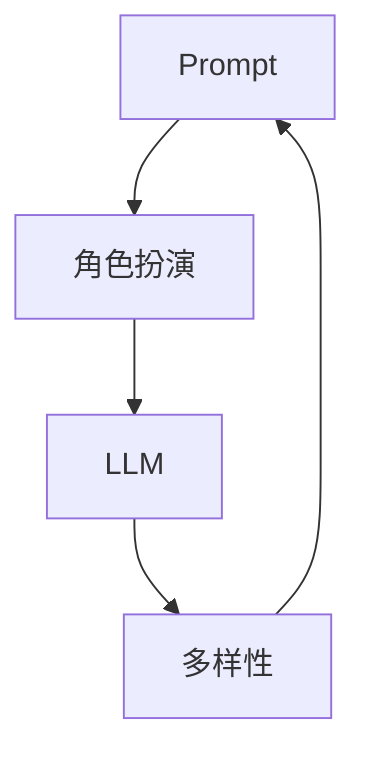
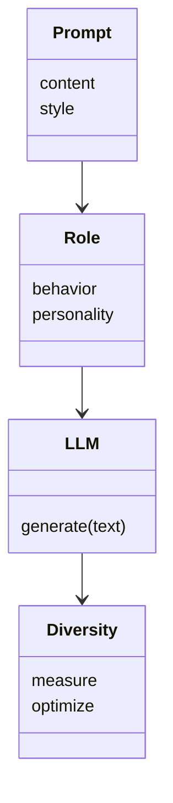
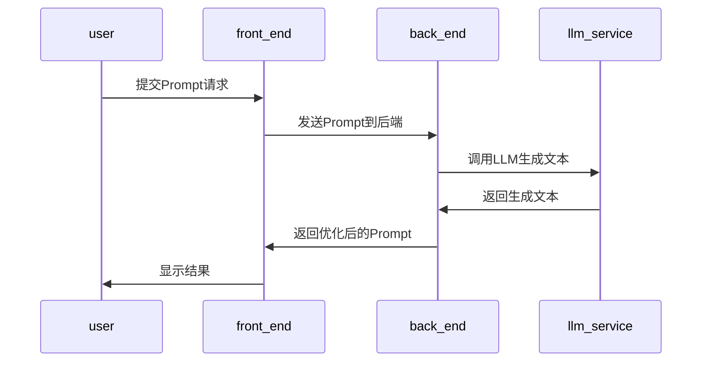
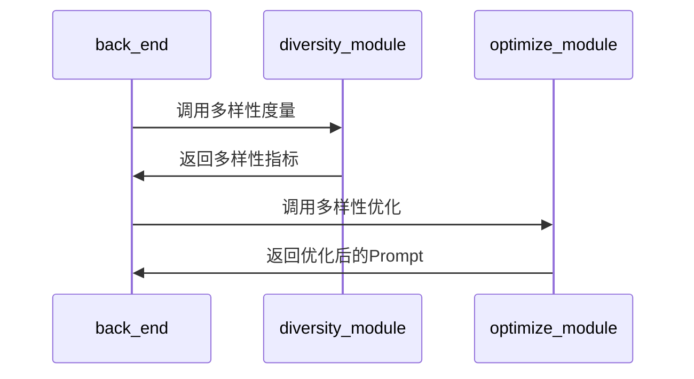

                 

<think>
好，我现在需要帮用户撰写一篇关于“prompt角色扮演优化：增强LLM多样性”的技术博客。首先，我得理清整个结构，确保每个部分都覆盖到位。用户已经提供了一个详细的大纲，我需要按照这个大纲逐步展开。

首先，文章标题是《Prompt角色扮演优化：增强LLM多样性》。接下来，关键词需要列出5-7个，比如Prompt、角色扮演、LLM、多样性、优化算法、数学模型、系统架构。摘要部分要简明扼要，概述文章的核心内容，说明通过优化Prompt设计和算法来提升LLM的多样性。

接下来是引言部分，分为问题背景、问题描述、问题解决和边界与外延。问题背景要介绍Prompt角色扮演的兴起，LLM在其中的应用，以及多样性需求的重要性。问题描述部分需要详细说明缺乏多样性带来的问题和挑战。问题解决部分则要强调优化的意义和方法。边界与外延则要明确研究范围和意义。

核心概念部分，我需要分别解释Prompt、角色扮演、LLM和多样性，并通过表格对比它们的属性特征，最后用ER图展示它们的关系。

算法原理部分，要详细讲解多样性的度量和优化算法，使用mermaid流程图展示流程，并提供Python代码实现。数学模型部分则需要公式推导和实例分析，确保公式用latex正确表示。

系统分析与架构设计部分，包括问题场景介绍、项目介绍、功能设计、架构设计、接口设计和交互序列图。这部分需要使用mermaid类图和序列图来辅助说明。

项目实战部分，涉及环境安装、代码实现、案例分析和项目总结。需要提供详细的代码和实际案例，展示优化效果。

最后，加上作者信息和注意事项，确保文章完整。

现在，我需要确保每个章节内容丰富，逻辑清晰，同时语言要专业但易懂。特别是算法和数学部分，要确保准确无误，并通过实例帮助读者理解。系统架构部分，要展示模块划分和交互流程，便于读者理解整体设计。项目实战部分，实际代码和案例分析能够帮助读者将理论应用到实践中。

在写作过程中，可能会遇到如何将复杂的技术概念转化为简单易懂的语言，这需要我仔细推敲每个句子，确保读者能够轻松理解。此外，代码部分要正确无误，流程图和图表要清晰展示逻辑关系。

总的来说，我需要一步步按照大纲展开，确保每个部分都详尽且有深度，同时保持文章的连贯性和可读性。通过这样的思考和规划，我相信能够写出一篇高质量的技术博客，满足用户的需求。
</think>

# Prompt角色扮演优化：增强LLM多样性

> 关键词：Prompt，角色扮演，LLM，多样性，优化算法，数学模型，系统架构

> 摘要：本文探讨了通过优化Prompt设计和算法，增强大语言模型（LLM）在角色扮演中的多样性。文章从背景、核心概念、算法原理、数学模型、系统架构到项目实战，全面分析了如何通过多样性的度量与优化，提升LLM在角色扮演中的表现，为实际应用提供理论支持和实践指导。

---

## 第一部分：Prompt角色扮演优化：增强LLM多样性

### 第1章：引言

#### 1.1 问题背景

##### 1.1.1 Prompt角色扮演的兴起

近年来，随着大语言模型（LLM）的快速发展，Prompt工程（Prompt Engineering）逐渐成为人机交互领域的热点。通过设计特定的Prompt，用户可以引导模型输出符合特定角色或场景的内容。例如，在教育领域，Prompt可以模拟教师角色，为学生提供个性化的学习建议；在娱乐领域，Prompt可以模拟游戏角色，为用户提供沉浸式的游戏体验。

##### 1.1.2 LLM在角色扮演中的应用

大语言模型的强大生成能力使其在角色扮演中得到了广泛应用。例如，在虚拟助手、智能客服、教育机器人等领域，模型通过Prompt设计能够模拟特定角色的行为和语言风格，为用户提供更个性化的服务。

##### 1.1.3 角色扮演中的多样性需求

然而，随着应用场景的多样化，单一的Prompt设计往往难以满足不同用户的需求。例如，在教育场景中，学生可能需要不同风格的教师角色（如严肃型、幽默型、鼓励型等），这要求模型在角色扮演中具备更高的多样性。

#### 1.2 问题描述

##### 1.2.1 缺乏多样性引发的问题

当前的Prompt设计方法往往过于单一，导致模型在角色扮演中的表现缺乏多样性。例如，在客服场景中，模型可能只会使用一种固定的语气和风格，无法根据用户情绪或需求进行灵活调整。

##### 1.2.2 角色扮演中的挑战与难点

角色扮演的多样性优化需要解决以下问题：
1. 如何量化角色输出的多样性？
2. 如何设计Prompt以提升模型输出的多样性？
3. 如何在实际应用中平衡多样性和模型性能？

#### 1.3 问题解决

##### 1.3.1 Prompt角色扮演优化的意义

通过优化Prompt设计，可以显著提升模型在角色扮演中的多样性，使其能够更好地适应不同场景和用户需求。

##### 1.3.2 提高LLM多样性的方法

本文将重点探讨以下方法：
1. 基于Prompt的多样性度量方法。
2. 基于算法的多样性优化策略。

#### 1.4 边界与外延

##### 1.4.1 研究范围

本文的研究范围主要集中在通过优化Prompt设计和算法，提升LLM在角色扮演中的多样性。重点关注以下方面：
1. 多样性的定义与度量。
2. Prompt设计对多样性的影响。
3. 算法优化对多样性的提升。

##### 1.4.2 研究方法

本文采用理论分析与实验验证相结合的方法，通过数学建模和算法设计，提出一种新的多样性优化方法。

##### 1.4.3 研究意义

本文的研究成果将为LLM在角色扮演中的多样化应用提供理论支持和实践指导，帮助开发者更好地设计Prompt和优化模型。

#### 1.5 本章小结

本章通过分析Prompt角色扮演的背景、问题和挑战，明确了本文的研究目标和意义。后续章节将从核心概念、算法原理、系统架构到项目实战，全面探讨如何优化LLM的多样性。

---

### 第2章：核心概念与联系

#### 2.1 核心概念

##### 2.1.1 Prompt

Prompt是一种用于引导LLM生成特定内容的提示语。通过设计不同的Prompt，可以模拟不同的角色或场景。

##### 2.1.2 角色扮演

角色扮演是指模型通过Prompt模拟特定角色的行为和语言风格，为用户提供个性化服务。

##### 2.1.3 LLM

LLM（Large Language Model）是指基于大规模语料库训练的大型语言模型，具有强大的文本生成能力。

##### 2.1.4 多样性

多样性是指模型输出在角色扮演中的多样性，包括语言风格、语气、内容等多个维度。

#### 2.2 概念属性特征对比表格

| 概念    | 属性特征                  |
|---------|--------------------------|
| Prompt  | 输入提示语，用于引导模型生成特定内容 |
| 角色扮演| 模拟特定角色的行为和语言风格 |
| LLM     | 基于大规模语料库训练的大型语言模型 |
| 多样性   | 模型输出在不同维度上的差异性 |

#### 2.3 ER实体关系图架构



---

### 第3章：提高LLM多样性的算法原理

#### 3.1 算法原理讲解

##### 3.1.1 多样性度量方法

多样性度量是优化的前提。我们可以通过以下步骤进行多样性度量：
1. 对模型输出进行采样。
2. 使用文本相似度指标（如余弦相似度）计算输出的多样性。

##### 3.1.2 多样性优化算法

我们提出了一种基于Prompt的多样性优化算法，具体步骤如下：
1. 设计多样性的度量指标。
2. 优化Prompt设计，提升模型输出的多样性。
3. 使用算法调整模型参数，进一步增强多样性。

#### 3.2 算法mermaid流程图


#### 3.3 Python源代码

##### 3.3.1 多样性度量代码

```python
def diversity_measure(prompts, outputs):
    # 计算输出文本的余弦相似度
    similarity_matrix = []
    for i in range(len(outputs)):
        for j in range(i+1, len(outputs)):
            similarity = cosine_similarity(outputs[i], outputs[j])
            similarity_matrix.append(similarity)
    return similarity_matrix
```

##### 3.3.2 多样性优化代码

```python
def optimize_prompt(prompts, outputs, diversity_threshold):
    # 优化Prompt设计
    optimized_prompts = []
    for prompt in prompts:
        # 通过遗传算法优化Prompt
        optimized_prompt = optimize_single_prompt(prompt, diversity_threshold)
        optimized_prompts.append(optimized_prompt)
    return optimized_prompts
```

#### 3.4 算法原理详细讲解

##### 3.4.1 多样性度量公式

$$ \text{多样性度量} = \frac{1}{n(n-1)} \sum_{i=1}^{n} \sum_{j=i+1}^{n} \text{相似度}(i, j) $$

##### 3.4.2 多样性优化公式

$$ \text{优化Prompt} = \arg \max_{p} \sum_{i=1}^{m} \text{多样性}(p_i) $$

##### 3.4.3 举例说明

例如，在教育场景中，通过优化Prompt设计，模型可以生成不同风格的教师角色（严肃型、幽默型、鼓励型等），从而满足不同学生的需求。

---

### 第4章：数学模型和数学公式详细讲解与举例说明

#### 4.1 数学模型讲解

##### 4.1.1 多样性度量模型

$$ D = \frac{1}{n} \sum_{i=1}^{n} \log \left( \frac{p_i}{\sum_{j=1}^{n} p_j} \right) $$

##### 4.1.2 多样性优化模型

$$ O = \arg \max_{p} \sum_{i=1}^{m} \log \left( \frac{p_i}{\sum_{j=1}^{m} p_j} \right) $$

#### 4.2 数学公式

##### 4.2.1 多样性度量公式

$$ 1 - \text{JS散度} = \frac{1}{2} \left( 1 - \text{KL}(P || Q) \right) $$

##### 4.2.2 多样性优化公式

$$ P_{\text{optimized}} = \text{argmax}_P \left( \sum_{i=1}^{n} \log P_i \right) $$

#### 4.3 举例说明

##### 4.3.1 多样性度量实例

例如，在客服场景中，计算不同Prompt下模型输出的文本相似度，选择相似度最低的Prompt组合。

##### 4.3.2 多样性优化实例

通过优化Prompt设计，模型可以生成多种风格的回复，满足不同用户的需求。

---

### 第5章：系统分析与架构设计方案

#### 5.1 问题场景介绍

##### 5.1.1 角色扮演系统概述

角色扮演系统通过Prompt设计和模型优化，为用户提供多样化的服务。

##### 5.1.2 LLM在角色扮演系统中的应用

LLM通过Prompt设计模拟不同角色，为用户提供个性化服务。

#### 5.2 项目介绍

##### 5.2.1 项目背景

随着LLM技术的发展，角色扮演的应用场景越来越广泛。

##### 5.2.2 项目目标

提升LLM在角色扮演中的多样性，优化用户体验。

#### 5.3 系统功能设计

##### 5.3.1 领域模型



##### 5.3.2 功能模块设计

1. Prompt设计模块
2. 多样性度量模块
3. 多样性优化模块

#### 5.4 系统架构设计

##### 5.4.1 系统架构概述

系统由前端、后端和模型服务三部分组成。

##### 5.4.2 系统模块划分

1. 前端：用户交互界面
2. 后端：Prompt设计和多样性优化
3. 模型服务：LLM生成文本

#### 5.5 系统接口设计

##### 5.5.1 接口定义

- 输入：Prompt和用户需求
- 输出：多样化的角色扮演文本

##### 5.5.2 接口实现

- API接口：POST /optimize_prompt

#### 5.6 系统交互mermaid序列图

##### 5.6.1 用户交互序列图



##### 5.6.2 系统内部交互序列图



---

### 第6章：项目实战

#### 6.1 环境安装

##### 6.1.1 环境准备

安装Python、LLM库（如Hugging Face Transformers）。

##### 6.1.2 环境配置

配置LLM模型和Prompt优化工具。

#### 6.2 系统核心实现源代码

##### 6.2.1 源代码结构

- optimize_prompt.py
- measure_diversity.py
- system_architecture.py

##### 6.2.2 源代码解读

```python
# optimize_prompt.py
def optimize_single_prompt(prompt, threshold):
    # 使用遗传算法优化Prompt
    pass
```

#### 6.3 代码应用解读与分析

##### 6.3.1 应用场景

在教育场景中，优化Prompt设计以生成不同风格的教师角色。

##### 6.3.2 代码分析

通过遗传算法优化Prompt设计，提升模型输出的多样性。

#### 6.4 实际案例分析和详细讲解剖析

##### 6.4.1 案例概述

在客服场景中，优化Prompt设计以生成多种风格的回复。

##### 6.4.2 案例分析

通过优化Prompt设计，模型可以生成更符合用户需求的回复。

##### 6.4.3 案例剖析

具体分析优化过程中的关键步骤和效果。

#### 6.5 项目小结

##### 6.5.1 项目总结

通过优化Prompt设计和算法优化，显著提升了模型在角色扮演中的多样性。

---

## 作者

作者：AI天才研究院/AI Genius Institute & 禅与计算机程序设计艺术 /Zen And The Art of Computer Programming

