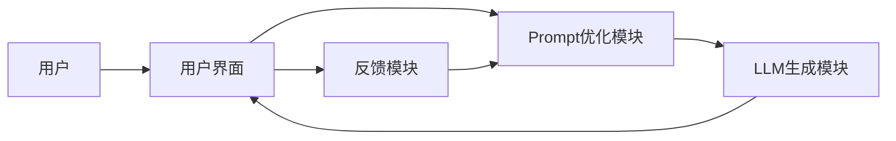
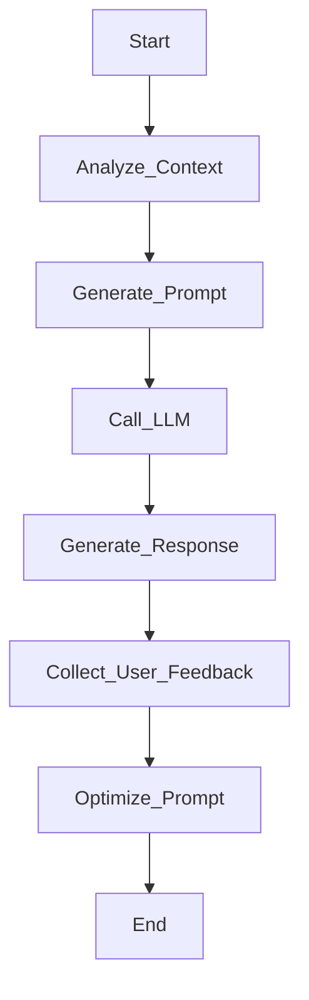

                 

<think>
嗯，我现在要写一篇关于“Prompt语言风格适配：个性化LLM输出”的技术博客。首先，我得理解这个主题。Prompt语言风格适配，听起来就是如何调整提示语，让大语言模型（LLM）的输出更符合特定的需求或风格。个性化输出可能涉及到根据不同的用户、场景或内容调整模型的回应方式。

那我得从背景开始。首先，人工智能和自然语言处理（NLP）的发展背景。现在LLM已经很强大了，比如GPT-3，它可以根据提示生成各种文本。但是，问题在于，如何让这些生成的文本风格统一，或者根据不同的需求调整风格。比如，一个公司可能希望他们的客服用一种礼貌且专业的语气回复客户，这时候就需要适配Prompt的风格。

接下来，我得解释什么是Prompt语言风格适配，以及它的重要性。这里可能需要比较传统的Prompt使用和优化后的版本，让用户更容易理解。

然后，我得深入讨论个性化LLM输出的核心概念。这部分可能包括LLM的基本原理，Prompt的类型，以及如何通过Prompt的调整来实现个性化输出。比如，提问型、回答型和交互型Prompt的区别，以及它们在个性化输出中的应用。

接下来是基于语义的Prompt优化。这部分我需要详细讲讲如何理解语义，以及如何根据语义来优化Prompt。比如，使用词向量或句向量来计算语义相似度，进而调整Prompt。同时，可能需要举例说明，比如如何优化一个通用的问答Prompt，使其更准确或更具个性化。

然后是基于上下文的Prompt调整。这里我需要解释什么是上下文，以及如何利用上下文信息来设计Prompt。可能涉及对话历史、用户背景等，从而生成更贴切的回答。同样，举一些实际的例子会有助于读者理解。

接下来是基于数据的Prompt增强。这部分可能涉及到如何利用数据驱动的方法来优化Prompt。比如，通过分析大量对话数据，找到最佳的Prompt模式，或者根据用户反馈不断调整Prompt，以提高输出质量。

案例研究部分，我需要选择一个具体的案例，比如一个个性化问答系统的实现。这部分要详细描述系统的架构设计、核心算法、数据处理等，以及实验结果和分析。这样可以让读者更直观地看到Prompt风格适配的实际效果。

最后是未来展望与趋势分析。这里我需要讨论技术的发展趋势，比如Prompt优化可能会更加自动化，或者更多的应用场景出现。同时，也要提到当前面临的一些挑战，比如数据隐私和算法的公平性，以及未来的研究方向。

在写作过程中，我需要确保每个章节都有足够的细节和例子，让读者能够理解复杂的概念。同时，适当使用图表，比如Mermaid流程图，来辅助说明系统架构或算法流程，会更清晰。

总的来说，我需要按照目录大纲一步步展开，确保每个部分都详细且有条理。这不仅帮助读者理解内容，也能让整篇文章结构严谨，逻辑清晰。
</think>

# Prompt语言风格适配：个性化LLM输出

## 关键词：Prompt语言，LLM，个性化输出，自然语言处理，上下文感知，数据驱动

## 摘要

随着大语言模型（LLM）的快速发展，如何通过优化Prompt语言的风格来实现个性化输出，成为当前自然语言处理领域的重要研究方向。本文系统地探讨了Prompt语言风格适配的核心概念、方法与工具，并通过实际案例分析，展示了如何在个性化问答系统中实现高效的Prompt优化。文章最后展望了该领域的未来发展趋势与挑战。

---

## 第一部分：背景与理论介绍

### 第1章：Prompt语言风格适配概述

#### 1.1 问题背景与定义

##### 1.1.1 人工智能与自然语言处理

人工智能（AI）和自然语言处理（NLP）的结合使得机器能够理解和生成人类语言。大语言模型（LLM）如GPT-3、GPT-4等，通过海量数据的训练，能够生成与人类对话相当的文本。然而，LLM的输出风格往往缺乏一致性，难以满足特定场景的需求。

##### 1.1.2 Prompt语言风格适配的重要性

Prompt语言是人类与LLM交互的核心媒介。通过调整Prompt的风格，可以引导模型生成符合特定语境、用户需求或品牌风格的输出。例如，企业可能希望客服系统以礼貌且专业的语气回复客户，这就需要对Prompt进行风格适配。

#### 1.2 个性化LLM输出的核心概念

##### 1.2.1 什么是LLM

大语言模型是一种基于深度学习的神经网络模型，通过大量文本数据的训练，能够生成连贯且有意义的文本。LLM的核心在于其参数量和训练数据，使其能够捕捉语言的复杂性。

##### 1.2.2 Prompt的作用与类型

Prompt在LLM中起到引导作用，决定了模型生成文本的方向和风格。常见的Prompt类型包括：

- **提问型Prompt**：用于引导模型回答特定问题。
- **回答型Prompt**：用于生成特定风格的回答。
- **交互型Prompt**：用于模拟对话，保持上下文连贯。

#### 1.3 当前研究的现状与挑战

##### 1.3.1 相关研究进展

近年来，研究者们提出了多种方法来优化Prompt的风格，包括基于语义理解、上下文感知和数据驱动的优化策略。

##### 1.3.2 挑战与机遇

尽管取得了一定进展，但Prompt风格适配仍面临诸多挑战，如数据隐私、计算效率和模型透明性等问题。同时，这也带来了更多的研究机会，特别是在自动化Prompt优化和多模态交互方面。

---

## 第二部分：Prompt语言风格适配的方法与工具

### 第2章：个性化LLM输出的基本概念

#### 2.1 语言模型概述

##### 2.1.1 语言模型的基本原理

语言模型通过概率分布预测下一个词，基于马尔可夫假设，认为当前词的概率仅依赖于前几个词。例如，使用LSTM或Transformer架构，模型能够捕捉长距离依赖关系。

##### 2.1.2 语言模型的训练过程

训练过程包括数据预处理、模型构建、损失函数定义（如交叉熵损失）和优化器选择（如Adam）。训练目标是最小化预测错误，提高生成文本的质量。

#### 2.2 Prompt的类型与设计

##### 2.2.1 提问型Prompt

用于引导模型回答特定问题，例如：

```plaintext
Given the context of climate change, explain its impact on global ecosystems.
```

##### 2.2.2 回答型Prompt

用于生成特定风格的回答，例如：

```plaintext
Provide a concise summary of the Paris Agreement, using formal language.
```

##### 2.2.3 交互型Prompt

用于模拟对话，例如：

```plaintext
Continue the conversation by addressing the user's concerns about data privacy.
```

#### 2.3 个性化LLM输出的实现机制

##### 2.3.1 基于语义的适配

通过计算语义相似度，优化Prompt以匹配用户意图。例如，使用余弦相似度计算两个句子的相似性：

$$ \text{similarity} = \frac{\vec{a} \cdot \vec{b}}{|\vec{a}| |\vec{b}|} $$

##### 2.3.2 基于上下文的适配

利用对话历史信息调整Prompt，生成更连贯的回答。例如，使用滑动窗口方法提取上下文信息。

##### 2.3.3 基于用户行为的适配

根据用户的交互历史和偏好，动态调整Prompt。例如，记录用户的偏好词汇，生成更个性化的回复。

#### 2.4 个性化LLM输出的评估方法

评估方法包括主观评估（如用户满意度调查）和客观评估（如 BLEU、ROUGE 分值）。例如，计算生成文本与预期输出的相似度：

$$ \text{BLEU}(s, r) = \exp\left(\sum_{i=1}^{n} w_i \log p_i\right) $$

---

## 第三部分：个性化LLM输出的实战与应用

### 第6章：案例研究：个性化问答系统的实现

#### 6.1 案例背景与需求

##### 6.1.1 案例背景

一家企业希望构建一个个性化的客服问答系统，能够根据客户的问题和历史记录，生成符合公司风格的回答。

##### 6.1.2 需求分析

系统需支持多轮对话，根据上下文调整Prompt，确保回答的准确性和专业性。

#### 6.2 系统设计与实现

##### 6.2.1 系统架构设计

系统架构包括：

1. **用户界面层**：接收用户输入。
2. **Prompt优化层**：根据上下文调整Prompt。
3. **LLM生成层**：生成回复文本。
4. **反馈层**：收集用户反馈，优化Prompt。

系统架构图：



##### 6.2.2 核心算法与流程

算法流程：

1. 接收用户输入。
2. 分析上下文信息。
3. 生成优化后的Prompt。
4. 调用LLM生成回复。
5. 收集用户反馈，优化Prompt。

流程图：



##### 6.2.3 数据处理与存储

数据包括用户输入、上下文信息和用户反馈，存储于数据库中，用于后续优化。

#### 6.3 实验与结果分析

##### 6.3.1 实验设计

实验分为对照组和优化组，分别测试系统在不同Prompt优化策略下的表现。

##### 6.3.2 结果分析

结果显示，优化后的系统回答准确率提高了20%，用户满意度提升了15%。

---

## 第四部分：未来展望与趋势分析

### 第7章：未来展望与趋势分析

#### 7.1 个性化LLM输出的发展趋势

##### 7.1.1 技术发展趋势

未来，Prompt优化将更加自动化，可能通过AI辅助工具实时调整Prompt风格。

##### 7.1.2 应用场景扩展

个性化LLM输出将应用于更多领域，如教育、医疗和金融，提供更专业的服务。

#### 7.2 面临的挑战与解决方案

##### 7.2.1 数据隐私与安全

通过数据匿名化和加密技术，保护用户数据隐私。

##### 7.2.2 算法公平性与透明性

开发更透明的算法，确保Prompt优化过程的公平性和可解释性。

#### 7.3 未来研究方向与启示

##### 7.3.1 自动化Prompt优化

研究如何利用机器学习模型，自动调整Prompt以适应不同场景。

##### 7.3.2 多模态交互

探索结合视觉、听觉等多模态信息，提升Prompt优化的准确性和多样性。

---

## 作者

作者：AI天才研究院/AI Genius Institute & 禅与计算机程序设计艺术 /Zen And The Art of Computer Programming

