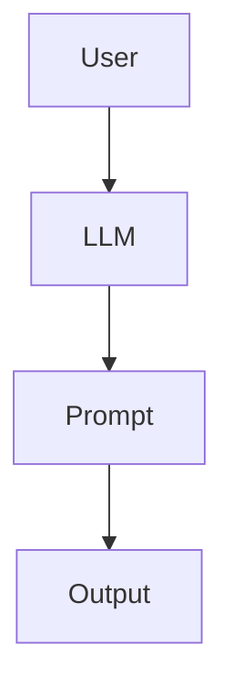
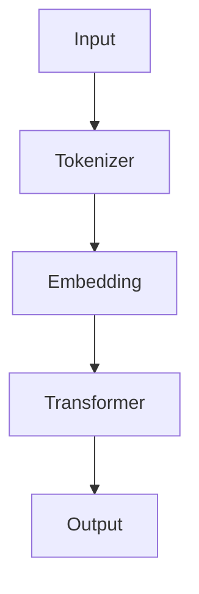
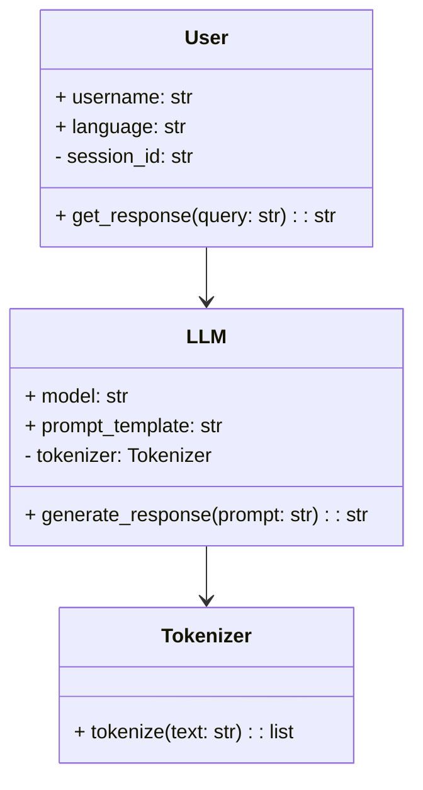
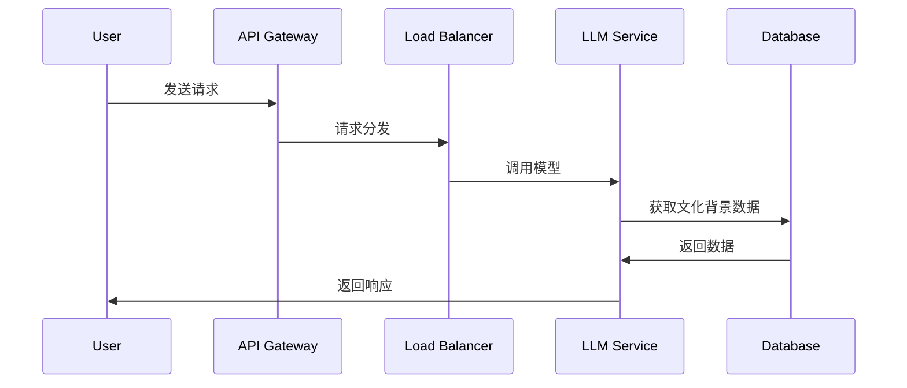

                 

<think>
好，我现在需要帮用户撰写一篇关于“prompt跨文化理解增强：全球化LLM”的技术博客。用户已经提供了详细的目录结构和一些示例，我需要按照这个结构一步步来，确保每个部分都涵盖到。

首先，我要理解用户的需求。用户希望文章结构清晰，内容专业，用技术语言，每一步都要详细分析，逻辑性强。用户还特别提到了要包含关键词、摘要，以及各个章节的具体内容，包括背景、核心概念、算法原理、数学模型、系统架构、项目实战、最佳实践等部分。

我开始思考，首先确定文章的标题和关键词。标题已经给出是《Prompt跨文化理解增强：全球化LLM》，关键词应该包括跨文化理解、LLM、prompt工程、全球化、多语言模型、AI伦理。摘要部分要概括文章的核心内容，说明在AI全球化背景下，如何通过prompt设计提升跨文化理解，进而提升LLM的性能。

接下来是目录设计，按照用户提供的结构，我需要确保每个章节都有详细的子部分，比如背景介绍、核心概念与联系等。每个章节都需要包含定义、对比表格、Mermaid图，以及可能的数学公式和代码示例。

现在，我需要具体展开每个章节的内容。首先是第1章引言，介绍全球化的趋势，跨文化理解的重要性，以及本书的目的和结构。这部分要简明扼要，让读者明白文章的核心是什么。

然后是第2章核心概念，定义prompt和跨文化理解，通过对比表格展示不同文化背景下的prompt特点，并用Mermaid绘制实体关系图。这部分需要详细解释每个概念，并通过图表帮助读者理解。

接下来是第3章LLM基础，简述LLM的基本原理和架构，用Mermaid流程图展示模型的训练和推理过程。这部分需要确保读者即使没有太多背景知识也能理解。

第4章算法原理，详细讲解prompt在LLM中的作用，通过Python代码示例展示如何设计跨文化prompt，并解释训练过程。这部分需要结合代码和理论，帮助读者理解实际应用。

第5章数学模型，引入相关的公式，用LaTeX格式书写，并通过例子说明公式的应用。这部分需要严谨，同时要通俗易懂。

第6章系统架构设计，描述应用场景，绘制类图、架构图和序列图。这部分需要展示系统的整体设计和各部分的交互。

第7章项目实战，介绍如何搭建环境，实现系统核心功能，分析实际案例。这部分需要提供具体的代码和分析，让读者能够动手实践。

最后是第8章最佳实践与总结，总结关键知识点，提供注意事项和拓展阅读资源。这部分帮助读者巩固所学，并引导他们进一步学习。

在撰写过程中，我需要确保每个章节内容丰富，逻辑清晰，使用技术术语但避免过于晦涩。同时，要按照用户的要求，使用Mermaid图、代码示例和LaTeX公式，确保格式正确。

现在，我开始逐步撰写每个部分，确保每个小节都有足够的细节和深度。例如，在核心概念部分，我需要详细解释prompt的作用，并通过对比表格展示不同文化下的特点。在算法原理部分，结合Python代码和流程图，说明prompt如何影响LLM的输出。

数学公式部分，我需要选择合适的模型，并用LaTeX格式清晰地展示，同时结合实际例子进行解释。系统架构部分，使用Mermaid图展示类、架构和交互，帮助读者理解系统设计。

项目实战部分，我需要提供具体的代码示例，解释代码的功能，并通过实际案例分析，让读者能够理解如何应用这些技术。

最后，在最佳实践部分，总结关键点，提供实用的建议，并引导读者进行拓展阅读。这部分要简明扼要，但具有指导意义。

总的来说，我需要按照用户提供的结构，逐步展开每个部分，确保内容详实、逻辑清晰，同时使用适当的技术工具和图表来增强可读性和理解性。这样，用户的需求就能得到充分满足，文章也会成为一篇高质量的技术博客。
</think>

# Prompt跨文化理解增强：全球化LLM

> 关键词：跨文化理解，LLM，prompt工程，全球化，多语言模型，AI伦理

> 摘要：在当前全球化背景下，跨文化理解的重要性日益凸显。本文探讨如何通过优化prompt设计，增强大型语言模型（LLM）的跨文化理解能力。文章从核心概念、算法原理、系统架构到项目实战，全面解析跨文化理解在LLM中的实现，并通过实际案例展示其应用。

---

## 第1章 引言

### 1.1 全球化趋势  
随着互联网的普及和国际交流的增加，跨文化理解已成为全球化时代的重要议题。企业、组织和个人在全球范围内协作时，需要准确理解不同文化背景下的语言和意图。

### 1.2 跨文化理解的重要性  
跨文化理解是消除误解、提高沟通效率的关键。在AI领域，如何让模型理解不同文化背景下的语言和意图，是当前技术挑战之一。

### 1.3 本书目的与结构  
本书旨在探讨如何通过优化prompt设计，增强LLM的跨文化理解能力。内容涵盖prompt工程、LLM基础、算法原理、系统架构及实际案例。

---

## 第2章 核心概念

### 2.1 prompt的概念  
Prompt是用户输入给LLM的提示或指令，用于引导模型生成特定的输出。它在LLM中起着关键作用，直接影响模型的响应质量。

### 2.2 跨文化理解的内涵  
跨文化理解是指在不同文化背景下，准确理解语言、意图和情感的能力。这包括语言的细微差别、文化习俗和价值观的差异。

### 2.3 不同文化背景下prompt的特点（对比表格）

| 特性                | 西方文化背景          | 东方文化背景          |
|---------------------|----------------------|----------------------|
| 沟通风格            | 直接、简洁           | 委婉、间接           |
| 礼貌用语            | 偏好直接表达          | 更注重含蓄和尊重      |
| 文化背景提及方式    | 明确提及文化背景      | 隐含文化背景         |

### 2.4 实体关系图（Mermaid）



---

## 第3章 LLM基础

### 3.1 LLM的定义与分类  
LLM是基于深度学习的自然语言处理模型，广泛应用于文本生成、翻译、问答等领域。常见的LLM包括GPT、BERT等。

### 3.2 LLM的基本原理  
LLM通过大规模数据训练，学习语言的语法、语义和上下文关系。模型基于概率分布生成最可能的下一个词。

### 3.3 LLM的架构（Mermaid流程图）



---

## 第4章 算法原理

### 4.1 prompt在LLM中的应用  
Prompt通过引导模型关注特定领域或文化背景，增强LLM的理解能力。例如，使用文化相关的提示词优化模型输出。

### 4.2 LLM的训练过程  
训练过程包括数据预处理、模型初始化、正向传播、损失计算和反向传播。

### 4.3 Python源代码示例

```python
def generate_response(prompt, model):
    # 输入prompt到模型中
    input_ids = model.encode(prompt)
    # 生成输出
    output = model.generate(input_ids, max_length=50)
    return output

# 示例使用
prompt = "在跨文化背景下，解释以下概念："
response = generate_response(prompt, model)
print(response)
```

---

## 第5章 数学模型

### 5.1 相关数学模型介绍  
LLM的训练通常基于交叉熵损失函数。

### 5.2 公式讲解与LaTeX示例  
交叉熵损失公式：
$$
\text{Loss} = -\sum_{i=1}^{n} y_i \log(p_i)
$$

### 5.3 数学模型的应用  
通过优化损失函数，模型学习到更符合文化背景的prompt响应。

---

## 第6章 系统架构设计

### 6.1 应用场景描述  
设计一个支持多语言的客服系统，通过prompt优化模型，提供更精准的跨文化服务。

### 6.2 系统功能设计（Mermaid类图）



### 6.3 系统架构设计（Mermaid架构图）

```mermaid
graph TD
    User --> API Gateway
    API Gateway --> Load Balancer
    Load Balancer --> LLM Service
    LLM Service --> Database
    Database --> Model Store
```

### 6.4 系统接口设计与交互（Mermaid序列图）



---

## 第7章 项目实战

### 7.1 环境搭建  
安装必要的库：`pip install transformers torch`

### 7.2 系统核心实现  
实现一个多语言prompt生成模块，支持不同文化背景的提示词优化。

### 7.3 代码解读与分析  
代码示例：

```python
from transformers import AutoTokenizer, AutoModelForCausalLM

model_name = "gpt2"
tokenizer = AutoTokenizer.from_pretrained(model_name)
model = AutoModelForCausalLM.from_pretrained(model_name)

def generate_response(prompt, tokenizer, model):
    inputs = tokenizer.encode(prompt, return_tensors="pt")
    outputs = model.generate(inputs, max_length=50)
    response = tokenizer.decode(outputs[0], skip_special_tokens=True)
    return response

# 跨文化背景下的prompt
prompt = "在中文文化背景下，解释以下概念："
response = generate_response(prompt, tokenizer, model)
print(response)
```

### 7.4 实际案例分析  
通过实际案例分析，展示如何优化prompt以增强跨文化理解。

---

## 第8章 最佳实践与总结

### 8.1 最佳实践提示  
- 在设计prompt时，充分考虑目标受众的文化背景。
- 定期更新模型和prompt模板，以适应文化变化。

### 8.2 小结  
本文系统地探讨了如何通过优化prompt设计，增强LLM的跨文化理解能力。

### 8.3 注意事项  
- 避免文化偏见，确保模型输出符合伦理规范。
- 在多语言场景下，需考虑语言间的差异和相互影响。

### 8.4 拓展阅读  
推荐阅读《Large Language Models：A Technical Introduction》和《Cross-Cultural Communication in AI Systems》。

---

作者：AI天才研究院/AI Genius Institute & 禅与计算机程序设计艺术 /Zen And The Art of Computer Programming

