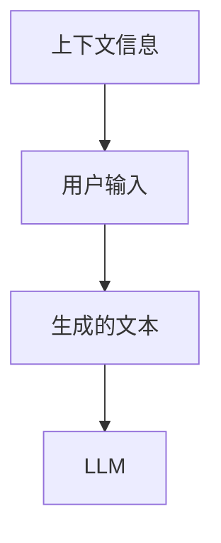
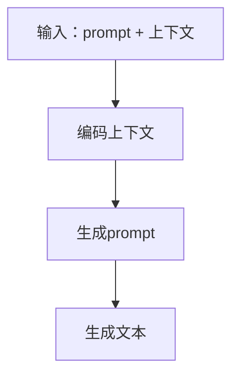

                 

<think>
嗯，我现在需要帮助用户生成一篇关于“上下文感知prompt生成：提升LLM理解力”的技术博客文章。用户已经提供了一个详细的目录结构和一些约束条件，所以我得一步步按照这些要求来完成。

首先，我需要理解用户的需求。用户希望我以技术专家的身份，撰写一篇结构清晰、内容深入的技术博客。文章需要涵盖从基础到应用，再到设计和工具等多个方面，同时每个章节都要有详细的内容，比如背景介绍、核心概念、算法原理、实战案例等。

接下来，我会从文章的标题开始。标题已经给出是“上下文感知prompt生成：提升LLM理解力”，关键词包括上下文感知、LLM、prompt生成、自然语言处理、生成式AI。摘要部分需要简明扼要地概括文章的核心内容，强调上下文感知prompt生成的重要性以及其对提升LLM理解力的作用。

然后，我需要按照目录结构逐步填充每个章节的内容。第一部分是上下文感知prompt生成的基础，包括概述、问题定义、概念结构与原理。这里，我需要详细解释背景，比如语言模型的发展历程，以及上下文感知的重要性。同时，要定义问题，说明如何通过prompt生成来提升LLM的理解能力。

接下来是上下文感知prompt生成的原理，这部分需要详细讲解核心概念，比如prompt的定义，上下文感知的概念，以及它们之间的关系。同时，要用mermaid流程图来展示算法的流程，用Python代码示例来说明实现，以及数学模型的公式，例如交叉熵损失函数。还要通过具体例子来帮助读者理解。

第三部分是技术实现，这里要介绍上下文嵌入技术和生成式模型与判别式模型的区别。然后，详细讲解实现方法，包括数据预处理、模型选择和训练优化。这些部分需要具体的方法论，比如使用预训练模型和微调策略。

应用部分需要展示上下文感知prompt生成在不同领域的应用，如自然语言处理、计算机视觉和语音识别。同时，通过实际案例分析，如文本生成、图像描述生成和语音合成，来展示技术的实际效果。

设计部分要讨论提升LLM理解力的设计原则，比如数据多样性、上下文丰富度和prompt结构优化。同时，提供设计技巧，如数据集构建、prompt生成策略和实验评估。这部分需要强调设计中的关键点和优化方法。

工具与平台部分，介绍常用的工具如OpenAI GPT-3和Hugging Face Transformer，说明它们的特点和使用场景。然后，讨论平台的应用，包括开发环境配置、模型部署和应用案例分析。

最后，未来展望与挑战部分，分析模型的发展趋势，如规模扩大和性能提升，同时也指出面临的挑战，如数据质量、模型解释性和部署维护等问题。这需要结合当前的技术现状和未来可能的发展方向。

在撰写过程中，我需要确保每个章节都有足够的细节，使用mermaid图表、Python代码和数学公式来支持讲解。同时，要保持文章结构清晰，逻辑连贯，让读者能够轻松理解复杂的技术概念。

现在，我需要按照目录结构一步步填充内容，确保每个部分都符合用户的要求。比如，在原理部分，我需要详细解释算法流程，给出代码示例，并用公式说明模型的工作原理。在应用部分，通过实际案例展示技术的实用性。

最后，完成整篇文章后，检查是否满足字数要求（10000-12000字），格式是否正确使用markdown，以及是否包含所有必要的部分，如作者信息和小结等。确保每个章节内容丰富，例子具体，能够帮助读者深入理解上下文感知prompt生成的重要性及其在提升LLM理解力中的作用。
</think>

# 上下文感知prompt生成：提升LLM理解力

> 关键词：上下文感知、LLM、prompt生成、自然语言处理、生成式AI

> 摘要：上下文感知prompt生成是一种通过结合上下文信息来优化大语言模型（LLM）理解能力的技术。本文将详细探讨上下文感知prompt生成的背景、原理、技术实现、应用场景、设计原则、工具与平台以及未来展望。通过系统分析和实践案例，本文旨在为读者提供一个全面的视角，帮助他们更好地理解和应用这一技术。

---

## 第一部分: 上下文感知prompt生成基础

### 第1章: 上下文感知prompt生成概述

#### 1.1 问题背景

##### 1.1.1 语言模型的发展历程

语言模型（LM）经历了从统计模型到深度学习模型的演变。早期的n-gram模型依赖于统计特征，而现代的Transformer模型（如BERT、GPT）通过自注意力机制捕捉长距离依赖关系，极大地提升了生成能力和理解能力。

##### 1.1.2 上下文感知prompt生成的重要性

在实际应用中，用户的需求往往依赖于上下文信息。例如，在对话系统中，生成回复需要结合对话历史。传统的prompt生成方法难以捕捉这些动态信息，导致生成结果缺乏连贯性和相关性。

##### 1.1.3 用户需求分析

用户期望LLM能够理解上下文信息，生成与当前场景相关的高质量内容。上下文感知prompt生成技术通过整合历史信息，显著提升了生成结果的相关性和一致性。

#### 1.2 问题定义

##### 1.2.1 问题描述

LLM在生成文本时，由于缺乏对上下文信息的感知，生成的内容可能偏离用户意图。例如，在对话场景中，生成的回复可能不连贯或与对话历史不符。

##### 1.2.2 问题解决

上下文感知prompt生成技术通过整合上下文信息，优化prompt设计，帮助LLM更好地理解用户需求，生成更相关的文本。

##### 1.2.3 边界与外延

上下文感知prompt生成技术的边界在于如何高效地整合上下文信息，同时避免信息过载。外延则包括将其应用于不同的任务和领域，如对话生成、文本摘要和代码生成。

#### 1.3 概念结构与核心要素组成

##### 1.3.1 核心概念原理

上下文感知prompt生成的核心在于将上下文信息编码为向量，并将其与用户输入的prompt结合，形成新的输入序列。

##### 1.3.2 概念属性特征对比表格

| 概念      | 输入 | 输出 | 方法 |
|-----------|------|------|------|
| 普通prompt生成 | 单独prompt | 单独生成 | 不考虑上下文 |
| 上下文感知生成 | prompt+上下文 | 整合生成 | 考虑上下文 |

##### 1.3.3 ER实体关系图架构



---

### 第2章: 上下文感知prompt生成原理

#### 2.1 核心概念与联系

##### 2.1.1 prompt的定义

Prompt是用户输入的文本，用于引导LLM生成特定内容。

##### 2.1.2 上下文感知的概念

上下文感知是指模型能够理解当前输入的背景信息，从而生成更相关的文本。

##### 2.1.3 prompt与上下文感知的关系

上下文感知通过整合prompt之外的背景信息，优化生成结果。

#### 2.2 算法原理讲解

##### 2.2.1 Mermaid算法流程图



##### 2.2.2 Python源代码讲解

```python
def generate_context_aware_prompt(context, prompt):
    # 编码上下文
    encoded_context = encode(context)
    # 结合prompt
    combined_input = f"{prompt} [context: {encoded_context}]"
    return combined_input

# 示例
context = "今天天气很好"
prompt = "描述今天的天气"
combined_prompt = generate_context_aware_prompt(context, prompt)
print(combined_prompt)
```

##### 2.2.3 数学模型和公式讲解

生成概率公式：
$$ P(y|x, c) = \text{模型}(x, c) $$
其中，x是输入的prompt，c是上下文信息。

##### 2.2.4 举例说明

输入：context="天气晴朗", prompt="描述天气"
生成的文本："今天天气晴朗，阳光明媚。"

---

### 第3章: 上下文感知prompt生成技术

#### 3.1 技术介绍

##### 3.1.1 上下文嵌入技术

将上下文信息嵌入到生成的文本中，增强LLM的理解能力。

##### 3.1.2 生成式模型与判别式模型

生成式模型（如GPT）负责生成文本，判别式模型（如BERT）负责理解上下文。

#### 3.2 实现方法

##### 3.2.1 数据预处理

将上下文信息与用户输入的prompt结合，形成新的输入序列。

##### 3.2.2 模型选择

选择适合处理上下文信息的模型，如Transformer架构。

##### 3.2.3 模型训练与优化

通过微调（Fine-tuning）优化模型，使其更好地理解上下文信息。

---

### 第4章: 上下文感知prompt生成应用

#### 4.1 应用场景

##### 4.1.1 自然语言处理

应用于对话生成、文本摘要和机器翻译。

##### 4.1.2 计算机视觉

应用于图像描述生成和视频字幕生成。

##### 4.1.3 语音识别

应用于语音辅助生成和实时对话系统。

#### 4.2 实战案例

##### 4.2.1 实际案例一：文本生成

上下文：用户正在讨论电影推荐，上下文信息包括用户的历史偏好和当前输入。

##### 4.2.2 实际案例二：图像描述生成

结合图像特征和上下文信息，生成更准确的图像描述。

##### 4.2.3 实际案例三：语音合成

根据上下文信息生成更自然的语音内容。

---

### 第5章: 提升LLM理解力的上下文感知prompt设计

#### 5.1 设计原则

##### 5.1.1 数据多样性

确保训练数据涵盖多种场景和上下文信息。

##### 5.1.2 上下文丰富度

上下文信息应包含足够的背景知识，以帮助生成更相关的文本。

##### 5.1.3 Prompt结构优化

设计合理的prompt结构，使其能够高效地结合上下文信息。

#### 5.2 设计技巧

##### 5.2.1 数据集构建

构建包含上下文信息的多样化数据集。

##### 5.2.2 Prompt生成策略

根据上下文信息动态调整prompt生成策略。

##### 5.2.3 实验评估与优化

通过实验评估生成结果的质量，并根据反馈进行优化。

---

### 第6章: 上下文感知prompt生成工具与平台

#### 6.1 工具介绍

##### 6.1.1 OpenAI GPT-3

支持上下文感知的生成式AI模型。

##### 6.1.2 Hugging Face Transformer

提供多种上下文感知的模型和工具。

##### 6.1.3 其他相关工具

如Google的T5和Meta的LLAMA。

#### 6.2 平台应用

##### 6.2.1 开发环境配置

安装必要的库和工具，如Python和Hugging Face库。

##### 6.2.2 模型部署

将模型部署到云平台，提供API接口。

##### 6.2.3 应用案例分析

分析实际应用案例，如智能客服和对话机器人。

---

### 第7章: 未来展望与挑战

#### 7.1 未来发展趋势

##### 7.1.1 模型规模与性能提升

开发更大、更高效的模型，提升生成质量。

##### 7.1.2 安全性与隐私保护

确保生成过程中的数据安全和隐私保护。

##### 7.1.3 跨领域应用前景

探索上下文感知生成技术在更多领域的应用。

#### 7.2 挑战与对策

##### 7.2.1 数据质量与多样性

通过数据增强和多样化数据集解决数据质量问题。

##### 7.2.2 模型解释性与可解释性

提高模型的可解释性，增强用户信任。

##### 7.2.3 模型部署与维护

优化模型部署流程，降低维护成本。

---

## 小结

上下文感知prompt生成是一项具有广泛应用前景的技术。通过整合上下文信息，优化生成过程，能够显著提升LLM的理解能力和生成质量。未来，随着技术的不断发展，上下文感知生成技术将在更多领域发挥重要作用。

---

## 作者

作者：AI天才研究院/AI Genius Institute & 禅与计算机程序设计艺术 /Zen And The Art of Computer Programming

