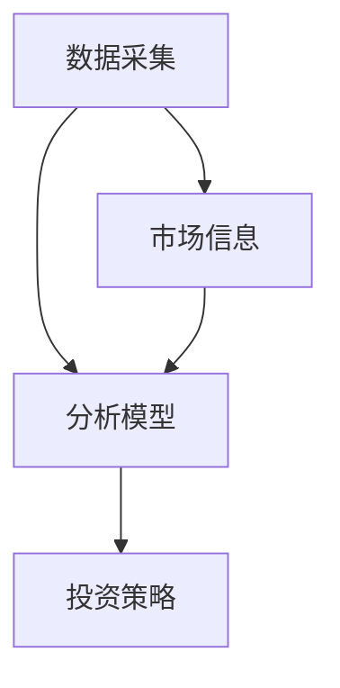
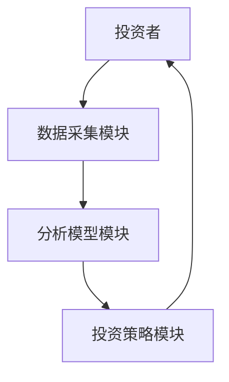

                 

<think>
嗯，用户希望我写一篇关于价值投资在不同资产类别中的应用的文章。首先，我需要明确文章的结构和内容。用户已经提供了一个大纲，所以我需要按照这个大纲来展开。

标题是《价值投资在不同资产类别中的应用：股票、债券及其他》。关键词应该是价值投资、股票、债券、房地产、商品期货，再加上其他相关的关键词。摘要需要简明扼要地概括文章的核心内容，强调价值投资在不同资产中的策略和应用。

接下来，我需要按照章节来写。首先是价值投资概述，包括基本理念、策略、优缺点。这部分需要简单明了，介绍价值投资的基本概念，以及它与股票、债券等其他资产的关系。

然后是股票投资中的价值投资，这部分需要详细分析股票的特点、策略，比如财务报表分析、估值指标，以及案例分析。我想到巴菲特的例子，他投资可口可乐，这是一个很好的案例，可以详细说明。

接下来是债券投资中的价值投资。这部分要介绍债券的特点，价值投资者如何分析债券的评级、收益率和发行人情况。可以举约翰·博格尔的例子，展示他在债券市场的成功投资。

然后是其他资产类别，如房地产和商品期货。房地产部分需要分析市场供需、物业估值，长期持有策略。商品期货则需要考虑供求关系和基本面分析，寻找被低估的商品。

每个部分都需要详细展开，可能需要加入一些数学公式和图表，比如财务指标的计算，或者价值评估的流程图。此外，用户还提到要包括系统分析和架构设计，这可能涉及到如何构建一个价值投资的分析框架，包括数据采集、分析模型、投资策略等部分，可能用Mermaid图来展示。

我还需要注意文章的字数，要求在10000到12000字左右，所以每个部分都要写得比较详细，提供丰富的例子和深入的分析。同时，文章要使用专业的技术语言，但保持逻辑清晰，结构紧凑，让读者容易理解。

最后，作者信息需要放在文章末尾，是AI天才研究院，可能还需要一些小结和注意事项，以及拓展阅读的内容，为读者提供更多的学习资源。

现在，我需要按照这个思路来撰写每个部分，确保涵盖所有用户要求的内容，同时保持文章的流畅和专业性。可能还需要调整章节结构，确保每个小节都有足够的细节，满足用户的高质量要求。
</think>

# 价值投资在不同资产类别中的应用：股票、债券及其他

**关键词**：价值投资、股票、债券、房地产、商品期货、投资策略、财务分析

**摘要**：  
价值投资是一种以寻找被市场低估的资产为主要策略的投资方法，其核心理念是通过深入分析资产的内在价值，寻找具有长期增长潜力和稳定收益的标的。本文将从股票、债券、房地产和商品期货等不同资产类别入手，探讨价值投资在这些领域的具体应用策略。通过对价值投资基本理念、策略优缺点的分析，结合实际案例，揭示价值投资在不同资产类别中的独特优势和挑战。本文旨在为投资者提供一种系统化、结构化的投资思路，帮助他们在复杂的市场环境中做出明智的投资决策。

---

## 1. 价值投资概述

### 1.1 价值投资的基本理念

价值投资是一种以基本面分析为基础的投资方法，其核心理念是寻找市场价格低于其内在价值的资产。这种方法由本杰明·格雷厄姆和戴维·多德提出，强调通过分析企业的财务状况、行业地位和竞争优势，识别出具有长期增长潜力和稳定现金流的公司。价值投资的哲学是，市场价格在短期内可能波动，但长期来看会回归其内在价值。

**核心概念与联系**  
以下是价值投资与其他相关概念的对比表格：

| 概念         | 描述                                                                 |
|--------------|----------------------------------------------------------------------|
| 内在价值     | 资产的真实价值，基于其未来现金流的现值计算。                          |
| 市场价格     | 资产在市场上的交易价格，受市场情绪和外部因素影响。                    |
| 安全边际     | 资产市场价格与内在价值之间的差额，确保投资的安全性和收益性。          |

### 1.2 价值投资的策略

#### 1.2.1 研究公司基本面

价值投资者通过分析公司的财务报表、盈利能力、增长前景等基本面因素，判断公司的内在价值。以下是关键的财务指标和分析方法：

- **利润表**：分析公司的收入、成本和利润，判断公司的盈利能力。
- **资产负债表**：评估公司的资产、负债和股东权益，判断公司的财务健康状况。
- **现金流**：分析公司的现金流入和流出，判断公司的流动性风险和现金流稳定性。

**算法原理讲解**  
以下是计算企业内在价值的简化模型：

$$ \text{内在价值} = \sum_{t=1}^{n} \frac{\text{未来现金流}}{(1 + r)^t} $$

其中，$r$ 是折现率，$n$ 是预测的现金流期限。

#### 1.2.2 寻找安全边际

价值投资者在购买资产时，要求市场价格低于其内在价值，从而留出足够的安全边际。以下是安全边际的计算公式：

$$ \text{安全边际} = \text{内在价值} - \text{市场价格} $$

如果安全边际为正，说明资产被市场低估，具有投资价值。

#### 1.2.3 长期持有

价值投资强调长期持有资产，避免频繁交易。以下是长期持有的优势：

- **减少交易成本**：频繁交易会增加佣金和税费等成本。
- **降低市场波动风险**：长期持有可以平滑短期市场波动的影响。
- **实现复利效应**：长期持有可以让收益滚雪球式增长。

### 1.3 价值投资的优点和挑战

#### 1.3.1 优点

- **风险较低**：通过基本面分析，价值投资者可以降低投资风险。
- **长期收益稳定**：价值投资追求的是长期稳定的回报，而非短期的暴利。
- **逆市场情绪**：在市场恐慌时，价值投资者可以利用低估值的机会。

#### 1.3.2 挑战

- **市场情绪影响**：市场情绪可能影响资产价格，导致低估资产被进一步压低。
- **信息不对称**：投资者可能无法获得与专业机构相同的信息和分析资源。
- **时间成本**：价值投资需要投入大量时间进行研究和分析。

---

## 2. 股票投资中的价值投资

### 2.1 股票投资的定义与特点

股票投资是指通过购买公司股票，以获取资本增值和分红收入的投资方式。股票投资具有高风险、高收益的特点，同时受到市场供求关系、公司基本面和宏观经济环境的影响。

### 2.2 股票投资中的价值投资策略

#### 2.2.1 财务报表分析

价值投资者通过分析公司的财务报表，评估公司的财务健康状况和盈利能力。以下是财务报表分析的关键指标：

- **市盈率（P/E）**：股价与每股收益的比率，用于衡量股票的估值。
- **市净率（P/B）**：股价与每股净资产的比率，用于衡量股票的估值。
- **股息率**：每年派发的股息与股价的比率，用于衡量股票的分红收益。

**算法原理讲解**  
以下是市盈率和市净率的计算公式：

$$ \text{市盈率} = \frac{\text{股价}}{\text{每股收益}} $$

$$ \text{市净率} = \frac{\text{股价}}{\text{每股净资产}} $$

#### 2.2.2 行业分析和公司对比

价值投资者会对公司所在行业的竞争环境、市场地位和成长性进行分析，以判断公司的投资价值。

**系统分析与架构设计方案**  
以下是价值投资的系统分析框架：

1. **数据采集**：收集公司的财务报表、行业数据和市场信息。
2. **分析模型**：构建财务指标分析模型和估值模型。
3. **投资策略**：根据分析结果制定买入、持有或卖出的策略。

**系统架构图**  


#### 2.2.3 价值投资案例分析

**案例分析**  
巴菲特在可口可乐的投资就是一个经典的案例。1988年，巴菲特通过深入分析可口可乐的财务状况、品牌价值和竞争优势，发现其股价被市场低估，因此大举买入。随着时间的推移，可口可乐的股价稳步上升，巴菲特的投资取得了巨大的成功。

---

## 3. 债券投资中的价值投资

### 3.1 债券投资的定义与特点

债券投资是指通过购买债券，以获取固定的利息收入和本金回收的投资方式。债券投资具有低风险、收益稳定的特点，适合风险厌恶型投资者。

### 3.2 债券投资中的价值投资策略

#### 3.2.1 债券评级分析

价值投资者会关注债券的评级，评级越高，债券的安全性越高。以下是常见的债券评级机构和评级标准：

- **评级机构**：标普、穆迪、惠誉。
- **评级标准**：从AAA（最高）到D（最低）。

#### 3.2.2 债券收益率分析

价值投资者会计算债券的收益率，并与市场利率进行比较，以判断债券是否被低估。

**算法原理讲解**  
以下是债券收益率的计算公式：

$$ \text{债券收益率} = \frac{\text{债券面值} \times 利率}{\text{债券价格}} $$

如果债券收益率高于市场利率，说明债券具有投资价值。

#### 3.2.3 债券发行人分析

价值投资者会对债券发行人的信用状况和财务状况进行分析，以判断债券的风险。

**系统分析与架构设计方案**  
以下是债券投资的系统分析框架：

1. **数据采集**：收集债券发行人财务数据和市场信息。
2. **分析模型**：构建债券评级模型和收益率模型。
3. **投资策略**：根据分析结果制定债券投资组合。

**系统架构图**  


#### 3.2.4 价值投资案例分析

**案例分析**  
约翰·博格尔在债券市场中的投资就是一个成功的案例。他通过深入分析债券发行人的信用状况和财务状况，发现了一些被低估的高收益债券，并在适当的时机买入。他的投资策略注重长期持有，以获取稳定的债券利息收入。

---

## 4. 其他资产类别中的价值投资

### 4.1 房地产投资中的价值投资

#### 4.1.1 市场供需分析

价值投资者会分析房地产市场的供需状况，以判断房地产的价值。以下是市场供需分析的关键指标：

- **供需平衡**：市场的供需平衡状况。
- **人口增长**：人口增长对房地产需求的影响。
- **政策环境**：政府政策对房地产市场的影响。

#### 4.1.2 物业估值

价值投资者会使用市场法、收益法等方法对房地产进行估值，以判断房地产是否被低估。

**算法原理讲解**  
以下是房地产估值的简化模型：

$$ \text{房地产估值} = \text{租金收入} \times \text{资本化率} $$

其中，资本化率是租金收入与房地产价值的比率。

#### 4.1.3 长期持有

房地产投资通常需要长期持有，投资者应耐心等待房地产市场回暖，以实现资本增值。

### 4.2 商品期货投资中的价值投资

#### 4.2.1 供求关系分析

价值投资者会分析商品的供求关系，以判断商品的价格趋势。

**系统分析与架构设计方案**  
以下是商品期货投资的系统分析框架：

1. **数据采集**：收集商品供求数据和市场信息。
2. **分析模型**：构建供求关系模型和价格趋势模型。
3. **投资策略**：根据分析结果制定商品期货交易策略。

**系统架构图**  


#### 4.2.2 基本面分析

价值投资者会研究商品的生产成本、库存情况和季节性因素，以判断商品的投资价值。

---

## 5. 价值投资的系统分析与架构设计方案

### 5.1 问题场景介绍

价值投资是一种以基本面分析为基础的投资方法，适用于股票、债券、房地产和商品期货等多种资产类别。以下是价值投资的系统分析框架：

1. **数据采集**：收集资产的财务数据、市场信息和行业数据。
2. **分析模型**：构建资产的内在价值模型和估值模型。
3. **投资策略**：根据分析结果制定买入、持有或卖出的策略。

### 5.2 项目介绍

价值投资的系统分析项目旨在通过构建一个全面的分析框架，帮助投资者在不同资产类别中寻找被低估的资产，实现长期稳定的收益。

### 5.3 系统功能设计

以下是价值投资系统的功能模块：

- **数据采集模块**：收集资产的财务数据和市场信息。
- **分析模型模块**：构建资产的内在价值模型和估值模型。
- **投资策略模块**：根据分析结果制定投资策略。

### 5.4 系统架构设计

以下是价值投资系统的架构图：


### 5.5 系统接口设计

以下是价值投资系统的接口设计：

- **输入接口**：接收资产的财务数据和市场信息。
- **输出接口**：输出资产的内在价值和投资策略。

### 5.6 系统交互设计

以下是价值投资系统的交互图：



---

## 6. 价值投资的项目实战

### 6.1 环境安装

以下是价值投资系统的环境安装步骤：

1. **安装Python**：安装Python编程语言。
2. **安装数据分析库**：安装Pandas、NumPy等数据分析库。
3. **安装可视化工具**：安装Matplotlib等可视化工具。

### 6.2 核心实现源代码

以下是价值投资系统的核心实现代码：

```python
import pandas as pd
import numpy as np

def calculate_intrinsic_value(future_cash_flows, discount_rate):
    intrinsic_value = 0
    for t in range(len(future_cash_flows)):
        intrinsic_value += future_cash_flows[t] / (1 + discount_rate) ** t
    return intrinsic_value

# 示例数据
future_cash_flows = [100, 200, 300]
discount_rate = 0.1

# 计算内在价值
intrinsic_value = calculate_intrinsic_value(future_cash_flows, discount_rate)
print("内在价值:", intrinsic_value)
```

### 6.3 代码应用解读与分析

以上代码通过计算未来现金流的现值，得出资产的内在价值。投资者可以通过比较内在价值和市场价格，判断资产是否被低估。

### 6.4 实际案例分析和详细讲解剖析

以下是价值投资在股票投资中的实际案例分析：

**案例分析**  
假设某公司的未来现金流如下：  
未来现金流：$100, $200, $300  
折现率：10%  

计算内在价值：

$$ \text{内在价值} = \frac{100}{1.1} + \frac{200}{1.1^2} + \frac{300}{1.1^3} $$

计算结果为：内在价值 = $487.62  

如果市场价格低于$487.62，说明股票被低估，具有投资价值。

---

## 7. 最佳实践 tips、小结、注意事项、拓展阅读

### 7.1 最佳实践 tips

- **长期持有**：价值投资强调长期持有，避免频繁交易。
- **深入研究**：投资者需要深入研究公司的基本面，判断其内在价值。
- **分散投资**：通过分散投资降低风险。

### 7.2 小结

价值投资是一种以基本面分析为基础的投资方法，适用于股票、债券、房地产和商品期货等多种资产类别。通过深入研究资产的内在价值，寻找被市场低估的资产，投资者可以在长期实现稳定的收益。

### 7.3 注意事项

- **市场风险**：市场情绪可能影响资产价格，导致低估资产被进一步压低。
- **信息不对称**：投资者可能无法获得与专业机构相同的信息和分析资源。
- **时间成本**：价值投资需要投入大量时间进行研究和分析。

### 7.4 拓展阅读

- 《The Intelligent Investor》 by Benjamin Graham
- 《Value Investing: A History of Ideas, Concepts, and Strategies》 by Bruce C. Wiggins

---

**作者：AI天才研究院/AI Genius Institute & 禅与计算机程序设计艺术/Zen And The Art of Computer Programming**

