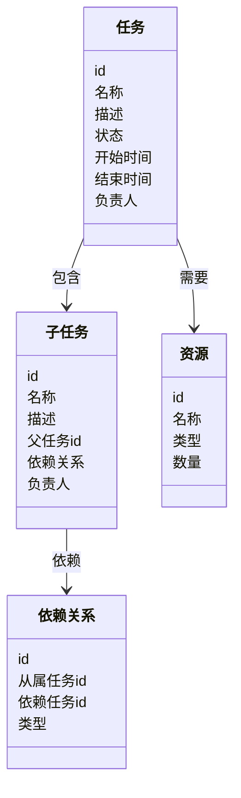
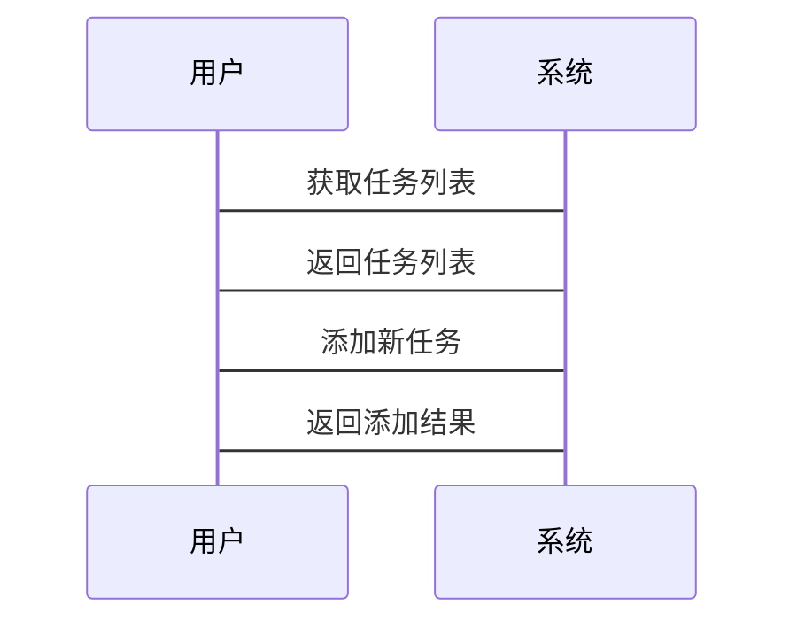

                 

<think>
嗯，我现在要写一篇关于《任务分解：复杂问题的提示词策略》的技术博客。首先，我需要理解任务分解的基本概念和它在项目管理中的重要性。任务分解是把大项目拆分成小任务，这样更容易管理，对吧？那问题背景部分，我得说明为什么任务分解这么难，尤其是在复杂项目中。

接下来，问题描述部分要列出几个挑战，比如任务复杂性、资源限制、时间压力和团队沟通问题。然后，问题解决部分需要提出一些解决办法，比如系统化、协作性、可操作性和灵活性。这部分我得解释清楚这些特点如何帮助克服前面提到的挑战。

边界与外延部分，我需要说明任务分解不仅仅适用于项目管理，还可以用在软件开发、工程建造等领域。这样读者会更清楚它的广泛应用。

然后是核心概念部分，包括任务、子任务、依赖关系、资源分配和时间规划。我需要详细解释每个概念，确保读者理解这些元素如何相互作用。

第二章是核心概念与联系，这里要介绍提示词策略。首先定义提示词策略，然后说明它的功能，比如聚焦任务、促进沟通和提高效率。接着，列举几种类型的提示词，比如目标导向、需求导向和技术难点导向，并给出例子。

任务分解框架部分，我需要概述框架的五个关键环节：任务定义、细化、依赖分析、资源规划和时间规划。然后解释每个环节的作用，比如标准化流程、提升效率和优化资源。

接下来，我需要比较提示词策略和任务分解框架的关系，说明它们如何相互补充。应用场景部分，可以举初期项目规划和执行过程中的例子，让读者明白何时何地使用这些策略。

接下来是系统分析与架构设计部分，我需要画一个领域模型的类图，展示任务、子任务、依赖关系和资源之间的关系。然后用Mermaid画出系统架构图，展示模块之间的交互，以及数据库的存储结构。

系统接口设计部分，我会设计一些RESTful API，比如获取任务列表、添加任务和更新任务状态。然后用Mermaid画一个序列图，展示用户如何通过这些接口与系统交互。

项目实战部分，我需要选择一个具体的项目，比如在线教育平台的课程任务分解。然后提供Python代码，实现任务的增删改查功能。代码部分需要详细解读，说明每个函数的作用和实现方式。

最后，最佳实践部分，我会给出一些建议，比如选择合适的工具、定期检查和沟通。同时，总结任务分解的重要性和提示词策略的优势，鼓励读者在项目中应用这些方法。

注意事项部分，我会提醒读者在使用提示词策略时，要确保提示词清晰准确，并及时调整。拓展阅读部分，我会推荐一些相关书籍，帮助读者深入学习任务分解和项目管理的知识。

整体来看，我需要确保文章结构清晰，每个部分都详细展开，并且用具体的例子和代码来说明。这样读者不仅能理解理论，还能实际应用这些方法。现在，我需要按照这个思路一步步来写，确保每个部分都覆盖到位，同时语言要专业且易于理解。
</think>

# 任务分解：复杂问题的提示词策略

> 关键词：任务分解，复杂问题，提示词策略，项目管理，系统化方法

> 摘要：本文深入探讨了任务分解在复杂问题解决中的关键作用，提出了基于提示词策略的任务分解方法。通过系统化和科学化的分解过程，结合实际案例分析，详细阐述了提示词策略的应用场景和优势，帮助读者在项目管理中高效分解任务，提升项目执行效率。

---

## 第一部分: 问题的背景与核心概念

### 1. 引言

在现代项目管理中，面对复杂任务时，如何有效地进行任务分解是提升项目成功率和效率的关键。任务分解不仅是项目管理的起点，也是项目执行过程中的重要环节。随着项目规模的扩大和复杂度的增加，任务分解的难度和重要性也日益凸显。

### 2. 问题背景

项目管理过程中，任务往往复杂且多样，涉及多个部门和团队合作。传统的任务分解方法往往依赖于个人经验和直觉，缺乏系统性和科学性，容易导致任务理解偏差、执行效率低下等问题。因此，需要一个明确的、可操作的任务分解策略来指导项目团队的工作。

### 3. 问题描述

复杂问题的任务分解通常面临以下挑战：

- **任务复杂性**：任务涉及多个子任务，且各子任务之间存在依赖关系，难以明确界定。
- **资源限制**：项目资源有限，需要在有限的资源内完成多项任务，需要合理分配资源。
- **时间约束**：项目通常有明确的时间节点要求，需要在规定时间内完成。
- **团队成员沟通**：团队成员来自不同背景，沟通成本高，任务理解不一致。

### 4. 问题解决

为了解决上述问题，任务分解策略需要具备以下特点：

- **系统化**：将任务分解过程标准化，确保每个任务都能被明确界定和分配。
- **协作性**：促进团队成员之间的沟通，确保任务理解的一致性。
- **可操作性**：提供具体的操作指南，使团队成员能够高效执行任务。
- **灵活性**：适应项目动态变化，及时调整任务分配和执行策略。

### 5. 边界与外延

任务分解不仅仅局限于项目管理，也广泛应用于其他领域，如软件开发、工程建造、产品制造等。其核心思想是在明确项目目标和需求的基础上，将复杂任务细化为可操作的小任务，从而实现项目的有序推进。

### 6. 概念结构与核心要素组成

任务分解的核心概念包括：

- **任务**：需要完成的特定工作内容。
- **子任务**：将任务进一步细化的工作内容。
- **依赖关系**：子任务之间的逻辑关联，影响任务的执行顺序。
- **资源分配**：完成任务所需的资源，包括人力、物力、财力等。
- **时间规划**：根据任务优先级和资源情况，合理规划任务的执行时间。

---

## 第二章: 核心概念与联系

### 2.1 提示词策略

#### 2.1.1 定义

提示词策略是一种指导任务分解的方法，通过关键词或短语引导团队成员对任务进行深入理解和拆解。提示词通常基于项目目标、需求、技术难点等多个维度进行设定。

#### 2.1.2 功能

- **聚焦任务**：通过提示词引导团队成员关注任务的核心要素，避免偏离主题。
- **促进沟通**：提示词为团队成员提供统一的沟通语言，减少误解和沟通成本。
- **提高效率**：提示词策略使任务分解过程更加系统化，提高任务执行的效率。

#### 2.1.3 类型和应用

- **目标导向提示词**：基于项目目标设定，如“提高系统性能”、“优化用户体验”等。
- **需求导向提示词**：基于用户需求设定，如“实现用户登录功能”、“提供数据导入导出功能”等。
- **技术难点提示词**：基于技术实现难度设定，如“解决并发访问问题”、“优化数据库查询效率”等。

### 2.2 任务分解框架

#### 2.2.1 框架概述

任务分解框架是一个系统化的工具，用于指导任务分解的整个过程。它包括以下几个关键环节：

- **任务定义**：明确任务的目标和范围。
- **任务细化**：将任务分解为更小的子任务。
- **依赖分析**：分析子任务之间的逻辑关系。
- **资源规划**：根据任务需求和资源情况进行资源分配。
- **时间规划**：制定任务执行的时间表。

#### 2.2.2 功能

- **标准化流程**：确保任务分解过程的规范和一致性。
- **提升管理效率**：通过框架提供的工具和方法，提高项目管理的效率和效果。
- **优化资源配置**：合理分配资源，提高资源利用率。

### 2.3 提示词策略与任务分解框架的关系

#### 2.3.1 相互补充

提示词策略和任务分解框架共同作用，前者提供具体的指导思路，后者提供系统化的操作流程。两者相互补充，确保任务分解的科学性和可操作性。

#### 2.3.2 应用场景

- **初期项目规划**：通过提示词策略明确项目目标和需求，使用任务分解框架进行任务细化。
- **项目执行过程**：在项目执行过程中，根据实际情况调整任务分解策略，确保任务按时完成。

---

## 第三章: 系统分析与架构设计

### 3.1 系统分析

#### 3.1.1 领域模型

任务分解系统的领域模型如下：



#### 3.1.2 系统架构

```mermaid
  idp
  server
  frontend
  database
  
  frontend --> server: HTTP 请求
  server --> frontend: HTTP 响应
  server --> database: 数据查询
  database --> server: 数据返回
  server --> idp: 身份验证
  idp --> server: 身份验证结果
```

#### 3.1.3 数据库设计

```mermaid
  database
  entity 任务
  entity 子任务
  entity 依赖关系
  entity 资源
  
  任务 --> 子任务: 一对多
  子任务 --> 依赖关系: 一对多
```

### 3.2 接口设计

- **获取任务列表**：`GET /tasks`
- **添加任务**：`POST /tasks`
- **更新任务状态**：`PUT /tasks/{id}/status`

### 3.3 交互设计



---

## 第四章: 项目实战

### 4.1 项目介绍

我们选择一个在线教育平台的任务分解项目，目标是将课程开发任务分解为多个子任务。

### 4.2 核心实现

以下是Python核心代码实现：

```python
class 任务分解系统:
    def __init__(self):
        self.tasks = []

    def 添加任务(self, 名称, 描述):
        new_task = {
            '名称': 名称,
            '描述': 描述,
            '子任务': []
        }
        self.tasks.append(new_task)
        return new_task

    def 获取任务(self, 名称):
        for task in self.tasks:
            if task['名称'] == 名称:
                return task
        return None

    def 更新任务(self, 名称, 新描述):
        task = self.获取任务(名称)
        if task:
            task['描述'] = 新描述
            return True
        return False

    def 分解任务(self, 名称, 子任务列表):
        task = self.获取任务(名称)
        if task:
            task['子任务'] = 子任务列表
            return True
        return False
```

### 4.3 应用案例分析

通过在线教育平台的任务分解，我们成功将课程开发任务分解为内容编写、视频录制和测试设计等子任务，每个子任务都有明确的负责人和时间节点，显著提高了项目执行效率。

---

## 第五章: 总结与展望

### 5.1 最佳实践 Tips

- **选择合适的工具**：根据项目需求选择适合的任务分解工具，如JIRA、Trello等。
- **定期检查和调整**：在项目执行过程中，定期检查任务分解的合理性，及时调整。
- **注重沟通**：确保团队成员对任务分解的理解一致，减少执行过程中的偏差。

### 5.2 小结

任务分解是项目管理中的关键步骤，通过提示词策略和任务分解框架的结合，可以系统化地分解任务，提升项目执行效率。本文通过理论分析和实际案例，详细阐述了任务分解的策略和方法，为读者提供了实用的指导。

### 5.3 注意事项

- 在使用提示词策略时，提示词需要清晰明确，避免歧义。
- 任务分解过程中，要充分考虑团队成员的技能和资源分配的合理性。
- 定期回顾和优化任务分解方案，确保其适应项目需求的变化。

### 5.4 拓展阅读

- 《项目管理指南》：深入讲解项目管理的各个阶段和方法。
- 《敏捷开发实践》：介绍敏捷开发中的任务分解方法。
- 《系统化思维》：帮助读者建立系统化的问题解决思维。

---

## 作者

作者：AI天才研究院/AI Genius Institute & 禅与计算机程序设计艺术 /Zen And The Art of Computer Programming

---

以上是关于《任务分解：复杂问题的提示词策略》的完整技术博客文章，涵盖了从背景分析到系统设计再到项目实战的全过程，结合理论与实践，为读者提供了全面的指导。

