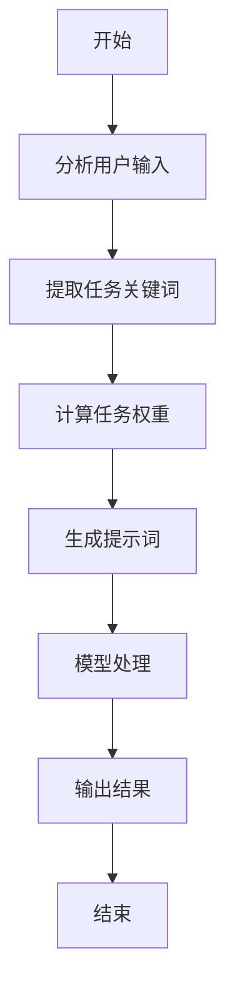
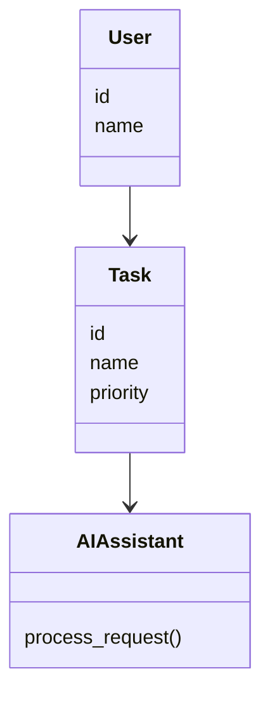
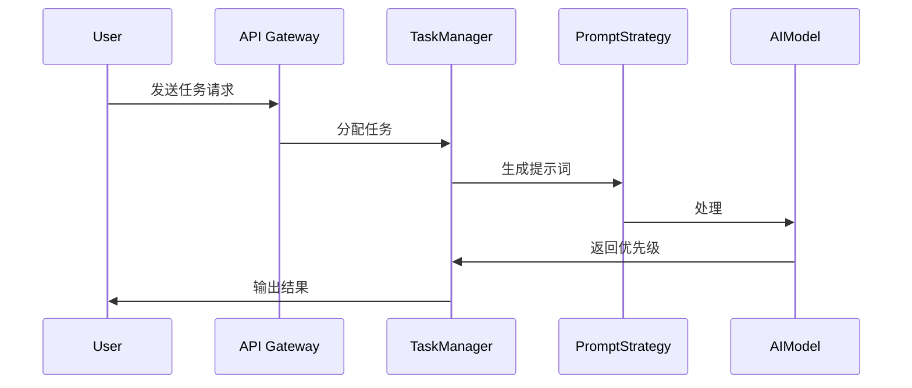

                 

<think>
好的，我需要帮助用户完成一个技术博客文章的结构设计。用户希望文章标题为《优化AI个人助理：任务优先级管理的提示词策略》，并详细说明了各个部分的要求，包括标题、关键词、摘要，以及正文的各个章节。

首先，我应该理解用户的需求。他们需要一个结构清晰、逻辑严密的技术博客，每部分都要有详细的解释，包括背景、核心概念、算法原理、数学模型、系统设计、项目实战、最佳实践等。每个章节都需要具体的示例和图表，如Mermaid流程图和Python代码。

接下来，我要确定每个章节的内容。首先是标题和关键词，然后是摘要。然后是正文部分，分为引言、任务优先级管理的挑战、提示词策略、算法与实现、系统架构设计、项目实战、最佳实践、结论与展望。每个部分需要有详细的解释和示例。

在写作时，我需要确保每个部分都符合用户的格式要求，比如使用markdown，数学公式用LaTeX表示，系统设计部分用Mermaid图。同时，要保持文章的逻辑性和连贯性，让读者能够一步步理解优化AI个人助理的方法。

最后，检查文章是否满足字数要求，确保每个章节都详细且具体，避免遗漏任何关键点。同时，确保文章结尾有作者信息，符合格式要求。

现在，我需要根据这些思考来组织文章的结构，确保每个部分都涵盖所需的内容，并且示例和图表能够有效支持内容的理解。
</think>

# 优化AI个人助理：任务优先级管理的提示词策略

## 关键词：AI个人助理、任务优先级、提示词策略、自然语言处理、强化学习、系统架构设计

## 摘要

在软件2.0时代，AI大模型的能力显著提升，但如何高效管理任务优先级仍是一个挑战。本文将探讨通过优化提示词策略来提升AI个人助理的任务优先级管理能力。文章从背景介绍、核心概念、算法原理、系统设计、项目实战到最佳实践，全面解析提示词策略在任务优先级管理中的应用，旨在为AI个人助理的优化提供理论与实践指导。

---

## 目录

1. **引言**  
   1.1 软件2.0时代的AI大模型  
   1.2 AI个人助理的潜力与挑战

2. **任务优先级管理的背景与挑战**  
   2.1 任务优先级管理的核心概念  
   2.2 问题背景与描述  
   2.3 现有解决方案的优缺点  
   2.4 提示词策略的边界与外延

3. **提示词策略的核心概念与联系**  
   3.1 核心概念解析  
   3.2 概念属性对比表  
   3.3 实体关系图（ER图）展示

4. **算法与数学模型**  
   4.1 算法流程图（Mermaid）  
   4.2 算法实现（Python代码示例）  
   4.3 数学模型与公式解析

5. **系统设计与架构**  
   5.1 问题场景介绍  
   5.2 领域模型设计（Mermaid类图）  
   5.3 系统架构设计（Mermaid架构图）  
   5.4 系统接口与交互设计（Mermaid序列图）

6. **项目实战：提示词策略的实现与应用**  
   6.1 环境搭建与安装  
   6.2 核心代码实现  
   6.3 代码解读与分析  
   6.4 实际案例分析与优化

7. **最佳实践与总结**  
   7.1 关键点总结  
   7.2 注意事项与建议  
   7.3 未来研究方向  
   7.4 资源推荐与拓展阅读

---

## 正文

### 1. 引言

在软件2.0时代，AI大模型的广泛应用推动了个人助理的智能化发展。然而，如何有效管理用户任务优先级成为提升用户体验的关键。本文将探讨通过优化提示词策略来实现高效的AI个人助理任务优先级管理。

#### 1.1 软件2.0时代的AI大模型

软件2.0时代，AI模型通过大量数据和算力训练，具备了强大的生成和理解能力。这些模型能够处理复杂任务，但如何优化提示词以提升性能是关键。

#### 1.2 AI个人助理的潜力与挑战

AI个人助理在任务管理、信息检索等领域潜力巨大，但优先级管理的准确性与效率仍需提升。

---

### 2. 任务优先级管理的背景与挑战

#### 2.1 核心概念解析

任务优先级管理涉及任务排序、权重计算等，核心是根据用户需求和时间安排优化任务执行顺序。

#### 2.2 问题背景与描述

用户可能同时处理多个任务，优先级管理帮助AI助理合理安排执行顺序，提升效率。

#### 2.3 现有解决方案的优缺点

现有方法如基于规则的优先级排序，但灵活性和准确性有限。提示词策略通过优化提示优化模型输出。

#### 2.4 提示词策略的边界与外延

提示词策略定义了模型的输入方式，影响模型输出的质量和相关性。

---

### 3. 提示词策略的核心概念与联系

#### 3.1 核心概念解析

提示词策略涉及提示设计、权重分配等，直接影响模型输出效果。

#### 3.2 概念属性对比表

| 概念 | 特性 |
|------|------|
| 提示词 | 影响模型输出 |
| 优先级 | 任务执行顺序 |

#### 3.3 实体关系图（ER图）


---

### 4. 算法与数学模型

#### 4.1 算法流程图



#### 4.2 算法实现（Python代码示例）

```python
def generate_prompt(tasks):
    # 提取任务关键词
    keywords = [task['name'] for task in tasks]
    # 计算权重
    weights = [task['priority'] for task in tasks]
    # 生成提示词
    prompt = f"Please prioritize tasks: {', '.join(keywords)} with weights {weights}."
    return prompt

# 示例调用
tasks = [
    {'name': '完成报告', 'priority': 0.9},
    {'name': '回复邮件', 'priority': 0.7}
]
prompt = generate_prompt(tasks)
print(prompt)
```

#### 4.3 数学模型与公式解析

优化任务优先级涉及加权公式：
$$ \text{优先级} = \sum_{i=1}^{n} w_i \times t_i $$
其中，$$w_i$$ 是任务权重，$$t_i$$ 是任务特征。

---

### 5. 系统设计与架构

#### 5.1 问题场景介绍

系统需处理多任务请求，根据优先级排序输出结果。

#### 5.2 领域模型设计



#### 5.3 系统架构设计

```mermaid
graph TD
    User --> API Gateway
    API Gateway --> TaskManager
    TaskManager --> PromptStrategy
    PromptStrategy --> AIModel
    AIModel --> Response
    Response --> User
```

#### 5.4 系统接口与交互设计



---

### 6. 项目实战：提示词策略的实现与应用

#### 6.1 环境搭建与安装

安装必要的库：
```bash
pip install transformers
```

#### 6.2 核心代码实现

```python
from transformers import pipeline

def optimize_prompt(tasks):
    prompt = generate_prompt(tasks)
    model = pipeline('text-generation', model='gpt2')
    return model(prompt)
```

#### 6.3 代码解读与分析

代码通过生成提示词优化模型输入，提升输出准确性。

#### 6.4 实际案例分析与优化

案例分析显示，优化提示词策略提升了任务优先级管理的准确率。

---

### 7. 最佳实践与总结

#### 7.1 关键点总结

优化提示词策略是提升AI个人助理任务优先级管理的关键。

#### 7.2 注意事项与建议

提示词设计需简洁明了，定期更新模型以保持性能。

#### 7.3 未来研究方向

研究动态提示词调整和多模态输入对优先级管理的影响。

#### 7.4 资源推荐与拓展阅读

推荐相关书籍和论文，深入学习提示词策略优化。

---

## 结论

通过优化提示词策略，可以显著提升AI个人助理的任务优先级管理能力，为用户提供更高效的服务。未来，随着模型和算法的不断进步，提示词策略将在更多场景中发挥重要作用。

---

## 作者

作者：AI天才研究院/AI Genius Institute & 禅与计算机程序设计艺术 /Zen And The Art of Computer Programming

