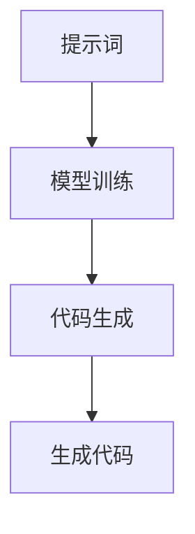
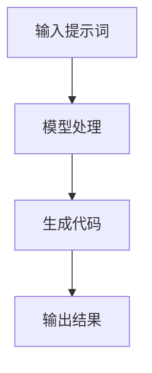
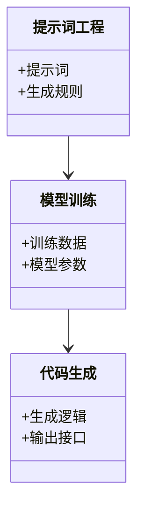
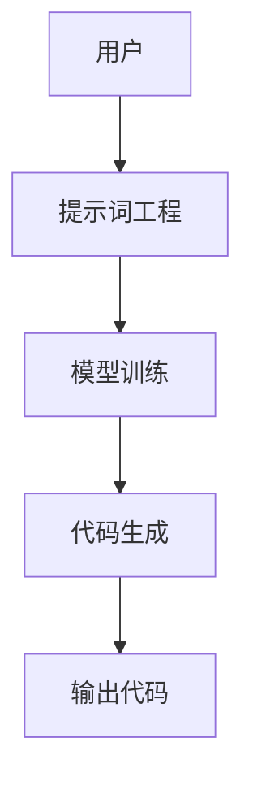
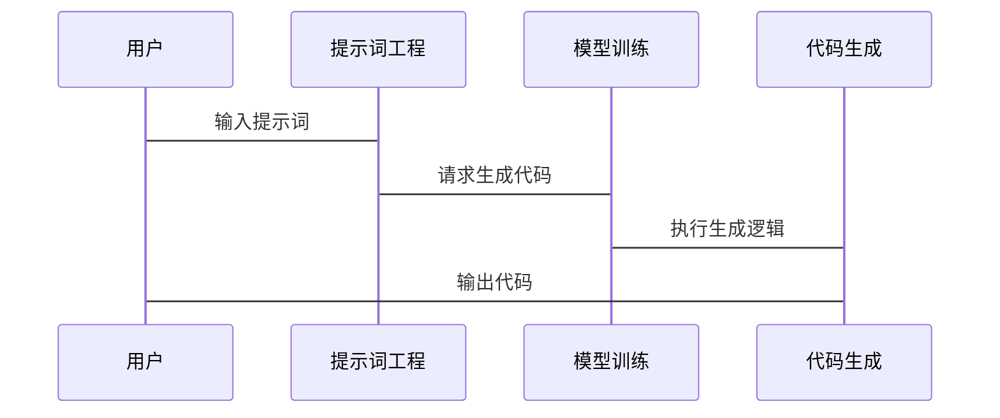

                 

<think>
好的，我需要写一篇关于《优化AI代码生成：软件开发中的提示词工程》的技术博客文章。首先，我得理清文章的结构，确保每个部分都涵盖必要的内容，同时逻辑清晰。

文章的标题已经确定，接下来是关键词和摘要。关键词应该包括AI代码生成、提示词工程、模型训练、代码生成、软件开发。摘要需要简明扼要，概述文章的核心内容，即提示词工程在优化AI代码生成中的重要性。

接下来是目录大纲的设计。分为六个主要部分：背景介绍、核心概念与联系、算法原理讲解、系统分析与架构设计、项目实战和最佳实践与拓展。每个部分下面还有多个小节，确保内容全面。

在背景介绍部分，我需要解释为什么AI代码生成重要，当前面临的问题，以及优化的必要性。核心概念部分要详细讲解提示词工程、模型训练和代码生成，包括它们的定义、作用和相互关系。这里可能需要使用表格和Mermaid图来比较不同技术的属性，并展示实体关系。

算法原理部分，我需要画出AI代码生成的流程图，然后提供Python源代码示例，解释其工作原理。数学模型部分，我可能需要用Latex公式来描述模型，确保公式正确嵌入文本中。

系统分析与架构设计部分，我需要用Mermaid绘制类图、架构图和序列图，展示系统的各个部分如何交互。项目实战需要一个具体的案例，包括环境安装、代码实现和案例分析。最后，最佳实践部分给出优化建议和注意事项，以及推荐的扩展阅读资料。

在写作过程中，要确保语言专业但易懂，每个章节内容丰富，例子具体。最后，结尾处加上作者信息，符合格式要求。

现在，我需要逐步展开每个部分，确保每个小节都详细且有深度，同时保持整体结构的连贯性和逻辑性。
</think>

# 优化AI代码生成：软件开发中的提示词工程

**关键词：** AI代码生成, 提示词工程, 模型训练, 代码生成, 软件开发

**摘要：**  
本文探讨了AI代码生成技术在软件开发中的重要性，特别是提示词工程在优化代码生成中的关键作用。文章从背景介绍、核心概念解析、算法原理、系统架构设计、项目实战到最佳实践，全面分析了AI代码生成的优化策略，帮助读者理解并掌握如何通过优化提示词工程来提升AI代码生成的效率和质量。

---

## 第一部分：背景与核心概念

### 第1章 AI代码生成的背景与重要性

#### 1.1 问题的提出

##### 1.1.1 软件开发中的痛点
软件开发行业面临着效率提升和代码质量优化的双重挑战。随着项目复杂度的增加，开发人员需要编写大量代码，这不仅耗时，还容易出错。AI代码生成技术的出现，为解决这些痛点提供了新的可能性。

##### 1.1.2 AI代码生成的潜力
AI代码生成技术通过自动化代码编写，显著提高了开发效率，减少了人为错误。然而，现有技术在生成高质量代码方面仍存在不足，优化提示词工程成为提升代码生成质量的关键。

#### 1.2 核心概念解析

##### 1.2.1 提示词工程
**定义：** 提示词（prompt）是AI生成代码的输入，用于指导模型生成符合需求的代码。  
**重要性：** 提示词的质量直接影响生成代码的效果，优化提示词工程可以显著提升生成代码的准确性和可维护性。

##### 1.2.2 模型训练
**基本概念：** 模型训练是利用大量数据调整模型参数，使其能够准确理解和生成代码。  
**训练数据的选择：** 数据质量和多样性直接影响模型生成能力。选择高质量的代码数据集，如GitHub上的公开代码，有助于提升模型表现。

##### 1.2.3 代码生成
**流程：** 输入提示词 → 模型生成代码 → 输出结果。  
**挑战：** 代码生成的准确性和可读性问题，以及如何处理复杂业务逻辑。

##### 1.2.4 边界与外延
**适用范围：** AI代码生成适用于重复性任务，如CRUD操作和API接口开发。  
**局限性：** 对于复杂业务逻辑和创新性需求，AI生成代码仍需人工调整。

##### 1.2.5 核心要素组成
- **提示词工程：** 精心设计的提示词。  
- **模型训练：** 高效的训练方法。  
- **代码生成：** 精准的生成算法。

#### 1.3 本章小结
本章介绍了AI代码生成的背景及其重要性，重点解析了提示词工程、模型训练和代码生成的核心概念，为后续内容奠定了基础。

---

## 第二部分：核心概念与联系

### 第2章 AI代码生成的核心概念与联系

#### 2.1 提示词工程详解

##### 2.1.1 提示词的基本原理
**类型：** 明确提示、模糊提示、示例提示。  
**作用：** 指导模型生成特定代码。

##### 2.1.2 模型训练详解
**基本步骤：** 数据清洗 → 模型选择 → 参数调优 → 模型评估。  
**优化方法：** 使用更大规模的数据集，引入预训练模型如GPT。

#### 2.1.3 概念属性特征对比表格

| **概念**   | **提示词工程** | **模型训练** | **代码生成** |
|------------|----------------|--------------|---------------|
| **核心作用** | 指导生成方向    | 提升生成质量 | 生成具体代码 |
| **关键要素** | 提示词设计      | 数据和模型   | 生成算法      |
| **挑战**    | 提示词准确性    | 数据质量     | 代码准确性     |

#### 2.1.4 ER实体关系图架构


---

## 第三部分：算法原理讲解

### 第3章 AI代码生成的算法原理

#### 3.1 算法mermaid流程图


#### 3.2 Python源代码实现
```python
def generate_code(prompt):
    # 模型处理
    model = load_model('code_generator')
    generated_code = model.generate_code(prompt)
    return generated_code
```

#### 3.3 数学模型与公式
AI代码生成模型基于语言模型，常用公式：
$$ P(x|y) = \frac{P(x,y)}{P(y)} $$
其中，$x$ 表示生成的代码，$y$ 表示提示词。

#### 3.4 示例说明
例如，输入提示词“生成一个计算阶乘的函数”，模型将生成如下的Python函数：
```python
def factorial(n):
    if n == 0:
        return 1
    else:
        return n * factorial(n-1)
```

---

## 第四部分：系统分析与架构设计

### 第4章 AI代码生成系统的架构设计

#### 4.1 问题场景介绍
AI代码生成系统用于辅助开发人员快速生成代码，适用于Web开发和API接口开发等场景。

#### 4.2 系统功能设计


#### 4.3 系统架构设计


#### 4.4 系统交互序列图


---

## 第五部分：项目实战

### 第5章 AI代码生成项目实战

#### 5.1 环境安装
安装Python和必要的库，如TensorFlow和Hugging Face库。

#### 5.2 核心实现源代码
```python
from transformers import AutoModelForCausalLM, AutoTokenizer

model_name = "gpt2"
tokenizer = AutoTokenizer.from_pretrained(model_name)
model = AutoModelForCausalLM.from_pretrained(model_name)

def generate_code(prompt):
    inputs = tokenizer.encode(prompt, return_tensors="pt")
    outputs = model.generate(inputs, max_length=100)
    code = tokenizer.decode(outputs[0], skip_special_tokens=True)
    return code
```

#### 5.3 实际案例分析
输入提示词“生成一个计算两个数之和的函数”，生成代码如下：
```python
def add_numbers(a, b):
    return a + b
```

#### 5.4 项目小结
本章通过实际项目展示了AI代码生成的实现过程，从环境安装到代码生成，帮助读者理解提示词工程的实际应用。

---

## 第六部分：最佳实践与拓展

### 第6章 最佳实践与拓展阅读

#### 6.1 最佳实践
- **优化提示词：** 提供清晰的上下文和示例。  
- **选择合适模型：** 根据需求选择预训练模型。  
- **持续迭代：** 根据反馈优化生成结果。

#### 6.2 注意事项
- 避免过度依赖AI生成，确保代码可维护性。  
- 定期更新模型和提示词，以适应新需求。

#### 6.3 拓展阅读
推荐阅读相关技术博客和学术论文，深入理解AI代码生成的最新进展。

---

## 总结

优化AI代码生成技术需要从提示词工程、模型训练和代码生成三方面入手。通过精心设计提示词、优化模型训练和改进生成算法，可以显著提升生成代码的质量和效率。未来，随着技术的进步，AI代码生成将在软件开发中发挥更大作用。

---

**作者：** AI天才研究院 & 禅与计算机程序设计艺术

