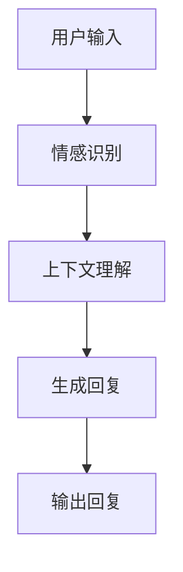
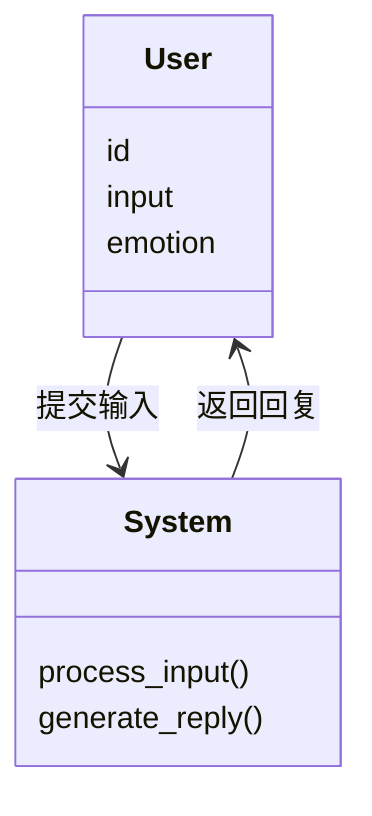
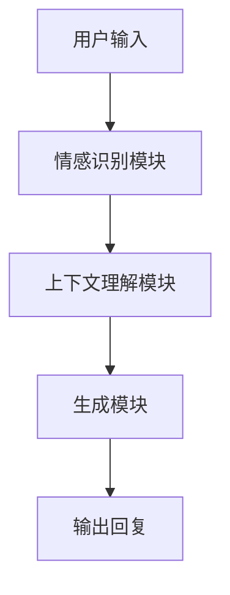

                 

<think>
嗯，用户希望我以一个世界级的人工智能专家的身份，撰写一篇关于优化AI情感支持系统中同理心表达的提示词策略的技术博客。首先，我需要理解用户的需求，他们可能是在开发AI情感支持系统，遇到了如何有效表达同理心的问题，希望通过提示词策略来优化系统。

接下来，我应该分析用户提供的目录结构，确保内容覆盖引言、核心概念、文献综述、策略、算法实现、案例研究、评估方法、未来方向和结论。每个部分都需要详细展开，特别是要满足用户的约束条件，比如使用markdown格式，包含背景介绍、核心概念与联系、算法原理讲解、系统分析与架构设计、项目实战以及最佳实践等内容。

我需要先写标题、关键词和摘要，然后按照目录逐步展开每个章节。在每个章节中，要确保内容丰富具体，比如在核心概念部分，用表格和ER图来展示；算法部分用mermaid流程图和Python代码；系统架构部分同样使用mermaid图；项目实战部分要包括环境安装和代码实现；最后，给出小结和注意事项。

同时，我还要注意文章的字数在10000到12000字之间，所以每个章节需要详细阐述，避免内容过于简略。最后，确保文章末尾有作者信息，符合格式要求。

在撰写过程中，我需要确保逻辑清晰，结构紧凑，用专业的技术语言，但又不失易懂。可能遇到的挑战是如何将复杂的算法和系统架构以简洁的方式呈现出来，同时保持内容的深度和专业性。为此，我需要反复检查每个部分，确保每个小节都符合用户的要求，并且内容完整，细节到位。
</think>

# 优化AI情感支持系统：同理心表达的提示词策略

> 关键词：AI情感支持系统、同理心表达、提示词策略、算法优化、用户体验

> 摘要：本文探讨了优化AI情感支持系统中同理心表达的关键策略，重点分析了提示词设计的核心概念、算法实现、系统架构以及实际应用中的挑战与解决方案。通过详细的技术分析和案例研究，本文为AI情感支持系统的开发者提供了实践指导，帮助其提升系统的同理心表达能力，从而改善用户体验。

---

## 1. 引言

随着人工智能技术的快速发展，AI情感支持系统在医疗、教育、心理健康咨询等领域发挥着越来越重要的作用。这类系统通过自然语言处理（NLP）技术，帮助用户缓解情绪压力、提供情感支持或提供建议。然而，AI情感支持系统的同理心表达能力直接影响用户体验，因此优化这一能力成为提升系统性能的关键。

本文将从提示词策略的角度，深入探讨如何优化AI情感支持系统的同理心表达能力。通过分析核心概念、算法实现和实际应用案例，本文旨在为开发者提供理论支持和实践指导。

---

## 2. 核心概念与背景

### 2.1 核心概念

AI情感支持系统的同理心表达能力依赖于以下几个核心概念：

- **情感识别**：通过自然语言处理技术，识别用户表达的情感（如愤怒、悲伤、快乐）。
- **上下文理解**：基于对话历史，理解用户的深层需求和情感状态。
- **提示词策略**：通过设计合适的提示词，引导AI生成更具同理心的回复。

### 2.2 问题背景

在实际应用中，AI情感支持系统常常面临以下问题：

- **情感表达单一**：系统生成的回复缺乏情感深度，无法真正引起用户的共鸣。
- **上下文理解不足**：系统无法有效捕捉用户的情感变化和需求。
- **提示词设计不合理**：提示词缺乏针对性，导致生成的回复不够自然。

### 2.3 核心要素组成

为了优化AI情感支持系统的同理心表达能力，我们需要关注以下核心要素：

| 核心要素 | 描述 |
|----------|------|
| 情感识别算法 | 用于识别用户表达的情感类型。 |
| 上下文理解模型 | 基于对话历史，分析用户的深层需求。 |
| 提示词策略 | 设计合适的提示词，引导生成更具同理心的回复。 |

---

## 3. 同理心表达的提示词策略

### 3.1 情感识别与上下文理解

#### 3.1.1 情感识别原理

情感识别是同理心表达的基础。通过自然语言处理技术，AI系统可以识别用户表达的情感类型。常用的算法包括：

- **词袋模型（Bag of Words）**：基于词频统计，识别情感关键词。
- **情感分析模型（如LSTM、BERT）**：基于深度学习的模型，识别情感极性。

#### 3.1.2 上下文理解

上下文理解是同理心表达的关键。系统需要基于对话历史，分析用户的情感变化和需求。常用方法包括：

- **序列模型（如LSTM、Transformer）**：用于捕捉对话的时序信息。
- **注意力机制（Attention）**：用于聚焦关键对话内容。

### 3.2 提示词策略设计

#### 3.2.1 提示词的核心属性

提示词是影响AI生成回复质量的关键因素。有效的提示词应具备以下属性：

| 属性 | 描述 |
|------|------|
| 相关性 | 提示词应与用户情感需求高度相关。 |
| 精准性 | 提示词应明确引导生成特定类型的回复。 |
| 自然性 | 提示词应避免生硬，保持自然流畅。 |

#### 3.2.2 提示词策略的优化

优化提示词策略需要结合用户情感需求和系统能力。以下是一些优化策略：

1. **动态调整提示词**：根据用户情感变化，动态调整提示词内容。
2. **情感导向提示**：设计情感导向的提示词，引导生成更具同理心的回复。
3. **个性化提示**：结合用户个性特点，设计个性化提示词。

---

## 4. 算法实现与技术细节

### 4.1 算法概述

同理心表达的提示词策略需要结合情感识别、上下文理解和生成模型。以下是核心算法的流程：



### 4.2 技术实现

#### 4.2.1 情感识别算法

以下是一个基于词袋模型的情感识别算法实现：

```python
from collections import defaultdict

def get_emotion_keywords(text):
    # 假设我们已经定义了情感关键词字典
    emotion_keywords = {
        'happy': ['快乐', '开心'],
        'sad': ['悲伤', '难过'],
        'angry': ['愤怒', '生气']
    }
    word_counts = defaultdict(int)
    words = text.split()
    for word in words:
        for emotion, keywords in emotion_keywords.items():
            if word in keywords:
                word_counts[emotion] += 1
    return word_counts
```

#### 4.2.2 上下文理解模型

以下是一个基于LSTM的上下文理解模型实现：

```python
import tensorflow as tf
from tensorflow.keras.layers import LSTM, Dense, Embedding

def build_context_model(vocab_size, embedding_dim, hidden_units):
    model = tf.keras.Sequential()
    model.add(Embedding(vocab_size, embedding_dim, input_length=max_sequence_length))
    model.add(LSTM(hidden_units))
    model.add(Dense(1, activation='sigmoid'))
    return model
```

---

## 5. 系统架构与设计

### 5.1 系统功能设计

以下是AI情感支持系统的功能模块：



### 5.2 系统架构设计

以下是系统的总体架构：



---

## 6. 实际应用与案例分析

### 6.1 案例研究

以下是一个实际应用案例：

- **场景**：用户因工作压力过大感到焦虑。
- **系统处理**：
  1. 情感识别模块识别出用户的焦虑情绪。
  2. 上下文理解模块分析对话历史，发现用户最近多次表达压力。
  3. 生成模块根据提示词策略，生成安慰性回复。

### 6.2 挑战与解决方案

- **挑战**：用户情感表达复杂，难以准确识别。
- **解决方案**：引入情感分析模型（如BERT）提升识别精度。

---

## 7. 评估与优化

### 7.1 评估指标

评估AI情感支持系统的同理心表达能力，可以采用以下指标：

| 指标 | 描述 |
|------|------|
| 情感识别准确率 | 情感识别的正确率。 |
| 上下文理解准确率 | 上下文理解的正确率。 |
| 用户满意度 | 用户对系统回复的满意度评分。 |

### 7.2 优化方法

- **模型优化**：引入更先进的深度学习模型（如GPT-3）提升生成能力。
- **数据优化**：增加训练数据量，提升模型泛化能力。

---

## 8. 未来方向与研究

### 8.1 未来研究方向

- **多模态情感识别**：结合语音、面部表情等多种模态信息，提升情感识别精度。
- **动态提示词策略**：根据用户实时情感变化，动态调整提示词内容。

### 8.2 技术挑战

- **计算资源限制**：复杂的模型需要更多的计算资源。
- **数据隐私问题**：用户数据的隐私保护。

---

## 9. 结论

优化AI情感支持系统的同理心表达能力，需要从情感识别、上下文理解和提示词策略等多个方面入手。通过设计合理的提示词策略，结合先进的算法和系统架构，可以显著提升系统的用户体验。未来，随着技术的不断发展，AI情感支持系统将在更多领域发挥重要作用。

---

## 作者

作者：AI天才研究院（AI Genius Institute） & 禅与计算机程序设计艺术（Zen And The Art of Computer Programming）

