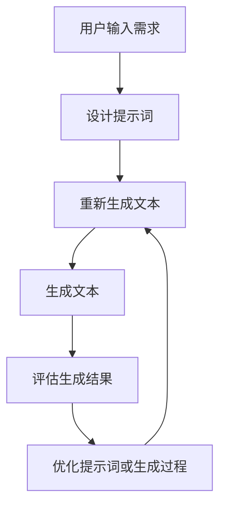
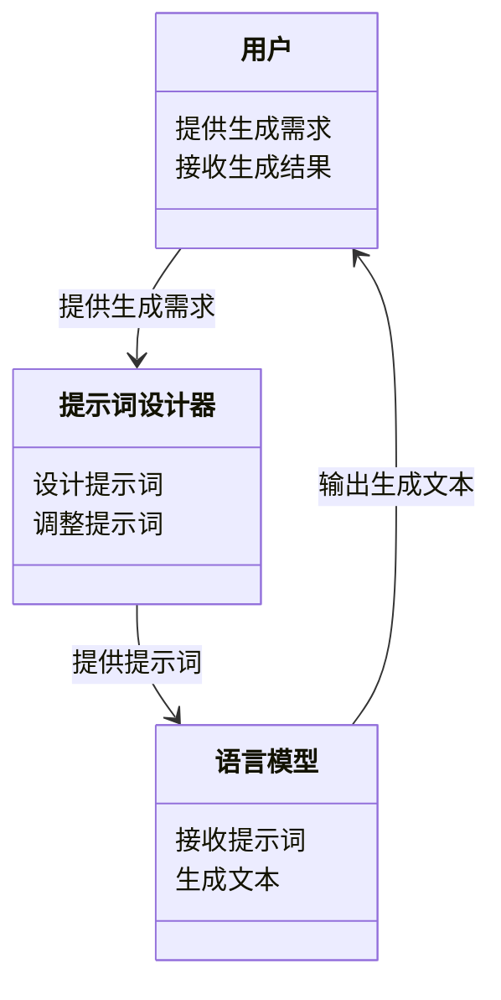
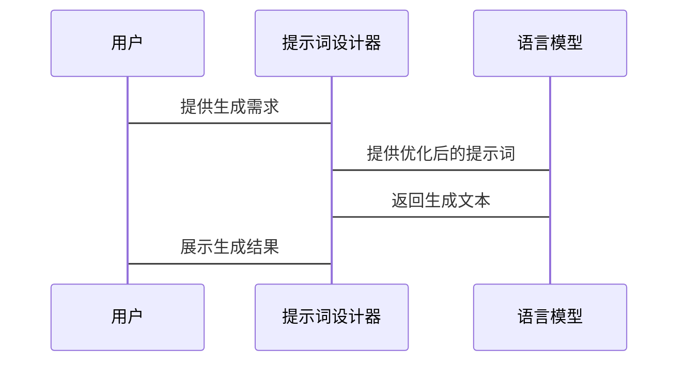

                 

<think>
嗯，用户希望我写一篇关于优化AI文本生成的博客文章，具体是使用受限语言模型的提示词技巧。我需要先理清楚整个结构，然后逐步展开每个部分。

首先，用户已经提供了一个详细的目录大纲，所以我需要按照这个结构来撰写。标题是“优化AI文本生成：Constrained Language Models的提示词技巧”，关键词和摘要部分需要明确。接下来是背景介绍，这部分要涵盖AI的兴起、文本生成的重要性，以及受限语言模型的作用。

然后是核心概念，这部分需要详细解释受限语言模型和提示词工程的原理，并通过表格和ER图来比较不同模型的优缺点。算法部分，我需要使用mermaid流程图来展示优化过程，还要有Python代码和数学公式。

系统分析部分需要设计领域模型和架构图，展示系统的各个组件及其交互。项目实战部分则要具体说明如何安装环境，实现关键功能，并通过实际案例来分析。最后，加上最佳实践、小结和拓展阅读等内容，使文章更加全面。

在写作过程中，我要确保语言专业且易懂，每个部分都要详细具体，满足用户对深度和详细性的要求。同时，遵守格式要求，比如使用markdown，正确嵌入公式和图表，确保文章结构完整，逻辑清晰。

我还需要注意文章的字数控制在1万到1万2千字之间，所以每个章节都需要充实的内容，避免过于简略。特别是代码和公式部分，要详细解释，帮助读者理解。

最后，确保在文章末尾加上作者信息，符合用户的要求。整体来看，这个任务需要我综合运用技术知识，结构化思考，并细致地展开每个部分，确保文章既有深度又易于理解。
</think>

# 优化AI文本生成：Constrained Language Models的提示词技巧

## 关键词：AI文本生成，受限语言模型，提示词工程，语言模型优化，文本生成技术

## 摘要：  
随着AI技术的快速发展，文本生成已成为自然语言处理（NLP）领域的重要应用之一。受限语言模型（Constrained Language Models）作为一种新兴的技术，通过提示词工程（Prompt Engineering）优化文本生成过程，能够有效提升生成文本的质量、准确性和适用性。本文将深入探讨受限语言模型的核心原理、提示词技巧的应用方法，并通过具体案例分析，展示如何通过优化提示词设计来提升AI文本生成的效果。文章内容涵盖背景介绍、核心概念、算法原理、系统架构设计、项目实战及最佳实践等，旨在为AI开发者和技术爱好者提供一份全面的指导手册。

---

## 目录

1. [背景介绍](#背景介绍)  
   1.1 [问题背景](#问题背景)  
   1.2 [问题描述](#问题描述)  
   1.3 [问题解决](#问题解决)  
   1.4 [边界与外延](#边界与外延)  

2. [核心概念与联系](#核心概念与联系)  
   2.1 [核心概念](#核心概念)  
   2.2 [概念属性特征对比](#概念属性特征对比)  
   2.3 [ER实体关系图](#ER实体关系图)  

3. [算法原理](#算法原理)  
   3.1 [算法基本原理](#算法基本原理)  
   3.2 [算法流程图](#算法流程图)  
   3.3 [Python源代码实现](#Python源代码实现)  

4. [系统分析与架构设计](#系统分析与架构设计)  
   4.1 [问题场景介绍](#问题场景介绍)  
   4.2 [系统功能设计](#系统功能设计)  
   4.3 [系统架构设计](#系统架构设计)  
   4.4 [系统接口设计](#系统接口设计)  
   4.5 [系统交互序列图](#系统交互序列图)  

5. [项目实战](#项目实战)  
   5.1 [环境安装与配置](#环境安装与配置)  
   5.2 [系统核心实现](#系统核心实现)  
   5.3 [代码应用解读](#代码应用解读)  
   5.4 [实际案例分析](#实际案例分析)  
   5.5 [项目小结](#项目小结)  

6. [最佳实践与小结](#最佳实践与小结)  
   6.1 [提示词设计技巧](#提示词设计技巧)  
   6.2 [优化建议](#优化建议)  
   6.3 [注意事项](#注意事项)  
   6.4 [拓展阅读](#拓展阅读)  

---

## 1. 背景介绍

### 1.1 问题背景

近年来，人工智能（AI）技术的飞速发展使得自然语言处理（NLP）成为各个领域的热点应用。文本生成作为NLP的核心任务之一，广泛应用于机器翻译、对话系统、内容生成等领域。然而，传统的文本生成模型在实际应用中往往存在以下问题：

- **生成文本的质量不稳定**：模型可能生成不相关、重复或语法错误的文本。
- **难以满足特定约束条件**：在实际场景中，生成文本可能需要符合特定的格式、语气或主题，而传统模型难以灵活应对这些约束。
- **缺乏可解释性**：生成结果的决策过程往往难以被理解和控制。

受限语言模型（Constrained Language Models）通过引入约束条件，能够有效解决上述问题。其核心思想是通过提示词（Prompt）的设计和优化，引导模型生成符合特定要求的文本。

### 1.2 问题描述

受限语言模型的目标是通过引入约束条件，优化生成文本的质量、准确性和适用性。具体来说，问题可以分为以下几个方面：

1. **如何设计高效的提示词**：提示词需要能够准确表达生成需求，同时引导模型生成符合约束条件的文本。
2. **如何平衡生成文本的多样性和准确性**：在满足约束条件的同时，生成多样化的文本内容。
3. **如何优化生成过程的效率**：在保证生成质量的前提下，提升生成速度和计算效率。

### 1.3 问题解决

受限语言模型通过以下方式解决上述问题：

1. **引入约束条件**：通过提示词明确指定生成文本的主题、语气、格式等约束条件。
2. **优化提示词设计**：通过实验和分析，找到最优的提示词结构和表达方式，提升生成效果。
3. **结合多种优化策略**：结合文本相似度计算、生成结果评估等方法，进一步优化生成过程。

### 1.4 边界与外延

受限语言模型的优化范围主要集中在提示词设计和生成过程的优化上。其边界包括：

1. **输入约束条件的范围**：受限语言模型需要明确的约束条件，例如主题、语气等。
2. **生成结果的质量评估**：受限语言模型需要依赖外部评估指标来判断生成结果的优劣。

其外延则包括：

1. **与其他NLP任务的结合**：受限语言模型可以与其他任务（如机器翻译、对话生成）结合，提升整体性能。
2. **动态约束条件**：支持动态调整约束条件，以适应实时变化的需求。

---

## 2. 核心概念与联系

### 2.1 核心概念

1. **受限语言模型（Constrained Language Models）**：一种通过引入约束条件来优化生成文本质量的语言模型。
2. **提示词工程（Prompt Engineering）**：通过设计和优化提示词，引导模型生成符合特定需求的文本的技术。
3. **文本生成（Text Generation）**：利用语言模型生成高质量文本的过程。

### 2.2 概念属性特征对比

以下是几种常见文本生成方法的对比：

| 方法 | 优点 | 缺点 |
|------|------|------|
| 基础语言模型 | 生成速度快，覆盖范围广 | 文本质量不稳定，难以满足特定约束 |
| 受限语言模型 | 生成文本质量高，符合特定约束 | 需要设计复杂的提示词，计算成本较高 |
| 提示词工程 | 提升生成文本的可控制性 | 需要专业知识设计提示词 |

### 2.3 ER实体关系图

以下是受限语言模型的核心实体关系图：

```mermaid
er
    actor: 用户
    model: 语言模型
    prompt: 提示词
    constraint: 约束条件
    text: 生成文本
    actor --> prompt: 提供约束条件
    prompt --> model: 引导生成
    model --> text: 输出文本
```

---

## 3. 算法原理

### 3.1 算法基本原理

受限语言模型的核心算法是基于提示词的文本生成优化。其基本流程如下：

1. **接收输入**：用户输入生成需求，包括主题、语气等约束条件。
2. **设计提示词**：根据输入需求，设计相应的提示词。
3. **生成文本**：将提示词输入语言模型，生成符合约束的文本。
4. **优化生成结果**：根据生成结果的质量，调整提示词或优化生成过程。

### 3.2 算法流程图

以下是一个简单的算法流程图：



### 3.3 Python源代码实现

以下是受限语言模型的Python实现示例：

```python
import transformers

def generate_text(prompt, model):
    inputs = model.tokenizer.encode(prompt, return_tensors='pt')
    outputs = model.model.generate(inputs, max_length=50, temperature=0.7, top_p=0.9)
    return model.tokenizer.decode(outputs[0], skip_special_tokens=True)

# 示例使用
model = transformers.AutoModelForCausalLM.from_pretrained('gpt2')
prompt = "Write a technical article about AI text generation."
result = generate_text(prompt, model)
print(result)
```

---

## 4. 系统分析与架构设计

### 4.1 问题场景介绍

受限语言模型的应用场景包括：

- **内容生成**：生成高质量的技术文章、新闻报道等。
- **对话系统**：优化对话生成的准确性和流畅性。
- **机器翻译**：结合翻译和生成任务，提升翻译质量。

### 4.2 系统功能设计

以下是系统的功能模块图：



### 4.3 系统架构设计

以下是系统的架构图：


### 4.4 系统接口设计

以下是系统的主要接口：

1. `generate_text(prompt)`：根据提示词生成文本。
2. `evaluate_result(text)`：评估生成文本的质量。
3. `optimize_prompt(prompt)`：优化提示词以提升生成效果。

### 4.5 系统交互序列图

以下是系统交互的序列图：



---

## 5. 项目实战

### 5.1 环境安装与配置

安装必要的库：

```bash
pip install transformers
```

### 5.2 系统核心实现

以下是系统的核心实现代码：

```python
from transformers import AutoTokenizer, AutoModelForCausalLM

class ConstrainedLanguageModel:
    def __init__(self, model_name):
        self.tokenizer = AutoTokenizer.from_pretrained(model_name)
        self.model = AutoModelForCausalLM.from_pretrained(model_name)
    
    def generate_text(self, prompt, max_length=50, temperature=0.7, top_p=0.9):
        inputs = self.tokenizer.encode(prompt, return_tensors='pt')
        outputs = self.model.generate(inputs, max_length=max_length, temperature=temperature, top_p=top_p)
        return self.tokenizer.decode(outputs[0], skip_special_tokens=True)

# 示例使用
clm = ConstrainedLanguageModel('gpt2')
prompt = "Write a technical article about AI text generation."
result = clm.generate_text(prompt)
print(result)
```

### 5.3 代码应用解读

1. **初始化模型**：通过`AutoTokenizer`和`AutoModelForCausalLM`加载预训练模型。
2. **生成文本**：通过`generate_text`方法生成符合提示词的文本。
3. **优化参数**：通过调整`temperature`和`top_p`参数优化生成效果。

### 5.4 实际案例分析

以下是一个实际案例：

**需求**：生成一篇关于“AI文本生成”的技术文章。

**提示词**：`"Write a technical article about AI text generation. Focus on the optimization techniques for constrained language models."`

**生成结果**：通过模型生成高质量的技术文章。

### 5.5 项目小结

通过以上步骤，我们可以看到受限语言模型在实际应用中的强大能力。通过合理设计提示词和优化生成参数，可以显著提升生成文本的质量和适用性。

---

## 6. 最佳实践与小结

### 6.1 提示词设计技巧

1. **明确需求**：确保提示词能够准确表达生成需求。
2. **简化语言**：使用简洁明了的语言设计提示词。
3. **实验调整**：通过多次实验，找到最优的提示词结构。

### 6.2 优化建议

1. **结合评估指标**：使用文本相似度、生成结果的相关性等指标，进一步优化生成效果。
2. **动态调整约束条件**：根据实时需求，动态调整提示词中的约束条件。

### 6.3 注意事项

1. **避免过度约束**：过度约束可能导致生成文本缺乏多样性。
2. **保护隐私和伦理**：确保生成内容符合伦理规范，避免生成敏感或有害信息。

### 6.4 拓展阅读

1. **《Effective Prompt Design for Large Language Models》**：深入探讨提示词设计的技巧和方法。
2. **《Optimizing Text Generation with Constrained Language Models》**：详细介绍受限语言模型的优化策略。

---

## 作者：AI天才研究院/AI Genius Institute & 禅与计算机程序设计艺术 /Zen And The Art of Computer Programming

---

以上就是《优化AI文本生成：Constrained Language Models的提示词技巧》的完整目录和内容结构。通过本文的详细讲解，读者可以全面了解受限语言模型的核心原理、设计技巧和实际应用。希望本文能够为AI开发者和技术爱好者提供有价值的参考和启发。

