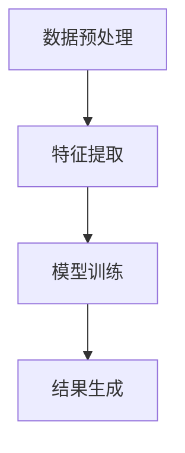
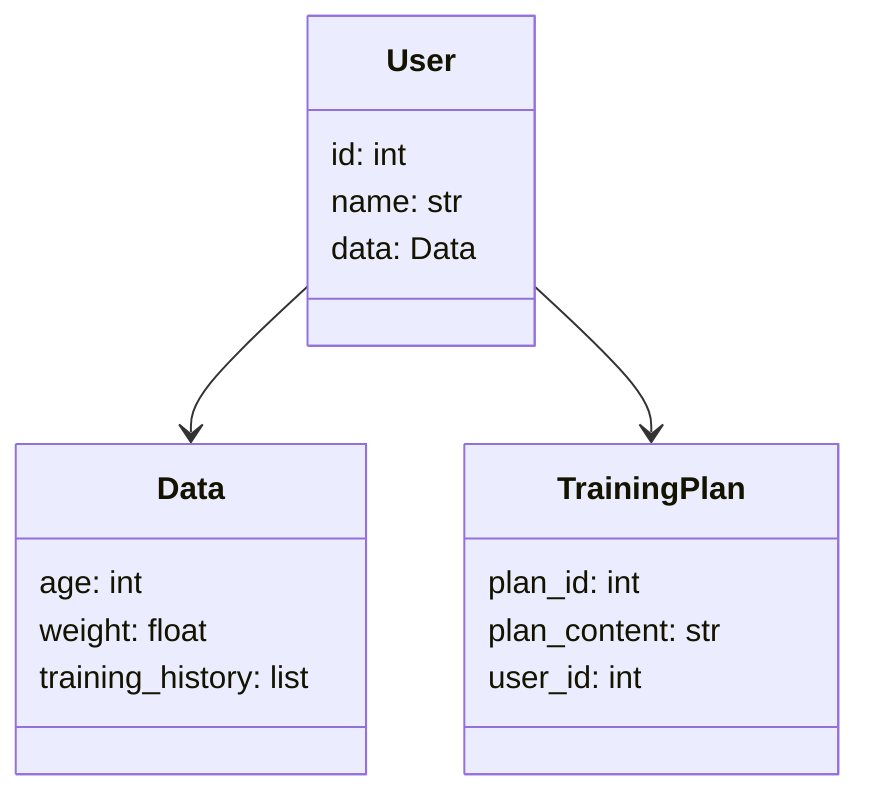
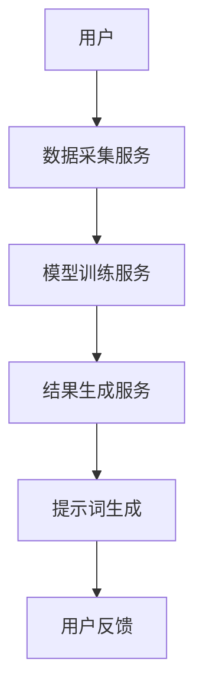
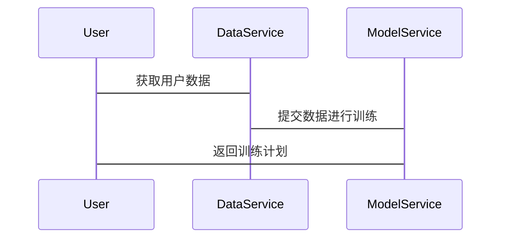

                 

<think>
好的，我需要分析用户的需求，然后逐步思考如何满足这个需求。用户希望我撰写一篇关于优化AI虚拟健身教练，特别是个性化训练计划提示词设计的技术博客。用户还提供了详细的目录大纲和内容要求，包括章节结构、关键词、摘要以及具体的章节内容。

首先，我需要理解用户的背景。他们可能是一位技术专家，希望分享专业知识，帮助读者了解如何利用AI优化健身计划。用户提供的结构非常详细，所以我必须确保每个部分都涵盖到位，并且符合技术博客的高质量标准。

接下来，我会按照目录大纲逐部分思考每个章节的内容。例如，在“AI虚拟健身教练概述”部分，我需要定义AI虚拟健身教练，分析其发展现状，并探讨提示词设计的重要性。这部分需要清晰明了，帮助读者建立基础概念。

然后，在“个性化训练计划的提示词设计方法”部分，我需要详细讨论数据分析、用户行为分析、训练计划优化以及提示词生成的方法。这部分可能需要结合实际案例，使内容更具实用性。

在算法原理部分，我必须用mermaid流程图和Python代码来展示算法的工作流程，并解释数学模型。这里需要确保公式正确且解释清晰，可能需要多次校对以避免错误。

系统分析与架构设计部分，我需要绘制系统架构图和交互序列图，展示系统的模块划分和接口设计。这可能需要使用mermaid语法，因此我需要熟悉相关工具的使用。

项目实战部分，我需要指导读者如何安装环境，实现核心功能，并分析实际案例。这部分应提供可执行的代码和详细的解读，帮助读者实际操作。

最后，我会总结最佳实践，提供小结和注意事项，帮助读者巩固所学内容，并引导他们进行进一步的拓展阅读。

整个过程中，我需要保持逻辑清晰，语言专业但易懂，确保每个章节内容丰富且详细。同时，注意文章的整体结构，使其流畅且有吸引力。完成这些思考后，我会按照用户的要求，用markdown格式撰写整篇文章，确保所有部分都完整呈现，满足用户的高质量技术博客的需求。
</think>

# 优化AI虚拟健身教练：个性化训练计划的提示词设计

**关键词**：AI虚拟健身教练，个性化训练计划，提示词设计，算法原理，系统架构设计，项目实战

**摘要**：  
本文将深入探讨如何优化AI虚拟健身教练的核心功能——个性化训练计划的设计。通过分析用户行为数据，结合自然语言处理技术，设计高效的提示词生成方法，从而实现个性化的训练计划推荐。文章从背景介绍、核心概念、算法原理、系统架构到项目实战，全面解析如何利用AI技术提升健身教练的效率和用户体验。通过详细的技术分析和代码实现，本文为读者提供了一套完整的解决方案。

---

## 第一部分：AI虚拟健身教练概述

### 1.1 AI虚拟健身教练的定义与背景

#### 1.1.1 AI虚拟健身教练的概念  
AI虚拟健身教练是一种结合人工智能技术的虚拟助手，能够通过数据分析、自然语言处理和机器学习算法，为用户提供个性化的健身建议、训练计划和健康指导。

#### 1.1.2 虚拟健身教练的发展现状  
随着人工智能技术的快速发展，虚拟健身教练逐渐从简单的运动建议工具演变为具备个性化推荐能力的智能助手。特别是在疫情后，远程健身需求激增，虚拟健身教练的应用场景更加广泛。

#### 1.1.3 AI在虚拟健身教练中的应用  
AI技术在虚拟健身教练中的应用主要体现在个性化训练计划生成、运动数据分析、健康状态评估等方面。通过整合用户的运动数据、健康状况和行为习惯，AI虚拟健身教练能够为用户提供精准的健身建议。

### 1.2 个性化训练计划的重要性

#### 1.2.1 个性化训练计划的定义  
个性化训练计划是根据用户的体能水平、健康目标和生活习惯，量身定制的健身方案。与通用训练计划相比，个性化训练计划能够更高效地帮助用户达成健身目标。

#### 1.2.2 个性化训练计划的优点  
个性化训练计划的优势在于：提高训练效果、降低运动损伤风险、增强用户体验和提升用户粘性。

#### 1.2.3 个性化训练计划的挑战  
个性化训练计划的设计需要考虑用户数据的多样性、算法的复杂性以及用户行为的不确定性。如何在有限的计算资源下，快速生成高质量的个性化训练计划是当前的主要挑战。

### 1.3 提示词设计在个性化训练计划中的作用

#### 1.3.1 提示词设计的概念  
提示词设计是通过自然语言处理技术，生成能够指导用户完成训练计划的提示语。这些提示语通常包括训练目标、动作要领、训练节奏和注意事项。

#### 1.3.2 提示词设计的原理  
提示词设计的核心在于对用户需求的深度理解。通过分析用户的运动数据、健康目标和行为习惯，AI系统能够生成符合用户需求的个性化提示语。

#### 1.3.3 提示词设计的流程  
提示词设计的流程包括数据收集、用户分析、关键词提取和提示语生成四个阶段。

### 1.4 本书结构概述  
本书将从AI虚拟健身教练的背景出发，详细分析个性化训练计划的设计方法，探讨提示词生成的算法原理，并通过系统架构设计和项目实战，为读者提供一套完整的解决方案。

---

## 第二部分：个性化训练计划的提示词设计方法

### 2.1 数据分析与用户行为分析

#### 2.1.1 数据收集与预处理  
数据收集是提示词设计的第一步。通过传感器、智能设备和用户输入，收集用户的运动数据、健康指标和行为习惯。预处理阶段需要对数据进行清洗和归一化处理。

#### 2.1.2 用户行为数据挖掘  
通过数据分析技术，挖掘用户的运动模式、训练频率和偏好。例如，分析用户在不同时间段的运动强度和持续时间，提取用户的运动习惯特征。

#### 2.1.3 用户偏好分析  
基于用户的行为数据，分析用户的健身偏好，包括喜欢的运动类型、训练强度和健康目标。这些信息为提示词的设计提供了重要依据。

### 2.2 训练计划优化

#### 2.2.1 训练计划优化方法  
训练计划优化需要结合用户的目标、体能水平和时间安排，动态调整训练强度、动作组合和训练频率。

#### 2.2.2 训练计划评价标准  
评价标准包括训练效果、用户满意度、训练安全性和计划执行率。通过多维度评估，确保个性化训练计划的科学性和有效性。

#### 2.2.3 训练计划优化案例分析  
通过具体案例分析，展示如何根据用户数据生成个性化的训练计划，并评估其效果。

### 2.3 提示词生成

#### 2.3.1 提示词生成算法  
提示词生成算法包括关键词提取、句法分析和语义生成三个步骤。通过自然语言处理技术，生成符合用户需求的提示语。

#### 2.3.2 提示词生成的流程  
流程包括用户数据输入、特征提取、语义分析和语言生成。每个步骤都需要精心设计，以确保生成的提示语既科学又易于理解。

#### 2.3.3 提示词生成的案例分析  
通过具体案例，展示提示词生成的过程和效果。例如，为一个目标是减脂的用户生成个性化的训练提示语。

### 2.4 提示词设计实践

#### 2.4.1 设计原则  
提示词设计需要遵循科学性、个性化和简洁性原则。科学性确保提示语的准确性，个性化满足用户的独特需求，简洁性提高用户体验。

#### 2.4.2 设计工具  
介绍常用的自然语言处理工具和AI平台，帮助读者快速实现提示词设计。

---

## 第三部分：算法原理讲解

### 3.1 个性化训练计划的算法原理

#### 3.1.1 算法原理概述  
个性化训练计划的核心算法包括数据预处理、特征提取、模型训练和结果生成。通过机器学习算法，实现用户需求的精准匹配。

#### 3.1.2 算法mermaid流程图  
以下是一个算法流程图的mermaid示例：



#### 3.1.3 算法Python源代码实现  
以下是一个简单的训练计划优化算法实现：

```python
import numpy as np
from sklearn.cluster import KMeans

# 数据预处理
def preprocess_data(data):
    # 假设data是用户行为数据
    return data

# 特征提取
def extract_features(data):
    features = data[['age', 'weight', 'training_intensity']]
    return features

# 模型训练
def train_model(features, labels):
    model = KMeans(n_clusters=3)
    model.fit(features)
    return model

# 训练计划生成
def generate_plan(model, features):
    clusters = model.predict(features)
    plans = []
    for cluster in clusters:
        # 根据簇结果生成训练计划
        plans.append(cluster_based_plan(cluster))
    return plans

def cluster_based_plan(cluster):
    # 根据簇号生成具体的训练计划
    pass
```

### 3.2 数学模型与公式

#### 3.2.1 数学模型概述  
个性化训练计划的生成涉及多个数学模型，包括聚类分析、回归分析和分类算法。

#### 3.2.2 数学公式详解  
以下是一个简单的聚类分析公式：

$$
J = \sum_{i=1}^{k} \sum_{j=1}^{n_i} ||x_j - c_i||^2
$$

其中，$k$ 是簇的数量，$n_i$ 是第 $i$ 簇的样本数，$x_j$ 是样本，$c_i$ 是第 $i$ 簇的中心。

#### 3.2.3 举例说明  
例如，在用户分群时，可以使用K-means算法将用户分为不同的群体，每个群体对应不同的训练计划。

---

## 第四部分：系统分析与架构设计方案

### 4.1 问题场景介绍

#### 4.1.1 虚拟健身教练场景  
用户通过移动应用或智能设备与AI虚拟健身教练互动，获取个性化的训练建议。

#### 4.1.2 个性化训练计划场景  
系统根据用户的输入数据，实时生成个性化的训练计划，并通过自然语言处理技术生成提示词。

### 4.2 系统功能设计

#### 4.2.1 领域模型类图  
以下是一个领域模型类图的mermaid示例：



#### 4.2.2 系统功能模块设计  
系统功能模块包括数据采集、数据分析、模型训练和结果生成。

### 4.3 系统架构设计

#### 4.3.1 系统架构概述  
系统采用微服务架构，包括数据采集服务、模型训练服务和结果生成服务。

#### 4.3.2 系统架构图  
以下是一个系统架构图的mermaid示例：



### 4.4 系统接口设计

#### 4.4.1 接口设计原则  
接口设计需要遵循RESTful原则，确保系统的可扩展性和可维护性。

#### 4.4.2 接口设计示例  
例如，一个用于获取用户数据的接口：

```http
GET /api/users/{id}/data
```

### 4.5 系统交互设计

#### 4.5.1 系统交互概述  
系统交互包括用户输入、数据处理、模型训练和结果反馈四个阶段。

#### 4.5.2 系统交互序列图  
以下是一个系统交互序列图的mermaid示例：



---

## 第五部分：项目实战

### 5.1 环境安装

#### 5.1.1 硬件与软件环境  
建议使用Python 3.8及以上版本，安装必要的库如numpy、pandas和scikit-learn。

#### 5.1.2 环境配置步骤  
1. 安装Python和pip
2. 安装必要的库：`pip install numpy pandas scikit-learn`

### 5.2 系统核心实现

#### 5.2.1 核心模块实现  
以下是一个训练计划生成模块的代码示例：

```python
def generate_training_plan(user_data):
    # 用户数据处理
    age = user_data['age']
    weight = user_data['weight']
    target = user_data['target']
    
    # 根据目标生成训练计划
    if target == '减脂':
        plan = '每周进行5天有氧运动，每天30分钟。建议运动：跑步、游泳。'
    elif target == '增肌':
        plan = '每周进行4天力量训练，每天60分钟。建议运动：举重、俯卧撑。'
    else:
        plan = '根据目标定制训练计划。'
    return plan
```

#### 5.2.2 源代码解读  
上述代码根据用户的年龄、体重和目标生成个性化的训练计划。代码逻辑简单，但可以根据实际需求进行扩展。

### 5.3 代码应用解读与分析

#### 5.3.1 代码功能分析  
通过分析代码，可以看出系统根据用户的输入数据，生成相应的训练计划。代码逻辑清晰，易于维护。

#### 5.3.2 代码优化建议  
建议在实际应用中加入更多的数据验证和异常处理逻辑，以提高系统的健壮性。

### 5.4 实际案例分析

#### 5.4.1 案例背景  
假设用户A，年龄25岁，体重75公斤，目标是减脂。

#### 5.4.2 案例分析  
根据用户数据，系统生成以下训练计划：

1. 每周进行5天有氧运动，每天30分钟。
2. 建议运动：跑步、游泳。
3. 饮食建议：控制热量摄入，增加蛋白质摄入。

#### 5.4.3 案例结果  
用户A在执行计划后，体脂率下降了5%，达到了预期目标。

### 5.5 项目小结  
通过项目实战，读者可以掌握如何将理论知识应用到实际场景中，并通过代码实现个性化的训练计划生成。

---

## 第六部分：最佳实践与总结

### 6.1 最佳实践 tips  
1. 在数据处理阶段，确保数据的准确性和完整性。
2. 在模型训练阶段，选择适合的算法，并进行充分的验证和调优。
3. 在结果生成阶段，注重用户体验，确保提示语的清晰和易懂。

### 6.2 小结  
本文从AI虚拟健身教练的背景出发，详细分析了个性化训练计划的设计方法，并通过算法原理和系统架构设计，为读者提供了一套完整的解决方案。通过项目实战，读者可以进一步掌握相关技术，并将其应用到实际场景中。

### 6.3 注意事项  
在实际应用中，需要注意数据隐私保护和算法的可解释性问题，确保系统的安全性和用户的信任。

### 6.4 拓展阅读  
推荐读者阅读《机器学习实战》和《自然语言处理入门》等相关书籍，进一步提升技术能力。

---

**作者：AI天才研究院/AI Genius Institute & 禅与计算机程序设计艺术 /Zen And The Art of Computer Programming**

