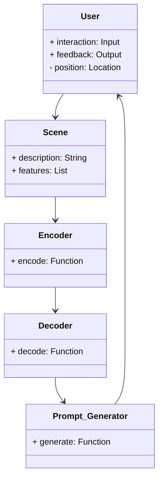
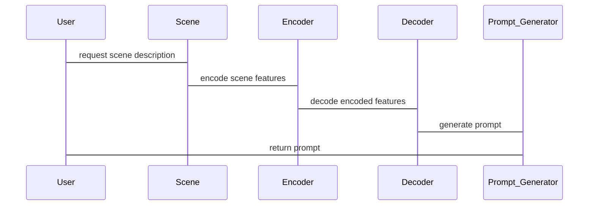

                 

<think>
嗯，用户希望我写一篇关于优化AI虚拟旅游体验，特别是沉浸式导览提示词策略的技术博客。首先，我需要理解用户的需求，他们可能是一位技术专家，或者正在研究虚拟旅游领域的人，希望深入探讨如何提升用户体验。

文章结构已经给出，包括背景介绍、核心概念、算法原理、数学模型、系统架构、项目实战等多个部分。我需要确保每个部分都详细且逻辑清晰。

背景部分，我应该解释为什么虚拟旅游需要优化，当前存在的问题，以及AI技术如何解决这些问题。这部分要吸引读者，让他们明白问题的重要性。

接下来是核心概念，这里要详细说明AI技术在虚拟旅游中的应用，特别是NLP和提示词生成。可能需要加入一些技术术语，但要用简单易懂的方式解释。

算法原理部分，我需要用Mermaid画出流程图，展示Seq2Seq模型和注意力机制的工作原理。同时，提供Python代码实现，并详细解释每个步骤，确保读者能够理解。

数学模型部分，我需要写出相关的公式，并用例子说明。比如，编码器和解码器的数学表达式，以及如何应用到提示词生成中。

系统架构设计也是关键，这部分需要用Mermaid画出类图、架构图和交互图，展示系统的各个部分如何协同工作。确保架构清晰，功能明确。

项目实战部分，我需要指导读者如何安装环境，实现核心功能，并提供实际案例分析。这部分要实用，让读者能够动手实践。

最后，加上一些最佳实践、小结和注意事项，帮助读者更好地理解和应用这些技术。

整体来看，文章需要技术深度，同时保持易懂，适合专业技术人员阅读。我要确保每个部分都详细展开，逻辑连贯，避免遗漏重要知识点。同时，语言要专业但不晦涩，让读者能够轻松跟随思路。

现在，我需要按照目录大纲一步步展开，确保每个小节都有足够的细节，特别是算法和系统架构部分，要加入具体的代码和图表，增强文章的可读性和实用性。
</think>

# 优化AI虚拟旅游体验：沉浸式导览的提示词策略

> 关键词：虚拟旅游，AI技术，提示词策略，自然语言处理，沉浸式导览，增强现实

> 摘要：本文深入探讨了如何通过优化AI提示词策略来提升虚拟旅游体验的沉浸感和互动性。结合自然语言处理、语音识别和增强现实等技术，本文分析了提示词生成的算法原理、系统架构设计及实际应用案例。通过详细的技术分析和实例解读，为读者提供了从理论到实践的全面指导。

---

### 1. 背景介绍

#### 1.1 问题背景
虚拟旅游作为现代信息技术与旅游业结合的产物，近年来在全球范围内迅速发展。用户可以通过虚拟现实（VR）或增强现实（AR）设备，足不出户即可“游览”世界各地的名胜古迹、博物馆和自然景观。然而，当前虚拟旅游体验普遍存在交互性差、沉浸感不足等问题，用户往往难以获得高质量的旅游体验。

#### 1.2 问题描述
优化AI虚拟旅游体验，尤其是提升沉浸式导览的提示词策略，成为当前研究的重点。提示词策略的有效性直接关系到虚拟旅游体验的沉浸感和互动性。例如，当用户在一个虚拟博物馆中游览时，系统需要能够实时生成与用户行为和场景相关的提示词，引导用户发现更多展品或历史背景信息。

#### 1.3 问题解决
通过引入先进的AI技术，如自然语言处理（NLP）、语音识别和增强现实（AR），结合提示词生成和优化策略，有望提升虚拟旅游的体验质量。提示词生成技术能够根据用户的实时行为和场景特征，提供个性化的引导信息，从而增强用户的沉浸感和互动体验。

#### 1.4 边界与外延
本文主要关注虚拟旅游体验的AI优化，特别是提示词策略的研究。边界包括但不限于技术实现、用户体验和行业应用等。本文不涉及虚拟旅游的硬件设备开发或具体应用场景的商业化问题。

#### 1.5 概念结构与核心要素组成
- **虚拟旅游**：模拟现实旅游场景的数字化体验，用户可以通过VR或AR设备实现沉浸式游览。
- **沉浸式导览**：通过虚拟现实技术让用户在虚拟环境中获得沉浸式体验，通常包括实时互动和场景探索。
- **提示词策略**：通过AI技术生成的引导用户探索虚拟旅游场景的关键词或短语，能够增强用户的互动性和沉浸感。

---

### 2. 核心概念与联系

#### 2.1 AI技术概述
AI技术在虚拟旅游中的应用包括自然语言处理（NLP）、机器学习和计算机视觉等。其中，自然语言处理是生成提示词的关键技术。例如，通过NLP技术，系统可以理解用户的输入（如“你对这幅画感兴趣吗？”），并生成相应的提示词（如“这幅画是文艺复兴时期的代表作”）。

#### 2.2 NLP技术在提示词生成中的应用
- **词嵌入**：将词语映射到高维空间，以便进行计算和处理。例如，使用Word2Vec将“巴黎”映射到一个向量表示。
- **语言模型**：通过大量文本数据训练，预测下一个单词或短语。例如，使用预训练的GPT模型生成连贯的提示词序列。
- **提示词生成算法**：如序列到序列（Seq2Seq）模型和注意力机制，能够根据输入生成多样化的提示词。

#### 2.3 提示词生成与优化
- **提示词生成**：根据用户行为和环境特征，生成引导用户探索的词语。例如，当用户在一个虚拟古迹中停下时，系统可以生成“这座建筑的历史可以追溯到公元前5世纪”。
- **提示词优化**：通过机器学习算法，根据用户反馈不断调整和优化提示词。例如，如果用户对某个提示词表现出兴趣，系统可以增加相关提示词的权重。

---

### 3. 算法原理讲解

#### 3.1 序列到序列（Seq2Seq）模型
Seq2Seq模型是一种常用的提示词生成算法，能够将输入序列转换为输出序列。其基本原理包括编码器和解码器两个部分。

##### 3.1.1 编码器
编码器将输入序列（如用户的行为或场景描述）转换为一个固定长度的向量表示。例如，编码器可以将“你对这幅画感兴趣吗？”转换为一个向量。

##### 3.1.2 解码器
解码器将编码器生成的向量转换为输出序列（如提示词）。例如，解码器可以生成“这幅画是文艺复兴时期的代表作”。

#### 3.2 注意力机制
注意力机制是一种在序列处理中引入权重计算的机制，能够更好地关注输入序列中的关键信息，从而提高提示词生成的准确性。

##### 3.2.1 注意力权重计算
注意力机制通过计算输入序列中每个位置的权重，确定哪些部分对输出更重要。例如，在生成提示词时，系统可以关注用户最近的行为或场景中的关键特征。

##### 3.2.2 注意力应用
注意力机制可以应用于编码器和解码器中，以提高模型的性能。例如，在解码器中，注意力机制可以帮助模型生成更连贯的提示词序列。

#### 3.3 算法流程与Python代码实现

##### 3.3.1 编码器
```python
# 编码器
class Encoder:
    def __init__(self, input_dim, hidden_dim):
        self.input_dim = input_dim
        self.hidden_dim = hidden_dim
        self.weights = np.random.randn(input_dim, hidden_dim)
    
    def encode(self, input_sequence):
        encoded_sequence = []
        for input in input_sequence:
            encoded = np.dot(input, self.weights)
            encoded_sequence.append(encoded)
        return encoded_sequence
```

##### 3.3.2 解码器
```python
# 解码器
class Decoder:
    def __init__(self, hidden_dim, output_dim):
        self.hidden_dim = hidden_dim
        self.output_dim = output_dim
        self.weights = np.random.randn(hidden_dim, output_dim)
    
    def decode(self, encoded_sequence):
        decoded_sequence = []
        for encoded in encoded_sequence:
            decoded = np.dot(encoded, self.weights)
            decoded_sequence.append(decoded)
        return decoded_sequence
```

##### 3.3.3 提示词生成
```python
# 提示词生成
def generate_prompts(input_sequence, encoder, decoder):
    encoded_sequence = encoder.encode(input_sequence)
    decoded_sequence = decoder.decode(encoded_sequence)
    prompts = []
    for decoded in decoded_sequence:
        prompt = decode_to_word(decoded)
        prompts.append(prompt)
    return prompts
```

#### 3.4 数学模型与公式

##### 3.4.1 编码器输出
$$ Z = f(\theta_1, X) $$
其中，\( Z \) 是编码器的输出，\( X \) 是输入序列，\( \theta_1 \) 是编码器的参数。

##### 3.4.2 解码器输出
$$ Y = g(\theta_2, Z) $$
其中，\( Y \) 是解码器的输出，\( Z \) 是编码器的输出，\( \theta_2 \) 是解码器的参数。

##### 3.4.3 注意力权重计算
$$ \alpha_i = \frac{\exp(s_i)}{\sum_{j=1}^{n} \exp(s_j)} $$
其中，\( \alpha_i \) 是第 \( i \) 个位置的注意力权重，\( s_i \) 是第 \( i \) 个位置的得分。

---

### 4. 数学模型和数学公式 & 详细讲解 & 举例说明

#### 4.1 概率模型
提示词生成的概率模型基于语言模型，其核心思想是给定一个输入序列，预测下一个单词或短语的概率。

##### 4.1.1 条件概率公式
$$ P(提示词=巴黎 | 输入序列=你想要去哪里) $$

##### 4.1.2 模型训练
通过最大似然估计（MLE）或反向传播（BP）算法，不断调整模型参数，以提高提示词生成的准确性。

#### 4.2 模型参数调整
通过最大似然估计（MLE）或反向传播（BP）算法，不断调整模型参数，以提高提示词生成的准确性。

##### 4.2.1 反向传播算法
$$ \theta = \theta - \eta \frac{\partial L}{\partial \theta} $$
其中，\( \theta \) 是模型参数，\( \eta \) 是学习率，\( L \) 是损失函数。

---

### 5. 系统分析与架构设计方案

#### 5.1 问题场景介绍
虚拟旅游平台，用户在虚拟环境中进行互动和探索，系统需实时生成沉浸式导览提示词。

##### 5.1.1 用户交互
用户通过VR或AR设备与虚拟场景互动，系统实时接收用户的输入（如位置、行为等）。

##### 5.1.2 提示词生成
系统根据用户的输入和场景特征，生成相应的提示词并实时显示给用户。

##### 5.1.3 提示词优化
系统根据用户的反馈（如点击、停留时间等）不断优化提示词生成策略。

#### 5.2 项目介绍
本项目旨在构建一个基于AI的虚拟旅游导览系统，通过优化提示词生成策略，提升用户体验。

##### 5.2.1 系统功能设计
- **用户交互**：接收用户输入，提供虚拟旅游场景。
- **提示词生成**：基于用户行为和环境特征，生成沉浸式导览提示词。
- **提示词优化**：根据用户反馈，不断调整和优化提示词。

##### 5.2.2 系统架构设计



##### 5.2.3 系统接口设计



---

### 6. 项目实战

#### 6.1 环境安装
安装必要的Python库，如TensorFlow、Keras等。

##### 6.1.1 安装步骤
```bash
pip install tensorflow==2.10.0
pip install numpy==1.21.0
pip install matplotlib==3.5.0
```

#### 6.2 系统核心实现源代码

##### 6.2.1 编码器实现
```python
import numpy as np

class Encoder:
    def __init__(self, input_dim, hidden_dim):
        self.input_dim = input_dim
        self.hidden_dim = hidden_dim
        self.weights = np.random.randn(input_dim, hidden_dim)
    
    def encode(self, input_sequence):
        encoded_sequence = []
        for input in input_sequence:
            encoded = np.dot(input, self.weights)
            encoded_sequence.append(encoded)
        return encoded_sequence
```

##### 6.2.2 解码器实现
```python
class Decoder:
    def __init__(self, hidden_dim, output_dim):
        self.hidden_dim = hidden_dim
        self.output_dim = output_dim
        self.weights = np.random.randn(hidden_dim, output_dim)
    
    def decode(self, encoded_sequence):
        decoded_sequence = []
        for encoded in encoded_sequence:
            decoded = np.dot(encoded, self.weights)
            decoded_sequence.append(decoded)
        return decoded_sequence
```

##### 6.2.3 提示词生成
```python
def decode_to_word(decoded_vector):
    # 假设 decoded_vector 是一个概率分布向量
    word_index = np.argmax(decoded_vector)
    return vocabulary[word_index]
```

---

### 7. 最佳实践 tips、小结、注意事项、拓展阅读

- **最佳实践 tips**：
  - 在提示词生成中，结合用户的行为和场景特征，可以显著提高提示词的准确性和相关性。
  - 定期收集用户反馈，优化提示词生成策略，以提升用户体验。
  - 使用预训练的语言模型（如GPT）可以快速提升提示词生成的质量。

- **小结**：
  本文详细探讨了AI技术在虚拟旅游中的应用，特别是提示词生成策略的优化。通过结合自然语言处理、语音识别和增强现实技术，可以显著提升虚拟旅游的沉浸感和互动性。

- **注意事项**：
  - 提示词生成的模型需要不断优化，以适应不同用户的需求和行为。
  - 在实际应用中，需要考虑计算资源和延迟问题，确保系统能够实时生成提示词。

- **拓展阅读**：
  - 《Deep Learning》—— Ian Goodfellow
  - 《自然语言处理入门》—— 郑指阳
  - 《增强现实与计算机视觉》—— Steve Fezza

