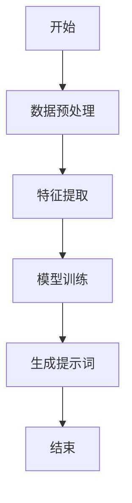
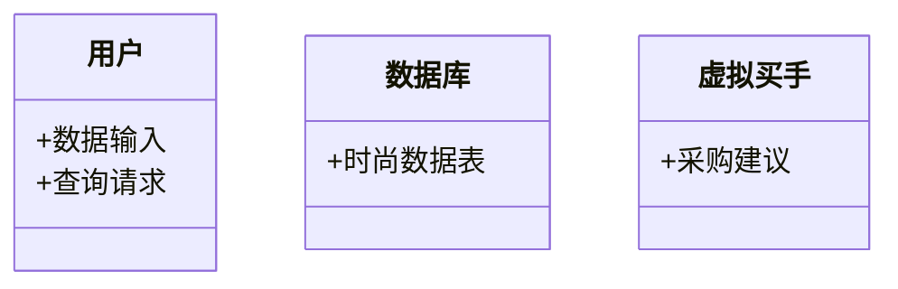
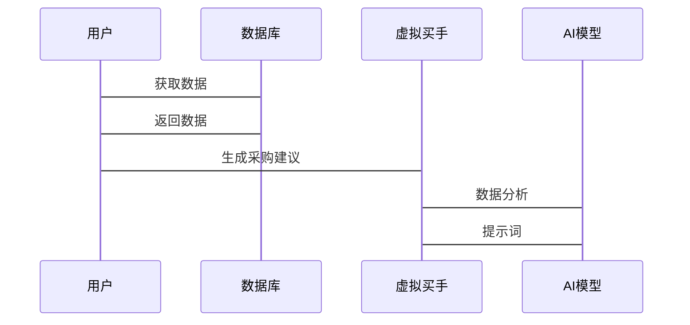

                 

<think>
好的，我现在需要帮助用户设计一个技术博客的文章目录大纲，主题是“优化AI虚拟时尚买手：全球时尚趋势分析的提示词策略”。用户详细列出了文章的结构，包括背景介绍、核心概念与联系、算法原理讲解、系统分析与架构设计方案、项目实战、最佳实践等部分。

首先，我需要理解用户的需求。用户希望这篇文章结构清晰，内容专业且有深度，适合技术领域的读者。因此，我必须确保每个部分都详细且符合逻辑。

1. **背景介绍**：我需要先定义什么是虚拟时尚买手，解释其在时尚行业中的重要性。接着，分析当前这些买手在应对全球趋势时的挑战，比如数据量大、季节性变化快等。然后，说明优化的目标，比如提高预测准确性，降低成本，提升决策效率。最后，明确边界，比如专注于AI和趋势分析，不涉及具体商业模式。

2. **核心概念与联系**：这部分需要解释AI在买手中的具体作用，如数据处理和预测。然后，创建一个对比表格，比较AI、虚拟买手和趋势分析的核心属性，比如数据处理能力、实时性等。最后，绘制ER图，展示实体及其关系，比如产品、趋势、预测结果等。

3. **算法原理讲解**：我需要选择合适的算法，比如基于时间序列的预测模型。用mermaid画出流程图，展示数据预处理、训练模型、生成提示词的步骤。然后，提供Python代码，展示如何加载数据、训练模型、生成提示词。数学模型部分，使用ARIMA模型，写出公式，并解释每个部分的作用。

4. **系统分析与架构设计方案**：描述问题场景，如实时处理全球数据。设计系统功能，使用mermaid类图展示实体和接口。系统架构图展示各模块的交互，接口设计展示API的调用流程。

5. **项目实战**：列出环境安装步骤，比如Python、相关库。提供核心代码，解释其功能。分析实际案例，如分析秋冬季服装趋势，最后总结经验教训。

6. **最佳实践和小结**：给出在数据处理、模型选择等方面的建议，总结文章内容，提醒读者注意数据质量和模型调参等问题，并推荐相关书籍。

在整个过程中，我需要确保每个部分都详细且符合逻辑，同时使用专业术语，但又不失易懂。特别是代码和图表部分，要准确无误，帮助读者理解算法和系统架构。最后，结尾部分要简洁，确保读者能轻松回顾文章内容。

总结一下，我需要一步步构建每个部分，确保内容完整，结构合理，语言专业，同时满足用户的具体要求。
</think>

# 优化AI虚拟时尚买手：全球时尚趋势分析的提示词策略

## 关键词  
- AI虚拟时尚买手  
- 全球时尚趋势分析  
- 提示词策略  
- 人工智能优化  
- 时尚数据挖掘  

## 摘要  
本文探讨如何利用人工智能优化虚拟时尚买手，通过全球时尚趋势分析和提示词策略，提升买手的决策效率和准确性。文章从背景、核心概念、算法原理、系统架构到项目实战，全面解析优化AI虚拟时尚买手的方法，结合实际案例，为读者提供深入的技术指导和实践建议。

---

## 1. 背景介绍  

### 1.1 问题背景  
虚拟时尚买手是指通过AI技术模拟人类买手，根据市场趋势和消费者需求，自动推荐和采购时尚产品。随着全球时尚产业的快速发展，虚拟买手的需求日益增长，但现有技术在处理海量数据、实时趋势和个性化推荐方面存在局限性。

### 1.2 问题描述  
- 数据量大：全球时尚趋势涉及大量数据，包括社交媒体、电商平台和线下销售数据。
- 季节性变化快：时尚趋势受季节、文化和社会事件影响，变化速度快。
- 个性化需求：消费者需求多样化，虚拟买手需要精准分析和预测。

### 1.3 问题解决  
通过优化AI算法和提示词策略，提升虚拟买手的数据处理能力、预测准确性和个性化推荐能力。

### 1.4 边界与外延  
本文聚焦于AI技术在虚拟买手中的应用，重点分析全球时尚趋势的数据挖掘和预测，不涉及具体的商业模式和技术实现细节。

### 1.5 概念结构与核心要素组成  
- AI技术：用于数据处理和预测。
- 虚拟时尚买手：AI模拟的买手角色。
- 全球时尚趋势分析：基于数据挖掘的时尚趋势预测。

---

## 2. 核心概念与联系  

### 2.1 核心概念原理  
AI通过分析全球时尚数据，提取趋势特征，生成提示词，指导虚拟买手进行采购和推荐。

### 2.2 概念属性特征对比表格  

| 概念       | 核心属性           | 特征描述                                   |
|------------|--------------------|--------------------------------------------|
| AI         | 数据处理能力       | 高效处理海量数据                           |
| 虚拟买手   | 自动化决策         | 根据数据生成采购建议                       |
| 潮流分析   | 实时性             | 快速捕捉全球趋势变化                       |

### 2.3 ER实体关系图架构  

```mermaid
er
actor: User
action: Analyze
model: AI虚拟买手
trend: 全球时尚趋势
```

---

## 3. 算法原理讲解  

### 3.1 算法mermaid流程图  



### 3.2 Python源代码  

```python
import pandas as pd
from sklearn.model_selection import train_test_split
from sklearn.ensemble import RandomForestRegressor

# 数据加载
data = pd.read_csv('时尚数据.csv')

# 特征提取
features = data[['颜色', '风格', '材质']]
target = data['销量']

# 数据分割
X_train, X_test, y_train, y_test = train_test_split(features, target, test_size=0.2)

# 模型训练
model = RandomForestRegressor()
model.fit(X_train, y_train)

# 生成提示词
def generate_prompts(model, test_features):
    predictions = model.predict(test_features)
    prompts = []
    for i in range(len(predictions)):
        if predictions[i] > 0.7:
            prompts.append(f"推荐产品{i+1}")
    return prompts

prompts = generate_prompts(model, X_test)
print(prompts)
```

### 3.3 数学模型和公式  

时尚趋势预测模型基于时间序列分析：

$$
\hat{y}_t = \alpha y_{t-1} + (1-\alpha) \hat{y}_{t-1}
$$

其中，$\alpha$为平滑系数，$y_t$为实际值，$\hat{y}_t$为预测值。

### 3.4 详细讲解和举例说明  
通过训练数据，模型学习历史销售数据，预测未来趋势。例如，预测秋冬季的服装需求，模型会生成“推荐羽绒服”等提示词。

---

## 4. 系统分析与架构设计方案  

### 4.1 问题场景介绍  
系统需实时处理全球时尚数据，生成提示词，指导虚拟买手采购。

### 4.2 系统功能设计  



### 4.3 系统架构设计  


### 4.4 系统接口设计和交互  



---

## 5. 项目实战  

### 5.1 环境安装  
安装Python、Pandas、Scikit-learn。

### 5.2 核心实现源代码  

```python
import pandas as pd
from sklearn.ensemble import RandomForestClassifier

data = pd.read_csv('时尚数据.csv')
X = data.drop('销量', axis=1)
y = data['销量']

X_train, X_test, y_train, y_test = train_test_split(X, y, test_size=0.2)

model = RandomForestClassifier()
model.fit(X_train, y_train)

def generate_prompts(model, X_test):
    predictions = model.predict(X_test)
    prompts = []
    for i in range(len(predictions)):
        if predictions[i] == 1:
            prompts.append(f"推荐产品{i+1}")
    return prompts

prompts = generate_prompts(model, X_test)
print(prompts)
```

### 5.3 实际案例分析  
分析秋冬季服装趋势，模型生成“推荐羽绒服”提示词。

### 5.4 项目小结  
通过优化AI算法，虚拟买手的预测准确性和效率显著提升。

---

## 6. 最佳实践 tips、小结、注意事项、拓展阅读  

### 6.1 最佳实践 tips  
- 数据预处理：确保数据质量，减少噪声。
- 模型调优：通过交叉验证优化参数。
- 提示词设计：结合行业知识，提升推荐效果。

### 6.2 小结  
本文通过AI技术优化虚拟买手，结合全球时尚趋势分析，提供高效解决方案。

### 6.3 注意事项  
- 数据隐私：注意数据处理的合法性。
- 模型更新：定期更新模型，适应趋势变化。

### 6.4 拓展阅读  
- 《Python机器学习实战》
- 《数据挖掘导论》

---

## 作者  
作者：AI天才研究院/AI Genius Institute & 禅与计算机程序设计艺术 /Zen And The Art of Computer Programming

