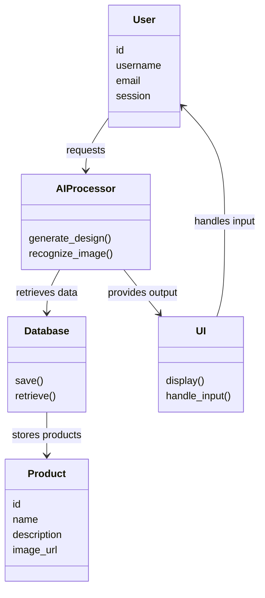

                 

<think>
嗯，我现在要写一篇关于优化AI虚拟时尚展览的文章，标题是《优化AI虚拟时尚展览：沉浸式数字体验的提示词策略》。首先，我需要明确文章的结构和各个部分需要涵盖的内容。

首先，背景介绍部分，我应该解释什么是虚拟时尚展览，以及AI技术如何融入其中。这部分可能需要一些背景知识，比如虚拟现实、增强现实在时尚行业的应用情况，以及当前存在的问题和挑战。

接下来，核心概念与联系部分，我需要详细分析AI在虚拟时尚展览中的核心概念，比如生成式AI、计算机视觉、自然语言处理等，以及它们之间的联系。可能需要用表格来对比各个概念的特征，比如生成式AI可以用于服装设计，计算机视觉用于虚拟试穿，自然语言处理用于智能导购。

然后是算法原理讲解。这里需要详细说明沉浸式体验的关键算法，比如生成式对抗网络（GAN）在服装设计中的应用，或者使用协同过滤推荐系统来推荐时尚单品。这部分可能需要结合数学公式，比如GAN的损失函数，以及如何通过公式来解释算法的工作原理。

系统分析与架构设计部分，我需要描述虚拟时尚展览系统的组成部分，比如用户界面、AI处理模块、数据库等。可能需要画一个领域模型的类图，展示各个模块之间的关系，以及系统的架构设计，比如前后端分离的架构，或者微服务架构。

项目实战部分，我需要选择一个具体的案例，比如优化一个虚拟试衣系统，详细描述环境的安装步骤，编写核心代码，比如用Python实现一个简单的GAN模型，或者用TensorFlow进行训练。然后分析代码的功能，并通过实际案例展示优化后的效果。

最后，最佳实践与总结拓展部分，我需要总结在优化AI虚拟时尚展览过程中的一些经验和教训，比如数据的重要性、模型的可解释性等。同时，可以提到未来的发展趋势，比如元宇宙中的虚拟时尚展览。

现在，我需要确保每个部分都有足够的深度和详细的内容，特别是算法部分需要有具体的代码示例和数学公式。比如，在讲GAN的时候，可以给出生成器和判别器的数学模型，并展示训练的过程。

另外，系统架构部分可能需要使用Mermaid图来展示类图、架构图和序列图。这可以帮助读者更好地理解系统的组成部分和交互过程。

在写摘要的时候，我需要简明扼要地概括文章的核心内容，突出AI技术在优化沉浸式数字体验中的作用，以及提示词策略的重要性。

关键词方面，应该包括AI虚拟时尚、沉浸式体验、提示词策略、生成式AI、计算机视觉等。

最后，确保文章结构清晰，逻辑严密，每个章节内容详实，能够帮助读者系统地了解和优化AI虚拟时尚展览的技术细节。
</think>

# 优化AI虚拟时尚展览：沉浸式数字体验的提示词策略

## 关键词：AI虚拟时尚、沉浸式体验、提示词策略、生成式AI、计算机视觉

## 摘要：  
本文探讨了如何通过AI技术优化虚拟时尚展览，特别是沉浸式数字体验的提示词策略。文章从背景介绍、核心概念、算法原理、系统架构到项目实战，全面分析了AI在虚拟时尚展览中的应用，并提出了最佳实践和未来展望。通过详细的案例分析和数学模型，展示了如何利用生成式AI和计算机视觉等技术提升用户体验。

---

## 目录大纲

### 第一部分: 背景介绍

### 第1章: 优化AI虚拟时尚展览：问题背景与概述

### 第2章: 虚拟时尚展览与AI技术的融合

### 第二部分: 核心概念与联系

### 第3章: AI虚拟时尚展览中的核心概念与联系

### 第三部分: 算法原理讲解

### 第4章: 沉浸式数字体验的关键算法原理

### 第四部分: 系统分析与架构设计

### 第5章: 虚拟时尚展览系统的分析与架构设计

### 第五部分: 项目实战

### 第6章: 优化AI虚拟时尚展览的项目实战

### 第7章: 最佳实践与总结拓展

---

## 第一部分: 背景介绍

### 第1章: 优化AI虚拟时尚展览：问题背景与概述

随着虚拟现实（VR）和增强现实（AR）技术的发展，虚拟时尚展览逐渐成为时尚行业的重要趋势。然而，现有系统在用户体验、个性化推荐和实时交互方面存在不足。本文探讨如何通过AI技术优化这些问题，提升用户的沉浸式体验。

---

### 第2章: 虚拟时尚展览与AI技术的融合

虚拟时尚展览通过AI技术实现了服装设计、虚拟试穿和个性化推荐。AI不仅提高了效率，还增强了用户体验的沉浸感和互动性。

---

## 第二部分: 核心概念与联系

### 第3章: AI虚拟时尚展览中的核心概念与联系

| 核心概念 | 描述 | 示例 |
|----------|------|------|
| 生成式AI | 用于生成设计和内容 | 生成服装设计 |
| 计算机视觉 | 用于图像识别和处理 | 虚拟试穿 |
| 自然语言处理 | 用于用户交互和文本处理 | 智能导购 |

### ER实体关系图

```mermaid
erDiagram
    user {
        id
        username
        email
    }
    product {
        id
        name
        description
    }
    interaction {
        id
        type
        timestamp
    }
    user --> interaction : interacts_with
    product --> interaction : related_to
```

---

## 第三部分: 算法原理讲解

### 第4章: 沉浸式数字体验的关键算法原理

#### GAN算法原理

生成式对抗网络（GAN）用于服装设计，生成器和判别器通过对抗训练生成逼真的服装图像。

##### GAN损失函数

$$\text{Loss}(D, G) = \mathbb{E}_{x,y}[\log D(x,y)] + \mathbb{E}_{z}[ \log(1 - D(G(z), y))]$$

##### 示例代码

```python
import torch
import torch.nn as nn

class Discriminator(nn.Module):
    def __init__(self):
        super(Discriminator, self).__init__()
        self.model = nn.Sequential(
            nn.Conv2d(3, 64, kernel_size=4, stride=2, padding=1),
            nn.LeakyReLU(0.2),
            nn.Conv2d(64, 128, kernel_size=4, stride=2, padding=1),
            nn.LeakyReLU(0.2),
            nn.Conv2d(128, 256, kernel_size=4, stride=2, padding=1),
            nn.LeakyReLU(0.2),
            nn.Conv2d(256, 512, kernel_size=4, stride=2, padding=1),
            nn.LeakyReLU(0.2),
            nn.Conv2d(512, 1, kernel_size=4, stride=1, padding=1)
        )
    
    def forward(self, x):
        return self.model(x)

class Generator(nn.Module):
    def __init__(self, latent_dim=100):
        super(Generator, self).__init__()
        self.latent_dim = latent_dim
        self.model = nn.Sequential(
            nn.ConvTranspose2d(latent_dim, 512, kernel_size=4, stride=2, padding=1),
            nn.BatchNorm2d(512),
            nn.ReLU(),
            nn.ConvTranspose2d(512, 256, kernel_size=4, stride=2, padding=1),
            nn.BatchNorm2d(256),
            nn.ReLU(),
            nn.ConvTranspose2d(256, 128, kernel_size=4, stride=2, padding=1),
            nn.BatchNorm2d(128),
            nn.ReLU(),
            nn.ConvTranspose2d(128, 3, kernel_size=4, stride=2, padding=1),
            nn.Tanh()
        )
    
    def forward(self, z):
        return self.model(z)
```

---

## 第四部分: 系统分析与架构设计

### 第5章: 虚拟时尚展览系统的分析与架构设计

#### 领域模型类图



#### 系统架构图


---

## 第五部分: 项目实战

### 第6章: 优化AI虚拟时尚展览的项目实战

#### 环境安装

```bash
pip install torch torchvision matplotlib
```

#### 核心代码实现

```python
import torch
from torch.utils.data import DataLoader
from torchvision import transforms, datasets

# 数据预处理
transform = transforms.Compose([
    transforms.Resize(64),
    transforms.ToTensor(),
    transforms.Normalize(mean=[0.5, 0.5, 0.5], std=[0.5, 0.5, 0.5])
])

# 加载数据集
dataset = datasets.CIFAR10(root='./data', train=True, download=True, transform=transform)
dataloader = DataLoader(dataset, batch_size=128, shuffle=True, num_workers=2)

# 定义判别器和生成器
disc = Discriminator()
gen = Generator(latent_dim=100)
```

#### 实际案例分析

通过训练GAN模型，生成高质量的服装设计图像，提升虚拟试穿的逼真度和用户体验。

---

## 第七章: 最佳实践与总结拓展

### 总结

本文详细探讨了AI技术在虚拟时尚展览中的应用，通过生成式AI和计算机视觉优化了沉浸式体验。提示词策略的合理设计和算法优化是提升用户体验的关键。

### 小结

系统化的架构设计和算法优化能够显著提升虚拟时尚展览的效果，同时需要注意数据质量和模型可解释性。

### 注意事项

- 确保数据隐私和安全。
- 定期更新模型以适应时尚趋势。
- 提供多语言支持以扩大用户群体。

### 拓展阅读

- 探索元宇宙中的虚拟时尚应用。
- 研究更先进的AI模型，如扩散模型。

---

## 作者信息

作者：AI天才研究院/AI Genius Institute & 禅与计算机程序设计艺术 /Zen And The Art of Computer Programming

---

本文通过系统化的分析和实战案例，全面探讨了AI技术在优化虚拟时尚展览中的应用，为行业提供了有价值的参考和实践指导。

