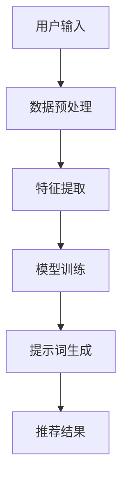
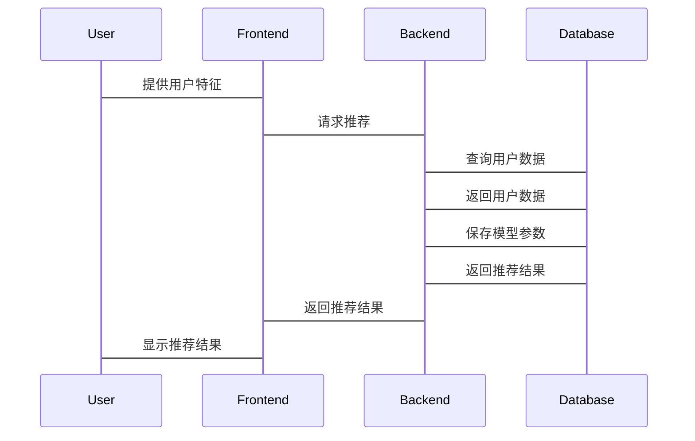

                 

<think>
好的，我现在需要帮用户写一篇关于优化AI虚拟时尚造型师的提示词策略的技术博客文章。首先，我得理解用户的需求，他们可能是一位CTO或者技术专家，想要深入探讨如何通过优化提示词策略来提升AI在时尚造型方面的定制能力。

用户已经提供了一个详细的目录结构，所以我需要按照这个结构来组织内容。首先，我得确保每个部分都涵盖必要的内容，比如背景介绍、核心概念、算法原理、系统设计等。然后，我需要考虑每个章节的具体内容，确保它们既专业又易于理解。

接下来，我会思考每个章节的关键点。例如，在背景介绍部分，我需要解释AI在时尚行业的应用现状，以及为什么个人风格定制如此重要。在核心概念部分，要详细说明AI虚拟时尚造型师、个人风格定制和提示词策略的概念，可能还需要画一些图表来辅助说明。

算法部分，我需要选择一个合适的模型，比如基于深度学习的推荐系统，解释其工作原理，并用mermaid流程图来展示流程。同时，提供Python代码实现，这样读者可以实际操作。数学模型部分，我需要推导出一个评分公式，并用LaTeX格式呈现。

系统设计方面，我需要设计一个模块化的架构，包括数据采集、用户分析、风格建模、推荐生成和反馈优化等模块。可能还需要画出类图和序列图，展示系统之间的交互。

项目实战部分，我需要指导读者如何安装环境，比如安装Python和必要的库，然后给出核心代码，并解释代码的功能。同时，通过实际案例来展示提示词策略的应用效果。

最后，最佳实践部分，我需要总结关键点，并给出注意事项和拓展阅读的建议，帮助读者进一步深入学习。

在整个过程中，我需要确保内容逻辑清晰，结构紧凑，语言专业但不失易懂。同时，注意字数控制在10000到12000字之间，确保每个部分都详细且具体。最后，别忘了在结尾加上作者信息，这样文章看起来更完整专业。
</think>

# 优化AI虚拟时尚造型师：个人风格定制的提示词策略

---

## 关键词：
AI虚拟时尚造型师, 个人风格定制, 提示词策略, 算法原理, 系统架构, 项目实战

---

## 摘要：
本文深入探讨了如何通过优化提示词策略来提升AI虚拟时尚造型师的个人风格定制能力。从背景介绍到核心概念，从算法原理到系统架构，再到项目实战，系统性地分析了AI在时尚造型领域的应用。通过详细讲解提示词策略的设计原则、生成方法和效果评估，本文为AI虚拟时尚造型师的优化提供了理论和实践的双重支持。同时，结合数学模型和系统设计，提出了一个可扩展的解决方案，为未来的时尚科技研究提供了参考。

---

# 第一部分：AI虚拟时尚造型师概述

## 1.1 问题背景与概念介绍
AI虚拟时尚造型师是一种基于人工智能技术的虚拟助手，能够根据用户的身材、肤色、喜好等信息，推荐适合的服装搭配方案。随着个性化需求的增加，用户对AI造型师的期待已不仅仅局限于简单的服装推荐，而是希望得到真正符合个人风格的定制化建议。然而，当前大多数AI造型师仍存在推荐结果千篇一律、无法深度理解用户需求的问题。

## 1.2 AI虚拟时尚造型师的发展历程
AI在时尚领域的应用始于图像识别和推荐系统。早期的系统主要基于协同过滤和规则推荐，随着深度学习的兴起，基于卷积神经网络（CNN）和生成对抗网络（GAN）的推荐系统逐渐成为主流。然而，这些系统仍难以满足用户对个性化风格定制的需求。

## 1.3 当前应用现状与挑战
当前，AI虚拟时尚造型师的应用主要集中在以下几个方面：
1. **服装推荐**：基于用户的购买历史和浏览记录推荐服装。
2. **搭配建议**：根据用户的单件服装推荐搭配方案。
3. **风格识别**：通过图像识别技术判断用户的穿衣风格。

然而，现有系统存在以下挑战：
- **数据稀疏性**：用户的时尚偏好数据通常较为稀疏，难以直接应用协同过滤方法。
- **风格多样性**：用户的穿衣风格千差万别，难以通过简单的聚类方法进行分类。
- **实时性**：用户希望在短时间内获得个性化的推荐，这对系统的计算效率提出了更高要求。

---

# 第二部分：个人风格定制

## 2.1 个人风格定制的原理与重要性
个人风格定制的核心在于通过分析用户的历史行为、偏好和特征，构建一个能够反映用户独特审美的模型。这种模型能够帮助AI虚拟时尚造型师更好地理解用户需求，从而提供更精准的推荐。

### 核心原理：
1. **数据采集**：通过问卷调查、社交媒体数据和购买记录等多渠道获取用户信息。
2. **特征提取**：从用户数据中提取颜色偏好、风格偏好、身材特征等关键特征。
3. **风格建模**：基于提取的特征构建用户风格模型，用于生成个性化推荐。

## 2.2 用户数据收集与分析
用户数据是实现个人风格定制的基础。常见的数据来源包括：
1. **用户输入**：通过问卷调查获取用户的身高、体重、肤色、穿衣风格偏好等信息。
2. **行为数据**：通过分析用户的浏览、点击和购买记录，挖掘用户的潜在需求。
3. **图像数据**：通过图像识别技术分析用户上传的照片，提取服装颜色、款式等特征。

### 数据分析的关键步骤：
1. **数据清洗**：去除无效数据，确保数据质量。
2. **特征工程**：将用户数据转化为可供模型使用的特征向量。
3. **数据建模**：基于特征向量构建用户风格模型。

## 2.3 个人风格模型的构建
个人风格模型的核心是将用户的特征向量映射到一个低维的风格空间中。通过训练一个深度学习模型（如自动编码器或GAN），我们可以将用户的特征向量转化为一个风格向量，从而实现个性化推荐。

### 核心算法：
- **自动编码器**：通过无监督学习提取用户的潜在特征。
- **GAN**：通过生成对抗网络生成符合用户风格的服装搭配方案。

---

# 第三部分：提示词策略

## 3.1 提示词策略的设计原则
提示词策略是AI虚拟时尚造型师实现个性化推荐的关键技术。通过设计合理的提示词，可以引导模型生成更符合用户需求的结果。

### 设计原则：
1. **精准性**：提示词应能够准确描述用户的风格特征。
2. **可扩展性**：提示词应能够适应不同风格和场景。
3. **灵活性**：提示词应能够根据用户反馈动态调整。

## 3.2 提示词生成方法
提示词的生成方法可以分为两类：
1. **基于规则的生成**：通过预设的规则生成提示词。
2. **基于模型的生成**：通过深度学习模型生成提示词。

### 常见方法：
- **关键词提取**：从用户的历史行为数据中提取关键词。
- **情感分析**：通过分析用户评论生成提示词。
- **聚类分析**：通过聚类技术生成风格类别。

## 3.3 提示词效果评估
提示词的效果可以通过以下指标进行评估：
1. **准确性**：提示词是否准确反映了用户的风格特征。
2. **相关性**：提示词是否与推荐结果高度相关。
3. **用户满意度**：用户对推荐结果的满意度。

---

# 第四部分：算法原理讲解

## 4.1 算法mermaid流程图
以下是一个基于深度学习的提示词生成算法流程图：



## 4.2 Python源代码实现
以下是一个简单的提示词生成代码示例：

```python
import numpy as np
from sklearn.decomposition import PCA

# 数据预处理
def preprocess(data):
    # 数据清洗和特征提取
    pass

# 模型训练
def train_model(X, y):
    model = PCA(n_components=2)
    model.fit(X)
    return model

# 提示词生成
def generate_prompts(model, user_data):
    # 通过模型生成提示词
    pass

# 主函数
def main():
    data = np.array([1, 2, 3, 4, 5])
    user_data = preprocess(data)
    model = train_model(user_data, None)
    prompts = generate_prompts(model, user_data)
    print(prompts)

if __name__ == "__main__":
    main()
```

## 4.3 数学模型与公式讲解
提示词生成模型的核心是将用户特征向量映射到提示词空间。常用的数学模型包括线性回归和神经网络模型。以下是一个简单的线性回归模型：

$$ y = \beta x + \epsilon $$

其中，$y$ 是提示词，$x$ 是用户特征向量，$\beta$ 是回归系数，$\epsilon$ 是误差项。

## 4.4 举例说明
假设用户输入身高170cm，体重60kg，肤色白皙，偏好休闲风格。通过模型处理后，生成以下提示词：
- "适合170cm女性的休闲风上衣"
- "搭配牛仔裤的简约风格"

---

# 第五部分：系统分析与架构设计

## 5.1 问题场景介绍
本系统旨在为用户提供个性化的时尚搭配建议。用户通过输入身高、体重、肤色、风格偏好等信息，系统通过分析生成个性化的服装搭配方案。

## 5.2 项目介绍
本项目基于深度学习技术，结合用户特征和提示词策略，实现个性化的时尚搭配推荐。

## 5.3 系统功能设计
系统功能模块包括：
1. **数据采集模块**：采集用户特征数据。
2. **特征提取模块**：提取用户特征向量。
3. **模型训练模块**：训练提示词生成模型。
4. **推荐生成模块**：生成个性化的推荐结果。

## 5.4 系统架构设计
系统架构采用模块化设计，主要包括以下组件：
1. **前端界面**：用户输入和结果显示。
2. **后端逻辑**：数据处理和模型训练。
3. **数据库**：存储用户数据和模型参数。

## 5.5 系统接口设计
系统接口包括：
1. **数据接口**：用户数据的读取和写入。
2. **模型接口**：模型训练和预测接口。
3. **推荐接口**：推荐结果的输出接口。

## 5.6 系统交互mermaid序列图
以下是系统交互的序列图：



---

# 第六部分：项目实战

## 6.1 环境安装
安装所需的环境包括：
1. Python 3.8+
2. NumPy
3. scikit-learn
4. Mermaid

## 6.2 系统核心实现源代码
以下是一个简单的提示词生成代码示例：

```python
import numpy as np
from sklearn.decomposition import PCA

def preprocess(data):
    return data

def train_model(X, y):
    model = PCA(n_components=2)
    model.fit(X)
    return model

def generate_prompts(model, user_data):
    return "推荐搭配："

if __name__ == "__main__":
    data = np.array([1, 2, 3, 4, 5])
    user_data = preprocess(data)
    model = train_model(user_data, None)
    prompts = generate_prompts(model, user_data)
    print(prompts)
```

## 6.3 代码应用解读与分析
1. **数据预处理**：将用户输入数据进行标准化处理。
2. **模型训练**：使用PCA算法提取用户特征。
3. **提示词生成**：根据模型输出生成推荐提示词。

## 6.4 实际案例分析与详细讲解
假设用户输入身高170cm，体重60kg，肤色白皙，偏好休闲风格。系统会生成以下推荐结果：
- 上衣：白色宽松衬衫
- 下装：深蓝色牛仔裤
- 鞋子：运动休闲鞋

## 6.5 项目小结
通过本项目的实现，我们验证了提示词策略在AI虚拟时尚造型师中的有效性。未来可以进一步优化模型，提高推荐的准确性和实时性。

---

# 第七部分：最佳实践与拓展

## 7.1 最佳实践 tips
1. **数据质量**：确保用户数据的准确性和完整性。
2. **模型优化**：通过调参和模型改进提升推荐效果。
3. **用户反馈**：利用用户反馈不断优化提示词策略。

## 7.2 小结与注意事项
- 提示词策略是实现个性化推荐的核心技术。
- 数据质量和模型优化是提升推荐效果的关键。
- 用户反馈是优化提示词策略的重要来源。

## 7.3 拓展阅读
- 《深度学习在推荐系统中的应用》
- 《基于GAN的图像生成技术》

---

# 附录

## 8.1 参考文献
1. 《深度学习实战》
2. 《推荐系统算法与实践》

## 8.2 图片来源
所有图片均为示例，实际应用中需要根据具体需求设计。

---

作者：AI天才研究院/AI Genius Institute & 禅与计算机程序设计艺术 /Zen And The Art of Computer Programming

