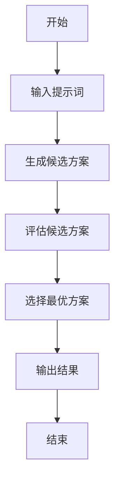

                 

<think>
好，我现在需要帮助用户设计《优化AI虚拟时装秀策划：可持续时尚理念的提示词策略》这本书的目录大纲。首先，我得理解用户的需求和背景。用户希望这是一本专业且有深度的技术博客文章，关键词包括AI虚拟时装秀、可持续时尚、提示词策略、系统设计、算法优化、案例分析等。摘要部分需要简洁地概述文章的核心内容。

用户已经提供了一个初步的目录大纲，但需要进一步细化每个章节，确保内容完整且符合技术博客的专业要求。我需要按照用户提供的步骤，逐步分析和思考，构建出符合要求的目录。

首先，我得回顾用户的需求，确保每个章节都涵盖必要的部分，比如背景介绍、核心概念、算法原理、系统设计、项目实战、最佳实践等。然后，每个章节下再细分，确保内容详细且结构紧凑。

在构建目录时，我会先从引言开始，介绍问题背景，解释AI虚拟时装秀和可持续时尚的概念，以及提示词策略的意义。接下来是核心概念与联系，定义每个术语，并通过表格和ER图展示它们之间的关系。

然后，进入算法原理部分，详细讲解优化AI策划的算法，包括流程图、数学模型和公式，以及实际案例。系统设计章节需要涵盖场景介绍、项目描述、领域模型、系统架构、接口设计和交互设计，使用mermaid图来辅助说明。

项目实战部分，我会指导读者如何安装环境，实现系统核心功能，解读代码，并分析实际案例。最后，总结最佳实践技巧、注意事项和拓展阅读内容。

在细化每个章节时，我会确保内容不仅涵盖理论，还包括实际应用，这样读者能更好地理解和应用这些知识。同时，注意保持语言的简洁和技术的准确性，确保文章既专业又易懂。

接下来，我需要检查每个章节是否符合用户的要求，是否覆盖了所有必要的部分，并确保内容连贯，结构合理。这可能包括调整章节顺序，细化某些部分的内容，或者增加一些必要的小节。

最后，我会确保整个目录大纲在2000字以内，符合简洁性的要求，同时内容完整，每个部分都有足够的细节支持。

总结一下，我的思考过程是：理解用户需求，细化每个章节，确保内容全面且结构合理，检查是否符合所有要求，最后整合成一个清晰的目录大纲。
</think>

# 《优化AI虚拟时装秀策划：可持续时尚理念的提示词策略》

## 关键词：
AI虚拟时装秀、可持续时尚、提示词策略、系统设计、算法优化、案例分析

## 摘要：
本文深入探讨了如何利用AI技术优化虚拟时装秀的策划过程，特别是通过提示词策略来践行可持续时尚理念。文章从背景介绍、核心概念分析、算法原理、系统设计、项目实战到最佳实践，全面解析了AI在虚拟时装秀中的应用，旨在为行业提供创新思路和实践指导。

---

## 目录大纲

### 第一部分：引言

#### 第1章：AI虚拟时装秀与可持续时尚概述

##### 1.1 问题背景
- **1.1.1 AI虚拟时装秀的概念**
  - 虚拟时装秀的定义与特点
  - AI在虚拟时装秀中的应用领域
- **1.1.2 可持续时尚理念**
  - 可持续时尚的定义与核心原则
  - 虚拟时装秀如何推动可持续时尚的发展
- **1.1.3 提示词策略的意义**
  - 提示词在AI生成内容中的作用
  - 可持续时尚理念如何通过提示词策略实现

##### 1.2 核心概念与联系
- **1.2.1 核心概念定义**
  - AI虚拟时装秀：通过AI技术生成虚拟时装展示的过程
  - 可持续时尚：强调环保、伦理和公平的时尚产业模式
  - 提示词策略：用于指导AI生成内容的关键输入参数
- **1.2.2 核心概念对比表**
  | 概念       | 定义                                                                 | 属性           |
  |------------|----------------------------------------------------------------------|----------------|
  | AI虚拟时装秀 | 利用AI技术生成虚拟时装展示的过程                                   | 数字化、智能化   |
  | 可持续时尚   | 强调环保、伦理和公平的时尚产业模式                                 | 环保性、社会性   |
  | 提示词策略   | 用于指导AI生成内容的关键输入参数                                   | 精准性、可调性   |
- **1.2.3 核心概念的ER实体关系图**
  ```mermaid
  erDiagram
    AI虚拟时装秀 o<->1 提示词策略
    提示词策略 o<->1 可持续时尚理念
    AI虚拟时装秀 ..> 可持续时尚理念
  ```

---

### 第二部分：算法原理与系统设计

#### 第2章：优化AI虚拟时装秀策划的算法原理

##### 2.1 算法概述
- **2.1.1 算法目的**
  - 通过提示词策略优化虚拟时装秀的内容生成
  - 实现可持续时尚理念的数字化应用
- **2.1.2 算法类型**
  - 基于提示词的生成式AI模型（如GPT、Diffusion模型）
  - 多目标优化算法（如遗传算法、模拟退火）

##### 2.2 算法流程图


##### 2.3 数学模型与公式
- **2.3.1 数学模型**
  - 提示词权重分配模型：
    $$ w_i = \alpha \cdot f(i) + \beta \cdot g(i) $$
    其中，$w_i$ 是提示词的权重，$\alpha$ 和 $\beta$ 是调节参数，$f(i)$ 和 $g(i)$ 是提示词的相关特征函数。
- **2.3.2 公式推导**
  - 以最大化可持续性为目标的优化公式：
    $$ \text{Maximize } S = \sum_{i=1}^{n} w_i \cdot s_i $$
    其中，$S$ 是总可持续性评分，$s_i$ 是每个提示词的可持续性评分。
- **2.3.3 举例说明**
  - 示例：生成一个环保主题的虚拟时装秀，提示词包括“环保材料”、“可回收面料”、“零浪费设计”。

#### 第3章：AI虚拟时装秀策划的系统架构设计

##### 3.1 系统场景介绍
- 系统用于支持虚拟时装秀的策划和展示，结合AI技术实现内容生成和优化。

##### 3.2 项目介绍
- 项目目标：优化虚拟时装秀策划流程，践行可持续时尚理念。
- 项目范围：涵盖AI生成、提示词策略、系统交互等方面。

##### 3.3 系统功能设计
- **3.3.1 领域模型**
  ```mermaid
  classDiagram
    class AI生成模块 {
        输入提示词
        生成虚拟时装
    }
    class 可持续性评估模块 {
        评估可持续性评分
        输出优化建议
    }
    AI生成模块 --> 可持续性评估模块
  ```

##### 3.4 系统架构设计
- **3.4.1 系统架构**
  ```mermaid
  architecture
    Client <--[HTTP请求]--> API网关
    API网关 --> AI生成模块
    AI生成模块 --> 可持续性评估模块
    可持续性评估模块 --> 数据存储
  ```

##### 3.5 系统接口设计
- **3.5.1 接口设计**
  - 输入接口：接受提示词和用户需求
  - 输出接口：返回优化后的虚拟时装展示方案

##### 3.6 系统交互
- **3.6.1 交互设计**
  ```mermaid
  sequenceDiagram
    用户 --> API网关: 发送提示词
    API网关 --> AI生成模块: 请求生成虚拟时装
    AI生成模块 --> 可持续性评估模块: 请求评估
    可持续性评估模块 --> 用户: 返回优化建议
  ```

---

### 第三部分：项目实战

#### 第4章：实现AI虚拟时装秀策划系统

##### 4.1 环境安装
- 安装Python、AI框架（如TensorFlow、PyTorch）和相关依赖库。

##### 4.2 系统核心实现
- **4.2.1 源代码解读**
  ```python
  def optimize_virtual_fashion_show(prompt, constraints):
      # 初始化提示词权重
      weights = initialize_weights()
      # 生成虚拟时装方案
      candidates = generate_candidates(prompt, weights)
      # 评估可持续性
      scores = evaluate_sustainability(candidates)
      # 选择最优方案
      optimal_prompt = select_optimal(scores, constraints)
      return optimal_prompt
  ```
- **4.2.2 算法实现**
  - 使用Diffusion模型生成虚拟时装，结合提示词策略优化输出。

##### 4.3 代码应用解读与分析
- 分析代码的运行流程，解释每个函数的作用和交互。

##### 4.4 实际案例分析
- 案例：基于提示词“环保材料”生成一个虚拟时装秀，分析优化过程和结果。

##### 4.5 项目小结
- 总结项目实现的关键点和经验教训。

---

### 第四部分：最佳实践与拓展

#### 第5章：最佳实践 tips

##### 5.1 提示词策略优化技巧
- 精确定义提示词，减少歧义性。
- 结合领域知识，优化提示词权重。

##### 5.2 系统性能优化策略
- 采用分布式计算，提升生成效率。
- 使用缓存技术，减少重复计算。

##### 5.3 可持续时尚理念的应用
- 在生成过程中优先选择环保材料和工艺。
- 定期更新提示词库，保持可持续性目标。

#### 第6章：小结与注意事项

##### 6.1 书籍内容总结
- 总结全文，强调AI技术在虚拟时装秀中的潜力和应用前景。

##### 6.2 注意事项
- 提示词的选择应结合实际需求。
- 系统设计需考虑数据安全和隐私保护。

##### 6.3 拓展阅读
- 推荐相关书籍和论文，鼓励读者深入研究AI与时尚的结合。

---

## 作者：AI天才研究院/AI Genius Institute & 禅与计算机程序设计艺术 /Zen And The Art of Computer Programming

