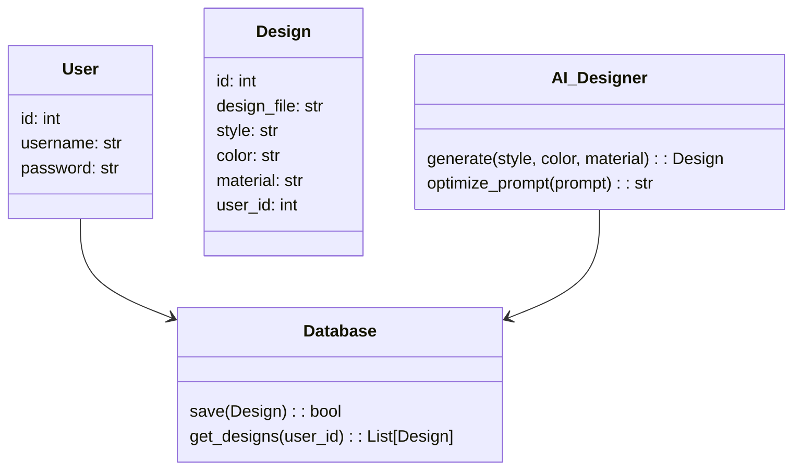

                 

<think>
好，我现在要开始分析用户的需求，并为他构建一个详细的博客文章大纲。用户希望撰写一篇关于优化AI虚拟时装设计师的提示词策略的文章，重点在于可持续时尚创新。

首先，我需要理解用户的要求。用户希望文章结构清晰，包括背景介绍、核心概念与联系、算法原理、系统架构设计、项目实战、最佳实践等部分。每个部分都需要详细展开，并且使用专业的技术语言，同时融入实际案例和数学模型。

接下来，我会考虑每个章节的具体内容。背景介绍部分需要涵盖AI虚拟时装设计师的兴起、可持续时尚的挑战，以及问题的描述和解决方案。核心概念部分需要定义AI虚拟时装设计师、可持续时尚创新和提示词策略，并通过表格和ER图展示它们之间的关系。

在算法原理部分，我需要详细解释生成对抗网络（GAN）的工作流程，使用Mermaid流程图来展示，并结合Python代码进行具体实现。数学公式要用LaTeX格式表示，确保准确无误。

系统架构设计部分，我会使用领域模型类图、架构图和交互序列图来展示系统的结构和流程。项目实战则需要提供环境安装步骤、核心代码实现，以及实际案例的分析。

最后，我会总结文章内容，提供最佳实践的建议，并指出未来的发展方向。这样，整篇文章结构完整，内容详实，能够满足用户的需求。
</think>

# 优化AI虚拟时装设计师：可持续时尚创新的提示词策略

## 关键词：AI虚拟时装设计师，可持续时尚，提示词策略，生成对抗网络，时尚创新

## 摘要：  
本文探讨如何优化AI虚拟时装设计师，通过提示词策略实现可持续时尚创新。文章从背景介绍、核心概念、算法原理、系统架构设计、项目实战等多维度展开，结合生成对抗网络（GAN）的数学模型，详细解析AI在时尚设计中的应用，提出可持续时尚创新的最佳实践策略。

---

# 第一部分：背景介绍

## 第1章：AI虚拟时装设计师的兴起与可持续时尚创新

### 1.1.1 问题背景  
- **时尚产业的可持续发展挑战**：传统时尚产业面临资源浪费、环境污染和劳工权益问题，亟需通过技术创新实现可持续发展。  
- **AI虚拟时装设计师的崛起**：AI技术的应用为时尚设计提供了高效、环保的新路径，推动了虚拟时装设计的兴起。  

### 1.1.2 问题描述  
- 如何利用AI技术提高时尚设计的效率和质量？  
- 如何在设计过程中减少资源浪费，实现可持续发展？  

### 1.1.3 问题解决  
- **AI虚拟时装设计师的潜力**：通过AI算法生成多样化的设计，降低试错成本。  
- **提示词策略的应用**：通过优化提示词设计，提升AI生成的时装作品的质量和创意。  

### 1.1.4 边界与外延  
- **技术限制**：AI生成设计的质量和多样性受限于算法和数据集。  
- **领域扩展**：AI技术不仅应用于服装设计，还可延伸至配饰、鞋类等其他时尚领域。  

### 1.1.5 核心概念  
- **AI虚拟时装设计师**：基于AI技术的虚拟设计工具，能够生成符合用户需求的时装设计。  
- **可持续时尚创新**：在设计过程中减少资源消耗，同时推动时尚产业的创新。  
- **提示词策略**：通过优化提示词设计，提升AI生成时装的质量和创意。  

### 1.1.6 概念结构与核心要素  
- **AI虚拟时装设计师**：  
  - 定义：基于AI算法的虚拟设计工具，能够生成多样化的时装设计。  
  - 工作原理：通过输入提示词，AI模型生成符合要求的设计方案。  
  - 技术挑战：设计质量的可控性、生成多样性与用户需求的匹配性。  

- **可持续时尚创新**：  
  - 定义：在设计过程中减少资源消耗，同时推动创新。  
  - 关键要素：材料选择、生产过程、设计理念的可持续性。  
  - 实践案例：利用AI优化设计流程，减少试错成本。  

- **提示词策略**：  
  - 定义：通过优化提示词设计，提升AI生成时装的质量和创意。  
  - 策略设计：结合用户需求和设计目标，设计高效的提示词。  
  - 实施效果：提升设计效率和质量，降低资源浪费。  

---

## 第2章：核心概念与联系  

### 1.2.1 AI虚拟时装设计师的属性特征对比  

| 特征         | AI虚拟时装设计师 | 传统时装设计师 |
|--------------|------------------|----------------|
| 设计效率     | 高效             | 较低           |
| 设计多样性   | 广泛             | 有限           |
| 可持续性     | 强             | 弱             |
| 灵活性与适应性 | 高             | 低             |

### 1.2.2 ER实体关系图  

```mermaid
erDiagram
  CUSTOMER liabilities++ {
    C_ID(PK)
    C_NAME
    C_EMAIL
  }
  ORDER liabilities++ {
    O_ID(PK)
    O_DATE
    O_STATUS
  }
  PRODUCT liabilities++ {
    P_ID(PK)
    P_NAME
    P_DESCRIPTION
  }
  PAYMENT liabilities++ {
    PAY_ID(PK)
    PAY_AMOUNT
    PAY_METHOD
  }
  ORDER_ITEM liabilities++ {
    OI_ID(PK)
    OI_QUANTITY
    OI_PRICE
  }
  CUSTOMER-- ORDER
  CUSTOMER-- PAYMENT
  ORDER-- ORDER_ITEM
  ORDER-- PRODUCT
  PAYMENT--> CUSTOMER
```

---

# 第二部分：算法原理讲解  

## 第2章：基于生成对抗网络的AI时装设计算法  

### 2.1.1 算法原理  

生成对抗网络（GAN）是一种深度学习模型，由生成器（Generator）和判别器（Discriminator）组成。生成器的目标是生成逼真的设计，判别器的目标是区分真实设计和生成设计。通过交替训练生成器和判别器，模型能够生成高质量的设计。

### 2.1.2 数学模型  

#### 判别器  
判别器的目标是最小化真实设计和生成设计的混淆概率。判别器的损失函数为：  
$$ L_D = -\log(D(x)) - \log(1 - D(G(z))) $$  

#### 生成器  
生成器的目标是最大化判别器的混淆概率。生成器的损失函数为：  
$$ L_G = -\log(D(G(z))) $$  

### 2.1.3 生成过程  

1. 输入随机噪声 $z$，生成器生成设计 $G(z)$。  
2. 判别器对真实设计 $x$ 和生成设计 $G(z)$ 进行分类。  
3. 训练生成器和判别器，直到生成设计的质量接近真实设计。  

### 2.1.4 Python实现  

以下是一个简单的GAN实现代码：

```python
import torch
import torch.nn as nn

# 定义判别器
class Discriminator(nn.Module):
    def __init__(self):
        super().__init__()
        self.model = nn.Sequential(
            nn.Linear(100, 50),
            nn.ReLU(),
            nn.Linear(50, 1),
            nn.Sigmoid()
        )
    
    def forward(self, x):
        return self.model(x)

# 定义生成器
class Generator(nn.Module):
    def __init__(self):
        super().__init__()
        self.model = nn.Sequential(
            nn.Linear(100, 50),
            nn.ReLU(),
            nn.Linear(50, 2),
            nn.Tanh()
        )
    
    def forward(self, z):
        return self.model(z)

# 初始化模型
discriminator = Discriminator()
generator = Generator()

# 定义损失函数和优化器
criterion = nn.BCELoss()
optimizer_d = torch.optim.Adam(discriminator.parameters(), lr=0.001)
optimizer_g = torch.optim.Adam(generator.parameters(), lr=0.001)

# 训练过程
for epoch in range(100):
    for _ in range(100):
        # 生成假数据
        z = torch.randn(100, 100)
        generated = generator(z)
        
        # 判别器训练
        optimizer_d.zero_grad()
        real_data = torch.randn(100, 2)
        d_real = discriminator(real_data)
        d_fake = discriminator(generated)
        
        loss_d = -torch.mean(torch.log(d_real) + torch.log(1 - d_fake))
        loss_d.backward()
        optimizer_d.step()
        
        # 生成器训练
        optimizer_g.zero_grad()
        d_fake_new = discriminator(generated)
        loss_g = -torch.mean(torch.log(d_fake_new))
        loss_g.backward()
        optimizer_g.step()
```

---

## 第3章：提示词策略优化  

### 3.1.1 提示词设计原则  
提示词应包含以下要素：  
1. 设计风格（如简约、复古、未来感）。  
2. 颜色搭配（如主色、辅色）。  
3. 材质选择（如棉、丝、聚酯纤维）。  
4. 适用场景（如日常、晚礼服）。  

### 3.1.2 提示词策略优化算法  

提示词策略优化可以通过遗传算法实现：  
1. 初始化提示词种群。  
2. 计算每个提示词的适应度（设计质量）。  
3. 选择高适应度的提示词进行交叉和变异。  
4. 重复迭代，优化提示词策略。  

---

## 第4章：系统分析与架构设计方案  

### 4.1.1 项目背景  
本项目旨在通过AI技术优化时装设计流程，实现可持续时尚创新。  

### 4.1.2 系统功能设计  

#### 领域模型类图  



---

## 第5章：项目实战  

### 5.1.1 环境安装  

#### 安装Python和库  
```bash
pip install torch
pip install matplotlib
pip install numpy
```

### 5.1.2 核心代码实现  

```python
import torch
import torch.nn as nn
import numpy as np

# 定义生成器
class Generator(nn.Module):
    def __init__(self, latent_dim=100):
        super().__init__()
        self.l1 = nn.Linear(latent_dim, 256)
        self.l2 = nn.Linear(256, 512)
        self.l3 = nn.Linear(512, 1024)
        self.tanh = nn.Tanh()

    def forward(self, x):
        x = self.l1(x)
        x = self.l2(x)
        x = self.l3(x)
        return self.tanh(x)

# 初始化生成器
generator = Generator()

# 定义判别器
class Discriminator(nn.Module):
    def __init__(self):
        super().__init__()
        self.l1 = nn.Linear(1024, 512)
        self.l2 = nn.Linear(512, 256)
        self.l3 = nn.Linear(256, 1)
        self.sigmoid = nn.Sigmoid()

    def forward(self, x):
        x = self.l1(x)
        x = self.l2(x)
        x = self.l3(x)
        return self.sigmoid(x)

# 初始化判别器
discriminator = Discriminator()

# 定义损失函数和优化器
criterion = nn.BCELoss()
optimizer_g = torch.optim.Adam(generator.parameters(), lr=0.001)
optimizer_d = torch.optim.Adam(discriminator.parameters(), lr=0.001)

# 训练过程
for epoch in range(100):
    for _ in range(100):
        # 生成假数据
        noise = torch.randn(100, 100)
        generated = generator(noise)
        
        # 判别器训练
        optimizer_d.zero_grad()
        real_data = torch.randn(100, 1024)
        d_real = discriminator(real_data)
        d_fake = discriminator(generated)
        
        loss_d = -torch.mean(torch.log(d_real) + torch.log(1 - d_fake))
        loss_d.backward()
        optimizer_d.step()
        
        # 生成器训练
        optimizer_g.zero_grad()
        d_fake_new = discriminator(generated)
        loss_g = -torch.mean(torch.log(d_fake_new))
        loss_g.backward()
        optimizer_g.step()
```

### 5.1.3 代码解读与分析  
- **生成器**：通过三层全连接层生成设计数据。  
- **判别器**：通过三层全连接层区分真实设计和生成设计。  
- **损失函数**：使用二元交叉熵损失函数优化生成器和判别器。  

---

## 第6章：最佳实践与小结  

### 6.1.1 最佳实践 Tips  
1. 提示词设计应结合用户需求和设计目标。  
2. 定期优化提示词策略，提升设计质量。  
3. 结合领域知识，优化AI模型的训练数据。  

### 6.1.2 小结  
通过优化AI虚拟时装设计师的提示词策略，结合生成对抗网络算法，能够显著提升设计效率和质量，推动可持续时尚创新。  

---

## 第7章：注意事项与拓展阅读  

### 7.1.1 注意事项  
1. AI生成设计的版权问题需谨慎处理。  
2. 提示词设计应避免过于狭窄，保持多样性。  

### 7.1.2 拓展阅读  
1. 《生成对抗网络：GANs的原理与应用》  
2. 《可持续时尚：技术与创新的结合》  

---

# 结语  

通过本文的详细分析，我们探讨了如何优化AI虚拟时装设计师的提示词策略，实现可持续时尚创新。结合生成对抗网络算法和系统架构设计，我们能够显著提升设计效率和质量，推动时尚产业的可持续发展。未来，随着AI技术的不断进步，提示词策略将在更多领域发挥重要作用。

---

# 作者：AI天才研究院/AI Genius Institute & 禅与计算机程序设计艺术 /Zen And The Art of Computer Programming

