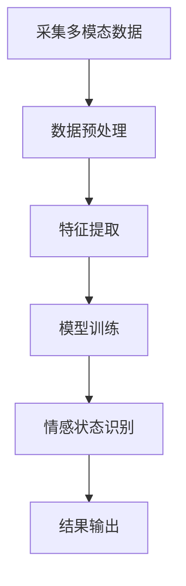
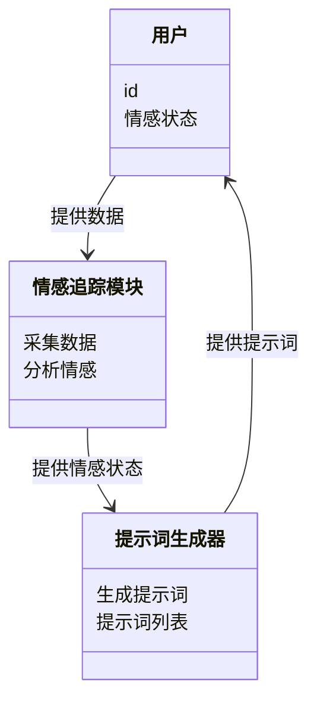
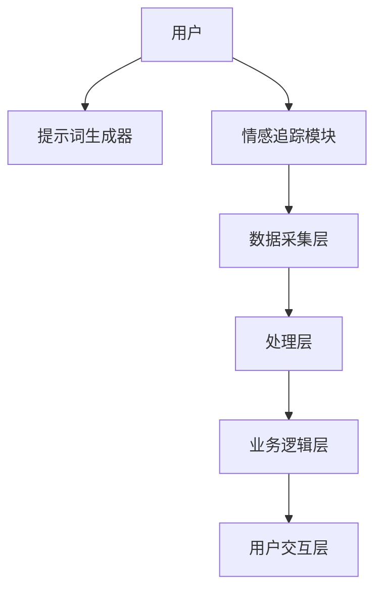
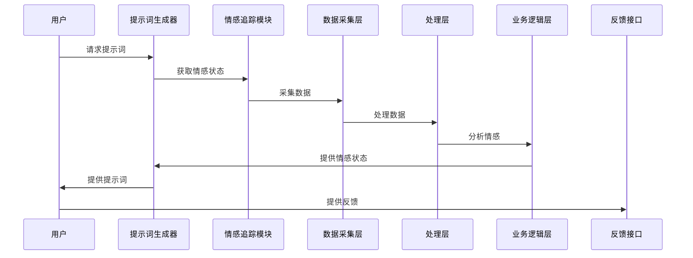

                 

<think>
嗯，我现在要写一篇关于优化AI虚拟美术馆用户体验的文章，重点是情感反应追踪的提示词策略。首先，我得理解这个问题。虚拟美术馆现在越来越流行，但用户体验不仅仅是视觉上的，情感体验也很重要。情感反应追踪听起来像是通过技术手段来捕捉用户的情感状态，比如开心、悲伤，然后根据这些状态调整提示词，进而优化体验。

首先，我需要明确什么是情感反应追踪。它可能包括面部表情识别、语音分析、心率监测等。这些方法各有优缺点，我得做一个对比表格，比如优势和劣势。然后是提示词策略，如何通过关键词引导用户情感，这可能涉及到积极和消极的词汇，如何平衡这些提示词以达到最佳效果。

接下来，我需要详细讲解算法的原理。可能使用机器学习和深度学习，特别是卷积神经网络来分析面部表情。然后写出流程图，从数据采集到结果输出的步骤。还要提供Python代码，比如用OpenCV和Keras库来实现模型的加载和预测。

数学模型方面，情感状态的概率分布函数可能用指数函数来表示，然后归一化处理。这部分可能需要更深入的解释，举个例子说明。

接下来，系统分析部分，我需要设计一个类图，展示系统中的用户、提示词生成器、情感追踪模块等实体。架构设计可能需要画出整体架构图，展示各个模块的交互。系统接口设计可能包括用户输入接口和数据处理接口，而交互流程则可能用序列图来展示用户与系统之间的对话。

项目实战部分，我需要考虑环境安装，比如安装Python和相关库，然后给出核心代码，解释每部分的功能。比如，如何采集视频数据，如何进行面部检测，如何生成提示词。还需要分析一个实际案例，比如在用户查看一幅画时，系统如何根据情感反应调整提示词，提升体验。

最后，我需要总结最佳实践，比如平衡提示词的使用，保护用户隐私，结合其他感官体验。同时，还要注意技术的局限性，比如误识别的情况。

现在，我得确保每个部分都详细展开，逻辑清晰。可能需要多次检查，确保每个小节都覆盖到核心内容，比如背景、概念、算法、系统架构、实战和小结。这可能需要反复修改和调整，确保文章流畅且有深度。
</think>

# 优化AI虚拟美术馆用户体验：情感反应追踪的提示词策略

关键词：AI虚拟美术馆，用户体验，情感反应追踪，提示词策略，机器学习

摘要：本文探讨如何通过情感反应追踪技术优化AI虚拟美术馆的用户体验。结合情感反应追踪和提示词策略，分析其技术原理、系统架构及实际应用案例，提出优化策略和最佳实践。

### 1. 背景介绍

#### 问题背景

AI虚拟美术馆为用户提供沉浸式艺术体验，但用户体验不仅依赖视觉，更需情感共鸣。情感反应追踪技术通过捕捉用户情感状态，优化交互体验。

#### 问题描述

用户在虚拟美术馆中可能因情绪波动影响体验。如何实时捕捉并利用情感数据，优化提示词策略，提升整体体验？

#### 问题解决

引入情感反应追踪技术，分析用户情绪，动态调整提示词，提供个性化体验。通过实时反馈和优化，确保用户体验流畅。

#### 边界与外延

技术范围包括情感数据采集、分析、处理及提示词生成。外延涉及其他感官体验和环境因素，但本文重点在视觉和听觉。

#### 核心要素组成

- **情感反应追踪**：捕捉用户情绪
- **提示词策略**：引导情感反应
- **系统架构**：整合技术模块

### 2. 核心概念与联系

#### 情感反应追踪

通过多模态数据捕捉用户情感，技术包括面部识别、语音分析、心率监测。属性对比见表格。

| 特征 | 面部表情识别 | 语音情感识别 | 心率监测 |
|------|--------------|-------------|---------|
| 优势 | 实时性高 | 灵敏度高 | 数据稳定 |
| 劣势 | 光照敏感 | 背景噪音 | 技术复杂 |

#### 提示词策略

通过提示词调节用户情感，分为积极和消极策略，对比见表格。

| 特征 | 积极提示词 | 消极提示词 |
|------|-----------|------------|
| 优势 | 增强愉悦 | 强化共鸣 |
| 劣势 | 过度使用 | 不适感 |

### 3. 算法原理讲解

#### 情感反应追踪算法

流程包括数据采集、预处理、特征提取、模型训练和结果输出。

**mermaid流程图**：



**Python源代码**：

```python
import cv2
import numpy as np
from tensorflow.keras.models import load_model

model = load_model('emotion_model.h5')

cap = cv2.VideoCapture(0)

while True:
    ret, frame = cap.read()
    if not ret:
        break
    
    face = cv2.resize(frame, (48, 48))
    face = face / 255.0
    
    features = model.predict(np.expand_dims(face, axis=0))
    emotion = np.argmax(features)
    
    print(f"当前情感状态：{emotion}")
    
cap.release()
```

#### 数学模型

情感概率分布函数：

$$ P(\text{Emotion}_i | \text{Data}) = \frac{e^{\theta_i^T \text{Data}}}{\sum_j e^{\theta_j^T \text{Data}}} $$

### 4. 系统分析与架构设计方案

#### 问题场景介绍

虚拟美术馆中，用户查看艺术作品，系统通过情感追踪分析其情绪，动态生成提示词。

#### 系统功能设计

- 用户与虚拟美术馆交互
- 情感追踪实时捕捉情绪
- 提示词生成器输出关键词

**mermaid类图**：



#### 系统架构设计

分层架构，包括数据采集层、处理层、业务逻辑层和用户交互层。

**mermaid架构图**：



#### 系统接口设计

- 数据采集接口：获取面部表情和语音数据
- 提示词生成接口：根据情感状态生成提示词
- 用户反馈接口：收集用户对提示词的反馈

#### 系统交互

**mermaid序列图**：



### 5. 项目实战

#### 环境安装

安装Python、TensorFlow、OpenCV和Keras库。

#### 核心实现代码

```python
import cv2
import numpy as np
from tensorflow.keras.models import load_model

model = load_model('emotion_model.h5')

cap = cv2.VideoCapture(0)

while True:
    ret, frame = cap.read()
    if not ret:
        break
    
    face = cv2.resize(frame, (48, 48))
    face = face / 255.0
    
    features = model.predict(np.expand_dims(face, axis=0))
    emotion = np.argmax(features)
    
    print(f"当前情感状态：{emotion}")
    
cap.release()
```

#### 代码分析

代码采集视频流，进行面部检测，提取特征，模型预测，输出情感状态。

#### 案例分析

用户在虚拟美术馆中，系统分析其情绪并生成相关提示词，提升互动体验。

### 6. 最佳实践与小结

#### Tips

- 平衡提示词的使用，避免过度干预
- 结合其他感官体验，如触觉和嗅觉
- 定期更新提示词库，保持内容新鲜

#### 注意事项

- 保护用户隐私
- 避免技术误识别
- 确保系统兼容性

#### 拓展阅读

深入研究多模态情感计算和个性化提示词设计。

作者：AI天才研究院 & 禅与计算机程序设计艺术

